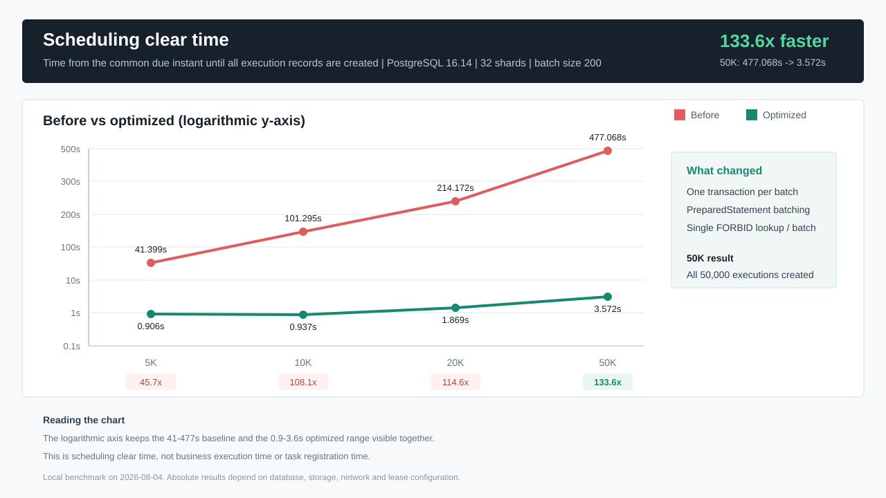
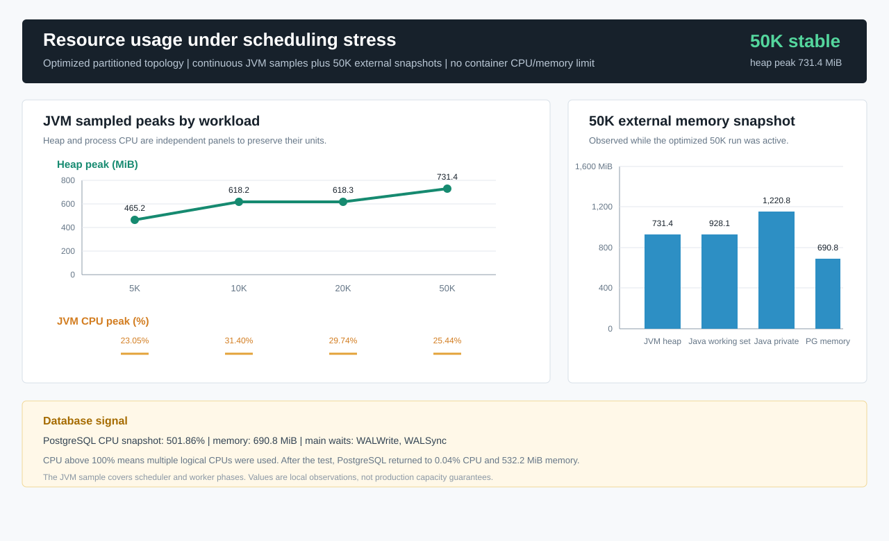

# What a Scheduler Benchmark Taught Me About Useful Stress Testing

> Summary: This is not a version benchmark report. It is a practical note on making a stress test useful enough to guide design decisions, using one Firefly scheduler benchmark as the example.

I recently added a local stress test for the Firefly scheduler. The first question was simple: if a large number of scheduled jobs become due at the same instant, can the Scheduler keep up?

After running it, the useful part was not just the final speedup. The test exposed several things that are easy to get wrong: the workload model can quietly measure registration time instead of scheduling pressure, average throughput can hide tail latency, and end-to-end duration can be confused with one narrow stage of the system.

So this article is less about a particular Firefly version and more about how I would design this kind of stress test next time.

## Narrow the Question First

"How fast is the system?" is too broad to be a useful stress-test question.

API latency, database writes, scheduler decisions, executor queueing, and business handlers can all hide inside that sentence. If the test becomes slow, the result still does not tell you what to change.

For this benchmark, I narrowed the question to the scheduler persistence path:

> When many scheduled jobs become due at the same instant, can the Scheduler persist dispatch decisions within an acceptable time window, without duplicates, lost records, or broken cursor and shard ownership invariants?

That gives three result groups:

| Concern | Signals |
| --- | --- |
| Whether the scheduler drains in time | drain time, `tasks/s` |
| Whether the tail is acceptable | p50, p95, p99, max scheduling delay |
| Whether the state is still correct | duplicate claims, duplicate execution IDs, unfinished outbox records |

This framing is a small step, but it changes the whole test. The point is not to fill the machine with load. The point is to prove or disprove a specific design assumption.

## Draw the Metric Boundary

The benchmark covers this PostgreSQL-backed scheduling path:

```text
due job
  -> Scheduler computes the next cursor
  -> cursor CAS
  -> create execution
  -> insert dispatch outbox
  -> close the outbox state loop
```

Scheduling delay is measured as:

```text
dispatch_time - scheduled_fire_time
```

That means the metric covers the time needed for the Scheduler to generate and persist the dispatch decision. It does not include real Gateway network transfer, Executor queueing, or business handler execution.

This boundary needs to be explicit. Otherwise a `3.572s` scheduling result can easily be misread as "50K jobs finished end to end in 3.572 seconds", which is not what was measured.

Environment details matter too:

| Item | Configuration |
| --- | --- |
| CPU | Intel Core i5-13600KF, 14 cores / 20 logical processors |
| Memory | 63.76 GiB |
| Java | Oracle JDK 21.0.11 |
| PostgreSQL | 16.14, `postgres:16-alpine` |
| Disk | Samsung SSD 980 PRO 1TB NVMe |
| Scheduler shards | 32 |
| Scheduling batch size | 200 |

These local numbers are not a production capacity promise. They are useful because they show which part of the implementation becomes the first constraint.

## Be Careful with "Same Instant" Workloads

Scheduled workloads have an easy trap: the test may look like a simultaneous burst, while it is actually measuring job registration speed.

If 50,000 jobs are inserted with a near-future fire time, registration itself may take minutes. The first jobs can already be due while the last jobs are still being inserted. That is no longer a clean simultaneous workload.

The benchmark avoids that by separating setup from pressure:

1. Register all jobs with an initial fire time one day in the future.
2. Acquire the 32 shard leases.
3. Move the test jobs to one common near-future fire time with a single SQL statement.
4. Wait for that instant, then start the Scheduler.
5. Wait until execution and outbox counts reach the job count.
6. Complete the outbox state loop concurrently.
7. Verify cursors, terminal states, duplicate IDs, duplicate claims, and unfinished records.

That extra setup is worth it. If the workload model is muddy, the final numbers are hard to interpret.

## Do Not Only Test the Happy Topology

I used two topologies:

| Topology | Behavior | What it checks |
| --- | --- | --- |
| `partitioned` | 32 shards are distributed across Scheduler instances; each shard has one owner | normal ownership throughput |
| `contention` | multiple Scheduler instances load and compete for all shards | CAS, fencing, and idempotency boundaries |

`partitioned` is closer to the normal production path. `contention` intentionally creates a rougher situation. In a scheduler, CAS and fencing can look boring until ownership changes, instances restart, or lease timing gets tight. A stress test that only runs the easy topology can miss those bugs.

## The Bottleneck Was the Transaction Boundary

Before the optimization, `SchedulerEngine.tick()` called `advanceAndEnqueue()` for each due job. The JDBC path roughly did this per job:

1. Borrow a `Connection`.
2. Start a transaction and read database time.
3. Run cursor CAS plus shard lease and fencing checks.
4. Query active executions for `FORBID` concurrency.
5. Insert execution.
6. Insert outbox.
7. Commit one transaction.

For 50,000 jobs, that means 50,000 commits and a large number of JDBC round trips. The old implementation stayed around `93-121 tasks/s` from 5K to 50K jobs, with little benefit from scale.

It was tempting to blame Java code or GC. The data did not support that. In the optimized 5K recording, four GC pauses totaled only `18.6ms`, with a max pause of `8.1ms` and no allocation failure. PostgreSQL waits were mainly `WALWrite` and `WALSync`.

The slow part was not "the Java loop." It was one transaction commit per job.

## Batching Has to Keep the Invariants

The fix was to move from per-job transactions to bounded atomic batches. The Scheduler splits work by `firefly.scheduler.batch-size`, currently defaulting to 200.


A batch borrows one `Connection`, reads database time once, and performs cursor CAS, execution insert, and outbox insert in the same transaction. Active execution checks for `FORBID` jobs also become set-based queries.

The important part is that batching does not weaken correctness:

- cursor CAS still validates the expected `next_fire_time`.
- SQL still validates shard owner, fencing token, and lease expiration.
- cursor, execution, and outbox changes remain in one transaction.
- only jobs with successful CAS and no active execution create follow-up records.
- if any batch insert fails, the bounded batch rolls back.
- custom stores without a batch API fall back to row-by-row behavior.

The value 200 is not a magic setting. It is just a reasonable balance for this local machine and workload: fewer commits, without making transactions too long or rollback scope too large.

## Read the Results in Pieces

First, the scheduling path itself:



| Jobs | Before | Optimized | Before throughput | Optimized throughput | Scheduling gain |
| ---: | ---: | ---: | ---: | ---: | ---: |
| 5,000 | 41.399 s | 0.906 s | 120.78/s | 5,518.76/s | 45.7x |
| 10,000 | 101.295 s | 0.937 s | 98.72/s | 10,672.36/s | 108.1x |
| 20,000 | 214.172 s | 1.869 s | 93.38/s | 10,700.91/s | 114.6x |
| 50,000 | 477.068 s | 3.572 s | 104.81/s | 13,997.76/s | 133.6x |

After changing the transaction boundary, 50K simultaneously due jobs drained from `477.068s` to `3.572s`.

Tail latency tells the other half of the story:


| Jobs | p50 | p95 | p99 | max |
| ---: | ---: | ---: | ---: | ---: |
| 100 | 29 ms | 29 ms | 29 ms | 29 ms |
| 5,000 | 199 ms | 210 ms | 213 ms | 214 ms |
| 10,000 | 204 ms | 213 ms | 216 ms | 216 ms |
| 20,000 | 427 ms | 454 ms | 456 ms | 458 ms |
| 50,000 | 886 ms | 927 ms | 932 ms | 936 ms |

At 50K jobs, p99 was `932ms` and max was `936ms`. If a service accepts one-second scheduling delay, that is a strong result. If the SLO is 200ms, the average throughput number is not enough.

Correctness stays in the result table too:

| Check | Result |
| --- | ---: |
| `firefly_job` | 50,000 |
| `firefly_execution` | 50,000 |
| `firefly_dispatch_outbox` | 50,000 |
| `SUCCEEDED` | 50,000 |
| `DONE` | 50,000 |
| duplicate claims | 0 |
| duplicate execution IDs | 0 |
| duplicate outbox IDs | 0 |
| unadvanced job cursors | 0 |
| non-terminal outbox records | 0 |

Performance work is not done if the state becomes messy. I prefer to keep these checks beside the performance numbers, not buried in test logs.

## The Bottleneck Moved

The scheduling path became 133.6 times faster, but the end-to-end test did not. At 50K jobs, total duration moved from `728.003s` to `242.239s`, roughly 3x.

The stage breakdown explains it:

| Stage | 50K duration |
| --- | ---: |
| Row-by-row job registration | 191.358 s |
| Scheduling drain | 3.572 s |
| Outbox completion simulation | 46.004 s |
| Total | 242.239 s |

At this point, tuning Scheduler threads harder is probably not the next useful move. The next round should look at batch job registration, outbox workers, snapshot encoding, PostgreSQL WAL behavior, or the real Gateway/Executor path.



In the 50K case, observed JVM heap peaked around `731.4 MiB`, Java Working Set around `928.1 MiB`, and PostgreSQL CPU reached `501.86%`. Waits were still mainly `WALWrite` and `WALSync`. Once per-job commit overhead is removed, the database gets to use more CPU, and the next limits move closer to WAL, disk, and PostgreSQL concurrency.

## Keep the Reproduction Command

A benchmark that cannot be reproduced is hard to evolve. Firefly runs this suite through a dedicated Gradle task:

```powershell
E:\gradle-9.6.1\bin\gradle.bat :stores:jdbc:stressTest --no-daemon --rerun-tasks `
  "-Dfirefly.stress.maxHeap=8g" `
  "-Dfirefly.stress.jdbc.url=jdbc:postgresql://127.0.0.1:55432/firefly_stress" `
  "-Dfirefly.stress.jdbc.username=postgres" `
  "-Dfirefly.stress.jdbc.password=<local-password>" `
  "-Dfirefly.stress.jobs=50000" `
  "-Dfirefly.stress.registrationThreads=16" `
  "-Dfirefly.stress.schedulerThreads=8" `
  "-Dfirefly.stress.outboxWorkers=32" `
  "-Dfirefly.stress.claimBatchSize=300" `
  "-Dfirefly.stress.maxConnections=96" `
  "-Dfirefly.stress.topology=partitioned" `
  "-Dfirefly.stress.schedulingBatchSize=200" `
  "-Dfirefly.stress.report.path=build/reports/stress/optimized-partitioned-50k.json"
```

Key runtime parameters:

```properties
firefly.scheduler.batch-size=200
firefly.scheduler.max-due-records-per-tick=10000
firefly.scheduler.max-idle-wakeup=PT0.5S
```

Do not publish real local passwords, internal URLs, or production connection strings. A placeholder such as `<local-password>` is enough.

## The Checklist I Would Keep

- Write the question before writing the script.
- Define the metric boundary before reading the numbers.
- Keep data preparation outside the pressure window.
- Read average throughput, p95, p99, and max together.
- Put correctness checks next to performance results.
- Record environment details and key parameters.
- Split timing by stage to see where the bottleneck moved.
- Correlate application logs with JFR, database waits, and pool waits.
- Keep the exact reproduction command.
- State what is local-only and what can inform production design.

## Closing

The direct result was clear: the old Firefly scheduler path was not primarily limited by Java loops or GC. It was limited by per-job transaction commits. After moving the persistence boundary to bounded atomic batches, 50,000 simultaneously due jobs drained from `477.068s` to `3.572s`.

The more useful takeaway is broader: a stress test should not leave only a speedup number. It should explain where the number came from, when it can be trusted, when it should not be extrapolated, and where the next design pass should go.

The full evidence is available in the [Firefly stress-test report](https://github.com/fishered/Firefly/blob/master/docs/stress-test-v1.0.4.md) and the [bounded-batch implementation commit](https://github.com/fishered/Firefly/commit/12fab19321ea03d609f93116c1fb6cbe5aadd87c).
