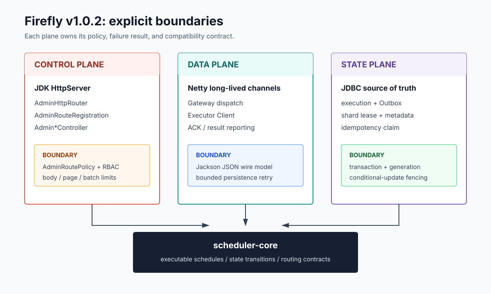
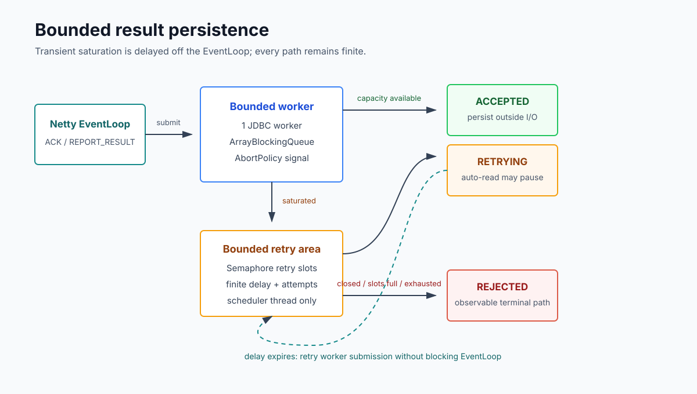
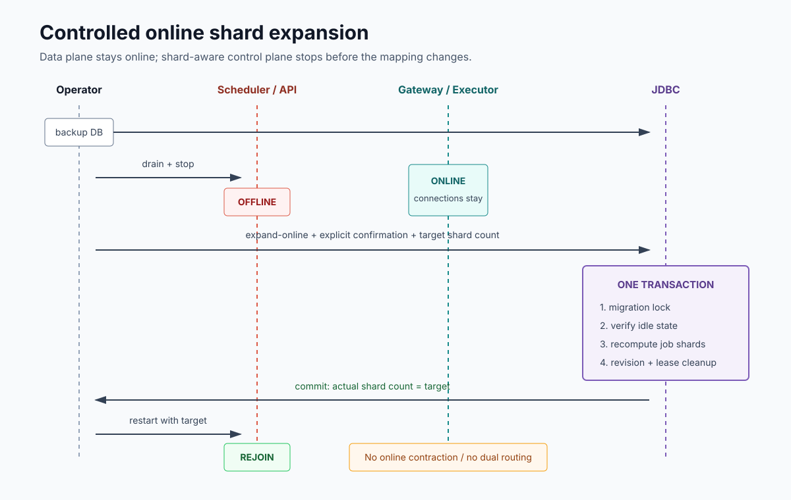

> 摘要：Firefly 不只负责按时触发任务，还要约束谁能修改调度状态、不同版本如何通信、数据库变慢时压力在哪里停止、过期 owner 是否还能写入，以及分片映射如何安全变化。它通过明确的控制面、数据面和状态面边界，让这些风险拥有稳定的入口、失败结果和恢复路径。

## 调度系统的风险来自边界失控

调度器的 happy path 很简单：计算触发时间、找到 Executor、执行任务、保存结果。生产风险却通常发生在这条路径的交界处：Admin 路由变化导致权限漂移，领域对象调整破坏通信兼容，数据库抖动堵住 Netty EventLoop，旧 Executor 在 claim 被接管后继续提交结果，或者新旧 Scheduler 使用不同 shard count 计算任务归属。

这些问题无法靠“任务最终执行成功”来证明系统可靠。Firefly 把调度能力拆成三类边界：控制面决定谁可以改变状态，数据面约束消息和流量如何传播，状态面证明谁仍拥有写入资格。

| 特性 | 设计理由 | 规避的问题 |
|---|---|---|
| 声明式 Admin RBAC | 权限策略与路由注册同源 | 路径变化造成越权、漏授权和 UI 伪授权 |
| 独立 Netty wire contract | 网络协议不依赖领域对象结构 | JDK 序列化风险、字段演进失控和滚动升级不兼容 |
| 有界结果持久化背压 | JDBC 与 EventLoop 隔离，等待必须有上限 | I/O 线程阻塞、无界堆积和静默丢失 |
| JDBC generation fencing | 用数据库事实证明跨进程所有权 | 过期 owner 覆盖新 claim、重复副作用和状态回退 |
| Plugin API level | 按 SPI 契约预检兼容性 | 部分插件启动和产品版本误判 |
| 受控 shard 扩容 | 映射变化期间只保留一个控制面事实 | 新旧映射并存、重复触发和错误 lease |



图 1：Admin policy、Netty wire contract 和 JDBC fencing 分别守住控制面、数据面与状态面；调度核心只接收已经通过边界校验的输入。

## 1. 声明式 Admin RBAC：让权限与路由同源

Firefly 的 Admin API 是调度控制面。创建任务、手动触发、取消执行、重放 Outbox 和管理用户的风险不同，因此权限不能由一个远离路由注册的函数根据路径前后缀猜测。

每组路由在注册时绑定 `AdminRoutePolicy`，将 `READER`、`OPERATOR`、`ADMIN` 或匿名访问声明在路由边界。运行时职责保持清楚：

| 组件 | 责任 |
|---|---|
| `AdminHttpPlugin` | 依赖装配、启动、关闭 |
| `AdminHttpRouter` | 请求目标与路由匹配 |
| `AdminRouteRegistration` | Controller 和 policy 绑定 |
| `AdminAuthorizationService` | 身份解析与角色判定 |
| `AdminRequestReader` | 请求体、JSON、分页与批量边界 |
| `Admin*Controller` | 任务、执行、集群、认证等业务动作 |

授权服务只消费已经匹配的 policy，不认识 `/api/users` 或 `/trigger` 这样的业务字符串。新增路由时，访问角色与 Controller 必须一起注册；修改 URL 不会绕过另一处隐藏的路径规则。

Admin HTTP 仍使用 JDK `HttpServer`。Router、Policy 和 Controller 提供的是职责边界，不依赖大型 Web 框架。这样既保留轻量运行时，也避免框架生命周期进入 scheduler-core。

安全边界还包括输入容量。请求体、分页和批量数量在 Controller 之前统一校验，防止一个已授权但过大的请求耗尽内存或数据库资源。UI 隐藏按钮从来不是授权，服务端 policy 和 limit 才是控制面的真实防线。

## 2. 独立 wire contract：让协议不跟随领域对象漂移

Java `record` 很适合表达不可变消息，但它只解决进程内数据形状，不自动定义跨版本协议。直接使用 JDK native serialization 会引入类名、`serialVersionUID`、JVM 类型图和反序列化安全风险；直接把领域 record 交给 Jackson，也会让领域重构意外变成协议变更。

Firefly 用独立的 `transports/netty-protocol` 模块定义线上契约：

```text
domain message
    -> NettyExecutorWireMessage
    -> Jackson JSON codec
    -> newline-delimited frame
```

wire record 只包含稳定字段：`messageId`、`type` 和字符串 payload。Gateway 与 Executor Client 依赖同一协议模块，但 Gateway 的连接、路由和派发实现留在 `transports/netty`。协议模型、编解码和运行时因此可以分别演进和测试。

选择 Jackson 并不意味着“JSON 天然兼容”。兼容仍需要规则：旧端缺失新字段时如何解释，未知消息类型是拒绝还是降级，能力协商结果是否允许发送 `CANCEL_JOB`。序列化库负责字节与对象之间的转换，协议设计负责版本语义，两者不能混为一谈。

## 3. 有界持久化背压：让数据库抖动停在数据面

Gateway 收到 ACK 或执行结果后需要写数据库。如果直接在 Netty EventLoop 执行 JDBC，连接抖动会拖住同一 EventLoop 上的其他连接；如果扔进无界队列，数据库变慢会把故障转化为堆内存增长；如果使用 `AbortPolicy` 后直接失败，又会放大短暂抖动。

Firefly 使用独立的 `NettyResultPersistenceExecutor`：一个有界工作队列、一个有界重试区和一个只负责延迟调度的线程。工作队列饱和后，任务以固定的有限间隔重新尝试；重试槽位和最大尝试次数耗尽时进入明确的最终拒绝路径。整个等待过程不占用 EventLoop。



图 2：`ACCEPTED`、`RETRYING` 和 `REJECTED` 是三种可观察提交结果。低水位恢复读取，关闭与耗尽都有确定出口。

这个特性吸收短暂数据库压力，但不冒充持久化 MQ：进程崩溃仍可能丢失内存重试项。派发可靠性由 Outbox 承担；在登记对象、去重键、重放方和保留期没有定义前，不创建含义模糊的“失败注册表”。由此避免同一份失败同时落入多个恢复机制，最终没人知道该从哪里重放。

## 4. JDBC generation fencing：阻止过期 owner 回写

业务幂等的典型流程是 `tryAcquire -> execute -> markCompleted`。如果 claim 超时后被新实例接管，旧实例稍后恢复，就可能提交一个已经失去所有权的完成状态。`ReentrantLock`、`Semaphore` 或 JVM 内 CAS 无法解决这个问题，因为两个 Executor 进程根本不共享同一个 JUC 状态。

`JdbcBusinessIdempotencyStore` 用状态机表达 acquire、complete 和 release 语义，`JdbcIdempotencyClaimDao` 负责条件更新，`JdbcTransactionTemplate` 负责事务边界。SQL 保留在 DAO 中，因为数据库才是跨进程 claim 的事实来源。

claim 的正确性依赖四件事：

1. 使用数据库时间判断过期，避免节点时钟漂移决定所有权。
2. 在事务中锁定记录，串行化接管决策。
3. 每次接管递增 generation；表中的 `attempt` 保存这一代次，`claim_token` 编码同一个 generation。
4. `markCompleted` 和 `release` 同时匹配 key、状态与 claim token。

这就是 fencing：旧 owner 即使仍持有旧 token，也无法更新 token 已随 generation 变化的新 claim。它比“先查再更新”多出的条件不是冗余，而是跨进程所有权证明。

仍需承认一个边界：如果业务副作用已经提交，而完成标记尚未提交时进程崩溃，调度系统不能凭空还原原子性。Handler 应使用同库唯一键、业务事务或可重复操作实现 effectively-once，而不是宣称绝对 exactly-once。

## 5. Plugin API level：让扩展兼容可预检

插件是否兼容，取决于 SPI 契约，不取决于产品版本字符串。`FireflyPlugin.compatibility()` 返回插件支持的 Plugin API level 范围。当前 level 为 `1`，未覆盖该方法的旧插件通过默认实现声明 level 1。

宿主在启动任何插件前，先校验所有启用插件。这样，一个不兼容插件会阻止节点加入，而不是让前几个插件已经启动、后一个失败，留下部分可用状态。API level 只有在 SPI 二进制或行为契约破坏时才提升，这比把产品版本当作兼容协议更稳定。

兼容性不能只停留在声明上。`compatibility/spring-boot-consumer` 由 CI 实际构建 Spring Boot 3.3、3.4、3.5 和 4.0 消费者，验证公共依赖链能够被真实项目解析。API level 负责插件 SPI，消费者矩阵负责 Starter 生态，两者分别阻断运行时不兼容和构建期不兼容。

## 6. 受控 shard 扩容：让映射变化保持单一事实

把 shard count 从 32 改成 64 会改变 `jobId -> shardId` 映射。若旧 Scheduler 仍按 32 计算、新 Scheduler 已按 64 计算，同一个 job 可能在两个 ownership 体系中出现。没有双版本路由和迁移 epoch 时，宣称全角色零停机会掩盖真正的重复触发风险。

Firefly 将这项能力定义为“受控在线扩容”：

- 只允许增加 shard count；缩容需要全停机。
- Scheduler、Standby 和 API 必须 drain 并下线。
- 纯 Gateway/Executor 数据面可以继续维持连接。
- 操作拒绝活跃 execution 和未完成 Outbox。
- 迁移锁与单事务覆盖 job shard 重算、metadata revision 更新和旧 lease 清理。



图 3：“在线”指数据面可在线，不代表控制面无感。失败时数据库事务回滚，控制面保持下线，并以数据库中的实际 shard count 决定重试或恢复。

这个边界给运维留下可验证的前置条件和回滚点。真正的全在线 reshard 需要双路由、迁移 epoch、进度持久化、读写兼容窗口和旧映射回收协议；在这些能力存在之前，让控制面短暂停止比让两套映射同时产生 execution 更可靠。

## 六项特性如何形成一条防线

这些特性分别处理不同故障阶段，但共享同一套边界原则：

1. **规则与入口同源。** 路由注册携带权限，wire module 携带协议，DAO 条件更新携带所有权证明。
2. **跨进程状态使用共享事实。** JUC 约束线程；数据库时间、lease、generation 和 fencing 约束多个节点。
3. **所有等待都有上限。** 队列、重试次数、延迟、关闭和最终拒绝都可观察。
4. **兼容单位彼此独立。** 产品版本、Plugin API level、wire protocol version 和数据库 schema version 分别演进。
5. **每类失败只有明确恢复 owner。** 内存重试处理瞬时背压，Outbox 处理派发恢复，维护事务处理映射变化。

## 结语

Firefly 边界治理的价值，不是让结构看起来复杂，而是让风险在进入核心调度语义之前被识别和收敛：权限随路由声明，协议与领域模型分开，有界背压不阻塞 EventLoop，数据库 generation 阻止旧 owner，插件按 API level 预检，shard 扩容始终保持一套控制面映射。

这些变化不会消除分布式系统的失败，却能让失败发生在预先定义的位置，并留下可以测试、观察和恢复的结果。

## 延伸阅读

- [本文对应的 Firefly 源码快照](https://github.com/fishered/Firefly/tree/v1.0.2)
- [相关版本说明](https://fishered.github.io/firefly-home/releases/v1.0.2)
- [AdminRoutePolicy](https://github.com/fishered/Firefly/blob/v1.0.2/apis/admin-http/src/main/java/com/firefly/api/admin/http/routing/AdminRoutePolicy.java)
- [NettyResultPersistenceExecutor](https://github.com/fishered/Firefly/blob/v1.0.2/transports/netty/src/main/java/com/firefly/executor/netty/NettyResultPersistenceExecutor.java)
- [JdbcReshardTool](https://github.com/fishered/Firefly/blob/v1.0.2/stores/jdbc/src/main/java/com/firefly/store/jdbc/JdbcReshardTool.java)
