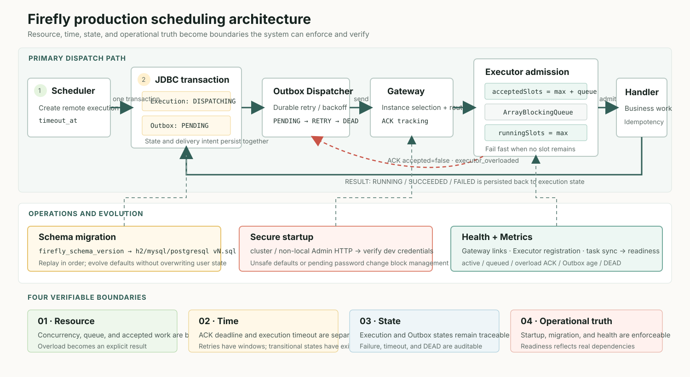
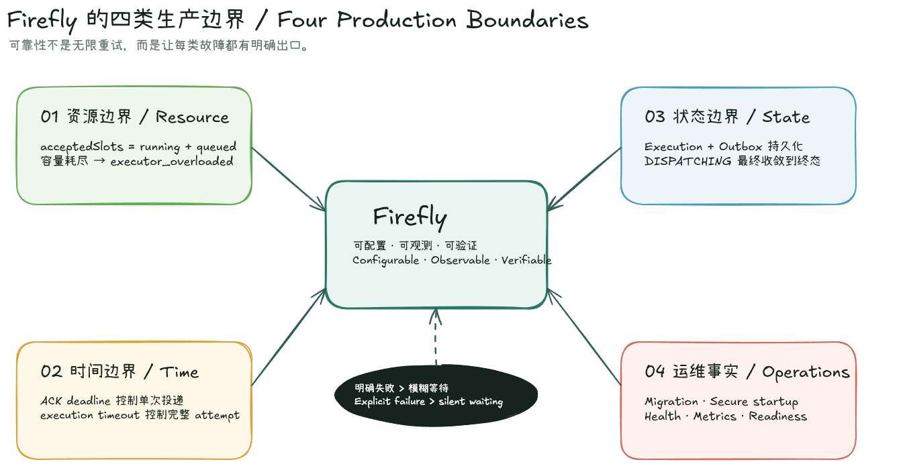
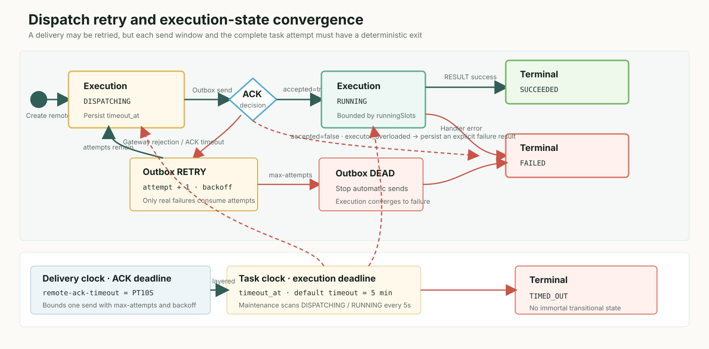
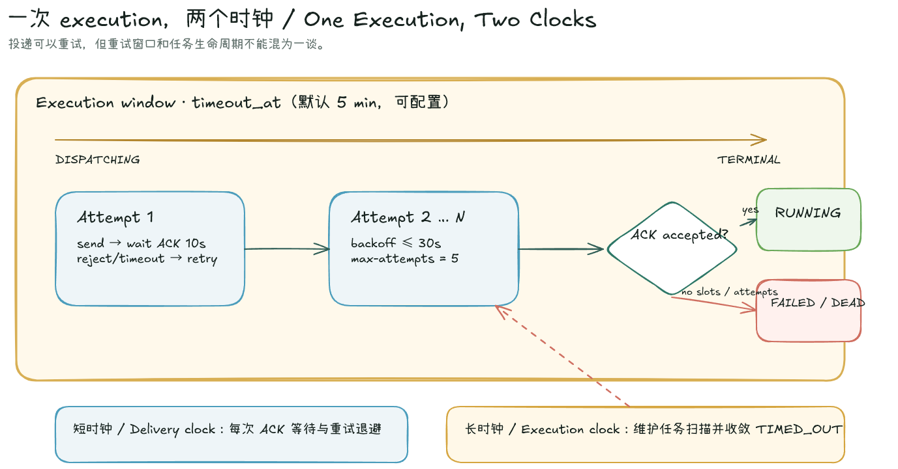
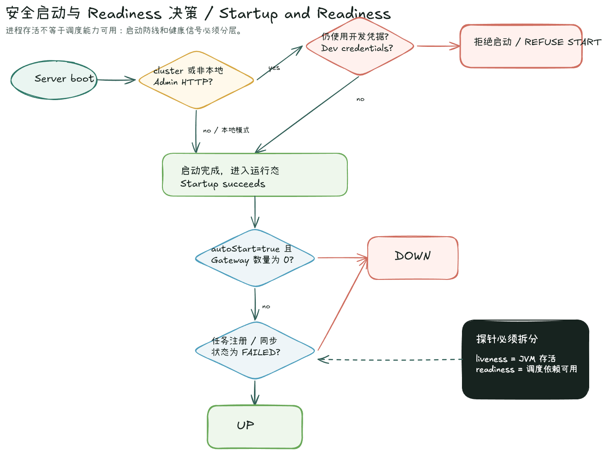

> Summary: A reliable scheduler must do more than complete work successfully. It also needs explicit outcomes for overload, timeout, upgrade, and dependency failure. This article examines how Firefly implements bounded capacity, dispatch convergence, schema migration, secure startup, and dependency-aware health reporting.

## Intended Reader

This article is for backend engineers who already understand the basic shape of a scheduler and now need to reason about its production behavior: overload, retry exhaustion, schema upgrades, security defaults, and readiness signals. It is especially relevant if you are building or operating Java services where scheduled work is executed remotely by application-side workers.

The article assumes familiarity with Java executors, Spring Boot Actuator, relational schema migration, and common reliability language such as timeout, ACK, idempotency, and SLO. It focuses on Firefly's production design boundaries rather than on a step-by-step quick start.

## Why This Matters

A scheduler looks reliable under light load: the Scheduler creates work, a Gateway locates an Executor, a handler runs, and the result reaches the database. The difficult failures appear at the edges. A traffic spike can grow thread count without bound. An execution can remain `DISPATCHING` after every Executor disconnects. A schema upgrade can depend on an operator remembering an ad hoc statement. A Spring Boot process can report `UP` even though it cannot register with any Gateway.

Those failures are not primarily missing features. They are missing resource, time, and state boundaries. Firefly's production design follows four rules:

1. Perform capacity admission before accepting work.
2. Persist deadlines for dispatch and execution attempts.
3. Evolve database state through versioned SQL files.
4. Report dependency failures through health, not merely JVM liveness.



Figure 1: Firefly combines transactional execution records, a durable Outbox, Gateway routing, bounded Executor admission, and operational guardrails into an observable dispatch path with deterministic outcomes.

As a compact mental model, the implementation defines four kinds of production boundary: capacity answers whether the system can accept more work, time answers how long it may wait, state defines where an attempt must converge, and operations determines whether the service is actually usable.



Figure 2: The four boundaries are not independent toggles. Capacity rejection, deadlines, durable terminal states, and health reporting work together to turn failure into an observable and recoverable result. The editable source is `assets/excalidraw/03-firefly-production-boundaries.excalidraw`.

## Mental Model

The core mental model is simple: a production scheduler should fail in states the system can record, monitor, and recover from. It should not convert every boundary into invisible waiting, unbounded resource growth, or ambiguous intermediate status.

In Firefly, capacity and time are first-class control surfaces. Executor admission decides whether a worker can accept more work before the business handler runs. The Outbox gives delivery a bounded recovery window. The execution deadline prevents `DISPATCHING` and `RUNNING` attempts from remaining alive forever. Schema migrations become an ordered version sequence instead of a one-off manual patch. Health reflects whether the application is connected and synchronized, not just whether its process exists.

This distinction matters because retry alone does not create reliability. Retrying without admission control can amplify overload. Retrying without deadlines can create immortal intermediate records. Running startup with insecure defaults can turn a configuration warning into an operational exposure. Reporting healthy while disconnected can make an orchestrator keep sending traffic to a service that is not ready.

## Implementation Walkthrough

The previous executor client used `newCachedThreadPool()`. That avoids short-term queueing by converting pressure into threads. When handlers slow down or block on downstream services, thread growth transfers the cost to heap usage, context switching, and garbage collection.

Firefly exposes execution resources through `NettyExecutorResourceOptions`:

```java
public record NettyExecutorResourceOptions(
        int workerThreads,
        int queueCapacity,
        int maxConcurrentExecutions
) {
    public static NettyExecutorResourceOptions defaults() {
        int workers = Math.max(2, Runtime.getRuntime().availableProcessors());
        return new NettyExecutorResourceOptions(workers, 1024, workers);
    }
}
```

A Firefly-owned pool has a fixed worker count, a bounded `ArrayBlockingQueue`, and a fail-fast `AbortPolicy`. `NettyExecutorWorkScheduler` adds two semaphore boundaries:

- `acceptedSlots = maxConcurrentExecutions + queueCapacity` limits all work accepted by the client.
- `runningSlots = maxConcurrentExecutions` limits concurrent business-handler calls.

The same admission layer wraps an externally supplied `ExecutorService`. Even if that pool has an unbounded queue, Firefly does not accept unbounded work.

When capacity is exhausted, the Executor neither drops work silently nor leaves the Gateway waiting for a network timeout. The protocol emits an explicit response:

```text
ACK_JOB accepted=false reason=executor_overloaded
RESULT   status=FAILED errorMessage=executor_overloaded
```

Overload is therefore a scheduler-visible, durable, and observable result. The relevant Prometheus series are:

```text
firefly_executor_overload_acks_total
firefly_executor_client_active_executions
firefly_executor_client_queued_executions
firefly_executor_client_max_concurrent_executions
firefly_executor_client_queue_capacity
```

Pool ownership is explicit as well. Firefly shuts down pools it creates. It never shuts down a pool supplied by the application, which remains responsible for that pool's lifecycle.

The second boundary is dispatch convergence. Immediately failing a task when no Executor is online is not always correct: the connection may be temporarily absent during a rolling deployment, and a durable Outbox exists precisely to allow recovery within a bounded window. Firefly keeps `DISPATCHING` as a transitional state but gives it deterministic exit conditions.

When a remote attempt is created, its execution enters `DISPATCHING` and persists `timeout_at` from the job timeout. The default job timeout is five minutes and can be changed per job. Outbox delivery operates on a shorter cycle:

```properties
firefly.dispatch.outbox.remote-ack-timeout=PT10S
firefly.dispatch.outbox.max-attempts=5
firefly.dispatch.outbox.max-retry-backoff=PT30S
firefly.execution.maintenance.interval=PT5S
```

These are two distinct time boundaries:

- The ACK deadline determines whether one remote send was accepted by an Executor.
- The execution deadline determines whether the entire attempt exceeded its allowed runtime.



Figure 3: the short ACK deadline bounds each delivery attempt, while the persisted execution deadline bounds the complete task attempt. Overload, retry exhaustion, and timeout all converge to explicit terminal states.

The state diagram is useful for checking every branch. The two-clock view below isolates the operational distinction that is easiest to miss: a failed delivery advances the retry budget, while only the job-level execution deadline bounds the lifetime of the complete attempt.



Figure 4: The ACK deadline bounds each `send -> wait ACK` cycle; the execution timeout bounds the complete task attempt. They require separate configuration, monitoring, and interpretation. The editable source is `assets/excalidraw/04-firefly-two-clocks.excalidraw`.

A Gateway send rejection or an ACK timeout consumes a real delivery attempt. After `max-attempts`, the Outbox record becomes `DEAD` and is no longer sent automatically. Upgrade compatibility also reconstructs missing historical deadlines from `dispatch_time + timeout_value`, preventing old executions from remaining active forever.

The third boundary is schema evolution. Schema `12` adds `password_change_required`, but the more important change is the migration mechanism. Each dialect now owns an incremental file:

```text
stores/jdbc/src/main/resources/com/firefly/store/jdbc/schema/migrations/
├── h2/v12.sql
├── mysql/v12.sql
└── postgresql/v12.sql
```

Startup reads `firefly_schema_version` and loads every missing version in order:

```java
for (int version = Math.max(installed + 1, FIRST_VERSIONED_SQL_MIGRATION);
     version <= CURRENT_VERSION;
     version++) {
    for (String sql : JdbcSchemaScript.loadMigration(dialect, version)) {
        statement.execute(sql);
    }
}
```

The same design naturally extends from `11 -> 12` to `12 -> 13 -> 14`, and tests can require every incremental resource to exist. Fresh PostgreSQL installations use `scripts/postgresql/init.sql`, which creates only Firefly-owned objects. Database creation, roles, and grants remain operator-owned.

The v12 migration requires a password change only when the administrator still has the known bootstrap password digest. It does not overwrite an already changed password. This is an essential migration property: strengthen unsafe defaults without destroying state the operator already owns.

The fourth boundary is security and health. Documentation that says "change this before production" is not a control. In Firefly, cluster mode or an Admin HTTP endpoint bound outside the local host checks for bundled development credentials and refuses to start when they remain. The bootstrap `admin/admin` account must also complete its first-login password change before management APIs become available.

The Spring Boot Starter adds an Actuator `HealthIndicator` that checks more than bean construction:

- The number of registered Gateway connections.
- Executor registration failures caused by authentication or server policy.
- Declarative job synchronization status and synchronized or failed job counts.

With `autoStart=true`, zero registered Gateway connections produces `DOWN`. A failed job-registration state does the same. This can change restart and traffic-routing behavior in an orchestrator, so liveness and readiness should be configured separately instead of using aggregate `/actuator/health` as an unconditional process-liveness probe.



Figure 5: Startup blocks development credentials from non-local deployments. During operation, Gateway connectivity and job synchronization determine readiness, while liveness remains a narrower JVM-process signal. The editable source is `assets/excalidraw/05-firefly-startup-readiness.excalidraw`.

## Pitfalls and Tradeoffs

A bounded system exposes insufficient capacity earlier. `executor_overloaded` is not framework instability; it is deterministic process protection. A larger queue does not create throughput. It increases waiting time and memory use. Capacity should be based on handler service time, latency budgets, and instance count, with alerts on active, queued, and overload metrics.

Reliable dispatch does not mean unlimited retries. Business handlers still need an idempotency boundary. Job timeout, ACK timeout, and delivery attempts should reflect the side effects of the workload. If a handler performs external writes, retry and timeout settings need to be designed together with deduplication or idempotency keys.

Health checks are also operational interfaces. If aggregate health is used as a liveness probe, a real dependency failure may cause unnecessary restarts. For Kubernetes or a similar orchestrator, liveness should answer "is the process alive enough to restart only when stuck?", while readiness should answer "should this instance receive traffic or scheduled work now?"

The release also closes several gaps that workstation builds tend to hide:

- Gradle resolves from Maven Central by default; local repositories and mirrors require explicit opt-in.
- Isolated Maven consumers test Spring Boot 3.3, 3.4, 3.5, and 4.0.
- PostgreSQL and MySQL containers cover initialization, concurrency, and fault injection.
- Playwright exercises the primary Admin UI workflows.
- Public artifacts no longer leak `slf4j-nop`, and `netty-all` is replaced with the modules actually used.

The process-fault benchmark foundation makes targets such as scheduler-delay p99 below 500 ms and failover below 15 seconds executable. Precision matters here: these are SLO definitions and test infrastructure, not claimed production benchmark results. Database restarts, network partitions, and large same-second workloads still require ongoing scenario implementation and measurement.

## Verification Checklist

- Evaluate concurrency per handler class instead of assuming CPU count is always optimal.
- Alert on queued executions, overload ACKs, oldest Outbox age, and DEAD records.
- Distinguish the 10-second ACK deadline from the job-level execution timeout.
- Back up existing databases and verify `firefly_schema_version` contains `12` after upgrade.
- Generate a unique JWT secret for non-local deployment and change the bootstrap administrator password immediately.
- Configure separate liveness and readiness probes in Kubernetes or an equivalent orchestrator.
- Treat SLO targets as testable objectives unless you have measured results from the target deployment environment.

Scheduler reliability is not making every operation "try harder." It is knowing how much work the system can still accept, how long it may wait, who owns state, and what evidence remains after failure. Firefly turns those boundaries into explicit engineering capabilities: overload can be rejected, dispatch can expire, schemas can advance one version at a time, and connectivity or synchronization failures can affect health.

The changes do not eliminate failure. They turn unbounded resource use and ambiguous intermediate states into deterministic behavior that operators can monitor, test, and recover.

Further reading:

- [Firefly source snapshot analyzed in this article](https://github.com/fishered/Firefly/tree/v1.0.1)
- [NettyExecutorWorkScheduler](https://github.com/fishered/Firefly/blob/v1.0.1/transports/netty/src/main/java/com/firefly/executor/netty/NettyExecutorWorkScheduler.java)
- [JDBC schema migrations](https://github.com/fishered/Firefly/tree/v1.0.1/stores/jdbc/src/main/resources/com/firefly/store/jdbc/schema/migrations)
