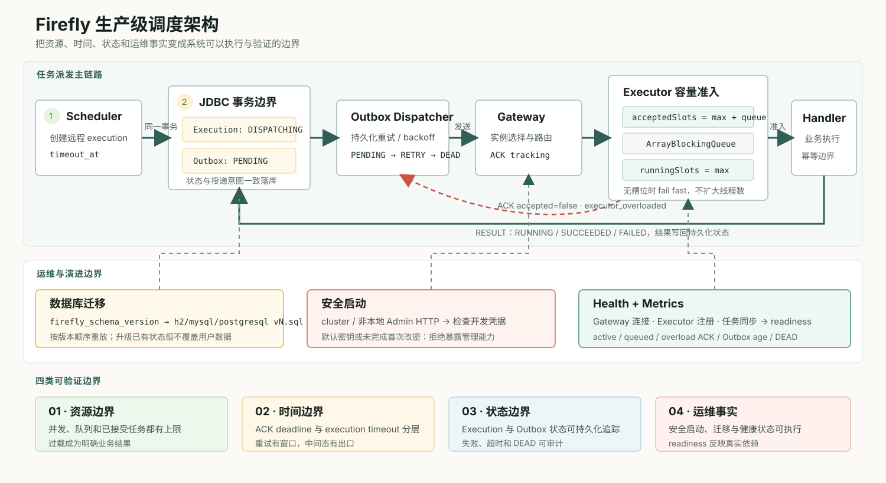
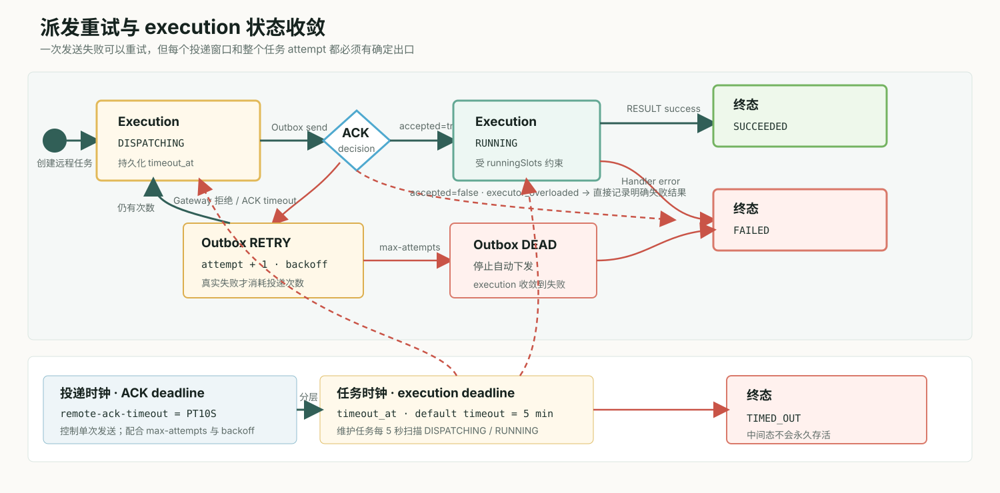

> 摘要：可靠的调度系统不仅要把任务执行成功，还要在过载、超时、升级和依赖故障时给出明确结果。本文结合 Firefly 的实现，拆解有界容量、派发收敛、数据库迁移、安全启动和真实健康状态这些生产级能力。

## 为什么生产边界重要

调度系统在低负载下很容易显得可靠：Scheduler 产生任务，Gateway 找到 Executor，Handler 执行完成，结果写回数据库。真正的问题往往只在边界条件出现：流量突增时线程数持续上涨、Executor 未连接时 execution 长期停在 `DISPATCHING`、数据库结构升级依赖人工记忆，或者 Spring Boot 应用已经和所有 Gateway 断开却仍然显示 `UP`。

这些问题的共同点不是“缺少功能”，而是系统没有给资源、时间和状态划出可验证的边界。Firefly 的生产级设计可以概括成四句话：

1. 在接收工作之前完成容量准入。
2. 为每次派发和执行保存持久化 deadline。
3. 用按版本保存的 SQL 演进数据库状态。
4. 让健康状态反映真实依赖，而不是只反映 JVM 仍在运行。



图 1：Firefly 将事务化执行记录、可靠 Outbox、Gateway 路由、有界 Executor 与运维防线组合为一条可观测、可收敛的调度链路。

如果把上面的实现压缩成一个便于讨论的心智模型，生产可靠性可以归纳为四类边界：容量决定“还能不能接”，时间决定“最多等多久”，状态决定“最终落到哪里”，运维决定“系统是否真的可用”。


图 2：四类边界不是彼此独立的开关。容量拒绝、deadline、持久化终态与健康状态共同把故障变成可观测、可恢复的结果。可编辑源文件位于 `assets/excalidraw/03-firefly-production-boundaries.excalidraw`。

## 1. 执行器先做容量准入

旧实现使用 `newCachedThreadPool()`。它能减少短期排队，却把压力转换成线程数量；当 Handler 变慢或下游阻塞时，线程会持续增长，最后由整个进程承担内存、上下文切换和 GC 成本。

Firefly 通过 `NettyExecutorResourceOptions` 显式配置执行资源：

```java
public record NettyExecutorResourceOptions(
        int workerThreads,
        int queueCapacity,
        int maxConcurrentExecutions
) {
    public static NettyExecutorResourceOptions defaults() {
        int workers = Math.max(2, Runtime.getRuntime().availableProcessors());
        return new NettyExecutorResourceOptions(workers, 1024, workers);
    }
}
```

自建线程池固定使用 `workerThreads` 个线程、有界 `ArrayBlockingQueue` 和 fail-fast `AbortPolicy`。`NettyExecutorWorkScheduler` 还使用两层 semaphore：

- `acceptedSlots = maxConcurrentExecutions + queueCapacity` 限制系统已经接受的总工作量。
- `runningSlots = maxConcurrentExecutions` 限制同时进入业务 Handler 的数量。

这两层限制同样适用于用户传入的 `ExecutorService`。因此，即使外部线程池自身是无界实现，Firefly 仍不会无限接收任务。

容量耗尽时，Executor 不会静默丢弃任务，也不会让 Gateway 等待到网络超时。协议会返回：

```text
ACK_JOB accepted=false reason=executor_overloaded
RESULT   status=FAILED errorMessage=executor_overloaded
```

这让过载成为调度系统能理解、记录和监控的业务结果。相关 Prometheus 指标包括：

```text
firefly_executor_overload_acks_total
firefly_executor_client_active_executions
firefly_executor_client_queued_executions
firefly_executor_client_max_concurrent_executions
firefly_executor_client_queue_capacity
```

线程池所有权也被显式保存。Firefly 创建的线程池会随 Client 关闭；应用传入的线程池不会被 Firefly 关闭，生命周期仍由应用负责。

## 2. `DISPATCHING` 是过程状态，不是永久状态

没有 Executor 在线时立即把任务判为失败并不总是正确。连接可能只是在滚动升级中短暂中断，可靠 Outbox 的价值正是允许系统在窗口内恢复。因此 Firefly 保留 `DISPATCHING` 作为过程状态，但为它增加了确定的退出条件。

远程任务创建时，execution 进入 `DISPATCHING`，同时根据任务的 `timeout` 固化 `timeout_at`。任务默认 timeout 为 5 分钟，也可以按任务调整。Outbox 负责较短周期的投递：

```properties
firefly.dispatch.outbox.remote-ack-timeout=PT10S
firefly.dispatch.outbox.max-attempts=5
firefly.dispatch.outbox.max-retry-backoff=PT30S
firefly.execution.maintenance.interval=PT5S
```

这形成两个不同层次的时间边界：

- ACK deadline 判断某一次远程发送是否得到 Executor 接收确认。
- execution deadline 判断整个任务 attempt 是否已经超过允许的运行时间。



图 3：短周期 ACK deadline 控制单次投递，持久化 execution deadline 控制整个任务 attempt；过载、重试耗尽与超时都必须进入明确终态。

状态图适合核对完整分支，而下面的双时钟图更强调运维时最容易混淆的一点：一次投递失败只会推进重试计数，只有任务级 execution deadline 才定义整个 attempt 的最长生命周期。


图 4：ACK deadline 约束每次 `send -> wait ACK`，execution timeout 约束整个任务 attempt。两者必须分别配置、监控和解释。可编辑源文件位于 `assets/excalidraw/04-firefly-two-clocks.excalidraw`。

发送被 Gateway 拒绝或 ACK 超时都会消耗真实投递次数。达到 `max-attempts` 后，Outbox 进入 `DEAD`，不会无限下发。即使历史数据没有 `timeout_at`，升级逻辑也会根据 `dispatch_time + timeout_value` 回填 deadline，避免旧 execution 永久悬挂。

所以，没有绑定或没有在线实例的任务会先显示 `DISPATCHING`，因为系统正在保留恢复机会；随后它会在投递耗尽或 execution deadline 到达时收敛到失败/超时终态，而不是永远停留。

## 3. 数据库升级必须是可重放的版本序列

schema `12` 增加 `password_change_required`。更重要的修改不是这一列本身，而是迁移机制：每个方言都保存独立的增量文件。

```text
stores/jdbc/src/main/resources/com/firefly/store/jdbc/schema/migrations/
├── h2/v12.sql
├── mysql/v12.sql
└── postgresql/v12.sql
```

启动时读取 `firefly_schema_version`，然后依次加载所有缺失版本：

```java
for (int version = Math.max(installed + 1, FIRST_VERSIONED_SQL_MIGRATION);
     version <= CURRENT_VERSION;
     version++) {
    for (String sql : JdbcSchemaScript.loadMigration(dialect, version)) {
        statement.execute(sql);
    }
}
```

这种设计让一次从 `11 -> 12` 的修改能够自然延伸为未来的 `12 -> 13 -> 14`，也让测试可以验证每个增量文件确实存在。全新 PostgreSQL 安装则使用 `scripts/postgresql/init.sql`，它只创建 Firefly 管理的对象，不擅自创建数据库、角色或授权。

`v12.sql` 只在管理员仍使用已知的默认密码摘要时设置强制改密标记，不会覆盖已经修改过的密码。这是迁移脚本必须具备的一个重要性质：升级安全默认值，但不破坏用户已经建立的状态。

## 4. 安全启动与健康状态必须可执行

文档提醒用户“上线前改密钥”不是安全控制。Firefly 在 cluster 模式或 Admin HTTP 绑定非本地地址时，检查是否仍在使用内置开发凭据；检查失败时 Server 直接拒绝启动。默认 `admin/admin` 账号也必须在首次登录完成密码修改后才能继续使用管理 API。

Spring Boot Starter 则增加 Actuator `HealthIndicator`。它不只检查 Bean 是否创建成功，而是检查：

- 当前已注册的 Gateway 连接数。
- Executor 注册是否被认证或服务端策略拒绝。
- 声明式任务同步是否成功，以及成功/失败任务数量。

当 `autoStart=true` 但没有任何已注册 Gateway，或任务注册状态为 `FAILED` 时，Firefly health 返回 `DOWN`。这会改变某些部署平台的重启或摘流行为，因此应该把 liveness 与 readiness 分开设计，而不是把聚合 `/actuator/health` 无条件当作进程存活探针。


图 5：启动阶段先阻止开发凭据进入非本地部署；运行阶段再根据 Gateway 连接和任务同步状态计算 readiness。liveness 仍只回答 JVM 是否存活。可编辑源文件位于 `assets/excalidraw/05-firefly-startup-readiness.excalidraw`。

## 5. 验证范围也要覆盖真实边界

这批修改同时补上了几类容易被本地环境掩盖的问题：

- Gradle 默认只解析 Maven Central，本地仓库和私有镜像必须显式启用。
- 独立 Maven 消费者验证 Spring Boot 3.3、3.4、3.5 和 4.0。
- PostgreSQL/MySQL 容器测试覆盖初始化、并发和故障注入。
- Admin UI 使用 Playwright 覆盖核心管理流程。
- 公共依赖移除 `slf4j-nop`，`netty-all` 拆为实际使用的模块。

多进程基准基础设施还定义了调度延迟 p99 低于 500ms、故障接管低于 15 秒等 SLO，并提供独立 JVM、TCP 故障代理和报告组件。这里要保持严谨：这些是可执行的目标和测试基础，不代表当前实现已经证明了对应的生产基准结果。完整的数据库重启、网络分区和大规模同秒任务场景仍需要持续补充。

## 权衡与使用建议

有界系统会更早暴露容量不足。`executor_overloaded` 不是框架故障，而是保护进程的确定性反馈。队列越大不等于吞吐越高，只会增加排队时间和内存占用。合理配置需要结合 Handler 的服务时间、允许延迟和实例数量，并对 active、queued、overload 指标建立告警。

可靠派发也不等于无限重试。业务 Handler 仍应具备幂等边界；任务 timeout、ACK timeout 和最大投递次数应按业务副作用调整。数据库迁移应在备份后执行，并在生产环境使用 `validate` 配合外部迁移流程时明确执行对应的增量 SQL。

## 实用检查表

- 为不同 Handler 评估并发上限，不直接把 CPU 数当作所有任务的最佳值。
- 对 queued executions、overload ACK、Outbox oldest age 和 DEAD 数量告警。
- 区分 10 秒 ACK deadline 与任务自身 timeout。
- 升级旧数据库前备份，并确认 `firefly_schema_version` 最终包含 `12`。
- 非本地部署使用独立生成的 JWT secret，首次登录立即修改默认管理员密码。
- Kubernetes 等环境分别配置 liveness 与 readiness。

## 结论

调度可靠性不是让每个动作都“尽量成功”，而是让系统知道自己还能接收多少工作、应该等多久、由谁拥有状态，以及失败后如何留下可操作证据。Firefly 把这些边界转化为明确的工程能力：过载可以被拒绝，派发可以超时，schema 可以逐版本迁移，连接和同步失败可以进入健康状态。

这些修改不会消除故障，但会让故障从无限资源消耗和模糊中间态，变成可以监控、测试和恢复的确定行为。

## 延伸阅读

- [本文分析的 Firefly 源码快照](https://github.com/fishered/Firefly/tree/v1.0.1)
- [NettyExecutorWorkScheduler](https://github.com/fishered/Firefly/blob/v1.0.1/transports/netty/src/main/java/com/firefly/executor/netty/NettyExecutorWorkScheduler.java)
- [JDBC schema migrations](https://github.com/fishered/Firefly/tree/v1.0.1/stores/jdbc/src/main/resources/com/firefly/store/jdbc/schema/migrations)
