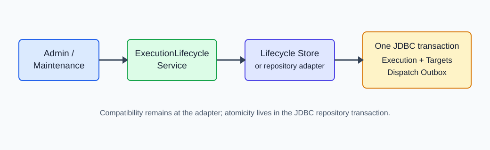
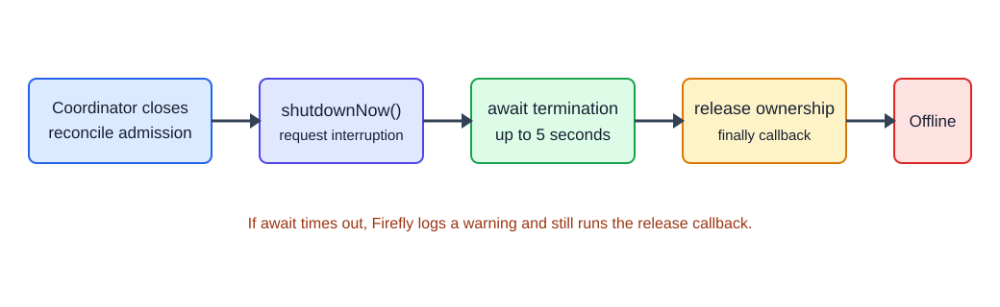

# 调度系统如何划清运行时状态所有权：Execution、Outbox 与关闭边界

> 摘要：不是每一种调度系统都需要 Execution、Outbox 或远程 ACK。判断依据不是系统叫不叫“分布式调度”，而是漏跑、重复执行和旧节点继续派发会造成什么后果。本文从三个具体任务开始，再用一次 ACK 丢失后的取消过程说明状态为何必须有唯一入口，最后用 Firefly 展示渐进式落地方式。

## 先看三种任务失败后会怎样

是否值得引入持久化执行记录、Outbox 或租约，首先取决于失败的业务代价，而不是架构名词。

### 本地缓存清理：漏跑一次可以接受

一个应用每十分钟清理一次本地缓存。任务和定时器都在同一个进程，进程重启后缓存自然消失；即使某一轮没有执行，下一轮也能继续清理。这里真正需要的是避免同一进程内并发执行，并在关闭时停止接受新任务。为它建立 execution 表和可靠派发队列，通常得不偿失。

### 远程对账：重复执行可能产生业务损失

每天零点，调度端通知 Worker 对某个商户执行账务对账。Worker 已经收到任务并开始处理，但 ACK 在网络中丢失。调度端如果把“没有收到 ACK”当成“没有执行”并直接重试，同一商户就可能被处理两次。此时必须保存“这次运行是谁”“派发是否已经尝试”“当前是否允许重试”，并要求 Worker 用 execution ID 做幂等。

### HA 节点接管：旧节点可能在释放租约后继续派发

节点 A 获得分片租约并读到一批待执行任务。关闭开始后，它释放租约；节点 B 随即接管同一分片。但如果 A 的工作线程忽略中断，仍可能把刚才读到的任务发出去，于是 A、B 同时派发。这里仅有租约表还不够：关闭顺序必须是停止新工作、等待在途工作退出，再释放所有权；对强一致场景还需要 fencing token 拒绝旧租约持有者的写入。

| 任务 | 可以接受的失败 | 不能接受的失败 | 最小必要设计 |
| --- | --- | --- | --- |
| 本地缓存清理 | 偶尔漏跑一轮 | 同一进程内无限并发 | 本地互斥、幂等、可等待的线程关闭 |
| 远程商户对账 | ACK 迟到后继续等待或人工确认 | 因盲目重试而重复处理 | 持久化 execution、可靠派发、Worker 幂等、取消/超时事务 |
| HA 分片调度 | 接管短暂延迟 | 新旧节点同时派发 | lease、停止后释放、超时告警；必要时增加 fencing |

本文关注后两类任务，因为它们的正确性取决于跨进程状态，而不只是定时器能否按时触发。

## 用一次 ACK 丢失后的取消拆解状态所有权

假设一次远程对账的 execution ID 是 `exec-2048`。下面几个事件可能在十秒内连续发生：

| 时间 | 发生的事件 | 系统必须保证的事实 |
| --- | --- | --- |
| 00:00.000 | 计划到期 | 推进调度游标、创建 `exec-2048`、记录派发意图必须属于同一次提交；否则可能只推进游标却没有任务可发 |
| 00:00.120 | Worker 收到任务，ACK 丢失 | 调度端只能确定“尚未确认”，不能据此断言 Worker 没有执行；重试仍必须复用同一个幂等标识 |
| 00:05.000 | 运维人员取消任务 | execution、执行目标和未完成的派发记录必须一起变为不可继续执行，不能只修改页面上展示的 execution 状态 |
| 00:05.010 | Outbox 重试扫描开始 claim | 扫描器不能再取得已取消的派发；取消与 claim 必须通过数据库条件或锁确定唯一胜者 |
| 00:08.000 | 原 Worker 上报迟到结果 | 系统必须预先定义策略：保留 `CANCELLED` 并记录迟到结果，或允许特定终态转换；不能由最后到达的请求随意覆盖终态 |

如果 Admin 取消先调用 Execution Repository，再调用 Outbox Repository，第二次调用失败后就会出现 `execution=CANCELLED`、`outbox=RETRYABLE`。页面告诉运维“已经取消”，后台却仍会再次派发。反过来只取消 Outbox，也可能留下永远停在 `RUNNING` 的 execution。这里需要的不是更多 Repository，而是一个拥有完整取消语义的生命周期入口，以及覆盖 execution、target 和 dispatch 的单个数据库事务。

输入错误也会进入这条状态链。比如启停接口收到：

```json
{"enabled":"treu"}
```

如果读取层先把所有值转成字符串，再调用 `Boolean.parseBoolean`，这次拼写错误会被解释为合法的 `false`，任务随即被停用。更可控的行为是保留 JSON 类型，在绑定 request record 时直接返回 400，并指出 `enabled` 必须是 boolean。批量取消的 ID 也应直接绑定成 `List<String>`，而不是先拼接、再按逗号拆分。

从这条时间线可以直接得到组件边界，而不必先设计类图：

| 业务操作 | 必须原子或互斥的变化 | 唯一入口应负责什么 |
| --- | --- | --- |
| 触发任务 | cursor、execution、dispatch intent | 原子推进并入队，失败时全部回滚 |
| 取消或判定超时 | execution、target、pending dispatch | 锁定当前状态并在一个事务内收敛 |
| 派发重试 | claim、retry、dead、requeue | 实现明确的 Outbox 状态机和条件更新 |
| 接收 ACK/结果 | 协议字段、当前 execution 状态、终态规则 | 先校验 typed frame，再执行允许的状态转换 |
| 节点关闭 | 停止接单、在途 worker、lease | 先阻止新工作，限时等待，最后释放所有权 |

## 划清边界能带来什么

这些改动不是为了让类图更漂亮，而是直接改善故障处理：

- **状态一致性**：取消和超时不再依赖多个 Repository 的调用顺序，跨表变化要么一起提交，要么一起回滚。
- **失败可见性**：错误布尔、缺失字段和未实现能力立即失败，配置错误不会伪装成一次成功状态变更。
- **能力可发现性**：调用方依赖 `JobCatalog` 或 `DispatchOutboxStore` 等窄接口，可以从类型上知道 Store 是否支持所需操作。
- **升级兼容性**：消息体和快照先建立 typed frame 与 schema envelope，新旧数据可以在明确的兼容边界内共存。
- **运维可诊断性**：关闭等待有固定上限并记录超时告警，节点离线不再把一次中断请求误认为任务已经结束。

这些收益共同指向一个目标：让并发和故障从“依赖调用者自觉”变成“由边界强制执行”。

下面以 Firefly 的渐进式改造为案例，说明这些从场景推导出的边界如何落到现有代码中。这里的类名和接口划分是一种实现选择，不是所有调度系统都必须复制的组件清单。

## 一个入口协调 Execution 与 Outbox 生命周期



Caption: 生命周期服务统一调用入口，JDBC 事务同时更新 execution、target 和 dispatch outbox；兼容调用仍可通过 Execution Repository 适配。

`ExecutionLifecycleService` 是应用层入口。它既可以接收新的 `ExecutionLifecycleStore`，也可以包装兼容的 `ExecutionRepository`：

```java
public boolean cancel(String executionId, Instant cancelledAt, String reason) {
    return lifecycleStore != null
            ? lifecycleStore.cancel(executionId, cancelledAt, reason)
            : executions.cancelExecution(executionId, cancelledAt, reason);
}
```

`JdbcExecutionLifecycleStore` 当前是一个很薄的适配器，实际事务仍由 `JdbcExecutionRepository` 完成。取消路径先锁定 execution，再依次更新 `firefly_execution`、`firefly_execution_target` 和 `firefly_dispatch_outbox`，最后提交；任一步抛出异常都会回滚。同样，超时扫描也在一个事务中收敛这三类状态。

这解决的是调用入口和原子性问题，不代表底层 DAO 已经完全拆分。它的价值在于 Admin 不再自行编排两个 Repository，后续维护路径也可以复用同一份生命周期语义。

## Store 能力先显式化，再迁移兼容 facade

`JobRepository` 曾经同时承担任务目录、游标推进、Outbox 和执行重试。大量默认返回空集合或 `false` 的方法会让一个不完整实现顺利编译，然后在运行时静默丢失能力。

这类拆分可以落成四个能力接口：

- `JobCatalog`：任务定义的保存、查询、启停和删除。
- `SchedulingStore`：due job 查询、游标推进和 `advanceAndEnqueue` 原子操作。
- `DispatchOutboxStore`：claim、ACK、retry、complete 和 cancel。
- `ExecutionRetryStore`：手工派发和 execution retry scheduling。

`JdbcJobRepository` 显式实现这四个接口。兼容的 `JobRepository` 仍存在，多数未实现的 Outbox 操作已经改为抛出 `UnsupportedOperationException`，但 `advanceAndEnqueue` 等兼容默认方法尚未全部消失。因此，这一版建立的是能力迁移路径，而不是宣称旧的胖接口已经移除。

## 关键 Admin 写请求保留 JSON 类型

Admin 继续使用 JDK `HttpServer` 和 Jackson，没有引入 Web 框架。变化集中在三个高风险写操作：

- `BatchCancelRequest`
- `BatchRequeueRequest`
- `SetJobEnabledRequest`

Jackson 对这些 record 启用了未知字段失败，并拒绝把字符串强制转换成布尔值。数组从请求体直接绑定为 `List<String>`，因此下面两个 ID 不会再因为逗号被拆成三个：

```json
{
  "executionIds": ["tenant,blue", "tenant-red"],
  "reason": "operator request"
}
```

```text
{"enabled": true}   -> accepted
{"enabled": "treu"} -> 400
```

通用 `AdminRequestReader.object()` 仍会把标量转换成字符串，并把数组或对象重新序列化为 JSON 文本，以维持其他路由的兼容性。因此，准确的结论是“关键写操作已经类型化”，而不是“整个 Admin API 已经拥有完整 request schema”。

## 关闭协议增加等待，但等待是有上限的



Caption: Coordinator 先关闭新的 reconcile 入口，后台 executor 收到中断并最多等待 5 秒；释放回调在正常退出或等待超时后都会执行。

`shutdownNow()` 只发出中断请求，不代表任务已经结束。`ManagedWorker` 统一了关闭顺序：

```java
executor.shutdownNow();
stopped = executor.awaitTermination(timeout.toMillis(), TimeUnit.MILLISECONDS);
// timeout -> warning
releaseOwnership.run(); // also runs after timeout or interruption
```

Scheduler、Dispatch Outbox Worker、Execution Maintenance Worker、Node Drain Monitor 和节点协调器都复用这个工具。节点协调器还在 `close()` 开始时把 `accepting` 设为 `false`，阻止新的 reconcile 进入；等待阶段结束后才释放当前租约并标记节点离线。

这里有一个必须保留的运维边界：等待上限是 5 秒，`releaseOwnership` 位于 `finally`。如果任务忽略中断并超过上限，系统会记录告警，但仍执行释放回调。它显著缩小了原来的并发窗口，却不是“无条件证明旧任务已经退出”。生产环境应把这条超时告警当作需要调查的信号。

## Netty 类型化从消息体校验开始

`NettyExecutorMessage` 继续作为兼容 envelope，payload 仍是 `Map<String, String>`。协议模块新增：

- `RegisterExecutorFrame`
- `AckJobFrame`
- `ReportResultFrame`
- `NettyExecutorFrameMapper`

Gateway Handler 在进入 Register、ACK 或 Result 分支前调用 mapper，必需字段缺失会在业务状态转换之前失败。这让协议约束从 Handler 内的零散 Map 读取，前移到可单测的消息模型。

这一步还没有拆掉 `NettyExecutorGatewayHandler` 的业务职责，也没有真正实现按协议版本注册的 upcaster。当前收益是输入验证和模型边界，后续才适合继续提取 command handler 与版本映射。

## 快照先版本化 envelope，而不是重写全部格式

新的 Outbox 快照形态如下：

```json
{"schemaVersion":1,"payload":"<base64url>"}
```

`schemaVersion` 选择解码路径，历史 v0 Map 字符串仍可直接读取。内层 `payload` 则是旧 Map 编码后的 Base64URL 文本。这种做法先解决“读哪一种格式”的问题，并避免升级时让未派发的历史 Outbox 立刻不可读。

解码 `enabled`、`retryOnFailure` 和 `retryOnTimeout` 时使用严格布尔解析。字段缺失或值非法会抛出异常，不再静默得到 `false`。

需要注意，这不是完整的 `DispatchSnapshotV1` JSON record。内层字段仍依赖既有 Map，envelope 解析目前也不是通用 Jackson DTO。后续若要安全增加必填字段，还需要定义真正的版本化 payload schema 和历史 fixture。

## 配置错误在启动时暴露

所有服务端布尔选项现在复用 `OptionSpec.strictBoolean`，所以 `firefly.security.jwt.enabled=treu` 会让启动失败。`OptionSchema` 首先注册 JWT 核心选项，并拒绝 `firefly.security.jwt.*` 下的未知核心名称；`firefly.security.jwt.client.*`、client 列表和插件配置保留扩展空间。

这同样是增量实现：严格布尔已经覆盖通用布尔入口，但完整的 Option Schema 注册表目前只覆盖 JWT 核心命名空间，并未枚举所有 Server option。

## 验证范围与已知边界

案例代码的验证覆盖严格 Admin 布尔和逗号 ID、JDBC 取消事务、v0/v1 快照读取、Scheduler 关闭等待、Netty frame 映射，以及错误 JWT 配置的启动失败。

MySQL 初始化数据库迁移的中途失败恢复不属于这组运行时边界改造。实现没有 migration journal，也没有“加列成功、后续失败后重跑”的真实 MySQL 注入测试；数据库初始化应单独设计恢复协议。

## 结语

这套方案最有价值的不是新增了多少类，而是把几条高风险路径从“大家都能改”推进到“有入口、有事务、有校验”。同样重要的是承认兼容层仍然存在：胖 `JobRepository`、集中式 Netty Handler、Map payload 和限时关闭都还需要继续演进。

可靠性改造不必从推倒重来开始。先让失败显式、让状态变更原子、让接口声明真实能力，系统就已经更容易验证，也更容易继续拆分。
