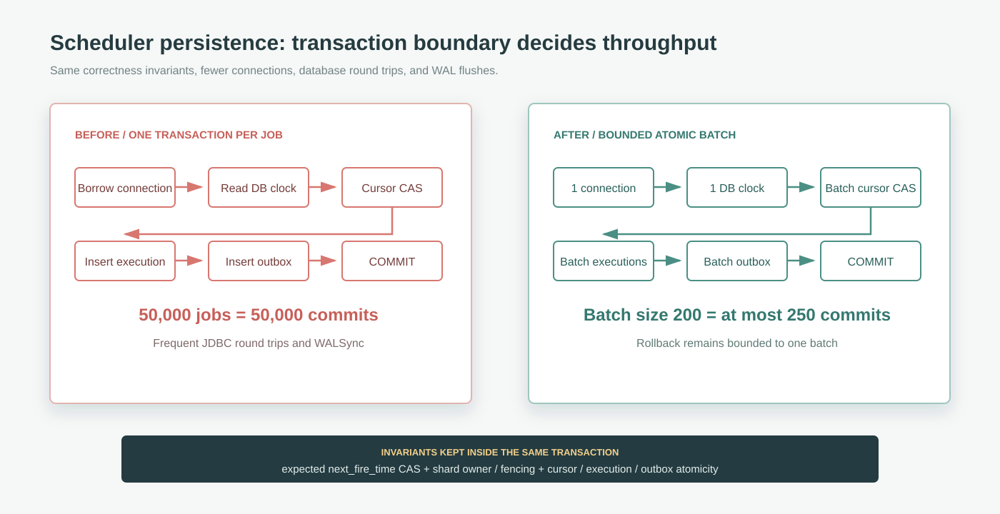
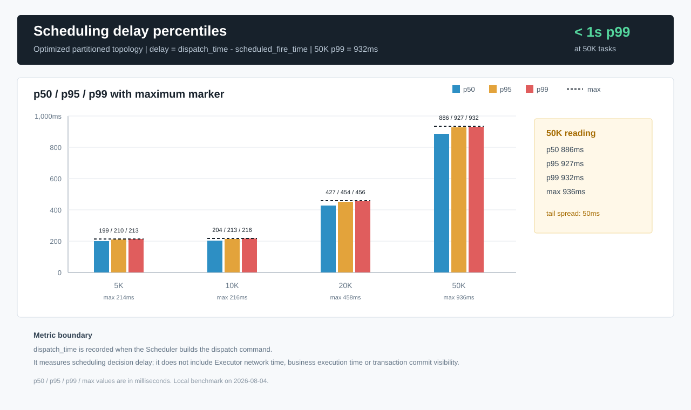

最近给 Firefly 的调度器补了一轮本地压测。刚开始我也只是想确认一件事：同一时刻堆上来一批定时任务，Scheduler 到底扛不扛得住。

但真正跑下来以后，我发现比结果数字更有价值的，反而是压测过程本身暴露出来的几个问题：负载模型很容易测歪，平均吞吐很容易骗人，端到端耗时和调度耗时也很容易混在一起看。最后如果只留下“提升了多少倍”，其实还是没有回答系统设计里最关键的部分：瓶颈为什么在那里，下一个瓶颈又会去哪里。

所以这篇不是 Firefly 某个版本的成绩单。我更想借这次调度器压测，把“压测应该怎么设计才有用”这件事整理一下。

## 先把问题问窄

压测最怕一上来就问一个很大的问题：系统性能怎么样？

这个问题太空了。API 性能、数据库性能、调度性能、执行器性能、业务 handler 性能，最后都能被塞进“系统性能”里。真跑慢了以后，还是不知道该改哪里。

这次我把问题收窄到调度器这一段：

> 大量定时任务在同一时刻到期时，Scheduler 能不能在可接受时间内把调度结果持久化下来，并且不重复、不丢失、不破坏 cursor 和 shard ownership？

这里其实已经隐含了三类结果。

| 我关心什么 | 具体看什么 |
| --- | --- |
| 调度能不能及时清空 | 调度清空耗时、`tasks/s` |
| 尾部任务会不会拖太久 | p50、p95、p99、max scheduling delay |
| 快了以后有没有出错 | duplicate claims、duplicate execution IDs、未完成 outbox |

这一步看起来像废话，但很重要。压测不是把机器打满就结束，它得先知道自己要证明什么。

## 指标要先画边界

Firefly 这次压的是 PostgreSQL 持久化调度路径，大概是这一段：

```text
到期任务
  -> Scheduler 计算下一次游标
  -> cursor CAS
  -> 创建 execution
  -> 写入 dispatch outbox
  -> Outbox 状态闭环
```

调度延迟按下面这个口径算：

```text
dispatch_time - scheduled_fire_time
```

也就是说，它衡量的是 Scheduler 把调度决策生成并持久化下来的延迟。它不包含真实 Gateway 网络传输、不包含 Executor 线程池排队，也不包含业务 handler 的执行耗时。

这个边界必须提前讲清楚。否则一个 `3.572s` 的结果很容易被误读成“端到端 5 万任务 3.572 秒完成”，这就完全不是一回事。

本地环境也要写清楚，因为压测数字离不开机器和数据库：

| 项目 | 配置 |
| --- | --- |
| CPU | Intel Core i5-13600KF，14 核 / 20 逻辑处理器 |
| 内存 | 63.76 GiB |
| Java | Oracle JDK 21.0.11 |
| PostgreSQL | 16.14，`postgres:16-alpine` |
| 磁盘 | Samsung SSD 980 PRO 1TB NVMe |
| Scheduler shards | 32 |
| 调度批次 | 200 |

这些数字不能直接当成生产容量承诺。它们更适合用来判断：当前实现里，到底是哪一段先顶不住。

## “同一时刻到期”很容易测歪

定时任务压测里有个坑，我一开始就专门避开了：你以为自己测的是“同刻到期”，实际测到的可能是“注册任务的速度”。

比如要压 50,000 个任务，如果一边注册一边把触发时间设置到一个很近的未来时间，注册过程本身可能就要好几分钟。前面写进去的任务已经到期了，后面的任务还在注册。最后调度器面对的并不是一个干净的突发流量。

这次的做法是先把任务都注册到一天后，再统一移动触发时间：

1. 先把全部任务注册到一天后的初始时间。
2. 获取 32 个 shard lease。
3. 用一条 SQL 把本轮任务统一设置到同一个近未来时间。
4. 等这个时间点到达，再启动 Scheduler。
5. 等待 execution 和 outbox 数量达到任务总数。
6. 并发完成 Outbox 状态闭环。
7. 最后校验游标、状态、重复 ID、重复 claim 和未完成记录。

这一步的目的不是把流程搞复杂，而是把“准备数据的时间”和“真正的调度压力”拆开。压测模型不干净，后面的数字再漂亮也没什么解释力。

## 不要只跑顺风局

我这里用了两种拓扑。

| 拓扑 | 行为 | 主要想看什么 |
| --- | --- | --- |
| `partitioned` | 32 个 shard 分配给多个 Scheduler，每个 shard 只有一个 owner | 正常 ownership 下能跑多快 |
| `contention` | 多个 Scheduler 同时加载并竞争全部 shard | CAS、fencing、幂等边界能不能守住 |

`partitioned` 更接近正常生产拓扑，适合看吞吐。`contention` 则有点像故意制造混乱，适合看实现有没有靠运气运行。

调度系统里，CAS 和 fencing 这种东西平时不一定显眼，但一旦 ownership 抖动、实例重启或者 lease 边界处理不稳，就可能变成重复调度。压测只跑顺风局，很容易把这些问题藏起来。

## 真正慢的是事务边界

优化前，`SchedulerEngine.tick()` 会对每个到期任务单独调用 `advanceAndEnqueue()`。JDBC 路径大概是这样：

1. 借一次 `Connection`。
2. 开事务，查一次数据库时间。
3. 做 cursor CAS 和 shard lease/fencing 校验。
4. 如果是 `FORBID` 并发策略，再查一次活动 execution。
5. 插入 execution。
6. 插入 outbox。
7. 单任务提交事务。

50,000 个任务就意味着 50,000 次事务提交，还有大量 JDBC 往返。旧实现从 5K 到 50K 的吞吐基本卡在 `93-121 tasks/s`，规模上去以后没有明显并行收益。

这时最容易怀疑的是 Java 代码或者 GC。但 JFR 不是这么说的：优化后 5K 完整记录覆盖 31 秒，4 次 GC 暂停合计只有 `18.6ms`，最大 `8.1ms`，没有 allocation failure。PostgreSQL 侧看到的主要等待是 `WALWrite` 和 `WALSync`。

也就是说，问题不在“Java 循环太慢”，而在“每个任务都单独提交一次事务”。数据库一直在为这些小事务做 WAL 同步。

## 批量不是把循环改成 batch 就完了

最后的改造方向是把逐任务事务改成有界批量原子事务。Scheduler 按 `firefly.scheduler.batch-size` 拆批，当前默认值是 200。



批量以后，一批任务只借一次 `Connection`，只读一次数据库时间，在同一个事务里完成批量 cursor CAS、execution insert 和 outbox insert。`FORBID` 任务的活动 execution 查询也从逐条查询变成集合查询。

但调度系统不能只为了快。这个批量路径仍然保留了几个约束：

- cursor CAS 仍然校验预期的 `next_fire_time`。
- SQL 仍然校验 shard owner、fencing token 和 lease 过期时间。
- cursor、execution、outbox 仍然在同一个事务里。
- 只有 CAS 成功且不存在活动 execution 的任务，才会创建后续记录。
- 任一 batch insert 失败，整个有界批次 rollback。
- 自定义存储如果没有批量 API，就回退到逐条实现。

这里的 200 也不是一个可以到处复制的“最佳参数”。它只是这台机器、这个数据库、这组任务模型下比较合适的平衡点：减少提交次数，同时别把事务拉得太长，也别让失败回滚范围太大。

## 结果要分开看

先看调度路径本身。


| 任务数 | 优化前调度 | 优化后调度 | 优化前吞吐 | 优化后吞吐 | 调度提升 |
| ---: | ---: | ---: | ---: | ---: | ---: |
| 5,000 | 41.399 s | 0.906 s | 120.78/s | 5,518.76/s | 45.7x |
| 10,000 | 101.295 s | 0.937 s | 98.72/s | 10,672.36/s | 108.1x |
| 20,000 | 214.172 s | 1.869 s | 93.38/s | 10,700.91/s | 114.6x |
| 50,000 | 477.068 s | 3.572 s | 104.81/s | 13,997.76/s | 133.6x |

这个结果说明，事务边界改完以后，调度路径上的瓶颈确实被移走了。50K 同刻到期任务，调度清空时间从 `477.068s` 降到 `3.572s`。

但只看清空时间还不够。尾延迟也要看：



| 任务数 | p50 | p95 | p99 | max |
| ---: | ---: | ---: | ---: | ---: |
| 100 | 29 ms | 29 ms | 29 ms | 29 ms |
| 5,000 | 199 ms | 210 ms | 213 ms | 214 ms |
| 10,000 | 204 ms | 213 ms | 216 ms | 216 ms |
| 20,000 | 427 ms | 454 ms | 456 ms | 458 ms |
| 50,000 | 886 ms | 927 ms | 932 ms | 936 ms |

50K 下 p99 是 `932ms`，max 是 `936ms`。如果业务能接受 1 秒级调度延迟，这个结果就比较稳；如果业务 SLO 是 200ms，那就不能只拿平均吞吐说事。

正确性也要跟着看：

| 校验项 | 结果 |
| --- | ---: |
| `firefly_job` | 50,000 |
| `firefly_execution` | 50,000 |
| `firefly_dispatch_outbox` | 50,000 |
| `SUCCEEDED` | 50,000 |
| `DONE` | 50,000 |
| duplicate claims | 0 |
| duplicate execution IDs | 0 |
| duplicate outbox IDs | 0 |
| 未推进任务游标 | 0 |
| 非终态 outbox | 0 |

性能优化最怕“看起来快了，状态却乱了”。所以这类校验我会放在压测结果里一起看，而不是当成测试日志里的附属信息。

## 瓶颈只是转移了

调度路径快了 133.6 倍，但端到端总耗时没有跟着快 133 倍。50K 场景下，总耗时从 `728.003s` 降到 `242.239s`，大概是 3 倍。

拆开以后就很清楚：

| 阶段 | 50K 耗时 |
| --- | ---: |
| 任务逐条注册 | 191.358 s |
| 调度清空 | 3.572 s |
| Outbox 完成模拟 | 46.004 s |
| 总耗时 | 242.239 s |

这就是压测报告里最有用的地方：它告诉你下一步不该继续盯着 Scheduler 猛调参数了。至少在这个本地模型下，下一轮更值得看的是任务批量注册、Outbox worker、snapshot 编码、PostgreSQL WAL，或者真实 Gateway/Executor 链路。


50K 场景里，JVM Heap 峰值大约 `731.4 MiB`，Java Working Set 大约 `928.1 MiB`，PostgreSQL CPU 峰值到了 `501.86%`，主要等待仍然是 `WALWrite`、`WALSync`。这也说明，串行小事务的问题移走以后，数据库开始真正吃到更多 CPU，后面继续优化就会越来越接近 WAL、磁盘和 PostgreSQL 并发能力本身。

## 复现命令别省略

如果压测报告不能复现，它就很难继续演进。Firefly 这轮压测用的是独立 Gradle task，不放进普通单元测试里：

```powershell
E:\gradle-9.6.1\bin\gradle.bat :stores:jdbc:stressTest --no-daemon --rerun-tasks `
  "-Dfirefly.stress.maxHeap=8g" `
  "-Dfirefly.stress.jdbc.url=jdbc:postgresql://127.0.0.1:55432/firefly_stress" `
  "-Dfirefly.stress.jdbc.username=postgres" `
  "-Dfirefly.stress.jdbc.password=<local-password>" `
  "-Dfirefly.stress.jobs=50000" `
  "-Dfirefly.stress.registrationThreads=16" `
  "-Dfirefly.stress.schedulerThreads=8" `
  "-Dfirefly.stress.outboxWorkers=32" `
  "-Dfirefly.stress.claimBatchSize=300" `
  "-Dfirefly.stress.maxConnections=96" `
  "-Dfirefly.stress.topology=partitioned" `
  "-Dfirefly.stress.schedulingBatchSize=200" `
  "-Dfirefly.stress.report.path=build/reports/stress/optimized-partitioned-50k.json"
```

对应几个关键运行参数：

```properties
firefly.scheduler.batch-size=200
firefly.scheduler.max-due-records-per-tick=10000
firefly.scheduler.max-idle-wakeup=PT0.5S
```

真实密码、内网地址、生产连接串不要写进文章。这里用 `<local-password>` 这种占位符就够了。

## 我会保留的压测清单

这次压测之后，我自己会把下面这些点当成之后做系统压测的固定检查项：

- 先写清楚压测要回答的问题。
- 先画指标边界，不要把所有链路混在一个耗时里。
- 数据准备和压测窗口要拆开。
- 平均吞吐、p95、p99、max 一起看。
- 正确性校验必须进压测结果，不要只看性能。
- 环境信息和核心参数要记录下来。
- 分阶段计时，观察瓶颈有没有迁移。
- 用 JFR、数据库等待事件、连接池等待和日志互相印证。
- 给出可复现命令。
- 明确哪些结论只适用于本地，哪些可以指导生产设计。

## 结尾

这次压测最直接的收获，是确认了 Firefly 调度器旧路径的主要瓶颈不在 Java 循环，也不在 GC，而在逐任务事务提交。把持久化边界改成有界批量原子事务以后，50,000 个同刻任务的调度清空时间从 `477.068s` 降到了 `3.572s`。

但我觉得更重要的收获是：压测不能只留下一个漂亮数字。它应该能解释数字从哪里来，哪些场景能相信，哪些场景不能外推，以及下一轮该把注意力放在哪里。

完整压测报告与实现可以查看 [Firefly 压测报告](https://github.com/fishered/Firefly/blob/master/docs/stress-test-v1.0.4.md) 和 [批量调度实现提交](https://github.com/fishered/Firefly/commit/12fab19321ea03d609f93116c1fb6cbe5aadd87c)。
