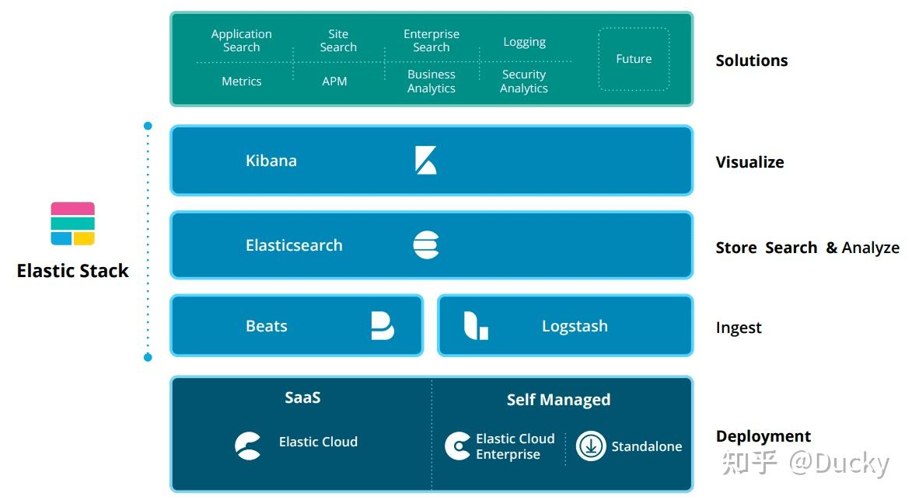
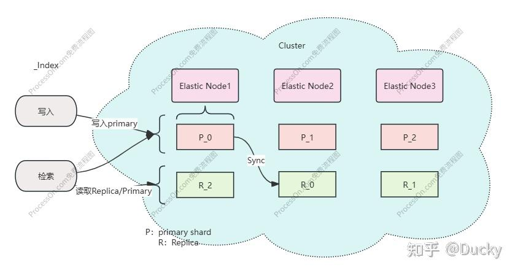

> Summary: This article connects Elasticsearch concepts with the lower-level Lucene mechanics that make indexing and querying possible.

## Intended Reader

Backend engineers who want to understand search infrastructure beyond basic API usage.

## Why This Matters

Search engine systems combine indexing, storage, distributed coordination, query execution, and scoring. Elasticsearch is a practical way to study those layers through a real system.

Elasticsearch should be understood as a distributed service built on top of Lucene. Lucene provides the index mechanics; Elasticsearch adds cluster coordination, node roles, APIs, and operational behavior.

## Mental Model

Understand the path from document ingestion to Lucene segments, then from cluster/node startup to query routing and result collection.

The practical way to read this article is to look for the boundary it clarifies: what state exists, who owns it, which operation changes it, and what evidence proves the system behaved as expected.

## Implementation Walkthrough

- Start with the search problem: documents must be indexed, segmented, queried, scored, and returned under latency constraints.
- Map Elasticsearch node roles to responsibilities such as data storage, master coordination, ingest processing, and request routing.
- Connect shards and replicas to availability and query parallelism instead of treating them as default settings.
- Use Lucene as the boundary for understanding inverted indexes, segments, and the cost of refresh and merge behavior.

## Pitfalls and Tradeoffs

- More shards can increase distribution but also increases coordination and memory overhead.
- Replicas improve availability and read capacity, but they raise storage and replication cost.
- Search relevance and cluster stability are related but should be tuned through different feedback loops.

## Verification Checklist

- Check cluster health, shard allocation, node roles, and index mappings before loading large data.
- Use representative queries when evaluating index design.
- Watch slow queries, refresh pressure, and merge activity during write-heavy workloads.

## Practical Takeaways

- Lucene provides the core index mechanics; Elasticsearch adds distributed coordination, APIs, and operational tooling.
- Cluster behavior depends on node discovery, shard allocation, replica strategy, and failure recovery.
- Index design should follow query patterns, update frequency, and storage cost rather than default settings.
- Visualization tools help, but they should be paired with an understanding of the underlying shard and node model.

## Visual Evidence

The migrated local images are preserved as supporting figures. They keep the English edition aligned with the same diagrams, screenshots, or console evidence used by the source article.

## Source Notes

- Topic: Search Engine
- [Original source](https://zhuanlan.zhihu.com/p/1974794973481288478)
- Original publication date: 2025-11-20
- This English edition is localized from the migrated article metadata, source structure, technical terms, local assets, and clean implementation evidence.

## Closing Thoughts

The goal of this English edition is not to imitate the original wording sentence by sentence. It preserves the engineering argument, removes migration noise, and presents the article as a publishable technical note that future readers can use for design, debugging, or implementation review.
