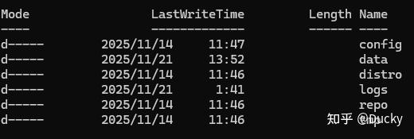
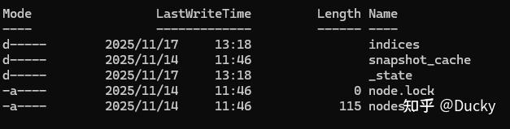
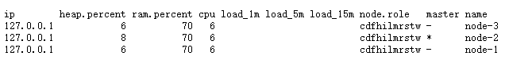
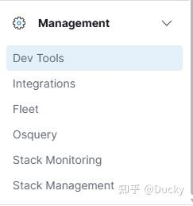
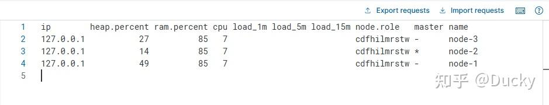

## Elastic Repo 源码运行

elastic源码服务运行，github上clone对应git repo

[Elastic Repo](https://link.zhihu.com/?target=https%3A//github.com/elastic/elasticsearch)

[Kibana Repo](https://link.zhihu.com/?target=https%3A//github.com/elastic/kibana)

```text
git@github.com:elastic/elasticsearch.git
git@github.com:elastic/kibana.git
```

IDEA Import Existed Project，选择Gradle适配/当前以es8.X jdk17为例

配置gradle ，使用es默认Wrapper（注意：es8.X gradle版本要在8以上），在init.gradle中修改默认镜像源：

```text
allprojects {
repositories {
mavenLocal()
maven { name "Alibaba" ; url "https://maven.aliyun.com/repository/public" }
maven { name "Bstek" ; url "https://nexus.bsdn.org/content/groups/public/" }
mavenCentral()
}
buildscript {
repositories {
maven { name "Alibaba" ; url 'https://maven.aliyun.com/repository/public' }
maven { name "Bstek" ; url 'https://nexus.bsdn.org/content/groups/public/' }
maven { name "M2" ; url 'https://plugins.gradle.org/m2/' }
}
}
}
```

配置完成，等待拉取镜像依赖后，在当前根目录执行：

```text
./gradlew clean assemble
```

构建完成后，执行

```text
./gradlew run
```

观察是否成功gradle 临时目录，位于/{root}/build/testclusters/runTask-0

其中，默认gradlew默认运行单实例node，其中runTask-0就是其中一个临时节点，包含
/config 基本配置信息，默认es是使用临时的elasticsearch.yml配置进行运行的

```text
xpack.security.enabled: true
cluster.name: runTask
discovery.seed_providers: file
http.port: 9200
cluster.routing.allocation.disk.watermark.low: 1b
cluster.routing.allocation.disk.watermark.high: 1b
indices.breaker.total.use_real_memory: false
discovery.seed_hosts: []
path.logs: {root}\build\testclusters\runTask-0\logs
path.repo: {root}\build\testclusters\runTask-0\repo
cluster.initial_master_nodes: [runTask-0]
script.disable_max_compilations_rate: true
action.destructive_requires_name: false
transport.port: 9300
path.data: C:\workSpace\elasticsearch\build\testclusters\runTask-0\data
cluster.routing.allocation.disk.watermark.flood_stage: 1b
node.name: runTask-0
node.attr.testattr: test
discovery.initial_state_timeout: 0s
cluster.deprecation_indexing.enabled: false
cluster.service.slow_task_logging_threshold: 5s
node.portsfile: true
cluster.service.slow_master_task_logging_threshold: 5s
```

默认jvm配置文件：

```text
-XX:+UseG1GC

## JVM temporary directory
-Djava.io.tmpdir=${ES_TMPDIR}

# Leverages accelerated vector hardware instructions; removing this may
# result in less optimal vector performance
20:--add-modules=jdk.incubator.vector

## heap dumps

# generate a heap dump when an allocation from the Java heap fails; heap dumps
# are created in the working directory of the JVM unless an alternative path is
# specified
-XX:+HeapDumpOnOutOfMemoryError

# exit right after heap dump on out of memory error
-XX:+ExitOnOutOfMemoryError

# specify an alternative path for heap dumps; ensure the directory exists and
# has sufficient space
-XX:HeapDumpPath={root}\build\testclusters\runTask-0\logs

# specify an alternative path for JVM fatal error logs
-XX:ErrorFile={root}\build\testclusters\runTask-0\logs\hs_err_pid%p.log

## GC logging
-Xlog:gc*,gc+age=trace,safepoint:file={root}\elasticsearch\build\testclusters\runTask-0\logs\gc.log:utctime,level,pid,tags:filecount=32,filesize=64m
```

执行后，会在根目录创建node初始化文件：





*indices目录：产生的index存储模型，里面包含index和对应的数据存储-index/_state/translog*

目前es8及以上，默认开启了身份访问控制，所以默认我们需要关闭当前配置，所以需要配置认证访问的开关：

```text
xpack.security.enabled = false
```

如果不想在配置中处理，可以查找Security的组件初始化：

```text
Security(Settings settings, List<SecurityExtension> extensions) {
// TODO This is wrong. Settings can change after this. We should use the settings from createComponents
this.settings = settings;

//将它设置为false，默认就不会打开security
//this.enabled = XPackSettings.SECURITY_ENABLED.get(settings);
this.enabled = false;
this.systemIndices = new SecuritySystemIndices();
this.nodeStartedListenable = new ListenableFuture<>();
if (enabled) {
```

然后执行./gradle run 或 ./gradlew run --debug-jvm，如果以debug运行，则需要jvm listen socket

```text
-agentlib:jdwp=transport=dt_socket,server=n,address=host.docker.internal:5007,suspend=y,onthrow=<FQ exception class name>,onuncaught=<y/n>
```

务必先指定监听器，后执行 --debug， 确保debug在执行时可以被listener监听

## Elastic Cluster & Kibana

直接搭建cluster集群，集群最少要满足最少奇数，所以一个最小的elastic search cluster至少需要三个节点

```text
https://github.com/elastic/elasticsearch/releases/tag/v8.19.7
```

将elastic复制3份，并修改配置文件：

```text
cluster.name: es-cluster
node.name: node-1

path.data: data
path.logs: logs

network.host: 127.0.0.1
http.port: 9310
transport.port: 9311

discovery.seed_hosts: ["127.0.0.1:9311", "127.0.0.1:9321", "127.0.0.1:9331"]
cluster.initial_master_nodes: ["node-1", "node-2", "node-3"]

xpack.security.enabled: false
xpack.security.http.ssl.enabled: false
xpack.security.transport.ssl.enabled: false
```

其中，每个节点都包含其余的节点，所以discovery.seed_hosts 是每个节点配置的transport.port，用于cluster检查及通信

cluster.initial_master_nodes需要与node.name相同，并且cluster.name相同才可注册在同一个集群下

执行./elasticsearch.sh

**kibana运行：**

kibana/config/kibana.yml 修改配置信息

```text
server.host: "0.0.0.0"
server.port: 5601

##这里只需要指定一个节点即可
elasticsearch.hosts: ["http://127.0.0.1:9310"]
```

完成后，访问[{host}/_cat/nodes?v](https://link.zhihu.com/?target=http%3A//localhost%3A9310/_cat/nodes%3Fv)






通过DevTools，尝试获取Elastic Node的节点信息：

```text
GET _cat/nodes?v
```


