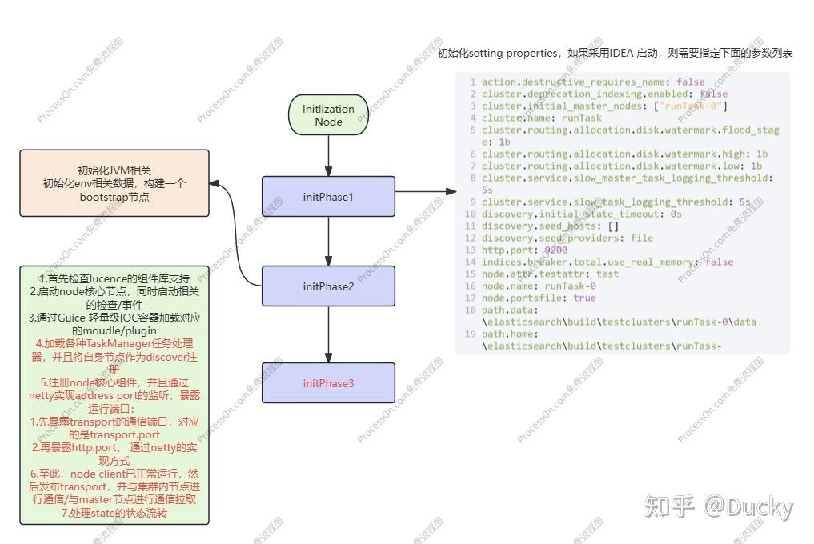

## Node组件一览

> 当前以Elastic Search 8.9 Release为例，相关代码Repo请参考过往文章
> elasticsearch/
> ├── benchmarks - 基准测试
> ├── build-* - 构建时工具
> ├── distribution - 打包/发布工具
> ├── doc - plugin相关文档
> ├── lib - 工具类库
> ├── moudles* - （重要）默认功能集成
> ├── plugin* - （重要）可插拔式组件集成
> ├── qa - 单元测试覆盖
> ├── server* - （非常重要）涵盖了elastic node核心处理
> └── x-pack - 扩展框架

其中，最核心的莫过于_server，它包含了：

- es node核心运行流程
- es与lucence集成
- esNIO的通信机制
- es的集群节点管理
- es的基础数据模型-包含indices/shard/replica....
- es的核心检索流程

从elastic 源码中，不难看出server包含了一些核心的处理流程和方案：

| package | 主要之策 |
| --- | --- |
| action | 外部API行为 |
| bootstrap | es node的入口，包含了加载器及安全策略 |
| cluster | 集群状态的管理 |
| discovery | 节点状态发现 |
| env | 基础环境文件配置，如果需要IDEA Run，则需要额外配置Env |
| index | （重要）单个索引的相关处理（刷新/合并/查找/重建....） |
| indices | （重要）多个集群的处理 |
| ingest | 前置pip管道处理，类似etl |
| lucence | （重要）集成lucence的方式，将esl转化成lucence相关操作指令集 |
| monitor | sys级别的一些监听器，主要是针对jvm/jc进行监听 |
| node | es的核心节点，每个es实例其实就是一个node节点 |
| plugin | 集成的spi注册机制和基础组件 |
| script | 脚本解析器 |
| search | （重要）检索数据的核心实现 |
| tasks/threadpool | 异步任务管理器 |
| transport | 一些基本通知器 |

## Node 启动流程

### 前言

在运行elastic篇幅中，我们提到关于IDEA Run Attr和Gradle build run的区别，这里如果想通过IDEA的方式进行运行，那么需要一些额外参数，参数列表如下：

```json
action.destructive_requires_name: false
cluster.deprecation_indexing.enabled: false
cluster.initial_master_nodes: ["runTask-0"]
cluster.name: runTask
cluster.routing.allocation.disk.watermark.flood_stage: 1b
cluster.routing.allocation.disk.watermark.high: 1b
cluster.routing.allocation.disk.watermark.low: 1b
cluster.service.slow_master_task_logging_threshold: 5s
cluster.service.slow_task_logging_threshold: 5s
discovery.initial_state_timeout: 0s
discovery.seed_hosts: []
discovery.seed_providers: file
http.port: 9200
indices.breaker.total.use_real_memory: false
node.attr.testattr: test
node.name: runTask-0
node.portsfile: true
path.data: \elasticsearch\build\testclusters\runTask-0\data
path.home: \elasticsearch\build\testclusters\runTask-0\distro\8.9.3-DEFAULT
path.logs: \elasticsearch\build\testclusters\runTask-0\logs
path.repo: ["\elasticsearch\build\testclusters\runTask-0\repo"]
script.disable_max_compilations_rate: true
transport.port: 9300
xpack.security.enabled: true
```

如果需要IDEA运行，则需要run args 指定相关参数，以便node加载临时配置时可以正常获取节点配置信息

### Node加载过程



*node 初始化运行主流程*

> Phase 3 consists of everything after security manager is initialized
> Up until now, the system has been single threaded.
> This phase can spawn threads, write to the log, and is subject to the security manager policy

这里说明了比较重要的几点：

- 首先，在Phase3时，会等待Security Manager加载完毕（elastic提供的安全组件）
- 整体的初始化流程时同步加载/单线程
- 当node加载完成后，main线程会退出，由task thread继续保持工作；同理，只有加载完成后才可通过netty提供对应服务及通讯

### Init-Phase1

可以看到，其实在Phase1中，主要加载启动节点前置配置信息

```java
/**
* Exposes system startup information
*/
@SuppressForbidden(reason = "exposes read-only view of system properties")
public final class BootstrapInfo
```

并且，从环境变量中加载对应setting及env（就是上面提到的env properties）

```java
// mostly just paths are used in phase 1, so secure settings are not needed
Environment nodeEnv = new Environment(args.nodeSettings(), args.configDir());

BootstrapInfo.setConsole(ConsoleLoader.loadConsole(nodeEnv));
```

如果在第一步就异常，则直接exit(1)，往往代表基本配置不匹配

### Init-Phase2

在步骤2中，尝试注册一些Sys级别的钩子函数，其中有几个值得一看

首先准备基本pid文件/将env构建成前置配置节点，用于保证node可正常运行

```java
bootstrap.setSecureSettings(secrets);
Environment nodeEnv = createEnvironment(args.configDir(), args.nodeSettings(), secrets);
bootstrap.setEnvironment(nodeEnv);

initPidFile(args.pidFile());
```

然后，先创建一个基于JVM的全局异常拦截器：

```java
/**
* 这里直接先设置了一个全局的异常处理器，用于处理一些未捕获异常，针对JVM Thread，这里的声明很有特点
*/
Thread.setDefaultUncaughtExceptionHandler(new ElasticsearchUncaughtExceptionHandler());
```

这里的做法是，直接把异常注册到JVM Exception Handler中，使用JVM Hook进行处理

```java
public void uncaughtException(Thread thread, Throwable t) {
if (isFatalUncaught(t)) {
try {
onFatalUncaught(thread.getName(), t);
} finally {
// we use specific error codes in case the above notification failed, at least we
// will have some indication of the error bringing us down
if (t instanceof InternalError) {
halt(128);
} else if (t instanceof OutOfMemoryError) {
halt(127);
} else if (t instanceof StackOverflowError) {
halt(126);
} else if (t instanceof UnknownError) {
halt(125);
} else if (t instanceof IOError) {
halt(124);
} else {
halt(1);
}
}
} else {
onNonFatalUncaught(thread.getName(), t);
}
}
```

同理，对于JVM close的Hook也在下方有所实现

```java
/**
* 先添加一个close的事件，用于close时处理
*/
Runtime.getRuntime().addShutdownHook(new Thread(Elasticsearch::shutdown));
```

如果有JVM close的指令，那么先尝试用短暂的时间去释放资源，如果释放资源时间过长，那么尝试直接interrupt()，这种处理方式和做法在中间件/架构中使用很常见

```java
/**
* 这里只是为了释放相关资源，最大等待10s用于回收资源，内置了一个栅栏CountDownLatch
*/
private static void shutdown() {
if (INSTANCE == null) {
return; // never got far enough
}
var es = INSTANCE;
try {
es.node.prepareForClose();
IOUtils.close(es.node, es.spawner);
if (es.node.awaitClose(10, TimeUnit.SECONDS) == false) {
throw new IllegalStateException(
"Node didn't stop within 10 seconds. " + "Any outstanding requests or tasks might get killed."
);
}
} catch (IOException ex) {
throw new ElasticsearchException("Failure occurred while shutting down node", ex);
} catch (InterruptedException e) {
LogManager.getLogger(Elasticsearch.class).warn("Thread got interrupted while waiting for the node to shutdown.");
Thread.currentThread().interrupt();
} finally {
LoggerContext context = (LoggerContext) LogManager.getContext(false);
Configurator.shutdown(context);

es.keepAliveLatch.countDown();
}
}
```

## 

前置工作准备完成后，就需要正真加载node运行了，实际核心运行的入口只有一行

```java
/**
* start 主要是将node节点启动起来，同时搞一个守护线程去监听当前node的状态，这也是node节点从启动到运行的过程
*/
INSTANCE.start();
```

真正运行的实现，主要包含：

1. 加载各种配置，构建一个node节点
2. 加载plugin的注册
3. 运行node的各种任务加载机制，执行各种异步线程池监听
4. 设置栅栏标记为已经运行

```java
private void start() throws NodeValidationException {
node.start();
keepAliveThread.start();
}
```

其中，keepAliveThread只是一个countDown栅栏，用于在加载完成前阻塞，核心加载流程在node的运行实例中：

node启动，其实可以分为主要三部分：

- 先通过Google Guice Ioc实例化对应的组件（这里某些组件在实例化时就已经注册了executors和listener用于执行任务）
- 加载核心组件-cluster/connect，用于集群信息的维护，节点的连接资源
- 加载transport组件，并暴露相关端口（内部协调端口/外部端口），并监听相关address

当它们都完成后，state状态流转为*STARTED*，当前节点状态变为可用，并注册到集群中，可以正常提供能力

### 核心内部加载步骤一：

```java
pluginLifecycleComponents.forEach(LifecycleComponent::start);

if (ReadinessService.enabled(environment)) {
injector.getInstance(ReadinessService.class).start();
}
/**
* 先从当前client中抽象出一个NodeClient ，用于后续执行各种通知，先单例化
*/
injector.getInstance(MappingUpdatedAction.class).setClient(client);
/**
* elastic最重要的task manager，启动indices的定时刷新任务
*/
injector.getInstance(IndicesService.class).start();
/**
* 对包含数据节点的索引状态做同步
*/
injector.getInstance(IndicesClusterStateService.class).start();
injector.getInstance(SnapshotsService.class).start();
injector.getInstance(SnapshotShardsService.class).start();
injector.getInstance(RepositoriesService.class).start();
/**
* 数据节点search的检索组件，它不光处理了action相关的操作，而是通过构造器实现了一系列的读取
*/
injector.getInstance(SearchService.class).start();
injector.getInstance(FsHealthService.class).start();
/**
* 再开启一个gc的监控
*/
nodeService.getMonitorService().start();
```

这里主要是一些基础配置，因为在es中，对于ioc容器做了一层拓展：LifecycleComponent

意味着，所有的组件都需要通过LifecycleComponent来实现，它会控制es server中所有组件的生命周期，但是对于类似SearchService类的组件，在实例化时就实现了executor，如：

```java
public SearchService(
ClusterService clusterService,
IndicesService indicesService,
ThreadPool threadPool,
ScriptService scriptService,
BigArrays bigArrays,
FetchPhase fetchPhase,
ResponseCollectorService responseCollectorService,
CircuitBreakerService circuitBreakerService,
ExecutorSelector executorSelector,
Tracer tracer
) {
Settings settings = clusterService.getSettings();
this.threadPool = threadPool;
this.clusterService = clusterService;
this.indicesService = indicesService;
this.scriptService = scriptService;
this.responseCollectorService = responseCollectorService;
this.bigArrays = bigArrays;
this.fetchPhase = fetchPhase;
this.multiBucketConsumerService = new MultiBucketConsumerService(
clusterService,
settings,
circuitBreakerService.getBreaker(CircuitBreaker.REQUEST)
);
this.executorSelector = executorSelector;
this.tracer = tracer;

TimeValue keepAliveInterval = KEEPALIVE_INTERVAL_SETTING.get(settings);
setKeepAlives(DEFAULT_KEEPALIVE_SETTING.get(settings), MAX_KEEPALIVE_SETTING.get(settings));

clusterService.getClusterSettings()
.addSettingsUpdateConsumer(
DEFAULT_KEEPALIVE_SETTING,
MAX_KEEPALIVE_SETTING,
this::setKeepAlives,
SearchService::validateKeepAlives
);

this.keepAliveReaper = threadPool.scheduleWithFixedDelay(new Reaper(), keepAliveInterval, Names.SAME);

defaultSearchTimeout = DEFAULT_SEARCH_TIMEOUT_SETTING.get(settings);
clusterService.getClusterSettings().addSettingsUpdateConsumer(DEFAULT_SEARCH_TIMEOUT_SETTING, this::setDefaultSearchTimeout);

defaultAllowPartialSearchResults = DEFAULT_ALLOW_PARTIAL_SEARCH_RESULTS.get(settings);
clusterService.getClusterSettings()
.addSettingsUpdateConsumer(DEFAULT_ALLOW_PARTIAL_SEARCH_RESULTS, this::setDefaultAllowPartialSearchResults);

maxOpenScrollContext = MAX_OPEN_SCROLL_CONTEXT.get(settings);
clusterService.getClusterSettings().addSettingsUpdateConsumer(MAX_OPEN_SCROLL_CONTEXT, this::setMaxOpenScrollContext);

lowLevelCancellation = LOW_LEVEL_CANCELLATION_SETTING.get(settings);
clusterService.getClusterSettings().addSettingsUpdateConsumer(LOW_LEVEL_CANCELLATION_SETTING, this::setLowLevelCancellation);

enableRewriteAggsToFilterByFilter = ENABLE_REWRITE_AGGS_TO_FILTER_BY_FILTER.get(settings);
clusterService.getClusterSettings()
.addSettingsUpdateConsumer(ENABLE_REWRITE_AGGS_TO_FILTER_BY_FILTER, this::setEnableRewriteAggsToFilterByFilter);
}
```

类似：

```java
this.keepAliveReaper = threadPool.scheduleWithFixedDelay(new Reaper(), keepAliveInterval, Names.SAME);
public class ThreadPool implements ReportingService<ThreadPoolInfo>, Scheduler
```

在server中，它内部实现了ThreadPool的周期性任务调度，包括很多SnapshotsService同理，例如最核心的refresh刷新可见性：

```java
@Override
protected void doStart() {
// Start thread that will manage cleaning the field data cache periodically
threadPool.schedule(this.cacheCleaner, this.cleanInterval, ThreadPool.Names.SAME);

// Start watching for timestamp fields
clusterService.addStateApplier(timestampFieldMapperService);
}
```


最后，再创建一个Jvm ObMonitor，用于监控gc的实时信息

```java
synchronized void monitorGc() {
seq++;
final long currentTime = now();
JvmStats currentJvmStats = jvmStats();

final long elapsed = TimeUnit.NANOSECONDS.toMillis(currentTime - lastTime);

monitorSlowGc(currentJvmStats, elapsed);
monitorGcOverhead(currentJvmStats, elapsed);

lastTime = currentTime;
lastJvmStats = currentJvmStats;
}
```

**到此，第一阶段完美结束**

### **核心内部加载步骤二**

步骤二中，node主要要处理cluster集群的信息和节点相互通信了，其中每个node实例可能是不同的角色，但是它们都可以充当coordinator（协调者），这时node节点就需要把自己包装成对应职责的实例

同时，它需要与cluster进行通信，确保当前集群环境是正常的

```java
/**
* 从这里就开始获取核心的组件并运行了，
* cluster 负责处理集群节点信息的维护
* node Connection 负责节点间的通信
*/
final ClusterService clusterService = injector.getInstance(ClusterService.class);

final NodeConnectionsService nodeConnectionsService = injector.getInstance(NodeConnectionsService.class);
nodeConnectionsService.start();
clusterService.setNodeConnectionsService(nodeConnectionsService);

/**
* 集群内每个节点都可以充当Coordinator 调度节点，那么就把它和master绑定起来
*/
injector.getInstance(GatewayService.class).start();
final Coordinator coordinator = injector.getInstance(Coordinator.class);
clusterService.getMasterService().setClusterStatePublisher(coordinator);
```

**到此，第二阶段完美结束**

### 核心内部加载步骤三

当配置加载完成后，当前节点也已经准备好与cluster的通信，那么就需要最核心的一步：启用能力

首先，保证集群节点下多节点可协调调度，那么就需要做transport的实例，这一步分为两部分：

1. 1.注册transport到cluster，并且同步到其他节点（这里还是利用了threadpool和task的模型处理）
2. 2.通过Netty4HttpServerTransport，绑定暴露的端口到netty，以便在接收到comming Request时可以通过监听端口来实现

```java
protected void bindServer() {
// Bind and start to accept incoming connections.
final InetAddress[] hostAddresses;
try {
hostAddresses = networkService.resolveBindHostAddresses(bindHosts);
} catch (IOException e) {
throw new BindHttpException("Failed to resolve host [" + Arrays.toString(bindHosts) + "]", e);
}

List<TransportAddress> boundAddresses = new ArrayList<>(hostAddresses.length);
for (InetAddress address : hostAddresses) {
boundAddresses.add(bindAddress(address));
}

final InetAddress publishInetAddress;
try {
publishInetAddress = networkService.resolvePublishHostAddresses(publishHosts);
} catch (Exception e) {
throw new BindTransportException("Failed to resolve publish address", e);
}

final int publishPort = resolvePublishPort(settings, boundAddresses, publishInetAddress);
TransportAddress publishAddress = new TransportAddress(new InetSocketAddress(publishInetAddress, publishPort));
this.boundAddress = new BoundTransportAddress(boundAddresses.toArray(new TransportAddress[0]), publishAddress);
logger.info("{}", boundAddress);
}
```

其实这一步很简单，就是从node的配置中获取到transport.port，它是用作节点间通信的端口

```java
/**
* 然后在通过transport进行通信，其中这里核心的代码设计是taskManager
* 这里transport的运行，大胆猜测是创建了一个netty的通道用于消息通知
*/
// Start the transport service now so the publish address will be added to the local disco node in ClusterService
TransportService transportService = injector.getInstance(TransportService.class);
transportService.getTaskManager().setTaskResultsService(injector.getInstance(TaskResultsService.class));
transportService.getTaskManager().setTaskCancellationService(new TaskCancellationService(transportService));
/**
* 这里先暴露transport的通信端口，对应的是transport.port
*/
transportService.start();
assert localNodeFactory.getNode() != null;
assert transportService.getLocalNode().equals(localNodeFactory.getNode())
: "transportService has a different local node than the factory provided";
injector.getInstance(PeerRecoverySourceService.class).start();

// Load (and maybe upgrade) the metadata stored on disk
final GatewayMetaState gatewayMetaState = injector.getInstance(GatewayMetaState.class);
gatewayMetaState.start(
settings(),
transportService,
clusterService,
injector.getInstance(MetaStateService.class),
injector.getInstance(IndexMetadataVerifier.class),
injector.getInstance(MetadataUpgrader.class),
injector.getInstance(PersistedClusterStateService.class),
pluginsService.filterPlugins(ClusterCoordinationPlugin.class)
);
```

这里，node基本运行完成，除此外还需要将当前node节点设置为可用，以便master或其他node data在协调调度时可发现，那么同理仍旧需要做以下两步：

- 1.将当前节点绑定到cluster
- 2.等待从master中获取当前集群信息（es的集群中，每个节点都会保存集群的基本信息），然后修改state

```java
/**
* 这里，基本node节点已经运行，那么将cluster相关的数据和协调者打开，确保可以正常通信
*/
clusterService.addStateApplier(transportService.getTaskManager());
// start after transport service so the local disco is known
coordinator.start(); // start before cluster service so that it can set initial state on ClusterApplierService
clusterService.start();
assert clusterService.localNode().equals(localNodeFactory.getNode())
: "clusterService has a different local node than the factory provided";
transportService.acceptIncomingRequests();
```

完成后，再进行await，代表整个node节点已经正常加载完成

```java
/**
* 如果当前节点中还没有同步到master的节点，那么就尝试countdown并阻塞，等待指定时间间隔后，再进行尝试
*/
if (clusterState.nodes().getMasterNodeId() == null) {
logger.debug("waiting to join the cluster. timeout [{}]", initialStateTimeout);
final CountDownLatch latch = new CountDownLatch(1);
observer.waitForNextChange(new ClusterStateObserver.Listener() {
@Override
public void onNewClusterState(ClusterState state) {
latch.countDown();
}

@Override
public void onClusterServiceClose() {
latch.countDown();
}

@Override
public void onTimeout(TimeValue timeout) {
logger.warn("timed out while waiting for initial discovery state - timeout: {}", initialStateTimeout);
latch.countDown();
}
}, state -> state.nodes().getMasterNodeId() != null, initialStateTimeout);

try {
latch.await();
} catch (InterruptedException e) {
throw new ElasticsearchTimeoutException("Interrupted while waiting for initial discovery state");
}
}
```

**至此，一个node节点就已经启动完成了**
