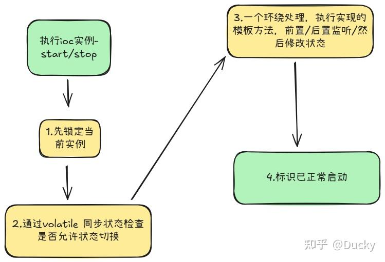
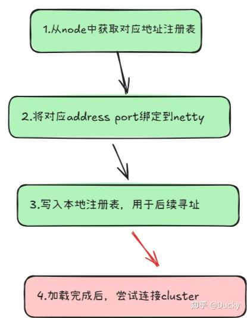
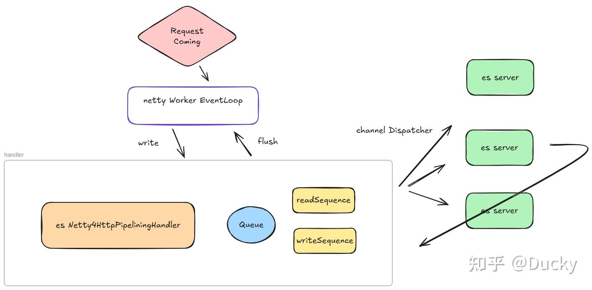
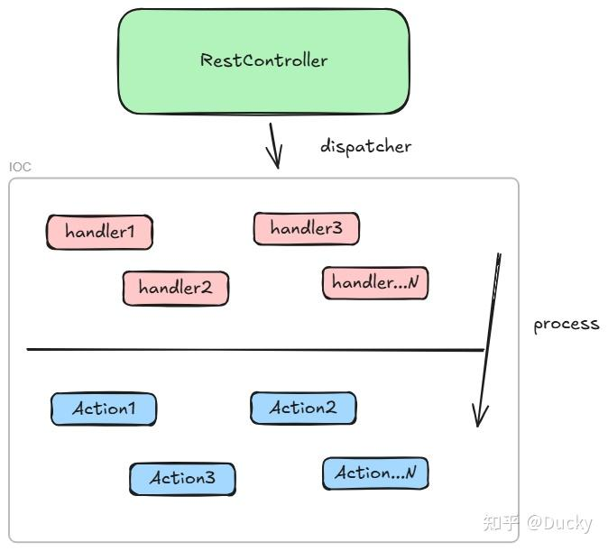

## 实例容器的生命周期

在elastic的实现中，利用Google Guice做了简易的Ioc绑定；为了管理组件化生命周期，又引入了AbstractLifecycleComponent，它是一套基于Ioc之上的模板方法，主要用于控制各个组件运行的生命周期

```java
public abstract class AbstractLifecycleComponent implements LifecycleComponent {

/**
* volatile的生命周期状态，支持状态流转；在node节点运行时，本身node也是一个携带生命周期的组件，它仍旧需要通过当前的state状态来识别
*/
protected final Lifecycle lifecycle = new Lifecycle();

/**
* 相关的前置/后置处理器监听器
*/
private final List<LifecycleListener> listeners = new CopyOnWriteArrayList<>();
```

在LifecycleComponent中，实现了close()，主要是用于控制停止信号的资源回收

在AbstractLifecycleComponent中，如果注册一个ioc实例，那么它需要这样一个模板方法实现

```java
@Override
public void start() {
synchronized (lifecycle) {
if (lifecycle.canMoveToStarted() == false) {
return;
}
for (LifecycleListener listener : listeners) {
listener.beforeStart();
}
doStart();
lifecycle.moveToStarted();
for (LifecycleListener listener : listeners) {
listener.afterStart();
}
}
}
```

通过synchronized锁定当前组件实例后，通过执行流程依次执行，stop同理：

```java
@Override
public void stop() {
synchronized (lifecycle) {
if (lifecycle.canMoveToStopped() == false) {
return;
}
for (LifecycleListener listener : listeners) {
listener.beforeStop();
}
lifecycle.moveToStopped();
doStop();
for (LifecycleListener listener : listeners) {
listener.afterStop();
}
}
}
```

不一样的是，如果是stop，则完成前置处理器后，先将状态设置为stop，而start则是先执行start核心流程，完成后再进行状态切换；




*生命周期流转*

### Netty/通信的集成

在Instance运行一个node实例中，Transport的通知行为同理也是通过这种方式加载

其中，有两个核心的类加载：

Netty4Transport - cluster 内部满足netty的通信，将当前node setting配置信息中的transport.port 注册到netty并绑定

Netty4HttpServerTransport - 外部请求监听的通信，将当前node setting配置信息中的server.port 注册到netty，并设置为pipline 通道

```java
@Override
protected void doStart() {
boolean success = false;
try {
sharedGroup = sharedGroupFactory.getTransportGroup();
clientBootstrap = createClientBootstrap(sharedGroup);
if (NetworkService.NETWORK_SERVER.get(settings)) {
for (ProfileSettings profileSettings : profileSettingsSet) {
createServerBootstrap(profileSettings, sharedGroup);
bindServer(profileSettings);
}
}
success = true;
} finally {
if (success == false) {
/**
* 同理，如果没有成功就尝试try close并更新当前组件的状态
*/
doStop();
}
}
}
```

实际上，所有的netty绑定都在Tcp层，bindServer其实做了这么几件事



```java
/**
* 这是 内部transport和外部server的核心监听
*
* @param profileSettings
*/
protected void bindServer(ProfileSettings profileSettings) {
// Bind and start to accept incoming connections.
/**
* 1.将当前host映射成地址表，
*/
InetAddress[] hostAddresses;
List<String> profileBindHosts = profileSettings.bindHosts;
try {
hostAddresses = networkService.resolveBindHostAddresses(profileBindHosts.toArray(Strings.EMPTY_ARRAY));
} catch (IOException e) {
throw new BindTransportException("Failed to resolve host " + profileBindHosts, e);
}
if (logger.isDebugEnabled()) {
String[] addresses = new String[hostAddresses.length];
for (int i = 0; i < hostAddresses.length; i++) {
addresses[i] = NetworkAddress.format(hostAddresses[i]);
}
logger.debug("binding server bootstrap to: {}", (Object) addresses);
}

assert hostAddresses.length > 0;

/**
* 2.将当前address port进行绑定
*/
List<InetSocketAddress> boundAddresses = new ArrayList<>();
for (InetAddress hostAddress : hostAddresses) {
boundAddresses.add(bindToPort(profileSettings.profileName, hostAddress, profileSettings.portOrRange));
}

final BoundTransportAddress boundTransportAddress = createBoundTransportAddress(profileSettings, boundAddresses);

/**
* 写入内部的地址表，方便后续寻找
*/
if (profileSettings.isDefaultProfile) {
this.boundAddress = boundTransportAddress;
} else {
profileBoundAddresses.put(profileSettings.profileName, boundTransportAddress);
}
}
```

同时，会将实际的监听动作放在NettyTransport的实现中：

```java
@Override
protected Netty4TcpServerChannel bind(String name, InetSocketAddress address) {
Channel channel = serverBootstraps.get(name).bind(address).syncUninterruptibly().channel();
Netty4TcpServerChannel esChannel = new Netty4TcpServerChannel(channel);
channel.attr(SERVER_CHANNEL_KEY).set(esChannel);
return esChannel;
}
```

其中，address_port 存储的格式类似如下：

> 127.0.0.1:9200
> [::1]:9200

当Transport完成后，会通过TransportService尝试与集群通信，寻址来源于setting配置中的discovery.seed_hosts/cluster.initial_master_nodes

```java
if (remoteClusterClient) {
// here we start to connect to the remote clusters
remoteClusterService.initializeRemoteClusters();
}
```

Netty4HttpServerTransport实现方式同理；

## 外部请求InComing Request

外部请求，主要是通过Netty4HttpServerTransport进行处理，话不多说先上图



大致处理流程有这几步：

1. 通过Socket接收外部请求报文
2. Netty通过EventLoop调度通道数据
3. transport处理分发协调资源，将动作下发到具体的节点中，例如：_Search行为将查询分散到多个node节点中，然后将信息写入到coordinator，进行合并处理
4. 合入数据相关报文，统一返回Request方

```java
public class Netty4HttpPipeliningHandler extends ChannelDuplexHandler {

private final Logger logger;

/**
* 当前最大的事件处理器
*/
private final int maxEventsHeld;
/**
* 这个队列是干嘛用的？
* 它是对于netty通信返回后，如果当前队列数已经超过maxEventsHeld，则将响应暂时放入该队列
*/
private final PriorityQueue<Tuple<? extends Netty4RestResponse, ChannelPromise>> outboundHoldingQueue;

private record ChunkedWrite(PromiseCombiner combiner, ChannelPromise onDone, Netty4ChunkedHttpResponse response) {}

/**
* The current {@link ChunkedWrite} if a chunked write is executed at the moment.
*/
@Nullable
private ChunkedWrite currentChunkedWrite;

/*
* The current read and write sequence numbers. Read sequence numbers are attached to requests in the order they are read from the
* channel, and then transferred to responses. A response is not written to the channel context until its sequence number matches the
* current write sequence, implying that all preceding messages have been written.
*/
private int readSequence;
private int writeSequence;

/**
* Queue of pending writes that are flushed as the channel becomes writable. Queuing operations here instead of passing them to
* {@link ChannelHandlerContext#write} straight away prevents us from allocating buffers for operations that can not be written
* to the channel at the moment needlessly in case compression is used which creates buffers containing the compressed content
* in {@link io.netty.handler.codec.http.HttpContentCompressor#write}.
*/
/**
* 这个队列是用来做写入请求时，如果写入请求过大，则先缓存在当前队列里
*/
private final Queue<WriteOperation> queuedWrites = new ArrayDeque<>();

/**
* bind socket 通信能力，主要通过serverTransport
*/
private final Netty4HttpServerTransport serverTransport;
```

Queue的特性是FIFO，它通过这种方式，满足在并发操作下节点处理的顺序问题

然后，将当前Request报文转换并携带readSequence计数器标记，然后开始转发

```java
protected void handlePipelinedRequest(ChannelHandlerContext ctx, Netty4HttpRequest pipelinedRequest) {
final Netty4HttpChannel channel = ctx.channel().attr(Netty4HttpServerTransport.HTTP_CHANNEL_KEY).get();
boolean success = false;
assert Transports.assertDefaultThreadContext(serverTransport.getThreadPool().getThreadContext());
assert Transports.assertTransportThread();
try {
serverTransport.incomingRequest(pipelinedRequest, channel);
success = true;
} finally {
if (success == false) {
pipelinedRequest.release();
}
}
}
```

核心的转发处理在上层抽象类的核心处理

```java
void dispatchRequest(final RestRequest restRequest, final RestChannel channel, final Throwable badRequestCause) {
final ThreadContext threadContext = threadPool.getThreadContext();
try (ThreadContext.StoredContext ignore = threadContext.stashContext()) {
if (badRequestCause != null) {
dispatcher.dispatchBadRequest(channel, threadContext, badRequestCause);
} else {
populatePerRequestThreadContext0(restRequest, channel, threadContext);
dispatcher.dispatchRequest(restRequest, channel, threadContext);
}
}
}
```

## 核心的Distapcher控制器

这里的模式就有点像IOC的模式了，将N多个Handler进行标识并注入，然后通过Path进行匹配，核心在这里：

```java
/**
* Handler for REST requests
*/
/**
* 所有的handler都需要实现它，它决定了这个handler如何被restController进行分发
*/
@FunctionalInterface
public interface RestHandler {

/**
* Handles a rest request.
* @param request The request to handle
* @param channel The channel to write the request response to
* @param client A client to use to make internal requests on behalf of the original request
*/
void handleRequest(RestRequest request, RestChannel channel, NodeClient client) throws Exception;
```



当它根据Method匹配到后，尝试取获取对应的Handler和Action，这时第一个组件登场了：

> Security

是的，这里才使用了SecurityFilter用于处理动作的过滤

首先，在Action层面，它额外适配了ActionType，就是用于各种action分发执行的一个策略模式，这里首先包含了所有的行为定义

```java
/**
* A generic action. Should strive to make it a singleton.
*/
public class ActionType<Response extends ActionResponse> {

private final String name;
private final Writeable.Reader<Response> responseReader;
```

以_Search为例，则它需要暴露相关action实例和path，用于RestController进行路由分配

```java
public class SearchAction extends ActionType<SearchResponse> {

public static final SearchAction INSTANCE = new SearchAction();
public static final String NAME = "indices:data/read/search";

private SearchAction() {
super(NAME, SearchResponse::new);
}

}
```

但是它还没有核心处理的方式，因为这种动作很有可能是通过远端的node节点进行处理的，所以它需要一个transport来进行通信，这时HandledTransportAction上场了，它的实现是基于TransportAction，它规范了一套任务执行机制，利用node来进行处理

```java
public abstract class TransportAction<Request extends ActionRequest, Response extends ActionResponse> {

public final String actionName;
private final ActionFilter[] filters;
protected final TaskManager taskManager;
/**
* @deprecated declare your own logger.
*/
@Deprecated
protected Logger logger = LogManager.getLogger(getClass());

protected TransportAction(String actionName, ActionFilters actionFilters, TaskManager taskManager) {
this.actionName = actionName;
this.filters = actionFilters.filters();
this.taskManager = taskManager;
}

/**
* Use this method when the transport action should continue to run in the context of the current task
*/
/**
* 是不是看着很熟悉，真实执行的动作
*/
public final void execute(Task task, Request request, ActionListener<Response> listener) {
final ActionRequestValidationException validationException;
try {
validationException = request.validate();
} catch (Exception e) {
assert false : new AssertionError("validating of request [" + request + "] threw exception", e);
logger.warn("validating of request [" + request + "] threw exception", e);
listener.onFailure(e);
return;
}
if (validationException != null) {
listener.onFailure(validationException);
return;
}
if (task != null && request.getShouldStoreResult()) {
listener = new TaskResultStoringActionListener<>(taskManager, task, listener);
}

RequestFilterChain<Request, Response> requestFilterChain = new RequestFilterChain<>(this, logger);
requestFilterChain.proceed(task, actionName, request, listener);
}
```

这里有一个很重要的东西：taskManager，它是所有任务的管理器；

那么它如何实现Service呢，以_Search为例，其实SearchService在初始化时，就会维护一些基本关系，如：

```java
public class SearchTransportService {

/**
* service是能力提供者，需要把access暴露给transportAction，那么就需要定义一些解析的规则
*/
public static final String FREE_CONTEXT_SCROLL_ACTION_NAME = "indices:data/read/search[free_context/scroll]";
public static final String FREE_CONTEXT_ACTION_NAME = "indices:data/read/search[free_context]";
public static final String CLEAR_SCROLL_CONTEXTS_ACTION_NAME = "indices:data/read/search[clear_scroll_contexts]";
public static final String DFS_ACTION_NAME = "indices:data/read/search[phase/dfs]";
public static final String QUERY_ACTION_NAME = "indices:data/read/search[phase/query]";
public static final String QUERY_ID_ACTION_NAME = "indices:data/read/search[phase/query/id]";
public static final String QUERY_SCROLL_ACTION_NAME = "indices:data/read/search[phase/query/scroll]";
public static final String QUERY_FETCH_SCROLL_ACTION_NAME = "indices:data/read/search[phase/query+fetch/scroll]";
public static final String FETCH_ID_SCROLL_ACTION_NAME = "indices:data/read/search[phase/fetch/id/scroll]";
public static final String FETCH_ID_ACTION_NAME = "indices:data/read/search[phase/fetch/id]";
public static final String QUERY_CAN_MATCH_NAME = "indices:data/read/search[can_match]";
public static final String QUERY_CAN_MATCH_NODE_NAME = "indices:data/read/search[can_match][n]";

public static void registerRequestHandler(TransportService transportService, SearchService searchService) {
transportService.registerRequestHandler(
FREE_CONTEXT_SCROLL_ACTION_NAME,
ThreadPool.Names.SAME,
ScrollFreeContextRequest::new,
(request, channel, task) -> {
boolean freed = searchService.freeReaderContext(request.id());
channel.sendResponse(new SearchFreeContextResponse(freed));
}
);
TransportActionProxy.registerProxyAction(transportService, FREE_CONTEXT_SCROLL_ACTION_NAME, false, SearchFreeContextResponse::new);
transportService.registerRequestHandler(
FREE_CONTEXT_ACTION_NAME,
ThreadPool.Names.SAME,
SearchFreeContextRequest::new,
(request, channel, task) -> {
boolean freed = searchService.freeReaderContext(request.id());
channel.sendResponse(new SearchFreeContextResponse(freed));
}
);
```

这时，不光会注册实际service的动作，还会伴随注册一个task用于检测任务的执行和处理

```java
private volatile Map<String, RequestHandlerRegistry<? extends TransportRequest>> requestHandlers = Collections.emptyMap();

synchronized <Request extends TransportRequest> void registerHandler(RequestHandlerRegistry<Request> reg) {
if (requestHandlers.containsKey(reg.getAction())) {
throw new IllegalArgumentException("transport handlers for action " + reg.getAction() + " is already registered");
}
requestHandlers = Maps.copyMapWithAddedEntry(requestHandlers, reg.getAction(), reg);
}
```

综上所述，elastic的设计对于拓展性是很高的，如果我们有一个新的RestController，则需要实现的是：

1. ActionRequest：请求报文
2. ActionResponse：响应报文
3. TransportAction：相关的处理行为
4. TransportHandler： 把相关的action注册到注册表中
5. Service：可选，可拓展基于client的相关业务
