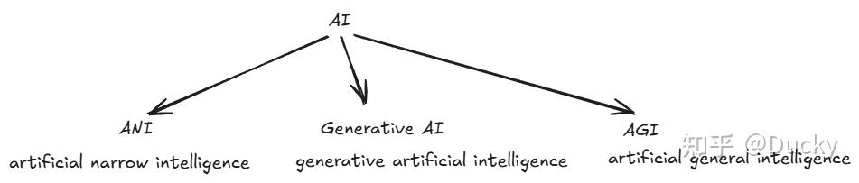
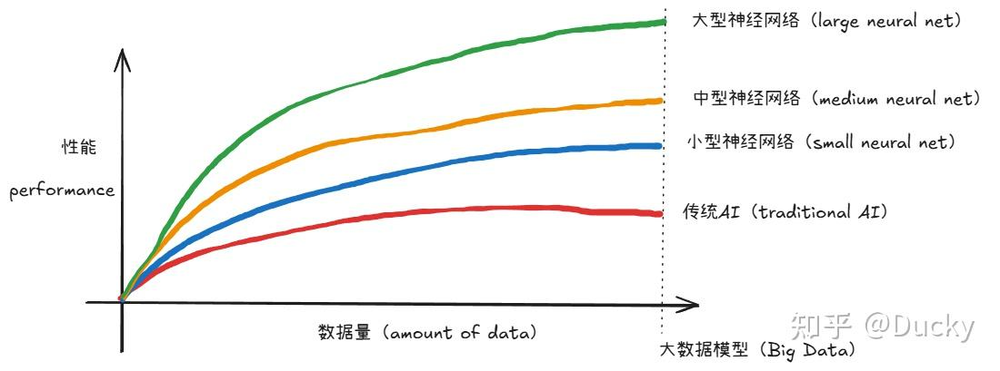
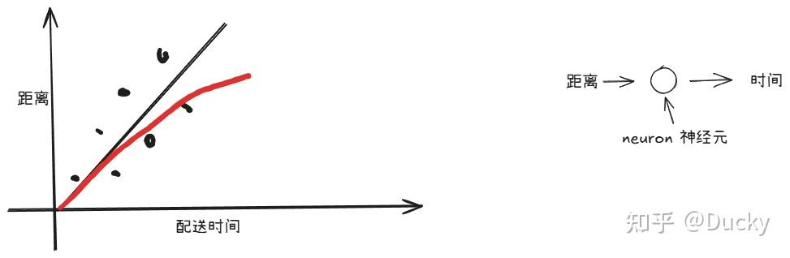

> 相关AI引用于DeepLerning AI相关介绍

## AI的崛起

从2025年起到现在近两年时间，AI发展迅速站上风口浪尖，生活中随处可见AI、智能体、人工智能... AI似乎正在无所不用其极，没有任何对手，可以做到任何事情。几乎所有人都接触过GPT、DeepSeek、豆包、元宝等大模型程序。

在2025年，我们仍旧认为AI Program是依赖于ChatBot，它似乎只是针对互联网、IT Technology相关的任务模型，但现如今看来，它似乎没有那么简单。

在传统的信息互联网市场中，我们常常听到互联网泡沫经济、依赖于风投入口而产生的脱离实体的盈利模式，所以我们普遍认为，AI无法适用于传统行业，例如理发师、水电工、维修工等等，这些行业不会随着AI产生巨大影响；但随着机器人、智能化硬件发展，也许一切都变得极有可能。**短期市场经济来看，我们仅仅是无法用高昂的代价解决简单的问题而已。**

但从根本入手，想要了解AI Program，需要了解一些基本的专业术语，以便熟悉它到底是如何工作的。

## AI的演变

AI最初形态大多为ChatBot，即带有智能回复的聊天机器人，例如早期ChatGPT，我们往往会通过Web Site进行输入交互，利用AI给与智能回复；而现在的AI智能体模型，可以针对各种特异场景进行任务处理，例如，利用AI生成报表、利用AI制作视频...

所以，AI有以下几大类

我们可以对这几类Demystifying AI进行描述：

1. ANI：我们叫做狭义人工智能，针对某种特殊场景，例如智能驾驶模型
2. Generative AI：生成式人工智能，例如ChatGPT，我们可以利用它做很多场景
3. AGI：人工智能的目标，可以实现任何人可实现的事情，甚至做到更多人无法完成的事情

## Machine Lerning（ML）

机器学习，是推动人工智能重要的技术支持，也可以理解Supervised Learning，为它的目标只有一个，就是将输入转化为想要的输出答案：

举个简单的例子，例如我们正在实现一款email program，利用AI的特性，我们可以将email进行检测，判断是否是垃圾邮件（Spam），那么AI实现的过程就称为Spam Filtering；如果我们将Input输入为audio，而输出结果是text transcripts，那么AI实现的过程就称为Speech recognition......那么如果我们输入对应文本，称为Source text，我们需要获取的目标为Target text，这就是Chatbox的实现过程，通过有效预测来生成它需要的文本。

### LLM（Large Language Models）

大型语言模型是通过ML，即监督学习来进行模型训练，以便它可以预测下一个数据词。这种方式说的通俗一些，可以想象例如elastic的分词结构，从我之前关于elastic的介绍中，我们可以短暂的理解为：

例如，我的输入Input为：我最常用的数据库为Elastic，那么

| Input | Output |
| --- | --- |
| 我最常用的 | 数据库 |
| 我最常用的数据库为 | Elastic |

如果我们训练非常庞大数据量的模型时，它就是现在的ChatGPT模型，就像我们给定一些初始提示词，它可以回复相关的语言，当然在GPT的模型中，不仅仅是通过给定提示词获取与之对应的下一个那么简单，它还需要去处理过滤一些语言，以便回复更精准。

在前两年中，我发现有很多企业用于完成相关的数据训练工作，例如它们会招聘员工做一些识别标记工作，例如大量的图片标记、文字标记，我相信这些应该就是用于监督训练模型的识别能力。这种训练方式随着计算机、互联网的崛起，我们可以在互联网上获取更多更丰富的资源，所以这两年模型的能力也突飞猛进。

这里要提出这两年AI模型很流行的名词：神经网络（neural net）

随着数据的增长，其性能会从提升逐渐持平，所以在传统的AI模型中，它并不能随着数据越来越多变得越来越智能。但是如果你想要达到好的性能，就需要Big Data 大数据，同时，随着图形处理器GPU的发展，也带来了更大规模的数据计算性能，能够有更好的资源去训练相关模型。

人工智能中最重要的概念就是机器学习、监督学习，它们就是输入输出关系的映射。

## DataSet

数据集，对于人工智能系统是至关重要的。我们不妨举个生活中简单的例子。

外卖员配送距离（公里）与对应的时间（分钟），就是一个简单的数据集，它包含了这些数据

| 配送距离（公里） | 预计配送时间（分钟） |
| --- | --- |
| 1 | 15 |
| 2 | 20 |
| 3 | 25 |
| 4 | 30 |
| 5 | 35 |

那么，配送距离就是我的Input输入，我希望获取Output Result，告诉我预计配送时间。那么除了公里数外，我仍旧希望我的Input有更多的条件，例如我还要输入红绿灯的数量

外卖员配送距离（公里）与对应的时间（分钟），就是一个简单的数据集，它包含了这些数据

| 配送距离（公里） | 预计配送时间（分钟） |
| --- | --- |
| 1 | 15 |
| 2 | 20 |
| 3 | 25 |
| 4 | 30 |
| 5 | 35 |

那么，配送距离就是我的Input输入，我希望获取Output Result，告诉我预计配送时间。那么除了公里数外，我仍旧希望我的Input有更多的条件，例如我还要输入红绿灯的数量，它就是一个简易的数据集。

| 红绿灯数量 | 配送距离（公里） | 预计配送时间（分钟） |
| --- | --- | --- |
| 1 | 1 | 15 |
| 1 | 2 | 20 |
| 2 | 3 | 30 |
| 2 | 4 | 35 |
| 2 | 5 | 34 |

同理，我也可以认为配送时间为Input，那么我就可以通过配送时间来预测某段路程是否可以达到要求。

同理，不仅仅是简单的数据，例如我们在访问一些页面时，往往会有安全认证，例如被吐槽N遍的：

### Messy Data

很多企业会考虑，是否利用企业中现有的生产数据做AI预测分析，但是一个残酷的真相是：

**很多高层CEO会认为，我们有大量的用户数据或生产数据，只需要一个AI团队，我就可以做到行业的预测分析，带来价值。**这是一个不太确定的问题。原因有以下几点：

1. 数据之间没有太多连续：很多互联网企业在发展大数据场景时，往往会将数据通过流式消息或其他方式存储在数仓中，这些数据往往反应各个业务指标，但它不一定有价值。
2. 数据中存在大量Garbage：数据中存在大量废弃的垃圾，这些数据没有用于训练AI的价值。
3. 数据缺失不连续：例如很多数据丢失、unknown甚至一些业务篡改数据，它们没有回归训练的价值。

## Neural Net（神经网络）

从上文中，我们不难看出，传统AI与神经网络的性能差异，但请不要被这个词所迷惑，所谓的神经网络，其实来源于人体中神经组织，它们由多个神经元组成。在AI 神经网络中，可以用一个简单的描述来介绍这一特征，就利用上面配送距离的例子：

这个场景让我想到了之前关于能源预测回归分析中，M&V的回归过程，它利用线性回归进行阶段型预测，例如通过a-b阶段数据，进行离散回归，生成线性回归公式，进行c段预测，当然这种方式仅仅作为后续阶段预测分析，所以在图表中包含回归方程公式，但是往往它的实现需要大多数因子进行计算，我们可以认为这些因子就是神经元，而每一个神经元就是输入与输出间的通道，它有自己的计算流程。

那么，所谓神经网络，其实就是各种不同的神经元组成的条件，神经元越多，神经网络越庞大，意味着它的输出越准确。

## ML擅长哪些工作

在文章的开始，我仍旧认为AI兴起不能影响传统行业，如手工、服务业，但其实这个结果恰恰相反；目前只是不会牺牲那么多代价去替代低成本的工作；如果随着AGI持续发展，它从宏观角度可以代替人相关的工作。

但是，我也观察到很多人对AI抱有太高的期望，请认清AI并不是救世主，这一区别其实很好理解，例如我们可以说让AI帮我们做报表、做数据，那是因为首先从人的角度它是清晰、完整的命令，我很清楚我应该如何做；相反如果我让AI去预测股市走向、告诉我明天彩票双色球的开奖号码，这是不现实的，因为即使作为人思考，你仍旧无法做到这一点，但是仍旧有一些预测指标，从根本上来说它们需要更多更复杂的信息输入，例如历史开盘走势、企业运营报告、流量等等，也许它们综合可以做一些参考，但是这些输入很复杂，仍旧无法克服这些随机性。

这也体现在，现如今智能汽车普及，自动驾驶普及，我们往往会搭载摄像头或雷达传感器来检查相关行驶轨迹，这是一种输入输出的体现；但是它却无法通过肢体行为动作来识别，举个简单例子，某汽车通过传感器雷达，绘制路线图像，并通过雷达检测障碍物，可以做到自动驾驶；但是它不能通过摄像头检测路边行人行为，例如网约车通过App控制，但它无法依赖于路边招手的乘客识别，因为肢体行为具有多样性，它无法从一个输入映射到一个输出。

同理，现在很多医院引进AI识别报告，例如自动识别CT报告，但它的前提是我们的检查有着标准流程，例如监督训练中所有报告均为正面朝上，所有心脏部位CT均在同一位置；相反如果用这种训练模型检查不规范的报告，如检测过程中侧躺报告，这时识别结果误差就会较大

所以，如何识别基于机器学习的AI更擅长哪些，只需要把握几个特征：

当出现以下情况时，ML 往往能很好地发挥作用

- 1.学习 "简单 "的概念
- 2.有大量可用数据

当出现以下情况时，ML 的效果往往不佳

- 1.从少量数据中学习复杂概念
- 2.要求它对新类型的数据进行处理
