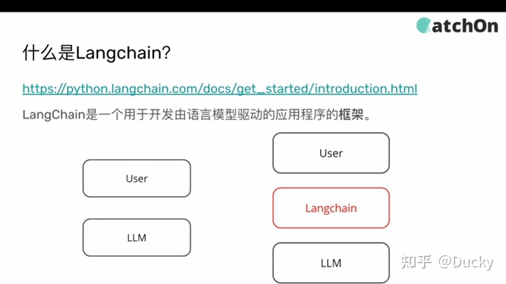
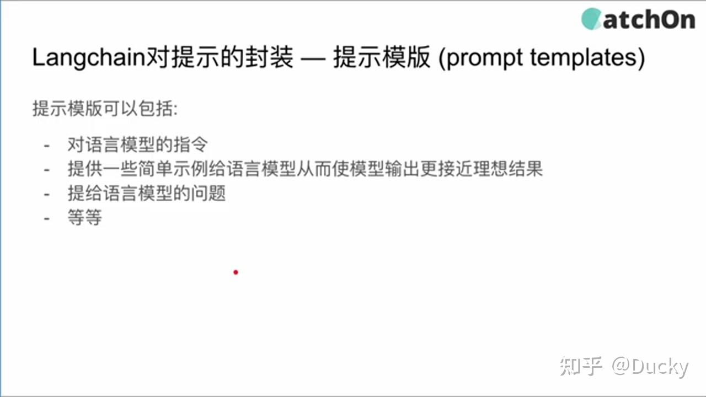

> Summary: This article turns LangChain from a list of APIs into a system map: components are useful only when their boundaries and data flow are understood.

## Intended Reader

Developers building LLM applications and trying to understand the LangChain ecosystem.

## Why This Matters

Agent-oriented AI systems are not only about calling a model. They also involve context management, tool boundaries, retrieval quality, memory, execution control, and failure recovery.

LangChain should be learned as a set of composable boundaries: model IO, prompt construction, parsing, memory, retrieval, tools, and agent orchestration.

## Mental Model

Treat the model as one component in an execution system. The valuable engineering work is deciding what the model may do, what evidence it can use, how state is carried forward, and how the workflow can be inspected or rolled back.

The practical way to read this article is to look for the boundary it clarifies: what state exists, who owns it, which operation changes it, and what evidence proves the system behaved as expected.

## Implementation Walkthrough

- Start with the model call and prompt template because every higher-level abstraction eventually depends on them.
- Introduce output parsing so model responses can become structured data instead of free text.
- Use chains to express repeatable workflows, not to hide logic that should be visible.
- Add memory, tools, and retrieval only when the task requires external context or action.

## Pitfalls and Tradeoffs

- High-level abstractions speed up demos but can obscure execution order.
- Memory improves continuity but can introduce stale or irrelevant context.
- Agent flexibility is valuable only when tool boundaries and traces remain inspectable.

## Verification Checklist

- Log prompt inputs, model outputs, parser results, and tool calls.
- Test each component independently before composing them.
- Use real task examples instead of only hello-world prompts.

## Practical Takeaways

- Separate model reasoning, tool execution, retrieval, memory, and orchestration instead of mixing everything into a single prompt.
- Use RAG or memory only when it improves the task boundary; more context is not automatically better context.
- Prefer explicit workflows for production agents, especially when tools mutate state or depend on external systems.
- Evaluate the system by observing failures: hallucinated tool calls, stale context, ambiguous state, and missing fallback paths.

## Visual Evidence

The migrated local images are preserved as supporting figures. They keep the English edition aligned with the same diagrams, screenshots, or console evidence used by the source article.







## Selected Technical Snippets

The following snippets are preserved only when they are safe to publish in English without broken encoding or translated identifiers.

```text
User Input → [Prompt Template] → [LLM Call] → [Output Parser] → Result
↑                ↑
[Memory]        [Tools / APIs]
```

```text
pip install langchain langchain-openai langchain-community python-dotenv
```

```text
DEEPSEEK_API_KEY=sk-your-key-here
OPENAI_API_KEY=sk-your-backup-key-here
```

## Source Notes

- Topic: AI & Agent
- [Original source](https://zhuanlan.zhihu.com/p/2048906743363769607)
- Original publication date: 2026-06-12
- This English edition is localized from the migrated article metadata, source structure, technical terms, local assets, and clean implementation evidence.

## Closing Thoughts

The goal of this English edition is not to imitate the original wording sentence by sentence. It preserves the engineering argument, removes migration noise, and presents the article as a publishable technical note that future readers can use for design, debugging, or implementation review.
