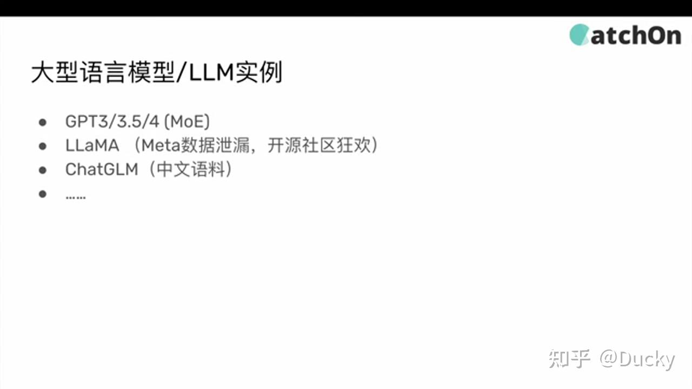
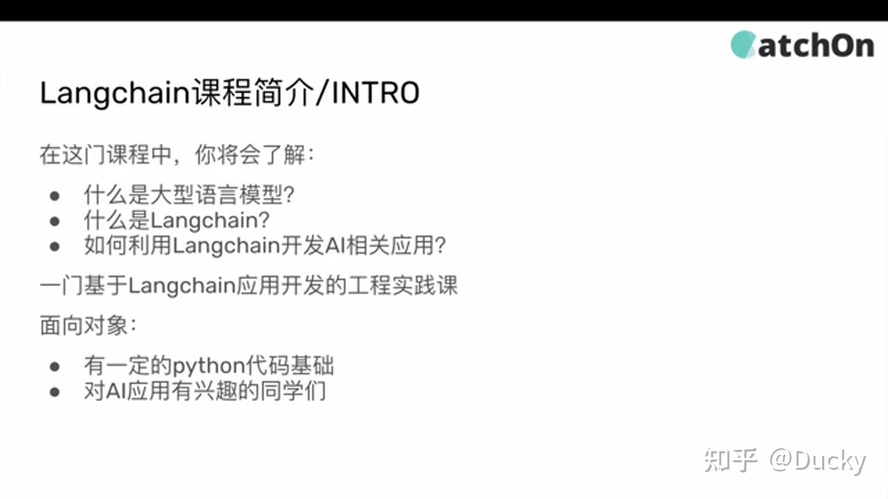

## LangChain 核心组件全景解析：从零到一构建 LLM 应用

> **作者注**：本文基于 LangChain 系列教程（共 9 集，总时长约 5 小时）系统整理而成。逐帧分析了视频中的幻灯片、代码演示和架构图示，并结合 LangChain 最新 API 进行了校验和适配。适合有 Python 基础的开发者系统学习。

---

### 目录

1. [开篇：为什么要学 LangChain](https://zhuanlan.zhihu.com/write#1-%E5%BC%80%E7%AF%87%E4%B8%BA%E4%BB%80%E4%B9%88%E8%A6%81%E5%AD%A6-langchain)
2. [第一集：LangChain 入门与 LLM 生态概览](https://zhuanlan.zhihu.com/write#2-%E7%AC%AC%E4%B8%80%E9%9B%86langchain-%E5%85%A5%E9%97%A8%E4%B8%8E-llm-%E7%94%9F%E6%80%81%E6%A6%82%E8%A7%88)
3. [第二集：Hello World 与 ConversationChain](https://zhuanlan.zhihu.com/write#3-%E7%AC%AC%E4%BA%8C%E9%9B%86hello-world-%E4%B8%8E-conversationchain)
4. [第三集：Model I/O —— Prompt 工程化](https://zhuanlan.zhihu.com/write#4-%E7%AC%AC%E4%B8%89%E9%9B%86model-io--prompt-%E5%B7%A5%E7%A8%8B%E5%8C%96)
5. [第四集：Data Connection —— 让 LLM 读懂你的数据](https://zhuanlan.zhihu.com/write#5-%E7%AC%AC%E5%9B%9B%E9%9B%86data-connection--%E8%AE%A9-llm-%E8%AF%BB%E6%87%82%E4%BD%A0%E7%9A%84%E6%95%B0%E6%8D%AE)
6. [第五集：Chains —— 编排的艺术](https://zhuanlan.zhihu.com/write#6-%E7%AC%AC%E4%BA%94%E9%9B%86chains--%E7%BC%96%E6%8E%92%E7%9A%84%E8%89%BA%E6%9C%AF)
7. [第六集：Agents —— 会思考的 LLM](https://zhuanlan.zhihu.com/write#7-%E7%AC%AC%E5%85%AD%E9%9B%86agents--%E4%BC%9A%E6%80%9D%E8%80%83%E7%9A%84-llm)
8. [第七集：实战 PDF 问答系统](https://zhuanlan.zhihu.com/write#8-%E7%AC%AC%E4%B8%83%E9%9B%86%E5%AE%9E%E6%88%98-pdf-%E9%97%AE%E7%AD%94%E7%B3%BB%E7%BB%9F)
9. [第八集：实战 搜索 Agent 进阶](https://zhuanlan.zhihu.com/write#9-%E7%AC%AC%E5%85%AB%E9%9B%86%E5%AE%9E%E6%88%98-%E6%90%9C%E7%B4%A2-agent-%E8%BF%9B%E9%98%B6)
10. [第九集：回顾总结与最佳实践](https://zhuanlan.zhihu.com/write#10-%E7%AC%AC%E4%B9%9D%E9%9B%86%E5%9B%9E%E9%A1%BE%E6%80%BB%E7%BB%93%E4%B8%8E%E6%9C%80%E4%BD%B3%E5%AE%9E%E8%B7%B5)
11. [附录：API 迁移指南与常见问题](https://zhuanlan.zhihu.com/write#11-%E9%99%84%E5%BD%95api-%E8%BF%81%E7%A7%BB%E6%8C%87%E5%8D%97%E4%B8%8E%E5%B8%B8%E8%A7%81%E9%97%AE%E9%A2%98)

---

### 1. 开篇：为什么要学 LangChain

### 1.1 背景：LLM 时代的挑战

2022 年 11 月，OpenAI 发布了 GPT-3.5 API（text-davinci-003），开发者的世界从此改变。紧接着，GPT-4 以 MoE（Mixture of Experts）架构横空出世，Meta 开源了 LLaMA 系列，智谱推出了 ChatGLM。

但直接调用 API 做应用开发，会立刻撞上四面墙：

第一面墙：**上下文有限**。GPT-3.5 的 token 上限是 4096，一份 20 页的 PDF 根本塞不进去。

第二面墙：**能力受限**。LLM 不能搜索网页、不能执行代码、不能读取本地文件——它只是”一本百科全书”，而不是”一个能干活的助手”。

第三面墙：**没有记忆**。每次 API 调用都是崭新的对话，你问”我之前叫什么”它永远回答不上来。

第四面墙：**Prompt 管理混乱**。项目里散落着上百行硬编码的 prompt 字符串，改一个字要搜遍整个代码仓库。

LangChain 就是为了推倒这四面墙而生的。

### 1.2 LangChain 是什么

LangChain 不是一个新的 LLM，而是一个 **LLM 应用编排框架**：

```text
User Input → [Prompt Template] → [LLM Call] → [Output Parser] → Result
↑                ↑
[Memory]        [Tools / APIs]
```

六层架构：

| 层级 | 模块 | 解决的问题 |
| --- | --- | --- |
| L1 | Model I/O | 如何统一调用不同厂商的 LLM |
| L2 | Data Connection | 如何让 LLM 读取外部文档 |
| L3 | Chains | 如何串联多个 LLM 调用 |
| L4 | Memory | 如何让 LLM 记住对话 |
| L5 | Agents | 如何让 LLM 自主使用工具 |
| L6 | Callbacks | 如何监控和调试 LLM 调用链 |


### 1.3 主流 LLM 生态速览

| 模型 | 厂商 | 架构特点 | 适用场景 |
| --- | --- | --- | --- |
| GPT-4 | OpenAI | MoE 混合专家，8×220B 参数 | 复杂推理，成本高 |
| GPT-3.5 | OpenAI | 175B Dense | 性价比首选 |
| LLaMA 2 | Meta | 7B/13B/70B 开源 | 本地部署、垂直微调 |
| ChatGLM | 智谱 AI | 中英双语优化 | 中文场景 |

**关于 MoE（Mixture of Experts）**：GPT-4 不是一个大模型，而是多个”专家”子模型的组合。每次推理时，只有部分专家被激活——理解为：一个问题来了，系统自动把它派给最擅长这个领域的那几个”专家”回答。

---

### 2. 第一集：LangChain 入门与 LLM 生态概览

> **视频源**：1.mp4（约 30 分钟）

### 2.1 本集要点

1. **什么是 LLM / 大语言模型？** —— 从 GPT-3（2020 年 6 月 11 日发布）到 GPT-3.5 API（2022 年 11 月）再到 GPT-4。
2. **什么是 LangChain？** —— 一个 Python 框架，让开发者用”搭积木”的方式组合 LLM 调用。
3. **为什么要用 LangChain？** —— 直接调 API 能做 demo，但做产品需要工程化。

### 2.2 直接调 API 的局限

```text
const response = await createCompletion({
model: "text-davinci-003",
prompt: "你是谁？",
temperature: 0.8,
max_tokens: 100,
});
```

缺少：prompt 管理、上下文注入、结果处理、错误处理、可观测性。

### 2.3 LangChain 的解法

> LangChain is a framework for developing applications powered by language models.

它在 LLM 之上构建了标准化的抽象层，让你只关心”业务逻辑”，不用管底层细节。



---

### 3. 第二集：Hello World 与 ConversationChain

> **视频源**：2.mp4（约 48 分钟）

### 3.1 环境搭建

```text
pip install langchain langchain-openai langchain-community python-dotenv
```

创建 `.env` 文件：

```text
DEEPSEEK_API_KEY=sk-your-key-here
OPENAI_API_KEY=sk-your-backup-key-here
```

### 3.2 第一个调用

```text
import os
from dotenv import load_dotenv
from langchain_openai import ChatOpenAI
from langchain_core.messages import HumanMessage

load_dotenv()

llm = ChatOpenAI(
model="deepseek-chat",
temperature=0.7,
api_key=os.getenv("DEEPSEEK_API_KEY"),
base_url="https://api.deepseek.com/v1"
)

result = llm.invoke([HumanMessage(content="你好，请用一句话介绍 LangChain")])
print(result.content)
```

关键点：`base_url` 参数让你可以对接任何兼容 OpenAI API 的服务，实现模型层的”热插拔”。

### 3.3 Temperature 参数

```text
temperature = 0.0  →  确定模式：数学计算、代码生成、事实问答
temperature = 0.7  →  平衡模式：日常对话、内容总结
temperature = 1.0  →  创造模式：创意写作、头脑风暴
```

底层原理：LLM 本质是在做”下一个 token 的概率预测”。temperature 越低，越倾向于选最高概率；temperature 越高，低概率 token 被选中的机会越大。

### 3.4 Jupyter Notebook 交互式开发

视频中演示了在 Jupyter Notebook 中进行 LangChain 开发的全流程。Cell 机制非常适合 LLM 开发——逐步构建 prompt、观察输出、调整参数。



### 3.5 ConversationChain：有记忆的对话

```text
from langchain.memory import ConversationBufferMemory
from langchain.chains import ConversationChain

conversation = ConversationChain(
llm=llm,
memory=ConversationBufferMemory(),
verbose=True
)

conversation.predict(input="我叫小明，今年 25 岁")
conversation.predict(input="我叫什么名字？多大？")
# AI: 你叫小明，今年 25 岁。
```

### 3.6 Prompt 向 LLM 传递信息的方式

- **System Message**：设定 AI 的行为边界和角色
- **Human Message**：用户的直接输入
- **AI Message**：LLM 的返回结果——在多轮对话中作为历史消息附加到后续请求

---

### 4. 第三集：Model I/O —— Prompt 工程化

> **视频源**：3.mp4（约 31 分钟）

### 4.1 为什么需要 Prompt 模板？

```text
# ❌ 反模式：硬编码字符串拼接
prompt = "请将以下文本翻译成英文：" + text
```

问题：维护困难、复用不了。Prompt Template 将 prompt 参数化，把”模板”和”数据”解耦。

### 4.2 PromptTemplate 基础用法

```text
from langchain_core.prompts import PromptTemplate

template = PromptTemplate.from_template(
"你是一个{role}。请将以下文本翻译成{target_lang}：\n{text}"
)

prompt_str = template.format(role="专业翻译", target_lang="英文", text="人工智能")
```

### 4.3 Few-Shot Prompting：用示例教会 LLM

```text
from langchain_core.prompts import FewShotPromptTemplate, PromptTemplate

examples = [
{"input": "今天天气真好", "output": "正向"},
{"input": "我太难了",     "output": "负向"},
{"input": "随便吧",       "output": "中性"},
]

few_shot = FewShotPromptTemplate(
examples=examples,
example_prompt=PromptTemplate.from_template("输入: {input}\n情感: {output}"),
prefix="分析以下文本的情感倾向，只输出'正向'、'负向'或'中性'：",
suffix="输入: {input}\n情感:",
input_variables=["input"],
)
```

**Few-Shot vs Fine-tuning**：

| 维度 | Few-Shot | Fine-tuning |
| --- | --- | --- |
| 成本 | 零训练成本，Token 消耗 | 需要训练数据和 GPU |
| 灵活性 | 随时改示例，立即生效 | 修改需要重新训练 |
| 效果 | 适合格式控制 | 适合领域知识注入 |
| 持久性 | 每次推理消耗 token | 训练后模型自带能力 |

视频中的建议：**先用 Few-Shot 验证需求，确实需要再考虑 Fine-tuning**。


### 4.4 Example Selector：示例太多怎么办？

```text
from langchain_core.example_selectors import SemanticSimilarityExampleSelector
from langchain_openai import OpenAIEmbeddings
from langchain_community.vectorstores import Chroma

selector = SemanticSimilarityExampleSelector.from_examples(
examples=all_examples,
embeddings=OpenAIEmbeddings(),
vectorstore_cls=Chroma,
k=3,
)
```

工作原理：1) 将所有示例的 input 转换为向量 → 2) 用户输入也转换为向量 → 3) 计算余弦相似度，选取 Top-K → 4) 注入 Few-Shot Prompt

### 4.5 其他输出解析器

- **CommaSeparatedListOutputParser**：逗号分隔列表输出
- **StructuredOutputParser**：要求 JSON Schema 输出
- **PydanticOutputParser**：直接解析为 Pydantic 模型对象

---

### 5. 第四集：Data Connection —— 让 LLM 读懂你的数据

> **视频源**：4.mp4（约 35 分钟）

这是 LangChain 最重要的模块，也是 RAG（Retrieval-Augmented Generation）的基础设施。

### 5.1 数据连接层全景

核心问题：LLM 的训练数据截止到某个时间点，且不包含你的私有数据。如何让 LLM 回答关于你私有文档的问题？

```text
Step 1: Load → Step 2: Split → Step 3: Embed → Step 4: Store
```

### 5.2 Document Loaders：万事皆可 Load

```text
from langchain_community.document_loaders import (
PyPDFLoader,           # PDF 文档
WebBaseLoader,         # 网页 URL
YoutubeLoader,         # YouTube 视频字幕
UnstructuredPowerPointLoader,  # PowerPoint
TextLoader,            # 纯文本
CSVLoader,             # CSV 数据
)

loader = PyPDFLoader("annual_report.pdf")
pages = loader.load()
# pages[0].page_content → 文字内容
# pages[0].metadata → {"source": "...", "page": 1}
```

每个 Loader 返回的 `Document` 包含 `page_content` + `metadata`，metadata 在后续检索中至关重要。

### 5.3 Text Splitters：切得聪明

```text
from langchain_text_splitters import RecursiveCharacterTextSplitter

splitter = RecursiveCharacterTextSplitter(
chunk_size=500,
chunk_overlap=50,
separators=["\n\n", "\n", "。", "，", " ", ""]
)
splits = splitter.split_documents(pages)
```

为什么需要 overlap？防止把一句话拦腰截断。

### 5.4 Word Embedding：文字的”身份证”

LLM 不理解文字，只理解数字。Embedding 将文字转为高维向量。关键性质：语义相近的文字，向量也相近。

```text
"猫" → [0.12, -0.34, 0.56, 0.78, ...]
"狗" → [0.14, -0.31, 0.58, 0.75, ...]  ← 离"猫"很近
"汽车" → [-0.78, 0.45, -0.12, ...]  ← 离"猫"很远
from langchain_openai import OpenAIEmbeddings

embeddings = OpenAIEmbeddings(model="text-embedding-3-small")
vec = embeddings.embed_query("什么是 RAG？")
```

模型选择：`text-embedding-3-small`（1536 维，性价比最优），`text-embedding-3-large`（3072 维，精度更高）

### 5.5 Vector Store：语义搜索引擎

```text
from langchain_community.vectorstores import FAISS

vectorstore = FAISS.from_documents(splits, OpenAIEmbeddings())
results = vectorstore.similarity_search("MoE 架构的优缺点？", k=4)
```

数据库选型：FAISS（开发测试）、Chroma（中小项目）、Pinecone（生产环境）、Weaviate/Qdrant（企业级）

---

### 6. 第五集：Chains —— 编排的艺术

> **视频源**：5.mp4（约 25 分钟）

### 6.1 Chain 是什么？

```text
# 没有 Chain：手动管理
prompt = template.format(input=user_input)
response = llm.invoke(prompt)
parsed = parser.parse(response)

# 有了 Chain + LCEL：
chain = prompt | llm | parser
result = chain.invoke({"input": user_input})
```

`|` 是 LangChain 的管道操作符，像 Unix 管道一样串联组件。

### 6.2 Chain 家族

**LLMChain**：最基础，Prompt → LLM → 输出。

**RouterChain**：根据输入内容自动选择处理策略。

```text
用户输入 → Router → 数学问题？ → MathChain
→ 编程问题？ → CodeChain
→ 一般问题？ → GeneralChain
```

**SequentialChain**：多步骤串联，上一步的输出是下一步的输入。

```text
生成大纲 → 扩展段落 → 润色校对 → 输出
```

**TransformationChain**：对 LLM 输出做后处理（翻译、摘要、格式化等）。

### 6.3 Document Chains：RAG 的核心

**Stuff**：把所有文档塞进一个 prompt。简单，受上下文限制。

**Map Reduce**：先分别处理每份文档，再汇总。可并行，适合大量文档。

**Refine**：逐步优化答案。质量高，延迟也高（串行）。

**Map Rerank**：先分别处理，再按置信度排序选最优。

---

### 7. 第六集：Agents —— 会思考的 LLM

> **视频源**：6.mp4（约 25 分钟）

### 7.1 Chain vs Agent

Chain 是被动的——你定义了流程，LLM 照做。Agent 是主动的——你给了工具箱，LLM 自己决定用哪个、用几次、按什么顺序。

### 7.2 ReAct 模式

```text
Q: Leo DiCaprio 的女友是谁？她年龄的 0.43 次方是多少？

Thought: 先查女朋友是谁
Action: Search("Leo DiCaprio girlfriend")
Observation: 模特 Vittoria Ceretti

Thought: 查她的年龄
Action: Search("Vittoria Ceretti age")
Observation: 26 岁

Thought: 计算 26^0.43
Action: Calculator("26^0.43")
Observation: ~4.06

Final Answer: Vittoria Ceretti，26岁。26^0.43 ≈ 4.06
```

### 7.3 Agent 代码实现

```text
from langchain.agents import load_tools, initialize_agent, AgentType
from langchain_openai import ChatOpenAI

llm = ChatOpenAI(model="deepseek-chat", temperature=0)
tools = load_tools(["serpapi", "llm-math"], llm=llm)
agent = initialize_agent(
tools, llm,
agent=AgentType.ZERO_SHOT_REACT_DESCRIPTION,
verbose=True, max_iterations=5,
)
agent.run("Who is Leo DiCaprio's girlfriend? Her age ^ 0.43?")
```

### 7.4 Agent 类型

| 类型 | 模式 | 适用 |
| --- | --- | --- |
| Zero-shot ReAct | 每步即时决策 | 简单任务 |
| Structured Chat | 多参数工具调用 | 复杂工具 |
| OpenAI Functions | Function Calling | GPT 专属 |
| Plan-and-Execute | 先规划再执行 | 多步骤复杂任务 |

### 7.5 Agent 调优

- **max_iterations**：限制最大轮数，防止死循环
- **handle_parsing_errors**：LLM 输出格式错误时重试
- **early_stopping_method**：”force”强制输出 / “generate”生成最佳猜测

---

### 8. 第七集：实战 PDF 问答系统

> **视频源**：7.mp4（约 38 分钟）

```text
from langchain_community.document_loaders import PyPDFLoader
from langchain_text_splitters import RecursiveCharacterTextSplitter
from langchain_openai import OpenAIEmbeddings
from langchain_community.vectorstores import FAISS
from langchain.chains import RetrievalQA
from langchain_openai import ChatOpenAI

loader = PyPDFLoader("report.pdf")
splits = RecursiveCharacterTextSplitter(chunk_size=800, chunk_overlap=100).split_documents(loader.load())
vectorstore = FAISS.from_documents(splits, OpenAIEmbeddings(model="text-embedding-3-small"))
qa = RetrievalQA.from_chain_type(
llm=ChatOpenAI(model="deepseek-chat", temperature=0),
chain_type="stuff",
retriever=vectorstore.as_retriever(search_kwargs={"k": 4}),
return_source_documents=True,
)
result = qa.invoke({"query": "这份报告的核心结论是什么？"})
print(result["result"])
```

**chain_type**：`stuff`（ chunks）、`map_reduce`（大量文档）、`refine`（高质量，串行）、`map_rerank`（打分排序）

---

### 9. 第八集：实战 搜索 Agent 进阶

> **视频源**：8.mp4（约 53 分钟）

```text
from langchain.agents import tool, initialize_agent, AgentType

@tool
def get_stock_price(symbol: str) -> str:
"""获取指定股票代码的当前价格。输入为股票代码，如 AAPL、TSLA。"""
prices = {"AAPL": "189.30", "TSLA": "242.84"}
return prices.get(symbol.upper(), f"未找到股票代码 {symbol}")

agent = initialize_agent([get_stock_price], llm, agent=AgentType.ZERO_SHOT_REACT_DESCRIPTION, verbose=True)
agent.run("苹果股票现在多少钱？")
```

关键：tool 的 docstring 就是 Agent 判断何时使用该工具的依据——务必清晰准确。

---

### 10. 第九集：回顾总结与最佳实践

> **视频源**：9.mp4（约 20 分钟）

### 技术选型决策树

- 简单问答 → LLMChain
- 私有文档问答 → RAG 流水线
- 固定多步骤 → SequentialChain
- 需自主决策 → Agent（ReAct）
- 外部 API → 封装为 Tool，交给 Agent

### 生产环境注意事项

**安全**：永远不要在 prompt 中暴露 API Key。Agent 的工具调用需要沙箱隔离。

**性能**：Embedding 结果缓存。向量库选持久化的（Chroma/Pinecone）。map_reduce 链可并行。

**成本控制**：先用便宜模型验证，再换强模型。temperature=0 的任务用缓存。限制 max_iterations。

**可观测性**：LangSmith 追踪完整调用链。记录每个 Step 的 token 消耗。

### API 迁移（两年变化）

| 旧 API | 新 API |
| --- | --- |
| from langchain.llms import OpenAI | from langchain_openai import ChatOpenAI |
| llm.predict("text") | llm.invoke([HumanMessage("text")]) |
| Chain.run(input) | Chain.invoke({"key": value}) |
| from langchain.vectorstores import FAISS | from langchain_community.vectorstores import FAISS |

---

### 11. 附录：常见问题排查

| 错误 | 原因 | 解决 |
| --- | --- | --- |
| ModuleNotFoundError: langchain.llms | 旧版 API 已移除 | 改用 langchain-openai |
| jupyter-lab 找不到 | Scripts 不在 PATH | 添加到 PATH |
| DeepSeek 401 | API Key 错误 | 检查 .env |
| Agent 陷入循环 | 工具返回不明确 | 优化 docstring |
| FAISS 内存溢出 | 数据太大 | 换 Chroma/Pinecone |

### 推荐学习路径

第 1 周：跑通 Hello World → 第 2 周：掌握 Prompt 工程 → 第 3 周：RAG 应用 → 第 4 周：Agent + 自定义工具 → 持续：关注官方文档

---

### 后记

这套视频虽然是两年前录制的，但 LangChain 的核心设计思想——**模块化、可组合、工程化**——没有变。变的只是包名和 API 签名，理解底层原理后，迁移只是改几行 import 的事。

---

> **声明**：本文代码示例已适配 LangChain 最新 API（2025-2026）。图片来自原教程视频截图，仅供学习参考。
