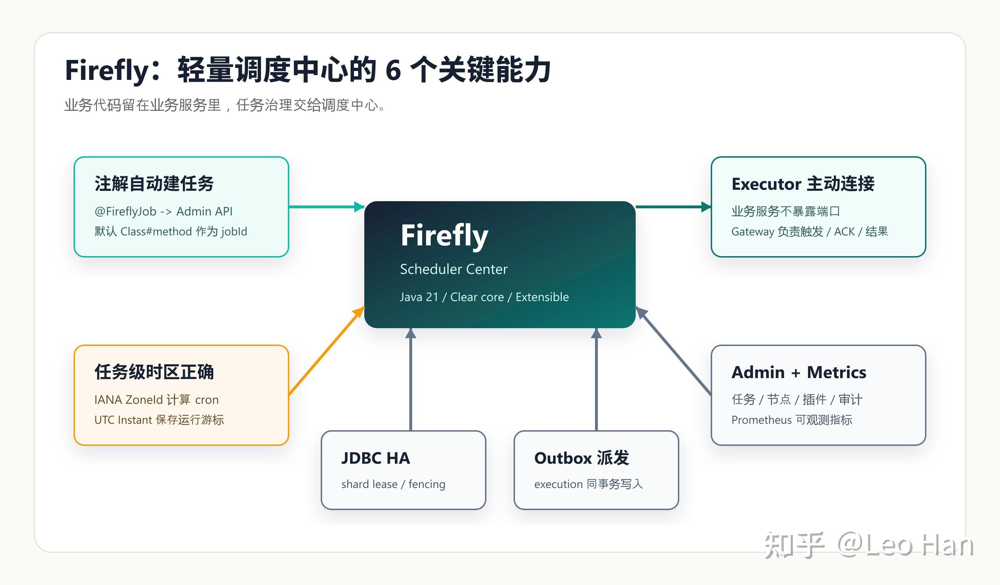

## Firefly：一个轻量、清晰、面向 Java 业务系统的调度中心

> 摘要：很多业务系统最后都会长出一套“定时任务治理”需求：任务要能集中管理，执行器要能远程注册，失败和超时要能观察，跨时区任务不能被机器默认时区带偏。Firefly 尝试用一个 Java 21 的轻量调度服务，把这些能力拆成清晰的 core、store、transport、API 和 UI 边界。

Tags: Java, Spring Boot, Scheduler, Distributed Systems, Firefly

> 项目入口：[官方网站（GitHub Pages）](https://link.zhihu.com/?target=https%3A//fishered.github.io/firefly-home/) · [GitHub 仓库](https://link.zhihu.com/?target=https%3A//github.com/fishered/Firefly) · [快速开始](https://link.zhihu.com/?target=https%3A//fishered.github.io/firefly-home/guide/quick-start) · [集成文档](https://link.zhihu.com/?target=https%3A//fishered.github.io/firefly-home/guide/integration) · [Admin API](https://link.zhihu.com/?target=https%3A//fishered.github.io/firefly-home/reference/admin-api) · [问题反馈](https://link.zhihu.com/?target=https%3A//github.com/fishered/Firefly/issues)

### 为什么还需要一个新的调度服务

定时任务一开始往往很简单：一个 `@Scheduled`，一个 cron，一个业务方法。但系统规模上来以后，问题会变得具体而麻烦：

- 任务散落在多个服务里，谁在线、谁接了任务不清楚。
- 业务服务不想暴露端口，但调度中心又需要远程触发它。
- cron 看起来没问题，但跨时区、夏令时和机器默认时区会把任务悄悄带偏。
- 一次执行失败后，到底是没派发、没 ACK、超时、业务失败，还是重试耗尽，很难追。
- 集群里多个调度节点同时工作时，需要明确的 ownership 和 fencing。

Firefly 的目标不是做一个大而全的工作流平台，而是做一个轻量调度中心：核心调度语义保持克制，远程执行、持久化、管理 API、控制台和指标都放在独立模块里。

### 核心思路：把调度系统拆成几个清楚的边界

| 边界 | 模块 | 关注点 |
| --- | --- | --- |
| 调度核心 | libs/scheduler-core | cron、fixed-rate、任务级 ZoneId、misfire、并发策略 |
| 远程执行 | transports/netty、clients/executor-netty | Executor 主动连接 Gateway、心跳、触发、ACK、结果上报 |
| Spring Boot 集成 | integrations/firefly-spring-boot-starter | 自动配置 Executor、扫描 @FireflyJob、启动同步任务 |
| 持久化与 HA | stores/jdbc | job、execution、outbox、node、shard lease、fencing token |
| 管理 API | apis/admin-http | JSON API、认证、RBAC、审计、任务管理 |
| 运维面 | ui/admin、plugins/metrics-prometheus | Admin 控制台、Prometheus 指标 |


Caption: Firefly 把业务服务、Gateway、调度中心、持久化存储、管理 API 和 Admin UI 分成独立边界。

### 一个更贴近业务的例子：从“几个 cron”到“可治理的任务”

假设一个账单系统里有三类任务：

- 每天凌晨 2 点生成账单。
- 每小时巡检未完成订单。
- 运维人员偶尔需要手动触发一次补偿任务。

如果这些任务只是散落在不同服务里的 `@Scheduled` 方法里，短期很省事，长期会出现几个问题：任务定义不集中、执行历史不集中、实例上下线不可见、手动触发和审计很难统一。Firefly 的思路是让业务代码仍然写在业务服务里，但把“任务定义、触发、执行状态、审计、指标”交给调度中心治理。

这也是 Firefly 与单纯进程内调度最大的差异：它不是把业务逻辑搬走，而是把任务生命周期管理起来。

### 最快的集成方式：Spring Boot + 注解自动创建任务

业务项目引入 starter：

```text
<dependency>
<groupId>com.firefly</groupId>
<artifactId>firefly-spring-boot-starter</artifactId>
<version>1.0.0</version>
</dependency>
```

Gradle：

```text
repositories {
mavenLocal()
mavenCentral()
}

dependencies {
implementation "com.firefly:firefly-spring-boot-starter:1.0.0"
}
```

最小配置只需要执行器名称、Gateway 地址和 Integration Key：

```text
spring:
application:
name: firefly-example
firefly:
executor:
name: billing-executor
gateway-addresses:
- 127.0.0.1:9700
integration-key: ${FIREFLY_INTEGRATION_KEY}
server:
port: 80
```

然后在业务方法上声明任务：

```text
import com.firefly.domain.ExecutionContext;
import com.firefly.spring.annotation.FireflyJob;
import org.springframework.stereotype.Component;

@Component
public class BillingJobs {
@FireflyJob(
name = "每日账单处理",
cron = "0 0 2 * * *",
zoneId = "Asia/Shanghai",
groupId = "billing",
parameters = {"tenant=primary"}
)
public void billingHandler(ExecutionContext context) {
System.out.println("executionId=" + context.executionId());
// run business code
}
}
```

默认情况下，Starter 使用方法全限定名作为自动入口和任务 ID：

```text
com.example.BillingJobs#billingHandler
```

业务侧不需要再手写全局 jobId 或 handlerName。Spring 应用启动完成后，Starter 会注册本地 handler，并把 `@FireflyJob` 声明同步到 Firefly Admin API；调度中心到点后通过 Gateway 触发这个 handler。

如果一个方法需要多个调度计划，可以重复声明 `@FireflyJob`，并用 `key` 区分：

```text
@FireflyJob(key = "daily", name = "每日账单", cron = "0 0 2 * * *", zoneId = "Asia/Shanghai")
@FireflyJob(key = "hourly", name = "小时账单巡检", cron = "0 0 * * * *", zoneId = "Asia/Shanghai")
public void billingHandler(ExecutionContext context) {
// run business code
}
```

### 从注解到自动建任务，启动时发生了什么

`@FireflyJob` 的关键不是“少写几行配置”，而是把业务方法、远程执行器和调度中心连成一个启动闭环。


Caption: Spring Boot Starter 在应用启动后扫描 `@FireflyJob`，注册本地 handler，并通过 Admin API 同步任务定义。

流程可以拆成五步：

1. Spring Boot 启动业务服务。
2. Starter 扫描 `@FireflyJob` 方法，并生成 `FireflyJobRegistration`。
3. Netty Executor Client 主动连接 Firefly Gateway。
4. Starter 调用 Admin API 查询任务是否存在。
5. 任务不存在时自动创建；任务已存在时默认保持线上配置不变。

这种模式适合“代码声明任务，但线上保留治理权”的团队：开发者用注解表达意图，运维和平台侧仍然能在 Admin UI 里看见任务、节点、执行记录和插件状态。

### 为什么强调任务级时区

Firefly 要求 cron 任务显式声明 IANA `ZoneId`，运行态游标统一使用 UTC `Instant`。这能避免调度行为被部署机器的默认时区影响。

```text
JobDefinition job = JobDefinition.builder()
.id("new-york-daily-report")
.name("New York Daily Report")
.handlerName("reportHandler")
.schedule(new CronSchedule("0 0 9 * * *"))
.zoneId(ZoneId.of("America/New_York"))
.build();
```

这表示任务会按纽约本地时间 09:00 触发，而不是按调度服务器所在机器的默认时区触发。

### 集群、Outbox 和可观测性

作为独立调度中心运行时，Firefly 可以使用 JDBC 存储承载任务定义、运行游标、execution、outbox、节点状态和审计记录。

几个关键设计点：

- Scheduler 节点通过 shard lease 获取分片所有权。
- lease 续期和接管使用 fencing token，避免旧 owner 继续推进任务。
- 任务游标 CAS、execution 创建和 outbox 写入在同一个事务中完成。
- 远程派发通过 outbox 记录重试，ACK 超时后可以重新派发。
- Prometheus 插件暴露调度延迟、执行耗时、Executor 连接、数据库时钟偏移等指标。

这让 Firefly 的关注点从“到点执行一个方法”扩展到“调度中心如何在失败、重启、网络抖动和集群接管中保持可解释”。



Caption: Firefly 用任务级 `ZoneId` 计算业务时间，用 UTC `Instant` 保存运行游标，并通过 outbox 可靠派发远程执行。

可以把它理解成两条线：

- **时间线**：cron 按任务自己的 `ZoneId` 计算，运行态统一落到 UTC `Instant`。
- **派发线**：任务到期后，调度中心在同一事务里推进游标、创建 execution、写入 outbox，再由 Gateway 派发给在线 Executor。

这能减少两类常见问题：一类是“时间算错了”，另一类是“状态推进了但任务没发出去”。Firefly 把这两件事都显式建模，调试时就有地方查。

### 和常见方案怎么区分

| 方案 | 适合场景 | Firefly 的差异 |
| --- | --- | --- |
| @Scheduled | 单应用内少量任务 | Firefly 提供集中管理、远程执行器、执行历史和集群治理 |
| Quartz | 进程内复杂调度 | Firefly 更强调调度中心、Admin API、Netty Executor 和 JDBC HA |
| XXL-JOB / PowerJob | 成熟任务平台 | Firefly 更轻，核心边界更克制，更适合想自己掌控演进路径的 Java 团队 |
| Airflow / DolphinScheduler | DAG、数据编排、补数 | Firefly 不要求把业务任务建模成 DAG，更贴近服务内业务方法 |

### 它适合什么场景

Firefly 更适合这些场景：

- Java / Spring Boot 业务系统，希望用注解声明任务，但又想集中治理。
- 业务服务不想被动暴露端口，而是主动连接调度中心。
- 任务涉及跨时区，不能依赖机器默认时区。
- 需要 Admin UI、Admin API、Prometheus 指标和审计记录。
- 希望从单机、本地 H2、PostgreSQL/MySQL 到多节点集群逐步演进。

它不试图替代大型工作流平台。如果你的核心需求是复杂 DAG、数据血缘、补数、人工审批流或数据平台级编排，Airflow、DolphinScheduler 这类系统可能更合适。

### 快速体验

启动 Firefly Server：

```text
.\gradlew.bat :server:launcher:run --args="--firefly.config.profile=h2"
```

默认地址：

| 服务 | 地址 |
| --- | --- |
| Admin UI | http://127.0.0.1:9720 |
| Admin API | http://127.0.0.1:9710 |
| Metrics | http://127.0.0.1:9711/metrics |
| Gateway | 127.0.0.1:9700 |

如果 starter 依赖还没有发布到远端仓库，可以先本地发布：

```text
.\gradlew.bat publishToMavenLocal
```

### 发布时可以强调的三句话

如果你要向团队或社区介绍 Firefly，可以抓住这三句话：

1. **业务代码还在业务服务里，任务治理交给调度中心。**
2. **Executor 主动连接 Gateway，业务服务不需要为了被调度而暴露端口。**
3. **时间语义、运行游标、Outbox、shard lease 都显式建模，调度问题更容易解释和排查。**

### 生产接入检查清单

- 任务是否显式声明了 IANA `ZoneId`。
- 业务 handler 是否基于 `executionId` 或业务主键保证幂等。
- Integration Key 是否通过环境变量或密钥系统注入。
- Admin API、Gateway、Metrics 端口是否按环境隔离。
- PostgreSQL/MySQL schema 初始化策略是否明确。
- Prometheus 指标和告警是否覆盖调度延迟、Outbox 停滞、Executor 连接和数据库时钟漂移。

### 结语

Firefly 的价值不在于把所有调度平台能力一次性堆满，而在于把最容易混乱的边界先理清楚：时间语义、执行器连接、持久化状态、集群 ownership、管理 API 和运维可观测。

对于正在从“服务里几个定时任务”走向“统一调度中心”的 Java 团队，Firefly 提供了一条相对轻量、渐进、可理解的路径。
