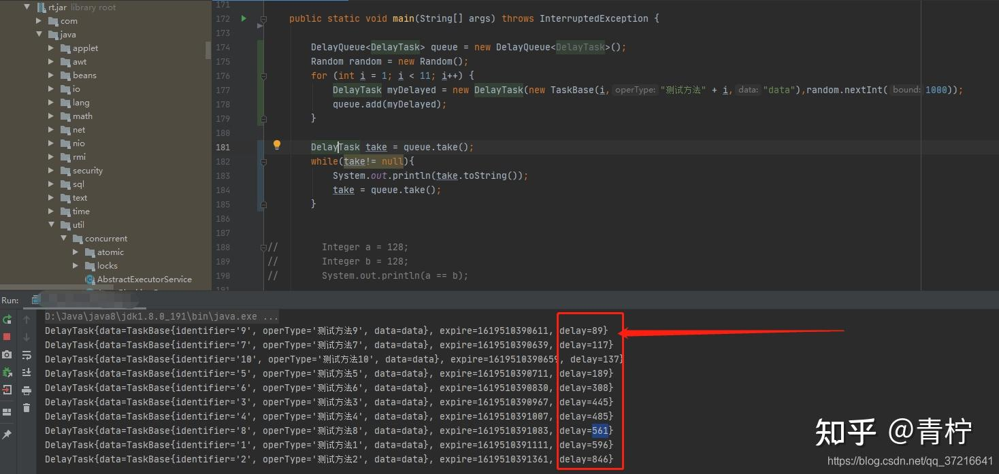

## **场景**

在公司业务场景中，偶然出现了一个量较小的需求：在某个业务系统处理完成之后，需要做一个临时操作，例如：用户申请某web网页账号后给用户指定账号发送一份邮件提示用户账号已开通… 等等，如果跟业务系统耦合，会影响到业务处理的速度，本来想用MQ做一个队列处理消息，但是系统消息量不大，尝试使用原生API DelayQueue延时队列实现。

## **延时队列DelayQueue**

java.util包中提供了现成的轮子，先扒一个main示例跑一下效果。



最直观的表现是用random随机创建时间，出队列的时间却根据设置时间顺序执行，扒一下源码看一下。

```java
// An highlighted block
public class DelayQueue<E extends Delayed> extends AbstractQueue<E>
implements BlockingQueue<E>
```

入列元素需要实现Delayed接口 ，接口提供了以下几个方法：

```java
@Override
public long getDelay(TimeUnit unit) {
//        return unit.convert(this.expire - System.currentTimeMillis(),unit);
return unit.convert(this.expire - System.currentTimeMillis(), TimeUnit.MILLISECONDS);
}

@Override
public int compareTo(Delayed o) {
//        long delta = getDelay(TimeUnit.NANOSECONDS) - o.getDelay(TimeUnit.NANOSECONDS);
//        return (int) delta;
return (int)(this.getDelay(TimeUnit.MILLISECONDS) - o.getDelay(TimeUnit.MILLISECONDS));
}

@Override
public boolean equals(Object o) {
if (o instanceof DelayTask){
return String.valueOf(this.data.getIdentifier()).equals(String.valueOf(((DelayTask) o).getData().getIdentifier()));
}
return false;
}
```

其中getDelay是其中最核心的方法，在上面main示例中，delay是一个延时队列，它在初始化init时是一个阻塞等待的线程，getDelay调用时，队列中元素会判断当前任务是否已经达到过期时间，如果过期我们才可以通过take取出元素。

我们在自定义Delay元素时，需要指定一个过期时间戳

```java
private final long delayTime; //延迟时间
private final long expire;  //到期时间
private String data;   //数据

//通过构造，设置过期时间 ，默认单位为毫秒 如果修改时间单位，使用TimeUnit.MILLISECONDS 去设置时间类型
public DelayTask(long delay, String data) {
delayTime = delay;
this.data = data;
expire = System.currentTimeMillis() + delay;
}
```

在我们添加元素时，根据重写compareTo方法，队列会根据返回值进行排序。

## **源码**

```java
private final transient ReentrantLock lock = new ReentrantLock();//获取锁
private final PriorityQueue<E> q = new PriorityQueue<E>();//队列
private Thread leader = null;//最快出队列的阻塞元素

public boolean add(E e) {
return offer(e);
}
public boolean offer(E e) {
final ReentrantLock lock = this.lock;
lock.lock();
try {
q.offer(e);
if (q.peek() == e) {
leader = null;
available.signal();
}
return true;
} finally {
lock.unlock();
}
}
public void put(E e) {
offer(e);
}
```

能看出，所有提供的入列方法，其实最后都调用了offer()，先获取锁，给线程上锁，加入元素时判断加入的元素是否为最头元素，leader设置为空并唤醒线程。

```text
public E take() throws InterruptedException {
final ReentrantLock lock = this.lock;
lock.lockInterruptibly();
try {
for (;;) {
E first = q.peek();
if (first == null)
available.await();
else {
long delay = first.getDelay(NANOSECONDS);
if (delay <= 0)
return q.poll();
first = null; // don't retain ref while waiting
if (leader != null)
available.await();
else {
Thread thisThread = Thread.currentThread();
leader = thisThread;
try {
available.awaitNanos(delay);
} finally {
if (leader == thisThread)
leader = null;
}
}
}
}
} finally {
if (leader == null && q.peek() != null)
available.signal();
lock.unlock();
}
}

public E poll(long timeout, TimeUnit unit) throws InterruptedException {
long nanos = unit.toNanos(timeout);
final ReentrantLock lock = this.lock;
lock.lockInterruptibly();
try {
for (;;) {
E first = q.peek();
if (first == null) {
if (nanos <= 0)
return null;
else
nanos = available.awaitNanos(nanos);
} else {
long delay = first.getDelay(NANOSECONDS);
if (delay <= 0)
return q.poll();
if (nanos <= 0)
return null;
first = null; // don't retain ref while waiting
if (nanos < delay || leader != null)
nanos = available.awaitNanos(nanos);
else {
Thread thisThread = Thread.currentThread();
leader = thisThread;
try {
long timeLeft = available.awaitNanos(delay);
nanos -= delay - timeLeft;
} finally {
if (leader == thisThread)
leader = null;
}
}
}
}
} finally {
if (leader == null && q.peek() != null)
available.signal();
lock.unlock();
}
}
```

从队列中获取元素，如果获取到最前的元素，线程被阻塞，如果获取元素为null，则锁被释放。然后根据元素中getDelay方法获取一个int的返回值，这里就是我们构造中设置的过期时间，如果当前时间小于0，说明当前任务已经过期，我们可以取出过期元素；如果元素还在等待中，并且leader不为空，释放锁。

finally如果队列中还有元素且leader中没有阻塞元素时，全局释放锁。

## **结合springboot简单应用**

```java
public class DelayManager implements CommandLineRunner{}
//创建一个外部管理类实现CommandLineRunner，重写run方法，这里实现runner是为了在springboot加载完成调用run方法时会启动队列

/*
**省略定义的add remove 等方法
*/
ExecutorService executorService = Executors.newSingleThreadExecutor();
executorService.execute(new Runnable() {
@Override
public void run() {
excuteThread();
}
});
//从队列中获取元素，一旦元素到期拿出元素处理
while(true){
try {
DelayTask task = delayQueue.take();
System.out.println(task.toString());
processTask(task);//获取到任务后的具体业务处理
} catch (Exception e) {
e.printStackTrace();
continue;
}
}
```
