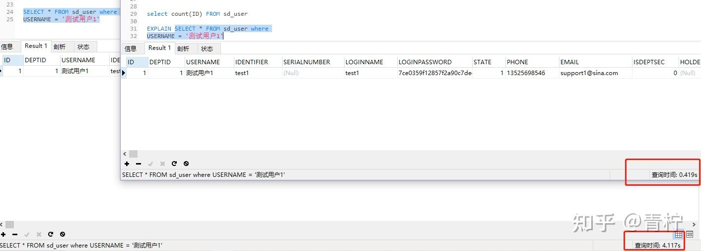

> 单mysql在数据量达到百万级以上时，在查询过程中响应过慢，性能会遭遇瓶颈

## **MYSQL的索引**

为什么要使用索引？索引可以在mysql查找数据时，更快的找到需要找到的数据：
参考：一本字典，当我想查找某个字或者词时，你不会将字典从头翻到尾，而是从目录根据关键字筛选位置（例如某个字的首字母）

MYSQL的索引有几种类型：FULLTEXT，HASH，BTREE，RTREE

1. FULLTEXT，即全文索引，前只有MyISAM引擎支持。其可以在CREATE TABLE ，ALTER TABLE ，CREATE INDEX 使用，不过目前只有 CHAR、VARCHAR ，TEXT 列上可以创建全文索引。（应用场景：类似需要模糊查某个关键字如：％中％）
2. HASH，根据键值对的模型，在索引后会根据键找到值，但是无法使用大量范围，使用与＝或ｉｎ范围较小的情况
3. BTREE，BTREE索引就是一种将索引值按一定的算法，存入一个树形的数据结构中（二叉树），每次查询都是从树的入口root开始，依次遍历node，获取leaf。这是MySQL里默认和最常用的索引类型。
4. RTREE，这种类型索引很少使用，暂时跳过（其实我也不懂．．．）

## **索引的优缺点**

优点：

1. MYSQL所有列都可以添加索引
2. MYSQL索引对查询效率提升有很大帮助

缺点：

1. MYSQL对索引的维护，极其消耗效率耗费时间
2. 索引在数据增删改时，也会维护数据

使用索引：

1. 对常常更新的列，尽量少使用索引
2. 对条件查询某些列常常作为条件字段查询时，应该添加索引保证查询速度
3. 数据量太小不需要添加索引，可能你的查询速度比维护索引要快
4. 一个列如果值比较分散建议使用索引，反之亦然。例如ｓｅｘ列只有两个默认值：男，女

## **数据测试索引效果**

首先创建两个测试表，一个在关键列上创建索引

```abap
CREATE TABLE `sd_user`  (
`ID` int(11) NOT NULL AUTO_INCREMENT,
`DEPTID` int(11) NULL DEFAULT NULL,
`USERNAME` varchar(256) CHARACTER SET utf8mb4 COLLATE utf8mb4_general_ci NOT NULL,
`IDENTIFIER` varchar(256) CHARACTER SET utf8mb4 COLLATE utf8mb4_general_ci NOT NULL,
`SERIALNUMBER` varchar(128) CHARACTER SET utf8mb4 COLLATE utf8mb4_general_ci NULL DEFAULT NULL,
`LOGINNAME` varchar(256) CHARACTER SET utf8mb4 COLLATE utf8mb4_general_ci NOT NULL,
`LOGINPASSWORD` varchar(64) CHARACTER SET utf8mb4 COLLATE utf8mb4_general_ci NULL DEFAULT NULL,
`STATE` smallint(6) NOT NULL,
`PHONE` varchar(64) CHARACTER SET utf8mb4 COLLATE utf8mb4_general_ci NULL DEFAULT NULL,
`EMAIL` varchar(64) CHARACTER SET utf8mb4 COLLATE utf8mb4_general_ci NULL DEFAULT NULL,
`ISDEPTSEC` smallint(6) NOT NULL,
`HOLDERID` varchar(32) CHARACTER SET utf8mb4 COLLATE utf8mb4_general_ci NULL DEFAULT NULL,
`CERT` varchar(4000) CHARACTER SET utf8mb4 COLLATE utf8mb4_general_ci NULL DEFAULT NULL,
`LOCKEDTIME` timestamp(0) NULL DEFAULT CURRENT_TIMESTAMP ON UPDATE CURRENT_TIMESTAMP(0),
`LOCKEDSTATE` smallint(6) NOT NULL,
`ERRORCOUNT` int(11) NOT NULL,
`CONFIGDENTIAL` smallint(6) NOT NULL,
`USERFROM` smallint(6) NOT NULL,
`MANAGEDEPTID` varchar(256) CHARACTER SET utf8mb4 COLLATE utf8mb4_general_ci NULL DEFAULT NULL,
`MSGSYNTIME` bigint(20) NOT NULL,
`LASTUPDATE` bigint(20) NOT NULL,　　　PRIMARY KEY (`ID`) USING BTREE,
CONSTRAINT `FK_RELATIONSHIP_4` FOREIGN KEY (`DEPTID`) REFERENCES `sd_dept` (`ID`) ON DELETE RESTRICT ON UPDATE RESTRICT
) ENGINE = InnoDB AUTO_INCREMENT = 2562028 CHARACTER SET = utf8mb4 COLLATE = utf8mb4_general_ci ROW_FORMAT = Dynamic;

INDEX `FK_RELATIONSHIP_4`(`DEPTID`) USING BTREE,
INDEX `FK_RELATIONSHIP_sd_55`(`ID`) USING BTREE,
INDEX `FK_RELATIONSHIP_sd_56`(`IDENTIFIER`) USING BTREE,
INDEX `FK_RELATIONSHIP_sd_57`(`SERIALNUMBER`) USING BTREE,
INDEX `FK_RELATIONSHIP_sd_58`(`LOGINNAME`) USING BTREE,
INDEX `FK_RELATIONSHIP_sd_59`(`STATE`) USING BTREE,
INDEX `FK_RELATIONSHIP_sd_60`(`USERNAME`) USING BTREE,
```

跑一个脚本给表中插入200W数据


查找数据对比



可以看到，在查找列中添加索引和不添加索引效率天差地别

如果想查看某条查询走了多少条，或者执行的效率 只需要在SQL语句前加上EXPLAIN关键字

## **索引失效的几种情况**

- **如果条件中有or，即使其中有条件带索引也不会使用(这也是为什么尽量少用or的原因)要想使用or，又想让索引生效，只能将or条件中的每个列都加上索引**
- **对于多列索引，不是使用的第一部分，则不会使用索引**
- **like查询以%开头（全表扫描）**
- **如果列类型是字符串，那一定要在条件中将数据使用引号引用起来,否则不使用索引**
