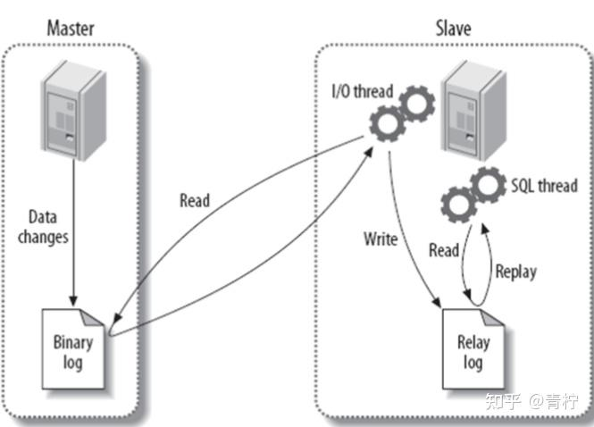
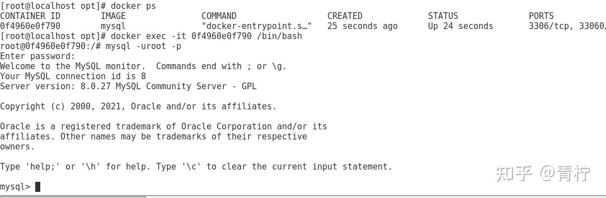

> Summary: The article uses Docker to build a learning environment for MySQL replication and explains what should and should not be inferred from that environment.

## Intended Reader

Developers learning MySQL replication through local experiments.

## Why This Matters

MySQL performance and deployment work is usually about data shape, access paths, indexes, transactions, and operational topology.

Docker is a good way to learn replication mechanics, but primary-replica topology still needs careful configuration of server IDs, binlog behavior, users, and replication state.

## Mental Model

The key is to understand how the database chooses an execution path and how deployment choices change availability, maintenance, and failure recovery.

The practical way to read this article is to look for the boundary it clarifies: what state exists, who owns it, which operation changes it, and what evidence proves the system behaved as expected.

## Implementation Walkthrough

- Start a primary MySQL instance and expose the necessary ports for local testing.
- Configure binlog settings and unique server IDs before expecting replication to work.
- Create a replication user with the required permissions.
- Start the replica and verify status rather than assuming the topology is healthy.

## Pitfalls and Tradeoffs

- Local Docker makes experimentation cheap but does not represent production durability.
- Hard-coded passwords and local IPs are acceptable in a lab only when they are clearly marked as examples.
- Replication lag and failover behavior need separate testing.

## Verification Checklist

- Check master status and replica status after configuration.
- Write test data on the primary and verify it appears on the replica.
- Record binlog file, position, and error fields when replication fails.

## Practical Takeaways

- Index design should start from predicates, sorting, cardinality, and result size.
- Large queries need execution-plan evidence, not guesswork.
- Docker-based clusters are useful for learning and local verification, but production topology requires stricter durability and backup planning.
- Optimization should preserve correctness first, then reduce latency and resource cost.

## Visual Evidence

The migrated local images are preserved as supporting figures. They keep the English edition aligned with the same diagrams, screenshots, or console evidence used by the source article.




## Selected Technical Snippets

The following snippets are preserved only when they are safe to publish in English without broken encoding or translated identifiers.

```powershell
[mysqld]
skip-name-resolve
server-id=1
log-bin=mysql-bin
binog-do-db=test_db
binlog-ignore-db=mysql
```

```text
start slave
```

## Source Notes

- Topic: MySQL
- [Original source](https://zhuanlan.zhihu.com/p/675930535)
- Original publication date: 2024-01-03
- This English edition is localized from the migrated article metadata, source structure, technical terms, local assets, and clean implementation evidence.

## Closing Thoughts

The goal of this English edition is not to imitate the original wording sentence by sentence. It preserves the engineering argument, removes migration noise, and presents the article as a publishable technical note that future readers can use for design, debugging, or implementation review.
