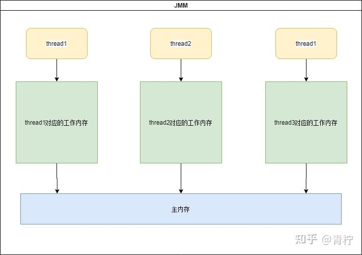

> Summary: The article explains volatile as a visibility and ordering tool, not a general-purpose lock or atomicity mechanism.

## Intended Reader

Java developers learning memory visibility and concurrency correctness.

## Why This Matters

Java concurrency is where language semantics, JVM memory visibility, OS scheduling, and data-structure design meet. Small misunderstandings often become production-only bugs.

volatile makes writes visible and constrains certain reorderings, but it does not make compound operations atomic.

## Mental Model

Think in terms of state ownership, visibility, ordering, blocking, and wake-up semantics. APIs such as AQS, CAS, LockSupport, volatile, and ThreadLocal are tools for shaping those guarantees.

The practical way to read this article is to look for the boundary it clarifies: what state exists, who owns it, which operation changes it, and what evidence proves the system behaved as expected.

## Implementation Walkthrough

- Define the visibility problem: one thread writes state and another thread needs to observe it reliably.
- Explain how volatile affects read and write visibility under the Java Memory Model.
- Separate visibility from atomicity using examples such as counters or check-then-act logic.
- Use volatile for flags and publication patterns only when the invariant is simple enough.

## Pitfalls and Tradeoffs

- volatile is lighter than a lock but provides fewer guarantees.
- It can make a state flag safe while leaving related mutable state unsafe.
- If multiple fields must change together, a lock or atomic abstraction is usually clearer.

## Verification Checklist

- Identify the exact happens-before relationship being relied on.
- Avoid using volatile to protect multi-step updates.
- Stress-test visibility assumptions with repeated concurrent runs.

## Practical Takeaways

- Distinguish atomicity, visibility, and ordering; they solve different classes of concurrency bugs.
- Do not treat locks as a single concept. Lock acquisition, queueing, parking, interruption, and fairness all affect behavior.
- Use low-level primitives only when the higher-level abstraction cannot express the requirement clearly.
- Concurrency bugs need evidence: thread dumps, state transitions, queue length, contention, and timeout signals.

## Visual Evidence

The migrated local images are preserved as supporting figures. They keep the English edition aligned with the same diagrams, screenshots, or console evidence used by the source article.



## Selected Technical Snippets

The following snippets are preserved only when they are safe to publish in English without broken encoding or translated identifiers.

```java
boolean isRun = false;
while(!isRun){
//doThings
}

isRun = true;
```

## Source Notes

- Topic: JUC
- [Original source](https://zhuanlan.zhihu.com/p/675931603)
- Original publication date: 2024-01-03
- This English edition is localized from the migrated article metadata, source structure, technical terms, local assets, and clean implementation evidence.

## Closing Thoughts

The goal of this English edition is not to imitate the original wording sentence by sentence. It preserves the engineering argument, removes migration noise, and presents the article as a publishable technical note that future readers can use for design, debugging, or implementation review.
