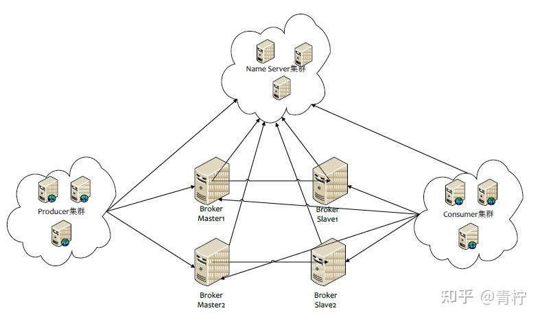
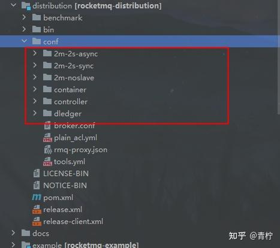

## **RocketMq背景：**

## **RocketMq的优势：**

|  | 性能、吞吐量 | 重试机制 | 消息积压能力 | 分布式 | 延时 | 事务 | 全局顺序/局部顺序 | 持久化 | 消息丢失 | 死信队列 | 常用场景 |
| --- | --- | --- | --- | --- | --- | --- | --- | --- | --- | --- | --- |
| RocketMq | 高 | 有 | 消息积压不影响消费 | 是 | 是 | 是 | 保证顺序影响效率 | 是 | 依靠策略保证 | 是 | 大多数场景 |
| Kfaka | 高 | 有 | 消息积压不影响消费 | 是 | 是 | 否 | 分区内顺序 | 是 | 存在丢失 | 否 | 高性能场景，如：日志 |
| RabbitMq | 低 | 有 | 不能保证大量消息积压，会打爆内存，导致操作缓慢 | 是 | 是 | 是 | 全局/局部 | 是 | 基本不存在丢失 | 是 | 用于实时的，对可靠性要求较高的消息传递 |

## **RocketMq的基础架构：**

首先来一张最基本的mq架构图（盗图）：



NameServer：Topic的注册中心，类似于Zookeeper，作为核心组件broker的动态注册和发现。NameServer根据心跳机制获取集群下borker的数据，并且通过心跳及时剔除失活的broker实例。**但是每个NameServer本身是不进行通信的，认为每个 NameServer都包含着所有的broker注册的信息**。这里与跟Zookeeper不太一样，不需要考虑NameServer挂掉后节点的选取。

Broker：RockerMq最核心的组件，broker支持集群，broker负责消息的存储，流转。broker实例跟所有的NameServer保持长连接，会将topic的数据同步到所有的NameServer中。
broker可以说是Rocket中最核心的模块，producer生产消息后，会根据NameServer获得对应的路由信息；每个broker中都有属于自己的topic和messageQueue，它们会分散在broker集群中来避免某个topic数据量过大。同时broker还有Store持久化刷盘的机制。默认master和slave相对应，一个slave只允许有一个master，slaver可以做读取，master做读写。

producer：消息生产者，用户服务实例中，通过NameServer长连接获所有的broker路由信息，然后根据默认负载均衡或者自定义策略进行消息的分发，将消息发送到broker中指定topic指定messageQueue中。

producerGroup：生产者组，发送消息为相同的一类型的生产者集合。

consumer：消息消费者，用户服务实例中，通过NameServer长连接获取所有的broker路由信息，然后向broker-pull拉取消息。消费者主要有两种类型：广播消费和集群消费：

广播消费：一条消息会发送给所有指定topic订阅的消费者，不支持重试！

集群消费：一条消息只会发送给订阅topic的消费者组的其中一个消费实例进行消费，可重试，不保证多次重试是相同消费者进行消费！

consumerGroup：消费者组，消费同一类型的消费者集合。

实际上，rocket除了实例客户端外，抽象的业务概念：

topic：topic是消息主题，每个消息都应该有自己的topic，主题跟随producer创建、在broker上messageQueue进行存储、在指定topic的consumer进行消费；topic是一个抽象的概念，只是对消息进行的一种类型划分，但是在存储上并不会根据不同的topic存储不同的位置，而是commitLog store所有topic共享同一个存储目录。

tag：rocketMq支持消息过滤消费，通过指定tag可以进行消息消费过滤，也可以根据tag做消息标记。

messageQueue：实际存储消息的队列，在broker实例下，认为每个queue都存储着相同topic的消息，但是一个topic可以有多个不同的queue存储消息。

offset：queue中消息存储的索引。


## **RocketMq的集群模型：**

RocketMq是帮助我们完成高可用集群的，在官方开源文档中提供了这几种方案：



它们之间的区别，有两个比较关键的策略：

**brokerRole：代表这个节点是broker还是slave，和master向slave同步的方式是异步的还是同步的。**

**flushDiskType：代表刷盘持久化的方式，同步刷盘或者异步刷盘。**

```todotxt
# NameServer地址，多个以;隔开 namesrvAddr=
# 集群名称，相同集群broker名称相同 brokerClusterName=
# brokerIP地址 brokerIP1=
# broker通信端口 listenPort=
# broker名称 brokerName=
# 0表示主节点，1表示从节点 brokerId=
# 进行消息删除时间，02就是凌晨2点 deleteWhen=
# 消息在磁盘上保留时间，单位小时 fileReservedTime=
# 主从复制 brokerRole=
# 刷盘 flushDiskType=
# 自动创建Topic autoCreateTopicEnable=
# 消息存储根目录 storePathRootDir=
```

但是，我们基于这种方式做的集群是不能完全保证高可用的，如果master挂掉后，虽然slave还可以提供查询，但是没有办法再进行消息写入了，本身它们不具备一个选举laeder的方式，认为所有的写都会依赖master，针对这种方式，rokcet给我们提供了rocketmq dledger集群部署，它可以理解成像zookeeper一样拥有了集群选举的能力，会从如果master挂掉，会从slave中选举出一个master继续提供服务。

## **一个MQ应该具备哪些优势/功能：**

综合rocketMq的特性来看，一个成熟的MQ组件，应该具备以下几种能力：

1. 支持生产和消费消息的能力
2. 能够做到持久化处理，避免消息大量丢失
3. 高可用
4. at last once，允许部分消息重复，幂等解决，但是要保证最少被消费一次
5. 消息重试和和回溯
