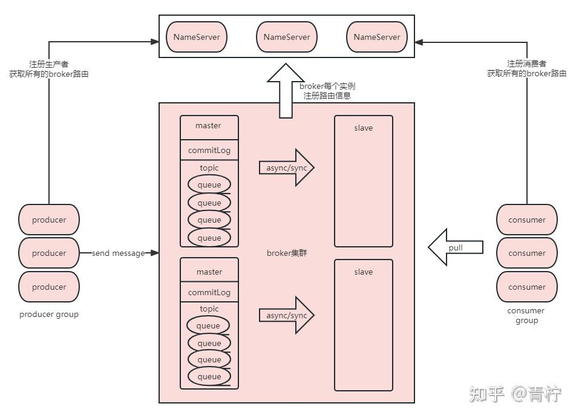
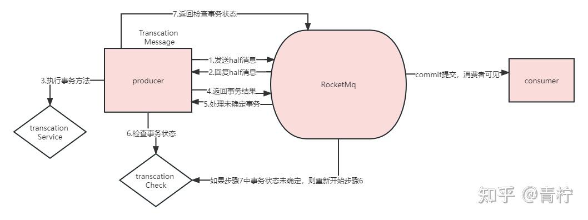
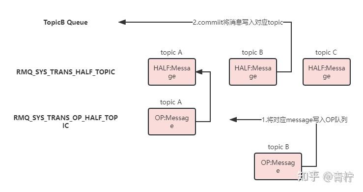
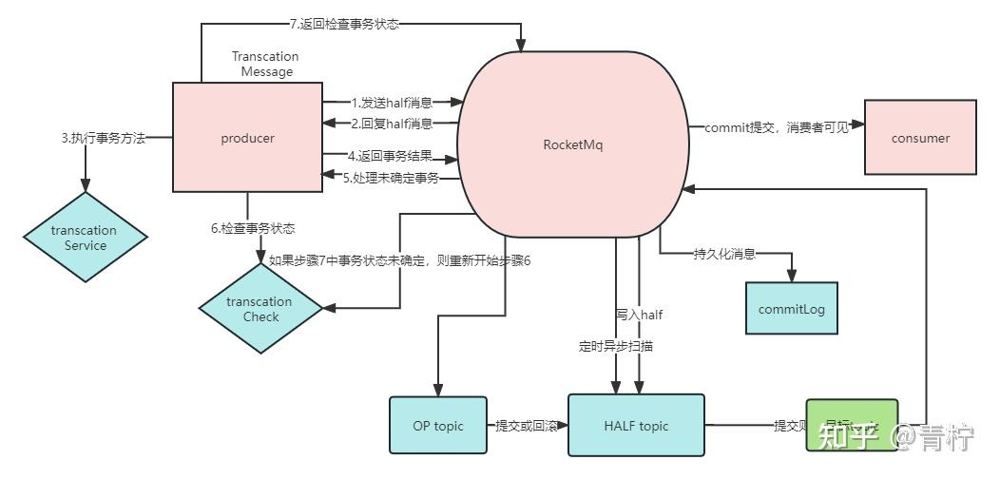

> Summary: The article treats message loss as an end-to-end problem across producer, broker, storage, replication, and consumer acknowledgement.

## Intended Reader

Engineers designing reliable messaging flows with RocketMQ.

## Why This Matters

Message queues decouple producers and consumers, but they also introduce delivery semantics, ordering constraints, persistence tradeoffs, and operational recovery work.

Preventing message loss requires identifying every boundary where a message can disappear or become unobservable.

## Mental Model

A reliable RocketMQ design starts from the desired message semantics: loss prevention, duplicate handling, ordering, backlog recovery, and broker durability.

The practical way to read this article is to look for the boundary it clarifies: what state exists, who owns it, which operation changes it, and what evidence proves the system behaved as expected.

## Implementation Walkthrough

- Start at the producer: send mode, retry behavior, and acknowledgement determine whether the producer knows the broker accepted the message.
- Move to the broker: persistence and flush strategy define how durable accepted messages are.
- Consider replication and broker failure because a single broker acknowledgement may not equal cross-node durability.
- Finish at the consumer: acknowledgement timing determines whether business processing and message progress stay consistent.

## Pitfalls and Tradeoffs

- Synchronous confirmation improves safety but adds latency.
- Stronger flush or replication settings improve durability but reduce throughput.
- Transaction messages help some business consistency cases but add state management complexity.

## Verification Checklist

- Test producer retry and send failure behavior.
- Simulate broker restart during message flow.
- Check consumer acknowledgement after business-side failure.

## Practical Takeaways

- Message loss, duplication, and disorder are separate problems; each needs a different design response.
- Exactly-once is usually achieved at the business layer through idempotency and state checks, not by the queue alone.
- Ordering requires narrowing concurrency and queue assignment; it should be used only where business semantics require it.
- Backlog handling depends on consumer capacity, retry strategy, dead-letter queues, and visibility into lag.

## Visual Evidence

The migrated local images are preserved as supporting figures. They keep the English edition aligned with the same diagrams, screenshots, or console evidence used by the source article.

## Source Notes

- Topic: RocketMQ
- [Original source](https://zhuanlan.zhihu.com/p/675933161)
- Original publication date: 2024-01-03
- This English edition is localized from the migrated article metadata, source structure, technical terms, local assets, and clean implementation evidence.

## Closing Thoughts

The goal of this English edition is not to imitate the original wording sentence by sentence. It preserves the engineering argument, removes migration noise, and presents the article as a publishable technical note that future readers can use for design, debugging, or implementation review.
