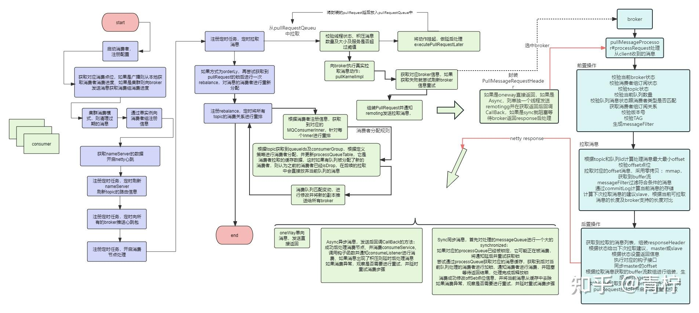

> *rocket存在重复消费吗？rocket怎么帮我们避免重复消费？*

## **如何算重复消费**

rocket本身其实有一部分思想建立在 at-least-once 基础上，rocket保证了生产者发送的消息，根据持久化刷盘和其他机制保证消息不丢失，消息不丢失请参考[https://www.cnblogs.com/oldEleven/p/17149457.html](https://link.zhihu.com/?target=https%3A//www.cnblogs.com/oldEleven/p/17149457.html)，但是rocket本身是支持重试的，其实要保证消息消费的能力，它本身是不保证重复消费的。当然现在说的重复消费并不这么简单，**如果rocket根据异常进行retry队列的重试任务，导致消息重试的情况排除后，它还能不能保证消息在正常消费的情况下做到不丢失呢**？

### **消费者的生命流程**

如何确定rocket会不会在消息处理成功后还会消费到重复的消息，我们可以根据消费者在生命周期启动到核心拉取消息消费的能力来决定。



上面是一个consumer的主要工作流程图，通过图我们可以观察到：

- 紫色的部分是consumer从启动到初始化在主流程上需要处理的动作：

consumer启动后先进行消费者的注册，以及一些初始化init处理。

获取对应的消费点位offSet，如果是广播消费则通过本地存储获取，如果是集群消费则通过broker通信获取对应consumerGroup的消费点位。

开启异步线程，定时拉取消息。

开启异步线程，定时做消费重排。

更新本地配置工厂。

- 绿色部分主要是consumer在主流程中创建的异步任务，其中最核心的内容就是consumer的拉取消息动作：

检查对应consumer配置及初始化clientFactory，初始化策略、pullApi。

获取consumer对应的消费点位，其中广播模式通过LocalFile本地文件获取对应offSet消费偏移量，并存储本地缓存offSetTable；集群模式通过向broker发送数据包请求对应consumer grop的消费点位。

异步线程池开启定时通过nameServer拉取对应的broker集群信息。

异步线程池开启通过broker拉取消息消费：

通过本地consumerTable获取对应的consumer集群信息。

根据对应pullRequest拉取消息处理缓存processQueue，如果当前处理对象已经被drop，则放弃处理；校验当前consumer服务的状态。

校验当前消费者缓存消息是否已经存在消息挤压、待处理消息超过阈值或当前服务处于busy状态，如果是将pullRequest放入延时线程队列 executePullRequestLater，避免消息挤压。

如果当前消费者是广播消费，则处理前将pullRequest锁定，防止其他消费者进行消费。（**这里可以体现广播消息不会出现重复消费，因为它们无法获取到已经锁定的pullRequest，并且广播消息是不支持重试的**）

如果广播消息，则在锁定后立即触发一次rebalance，进行消费重排，并刷新消费节点，具体刷新规则依靠消费者设置的消费策略：从最开始节点消费或消费当前节点。后续同理。

根据consumer指定topic获取本地订阅的缓存数据，定义消息拉取callBack回调方法**（这里的callBack是指consumer从broker拉取的response）**

### **broker：**

**接收到pullMessage后，校验当前broker状态、校验消费者组订阅状态、校验topic状态。**

获取consumergroup信息，校验消费者订阅是否合法、校验topic、校验队列数量。

构建messageFilter，校验consumer类型是否匹配；获取consumer同步到broker的 consumerGroupInfo，校验版本、Tag、Filter。

在rocket5.0版本之前，采用了直接通过计算MinOffSet和MaxOffSet拉取，在5.0及之后，通过future拉取了一个message的任务（5.0之后支持了POP处理，这个后面再说）：

### **broker拉取消息：**

根据topic和队列id计算处理消息最大最小offset、校验offset点位

拉取对应的offset消息，采用零拷贝 ：mmap，获取到buffer流

messageFilter过滤符合条件的消息

通过commitLog计算当前消息的存储

计算下次拉取消息的建议slave，根据当前可拉取消息的长度及broker支持的长度对比（**这里的消息还是buffer流数组，是通过零拷贝直接获取的文件流**）

### **broker后置操作：**

**获取到拉取的消息列表，组装responseHeader**

根据状态给出下次拉取建议，master或slave

根据状态设置返回信息

执行对应的钩子接口

同步master的offset

根据拉取消息获取的buffer流数组进行组装，生成messageList

如果没有拉取到消息，broker允许挂起，将pullRequest挂起并开启子线程重试拉取

写入netty返回response

pullAPI拉取消息到processQueue：

当consumer从broker中拉取到了message后，回调pullCallBack方法：

当拉取到消息后，对消息做基本处理，然后放入processQueue缓存中。这时它就要包装 consumeMessageContext并执行一些前置的钩子函数，如果这时消息并没有达到阈值，没有消息积压！这时就会通知messageListener，就是我们业务实现的方法，并对consumeMessage的返回值做封装、再执行定义的after钩子函数，**然后要看这个消息是否是被丢弃的！！！注意，这里是消费完后采取处理，如果是isDrop，则不需要做一些offSet偏移！如果这次拉取并没有拉取到消息，那么根据消息拉取间隔将pullRequest再放入异步延时队列中等待下一次拉取！（拉取的核心）。**

当没有拉取到消息或者拉取异常后，将pullRequest放入延时队列等待下一次拉取。

先从clientFactory拉取一个broker节点，组装 requestHeader，向broker发送netty包，请求拉取消息。

oneWay单向消息，发送直接返回；Async异步消息，发送后回调CallBack的方法：成功后处理消费节点、并消费consumeService、调用钩子函数并通知consumeListener进行消费、如果消息出现了积压则延时后处理消息，如果消费异常，观察是否需要进行重试，并延时重试消费步骤。Sync同步消息，首先对处理的messageQueue进行一个大的synchronized：如果对应的processQueue已经被锁定，它可能正在被消费，将通知延后并重试获取锁，尝试通过processQueue获取对应的消息缓存，获取到后对当前队列处理的消费者进行加锁，通知消费者进行消费，并阻塞等待返回结果，处理完成后释放锁，消费成功修改offSet点位信息，并将当前消息从缓存中去除。*（***这是consumer在请求拉取之后的处理，如果是单向消息或异步消息，则开启线程处理回调方法，主线程直接返回*）***

异步线程开启定时定时清除过期消息，**rocket认为消息在重试后必须消费成功后才会在processQueue中清除已经过期不需要，并且偏移量已经超过当前重试消费的消息**。（这里抛砖引玉，会出现消息重复消费的问题）

异步线程开启定时rebalance重排，重排的机制不仅仅在与consumer启动注册时，在broker中也有对应的异步线程定时去通知所有consumer和processQueue进行重新匹配。

首先触发rebalance时，将消费进程暂停，通过CountDownLatch2挂起或唤醒，rocket中client很多都是基于封装的ServiceThread去做线程通信的，具体可以参考common-ServiceThread代码实现。

```java
public void wakeup() {
if (hasNotified.compareAndSet(false, true)) {
waitPoint.countDown(); // notify
}
}
```

触发rebalance时的机制有这几种，首先在consumer启动时，注册节点后就会启动rebalance，broker在启动或者订阅信息发生变化后会主动要求rebalance。这里我们在后面rebalance中再具体的说明。

```java
if (isNotifyConsumerIdsChangedEnable) {
this.consumerIdsChangeListener.handle(ConsumerGroupEvent.CHANGE, group, consumerGroupInfo.getAllChannel());
}
}
```

### **rebalance重排篇**

rocket的rebalance不仅仅是consumer的动作，broker也有定时强制要求rebalance的动作。消费重排是为了在consumer或broker发生变动的情况下，及时让消费绑定的消息发生变化。例如：


假设当前某个broker的指定topic中默认有4个队列，且是默认集群异步消费任务。当前有4个消费者，在消费者注册后，会触发一次rebalance，将订阅消费指定topic的队列集合与当前的队列进行分配，假设默认以分区进行分配，那么就应该一个consumer对应一个固定的queue。这时，有两个consumer实例下线了，**这时如果不进行重排，就会发生部分消息永远消费不到的场景**。例如对应queue1 queue2的消费者consumer1 consumer2挂掉了，配置中心会先将心跳失败的consumer从存活的consumerGroup中移除， 我们根据上面consumer的生命周期可以看出，其实每个consumer是根据持续pull从broker拉取到本地的processQueue进行消费的。那么这种情况就会导致queue1 queue2在短时间内无法被消费。

首先，通过ClientInstance获取到所有的消费者实例Inner，对消费实例进行doBalance。根据实例获取对应的订阅缓存，针对sub下每一个topic去做rebalance。

如果是广播消息，则获取到当前topic下所有的consumer，认为他们都会订阅当前topic下的所有消息，根据topic取出当前的messageQueue消息队列和processQueue预处理队列，如果某一个mq已经不属于当前的mqset，说明当前的队列已经被移了，这时需要将当前队列删除，如果是广播模式，则尝试从broker进行解锁。如果上一次操作时间超时，认为没有新消息或者拉取是失败的，则将对应的数据清除掉。如果当前是顺序消费，尝试获取锁，如果当前的锁无法获取则说明当前队列可能正在被消费，则放弃处理当前队列，并创建一个processQueue计算对应的offSet消费点位，然后保存messageQueue与processQueue的关系，然后创建一个pullRequest进行拉取消息。当包含新的变动时，则需要将更新后的关系推送给broker。

```text
this.getmQClientFactory().sendHeartbeatToAllBrokerWithLock();
```

如果是集群消息，要先获取对应topic下所有的消息队列和订阅的消费者，进行排序，然后根据指定策略进行消费者分配：

```java
allocateResult = strategy.allocate(
this.consumerGroup,
this.mQClientFactory.getClientId()
```

根据选中分配获取到对应的结果后，再进行处理：处理方式与上文中同步消息类似，只是不是orderLy实例，不需要获取队列的锁，并创建一个processQueue计算对应的offSet消费点位，然后保存messageQueue与processQueue的关系，然后创建一个pullRequest进行拉取消息。当包含新的变动时，则需要将更新后的关系推送给broker。

**当队列认为是被移除或者已经超时拉取时，都会给processQueue对应的队列设置isDrop，这时对应的processQueue是不会被消费者进行消费的**

- AllocateMessageQueueAveragely：平均分配策略，这是默认策略。尽量将消息队列平均分配给所有消费者，多余的队列分配至排在前面的消费者。分配的时候，前一个消费者分配完了，才会给下一个消费者分配。
- AllocateMessageQueueAveragelyByCircle：环形平均分配策略。尽量将消息队列平均分配给所有消费者，多余的队列分配至排在前面的消费者。与平均分配策略差不多，区别就是分配的时候，按照消费者的顺序进行一轮一轮的分配，直到分配完所有消息队列。
- AllocateMessageQueueByConfig：根据用户配置的消息队列分配。将会直接返回用户配置的消息队列集合。
- AllocateMessageQueueByMachineRoom：机房平均分配策略。消费者只消费绑定的机房中的broker，并对绑定机房中的MessageQueue进行负载均衡。
- AllocateMachineRoomNearby：机房就近分配策略。消费者对绑定机房中的MessageQueue进行负载均衡。除此之外，对于某些拥有消息队列但却没有消费者的机房，其消息队列会被所欲消费者分配，具体的分配策略是，另外传入的一个AllocateMessageQueueStrategy的实现。
- AllocateMessageQueueConsistentHash：一致性哈希分配策略。基于一致性哈希算法分配。

根据rocket的rebalance机制，因为它的分配机制可以帮助我们绑定一个队列只会被一个消费者进行消费，但一个消费者可以在subTable中订阅多个队列。但是rebalance在处理时会对process Queue和broker中的mq进行锁定，可能会发生短暂的消息无法拉取。

从源码的角度，其实在处理消费点位上，就能看出来当前的结论：

```java
/** TODO 消费同步模式 重要
* 集群消费更新节点 其实可以看出在这里不管广播还是集群都是存储在了offsetTable中，其实会在后续推送到broker进行保存的
* 这里有个误区，我们知道集群模式 一个queue会对应到一个消费者进行消费 一个消费者可以绑定多个队列进行pull 如果这里不存在rebalance时，这个消费者不会变化，它延后在注册心跳同步offSet是完全没有问题的
* 但是如果这里触发了rebalance，这个消息可能在消费没来得及相应的情况下 进行了消费重排，这时这个队列在这个消费者下可能就是isDrop，但是新的消费者拉取消息时不会从当前的点位消费，而是从上一次成功提交
* 的点位进行消费！
* 当前保存的点位信息可能在同步或拉取时推送给broker
* @see RemoteBrokerOffsetStore#persistAll(Set)
* 在拉取时也会将当前的消费点位传入broker
* @see org.apache.rocketmq.client.impl.consumer.DefaultMQPushConsumerImpl#pullMessage(PullRequest)
*/
@Override
public void updateOffset(MessageQueue mq, long offset, boolean increaseOnly) {
if (mq != null) {
AtomicLong offsetOld = this.offsetTable.get(mq);
if (null == offsetOld) {
offsetOld = this.offsetTable.putIfAbsent(mq, new AtomicLong(offset));
}

if (null != offsetOld) {
if (increaseOnly) {
MixAll.compareAndIncreaseOnly(offsetOld, offset);
} else {
offsetOld.set(offset);
}
}
}
}

/**
* 更新消费者消费进度 集群模式 这里也看到其实偏移量也就是在commitOffset中保存了每个queueId的offSet 其实在broker中通过启动单独的异步线程去定时刷新到磁盘
* @see BrokerController#initializeBrokerScheduledTasks() this.consumerOffsetManager.persist();
* 默认异步刷盘方式同理 如果在rebalance时没有将offSet刷新保存到broker中，同样会存在重复消费
* @return
* @throws RemotingCommandException
*/
private RemotingCommand updateConsumerOffset(ChannelHandlerContext ctx, RemotingCommand request)
throws RemotingCommandException {

final RemotingCommand response =
RemotingCommand.createResponseCommand(UpdateConsumerOffsetResponseHeader.class);

final UpdateConsumerOffsetRequestHeader requestHeader =
(UpdateConsumerOffsetRequestHeader)
request.decodeCommandCustomHeader(UpdateConsumerOffsetRequestHeader.class);

TopicQueueMappingContext mappingContext =
this.brokerController.getTopicQueueMappingManager().buildTopicQueueMappingContext(requestHeader);

RemotingCommand rewriteResult = rewriteRequestForStaticTopic(requestHeader, mappingContext);
if (rewriteResult != null) {
return rewriteResult;
}

String topic = requestHeader.getTopic();
String group = requestHeader.getConsumerGroup();
Integer queueId = requestHeader.getQueueId();
Long offset = requestHeader.getCommitOffset();

if (!this.brokerController.getTopicConfigManager().containsTopic(requestHeader.getTopic())) {
response.setCode(ResponseCode.TOPIC_NOT_EXIST);
response.setRemark("Topic " + topic + " not exist!");
return response;
}

if (queueId == null) {
response.setCode(ResponseCode.SYSTEM_ERROR);
response.setRemark("QueueId is null, topic is " + topic);
return response;
}

if (offset == null) {
response.setCode(ResponseCode.SYSTEM_ERROR);
response.setRemark("Offset is null, topic is " + topic);
return response;
}

ConsumerOffsetManager consumerOffsetManager = brokerController.getConsumerOffsetManager();
if (this.brokerController.getBrokerConfig().isUseServerSideResetOffset()) {
// Note, ignoring this update offset request
if (consumerOffsetManager.hasOffsetReset(topic, group, queueId)) {
response.setCode(ResponseCode.SUCCESS);
response.setRemark("Offset has been previously reset");
LOGGER.info("Update consumer offset is rejected because of previous offset-reset. Group={}, " +
"Topic={}, QueueId={}, Offset={}", group, topic, queueId, offset);
return response;
}
}

//接收client同步offSet同步到本地变量中，等待下一次异步线程刷新到磁盘
this.brokerController.getConsumerOffsetManager().commitOffset(
RemotingHelper.parseChannelRemoteAddr(ctx.channel()), group, topic, queueId, offset);
response.setCode(ResponseCode.SUCCESS);
response.setRemark(null);
return response;
}
```

## **如何保证不重复消费**

**首先，我们可以确定的是，rocket不会帮助我们实现消息唯一消费，如果业务需要保证消费一致，一定需要通过强一致性，例如做幂等性业务来实现。**

rocket出现重复消费的问题点主要在于以下几点：

1. rocket天然支持重试机制，在存在重试的前提下，所有的重复消费都成为空谈。因为它本身支持分布式部署，消息链路来源与网络，就一定会有网络出现波动未响应的情况！例如异步消息在返回时超时，那么broker就会将其放入%retry%-topic队列中进行延时重试，这时其实消息的存储是不发生变化的，对于消费者而言一定是重复的。（在这个基础上，广播消息可以避免因为网络或超时导致重试，因为广播消息是不支持重试的！）
2. 在rebalance时，异步处理消息时，如果消费者进行扩容，就会触发rebalance，这时A队列可能由Q1分配到了Q2，这时由于异步写可能offSet还没有经过处理，这时Q2在分配时已经订阅到了A，它就会通过broker获取A的消费点位，这时候可能会短暂触发A已经在Q1消费过后又被Q2拉取了一次进行消费，但是这样的做法是保证最终一致性，对整理来说并不存在问题。
3. 从生产者考虑，如果producer发送了一条消息并等待响应，但是由于网络波动没有获取到响应时，如果设置了retryTimesWhenSendFailed或retryTimesWhenSendAsyncFailed，则会进行重发，在messageQueue中可能存在相同messageId，相同消息的问题。
