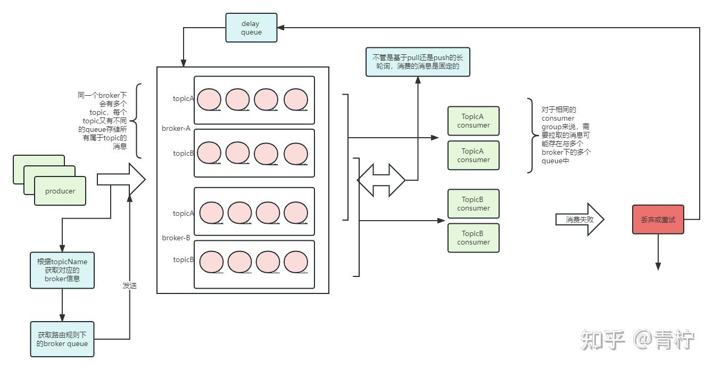
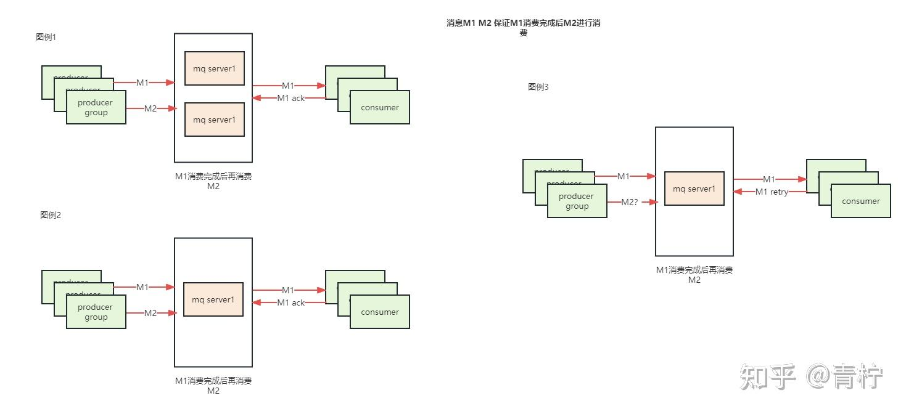
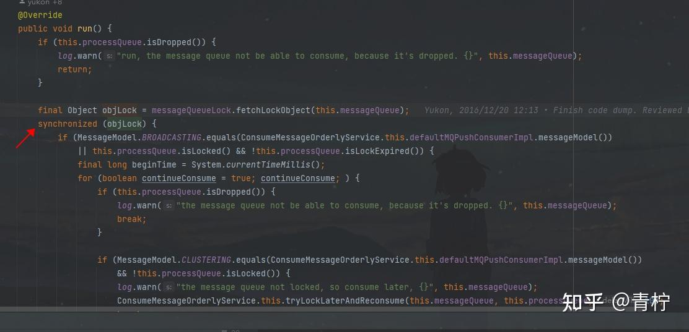
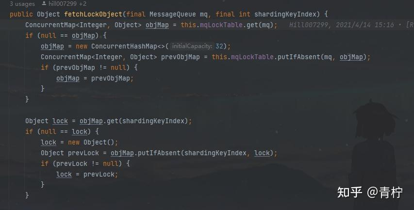
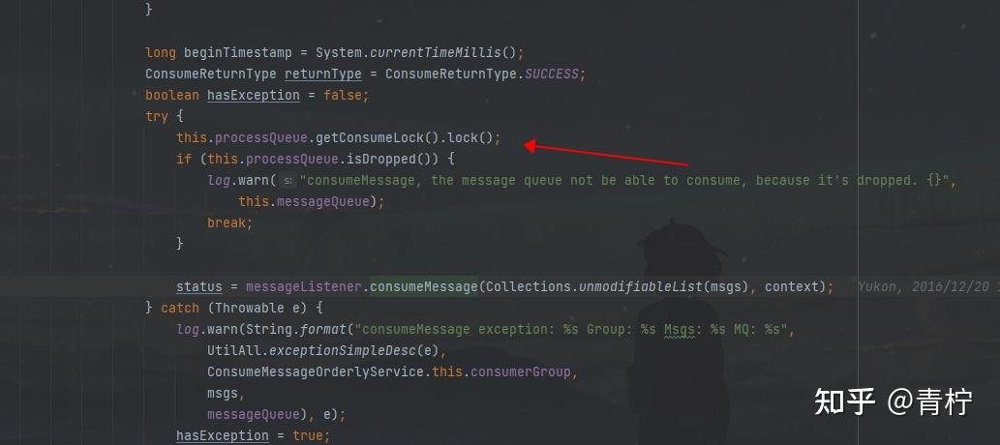

> Summary: The article explains that ordering should be scoped to the business key that needs it, not applied globally by default.

## Intended Reader

Engineers designing order-sensitive message flows.

## Why This Matters

Message queues decouple producers and consumers, but they also introduce delivery semantics, ordering constraints, persistence tradeoffs, and operational recovery work.

Message ordering is a constraint on concurrency. It should be preserved only where the business invariant requires serialized processing.

## Mental Model

A reliable RocketMQ design starts from the desired message semantics: loss prevention, duplicate handling, ordering, backlog recovery, and broker durability.

The practical way to read this article is to look for the boundary it clarifies: what state exists, who owns it, which operation changes it, and what evidence proves the system behaved as expected.

## Implementation Walkthrough

- Define the ordering scope first: global, topic-level, queue-level, or business-key-level.
- Route related messages to the same queue when they must be consumed in order.
- Use sequential consumption for that queue while keeping unrelated keys parallel when possible.
- Handle failure carefully because retry behavior can block later messages in the same ordered stream.

## Pitfalls and Tradeoffs

- Global ordering is simple conceptually but expensive operationally.
- Per-key ordering preserves more throughput but requires stable routing.
- Retry and poison messages are more disruptive in ordered flows.

## Verification Checklist

- Send messages for the same business key and verify processing order.
- Test failure of one message and observe later messages in the same queue.
- Monitor lag for ordered queues separately from normal queues.

## Practical Takeaways

- Message loss, duplication, and disorder are separate problems; each needs a different design response.
- Exactly-once is usually achieved at the business layer through idempotency and state checks, not by the queue alone.
- Ordering requires narrowing concurrency and queue assignment; it should be used only where business semantics require it.
- Backlog handling depends on consumer capacity, retry strategy, dead-letter queues, and visibility into lag.

## Visual Evidence

The migrated local images are preserved as supporting figures. They keep the English edition aligned with the same diagrams, screenshots, or console evidence used by the source article.







## Selected Technical Snippets

The following snippets are preserved only when they are safe to publish in English without broken encoding or translated identifiers.

```java
private final ConcurrentMap<String/* group */, ConcurrentHashMap<MessageQueue, LockEntry>> mqLockTable =
new ConcurrentHashMap<>(1024);
```

## Source Notes

- Topic: RocketMQ
- [Original source](https://zhuanlan.zhihu.com/p/675934781)
- Original publication date: 2024-01-03
- This English edition is localized from the migrated article metadata, source structure, technical terms, local assets, and clean implementation evidence.

## Closing Thoughts

The goal of this English edition is not to imitate the original wording sentence by sentence. It preserves the engineering argument, removes migration noise, and presents the article as a publishable technical note that future readers can use for design, debugging, or implementation review.
