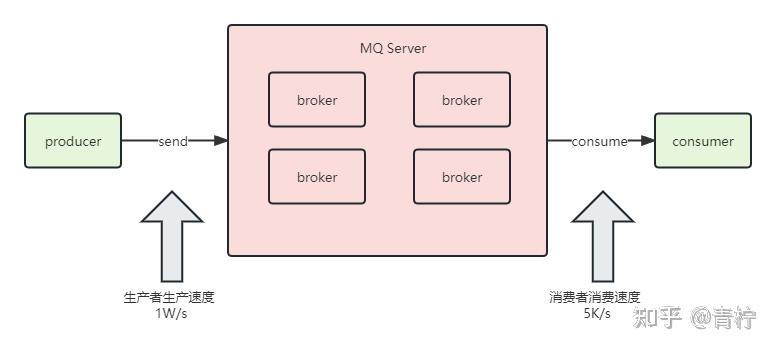
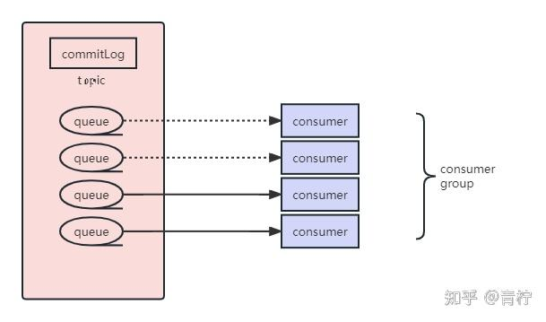

> Summary: The article explains backlog handling as a recovery problem: increase throughput without overwhelming downstream systems or creating duplicate failures.

## Intended Reader

Engineers operating RocketMQ consumers under traffic spikes or stalled processing.

## Why This Matters

Message queues decouple producers and consumers, but they also introduce delivery semantics, ordering constraints, persistence tradeoffs, and operational recovery work.

A backlog is a symptom. The fix depends on whether the bottleneck is consumer code, downstream dependency, broker pressure, retry storms, or insufficient parallelism.

## Mental Model

A reliable RocketMQ design starts from the desired message semantics: loss prevention, duplicate handling, ordering, backlog recovery, and broker durability.

The practical way to read this article is to look for the boundary it clarifies: what state exists, who owns it, which operation changes it, and what evidence proves the system behaved as expected.

## Implementation Walkthrough

- Measure lag, consume rate, retry count, and downstream latency before scaling.
- Identify whether consumers are slow, blocked, failing, or under-provisioned.
- Increase parallelism only when business ordering and downstream capacity allow it.
- Use temporary recovery consumers or batching carefully when backlog is large.

## Pitfalls and Tradeoffs

- Scaling consumers can reduce lag but can also overload databases or remote services.
- Skipping or dead-lettering messages may restore flow while requiring business compensation.
- Ordered queues make backlog recovery slower because concurrency is constrained.

## Verification Checklist

- Track lag reduction rate after each change.
- Watch downstream error rate while increasing consumption.
- Verify dead-letter and retry handling after recovery.

## Practical Takeaways

- Message loss, duplication, and disorder are separate problems; each needs a different design response.
- Exactly-once is usually achieved at the business layer through idempotency and state checks, not by the queue alone.
- Ordering requires narrowing concurrency and queue assignment; it should be used only where business semantics require it.
- Backlog handling depends on consumer capacity, retry strategy, dead-letter queues, and visibility into lag.

## Visual Evidence

The migrated local images are preserved as supporting figures. They keep the English edition aligned with the same diagrams, screenshots, or console evidence used by the source article.

## Source Notes

- Topic: RocketMQ
- [Original source](https://zhuanlan.zhihu.com/p/675935289)
- Original publication date: 2024-01-03
- This English edition is localized from the migrated article metadata, source structure, technical terms, local assets, and clean implementation evidence.

## Closing Thoughts

The goal of this English edition is not to imitate the original wording sentence by sentence. It preserves the engineering argument, removes migration noise, and presents the article as a publishable technical note that future readers can use for design, debugging, or implementation review.
