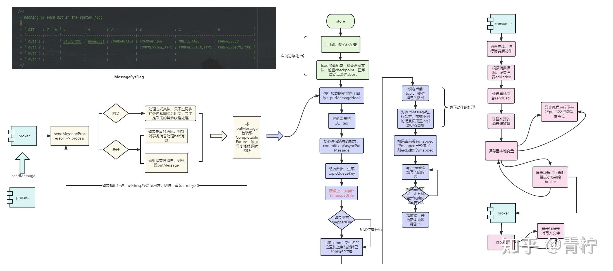
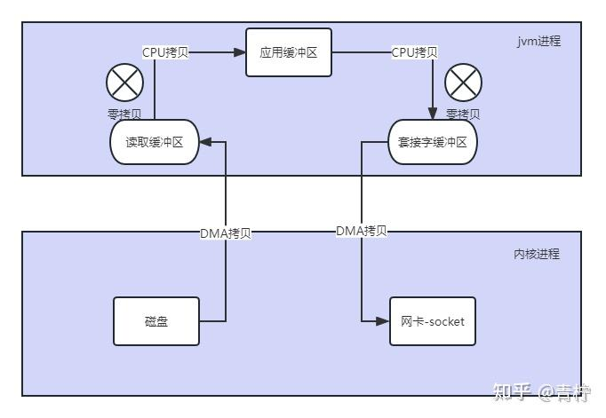
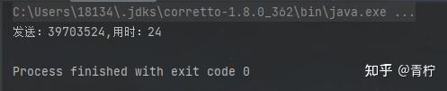

> Summary: The article studies how RocketMQ persists messages and how storage structures support writes, reads, and recovery.

## Intended Reader

Engineers interested in RocketMQ internals and durability behavior.

## Why This Matters

Message queues decouple producers and consumers, but they also introduce delivery semantics, ordering constraints, persistence tradeoffs, and operational recovery work.

RocketMQ durability depends on understanding the storage path: messages are appended, indexed, made consumable, and recovered through coordinated storage structures.

## Mental Model

A reliable RocketMQ design starts from the desired message semantics: loss prevention, duplicate handling, ordering, backlog recovery, and broker durability.

The practical way to read this article is to look for the boundary it clarifies: what state exists, who owns it, which operation changes it, and what evidence proves the system behaved as expected.

## Implementation Walkthrough

- Start with the store directory layout so each file type has a clear purpose.
- Follow the producer write path into CommitLog and related dispatch structures.
- Understand how ConsumeQueue and IndexFile support consumption and lookup.
- Connect flush strategy and recovery behavior to durability guarantees.

## Pitfalls and Tradeoffs

- Append-oriented storage improves throughput but requires careful indexing and recovery.
- Synchronous flush improves safety while reducing write throughput.
- Storage internals are useful for debugging but should not leak into normal business code.

## Verification Checklist

- Inspect store files in a local broker after sending messages.
- Restart the broker and verify message recovery.
- Measure write latency under different flush strategies if configuration changes are tested.

## Practical Takeaways

- Message loss, duplication, and disorder are separate problems; each needs a different design response.
- Exactly-once is usually achieved at the business layer through idempotency and state checks, not by the queue alone.
- Ordering requires narrowing concurrency and queue assignment; it should be used only where business semantics require it.
- Backlog handling depends on consumer capacity, retry strategy, dead-letter queues, and visibility into lag.

## Visual Evidence

The migrated local images are preserved as supporting figures. They keep the English edition aligned with the same diagrams, screenshots, or console evidence used by the source article.






## Selected Technical Snippets

The following snippets are preserved only when they are safe to publish in English without broken encoding or translated identifiers.

```java
/**
* Spin lock Implementation to put message, suggest using this with low race conditions
*/
public class PutMessageSpinLock implements PutMessageLock {
//true: Can lock, false : in lock.
private AtomicBoolean putMessageSpinLock = new AtomicBoolean(true);

@Override
public void lock() {
boolean flag;
do {
flag = this.putMessageSpinLock.compareAndSet(true, false);
}
while (!flag);
}

@Override
public void unlock() {
this.putMessageSpinLock.compareAndSet(false, true);
}
}
/**
* Exclusive lock implementation to put message
*/
public class PutMessageReentrantLock implements PutMessageLock {
private ReentrantLock putMessageNormalLock = new ReentrantLock(); // NonfairSync

@Override
public void lock() {
putMessageNormalLock.lock();
}

@Override
public void unlock() {
putMessageNormalLock.unlock();
}
}
```

```java
public void run() {
DefaultMessageStore.LOGGER.info(this.getServiceName() + " service started");

while (!this.isStopped()) {
try {
Thread.sleep(1);
this.doReput();
} catch (Exception e) {
DefaultMessageStore.LOGGER.warn(this.getServiceName() + " service has exception. ", e);
}
}

DefaultMessageStore.LOGGER.info(this.getServiceName() + " service end");
}
```

## Source Notes

- Topic: RocketMQ
- [Original source](https://zhuanlan.zhihu.com/p/675935650)
- Original publication date: 2024-01-03
- This English edition is localized from the migrated article metadata, source structure, technical terms, local assets, and clean implementation evidence.

## Closing Thoughts

The goal of this English edition is not to imitate the original wording sentence by sentence. It preserves the engineering argument, removes migration noise, and presents the article as a publishable technical note that future readers can use for design, debugging, or implementation review.
