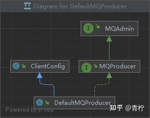
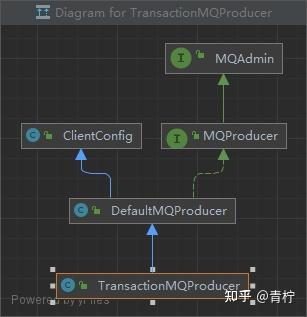

> Summary: The article follows the producer from configuration and startup to message sending and transaction message handling.

## Intended Reader

Engineers reading RocketMQ producer internals or debugging send behavior.

## Why This Matters

Message queues decouple producers and consumers, but they also introduce delivery semantics, ordering constraints, persistence tradeoffs, and operational recovery work.

Producer behavior shapes reliability before the message ever reaches the broker. Routing, send mode, retry strategy, and transaction handling all matter.

## Mental Model

A reliable RocketMQ design starts from the desired message semantics: loss prevention, duplicate handling, ordering, backlog recovery, and broker durability.

The practical way to read this article is to look for the boundary it clarifies: what state exists, who owns it, which operation changes it, and what evidence proves the system behaved as expected.

## Implementation Walkthrough

- Start with producer initialization and the responsibilities of DefaultMQProducer.
- Trace how routing information is discovered and used for message sending.
- Follow sendMessage behavior through validation, queue selection, broker interaction, and acknowledgement.
- Compare normal sending with transaction message flow and local transaction checks.

## Pitfalls and Tradeoffs

- Retry improves reliability but can create duplicate messages.
- Transaction messages improve business consistency but add state transitions and checkback complexity.
- Source analysis should be tied to observable producer logs and broker responses.

## Verification Checklist

- Test synchronous, asynchronous, and one-way sending if the article uses them.
- Simulate broker unavailability and observe retry behavior.
- Verify transaction message status transitions with controlled local transaction outcomes.

## Practical Takeaways

- Message loss, duplication, and disorder are separate problems; each needs a different design response.
- Exactly-once is usually achieved at the business layer through idempotency and state checks, not by the queue alone.
- Ordering requires narrowing concurrency and queue assignment; it should be used only where business semantics require it.
- Backlog handling depends on consumer capacity, retry strategy, dead-letter queues, and visibility into lag.

## Visual Evidence

The migrated local images are preserved as supporting figures. They keep the English edition aligned with the same diagrams, screenshots, or console evidence used by the source article.




## Selected Technical Snippets

The following snippets are preserved only when they are safe to publish in English without broken encoding or translated identifiers.

```java
/**
* The number of produced messages.
*/
public static final int MESSAGE_COUNT = 100;
public static final String PRODUCER_GROUP = "producer_test_group_hanxl";
public static final String DEFAULT_NAMESRVADDR = "127.0.0.1:9876";
public static final String TOPIC = "hanxl";
public static final String TAG = "hanxlTag";

public static void main(String[] args) throws MQClientException, InterruptedException {

/*
* Instantiate with a producer group name.
*/
DefaultMQProducer producer = new DefaultMQProducer(PRODUCER_GROUP);

/*
* Specify name server addresses.
*
* Alternatively, you may specify name server addresses via exporting environmental variable: NAMESRV_ADDR
* <pre>
* {@code
*  producer.setNamesrvAddr("name-server1-ip:9876;name-server2-ip:9876");
* }
* </pre>
*/
// Uncomment the following line while debugging, namesrvAddr should be set to your local address
producer.setNamesrvAddr(DEFAULT_NAMESRVADDR);

/*
* Launch the instance.
*/
producer.start();

for (int i = 0; i < MESSAGE_COUNT; i++) {
try {

/*
* Create a message instance, specifying topic, tag and message body.
*/
Message msg = new Message(TOPIC /* Topic */,
TAG /* Tag */,
("Hello RocketMQ " + i).getBytes(RemotingHelper.DEFAULT_CHARSET) /* Message body */
);

/*
* Call send message to deliver message to one of brokers.
*/
SendResult sendResult = producer.send(msg);
/*
* There are different ways to send message, if you don't care about the send result,you can use this way
* {@code
* producer.sendOneway(msg);
* }
* if you want to get the send result in a synchronize way, you can use this send method
* {@code
* SendResult sendResult = producer.send(msg);
* System.out.printf("%s%n", sendResult);
* }
*/

/*
* if you want to get the send result in a asynchronize way, you can use this send method
* {@code
*
*  producer.send(msg, new SendCallback() {
*  @Override
*  public void onSuccess(SendResult sendResult) {
*      // do something
*  }
*
*  @Override
*  public void onException(Throwable e) {
*      // do something
*  }
*});
*
*}
*/

System.out.printf("%s%n", sendResult);
} catch (Exception e) {
e.printStackTrace();
Thread.sleep(1000);
}
}

/*
* Shut down once the producer instance is no longer in use.
*/
producer.shutdown();
}
```

```java
public String buildMQClientId() {
StringBuilder sb = new StringBuilder();
sb.append(this.getClientIP());

sb.append("@");
sb.append(this.getInstanceName());
if (!UtilAll.isBlank(this.unitName)) {
sb.append("@");
sb.append(this.unitName);
}

if (enableStreamRequestType) {
sb.append("@");
sb.append(RequestType.STREAM);
}

return sb.toString();
}
```

```java
public synchronized boolean registerProducer(final String group, final DefaultMQProducerImpl producer) {
if (null == group || null == producer) {
return false;
}

MQProducerInner prev = this.producerTable.putIfAbsent(group, producer);
if (prev != null) {
log.warn("the producer group[{}] exist already.", group);
return false;
}

return true;
}
```

## Source Notes

- Topic: RocketMQ
- [Original source](https://zhuanlan.zhihu.com/p/675936893)
- Original publication date: 2024-01-03
- This English edition is localized from the migrated article metadata, source structure, technical terms, local assets, and clean implementation evidence.

## Closing Thoughts

The goal of this English edition is not to imitate the original wording sentence by sentence. It preserves the engineering argument, removes migration noise, and presents the article as a publishable technical note that future readers can use for design, debugging, or implementation review.
