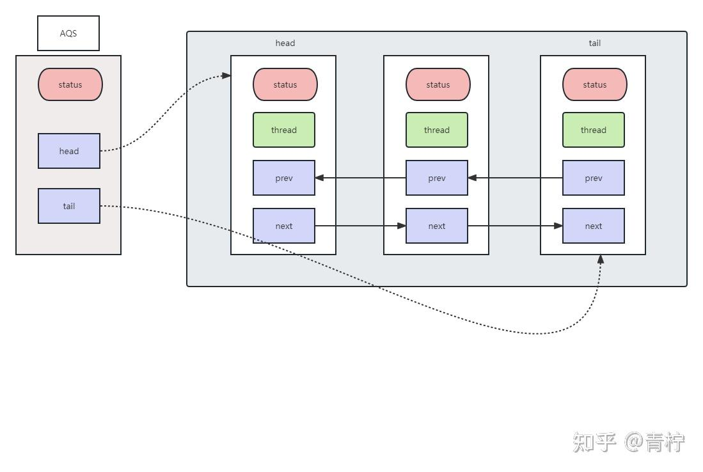
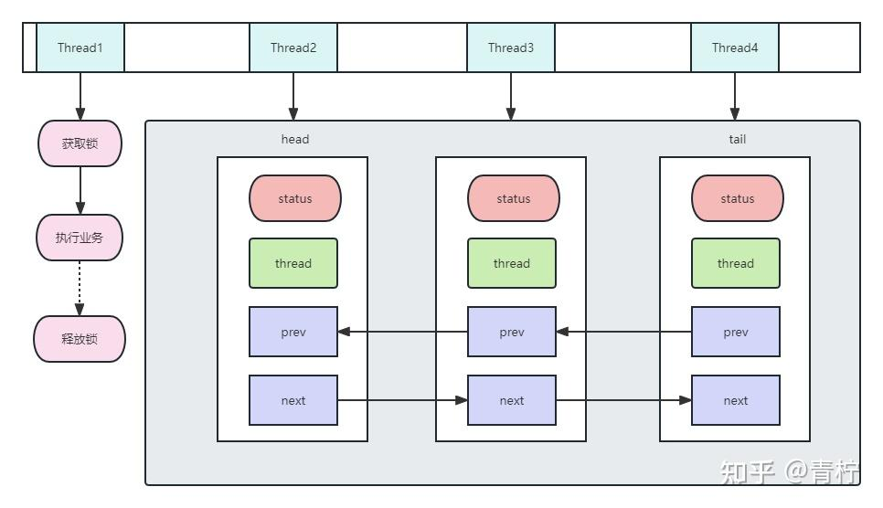
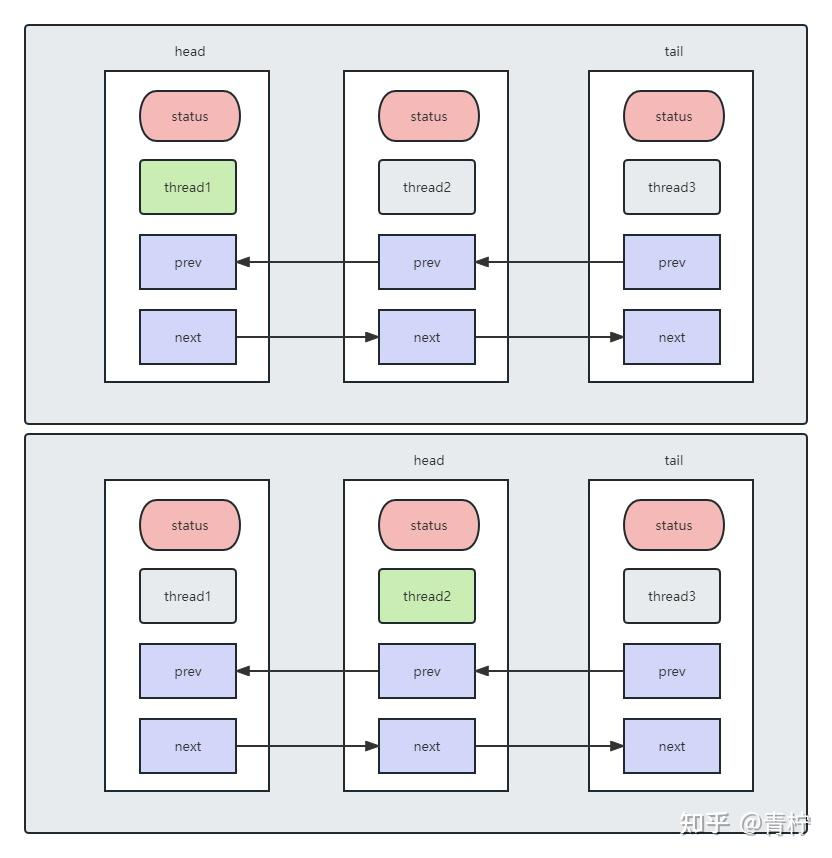
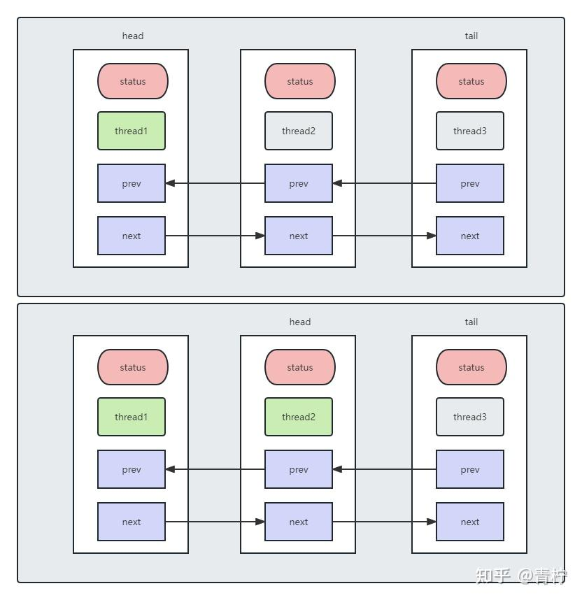
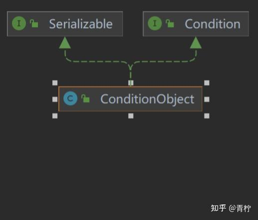
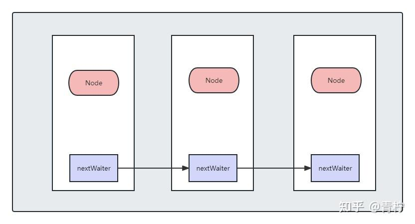

> *aqs，它是抽象队列同步器AbstractQueuedSynchronizer ，是juc包下的核心组件。*

## **关于aqs**

aqs，是AbstractQueuedSynchronizer 的简称，位于juc包下。在jdk1.5后，提供了针对并发处理的一些工具。

通过aqs，其实它提供了实现锁和线程同步机制的上层抽象能力，在aqs中通过volidate修饰的共享变量status状态、和一个队列模型，（FIFO先进先出）线程等待队列，主要处理在多线程竞争时阻塞。

我们通过源码来分析aqs的能力，默认以8版本为主：

```java
public abstract class AbstractQueuedSynchronizer
extends AbstractOwnableSynchronizer
implements java.io.Serializable {

private static final long serialVersionUID = 7373984972572414691L;

/**
* Creates a new {@code AbstractQueuedSynchronizer} instance
* with initial synchronization state of zero.
*/
protected AbstractQueuedSynchronizer() { }

static final class Node {
/** 共享节点的引用 */
static final Node SHARED = new Node();
/** 独占节点的引用 */
static final Node EXCLUSIVE = null;

/** cancelled 取消节点 */
static final int CANCELLED =  1;
/** signal 唤醒后续节点 */
static final int SIGNAL    = -1;
/** condition 等待节点 */
static final int CONDITION = -2;
/**
* 传播节点
*/
static final int PROPAGATE = -3;

/** CLH等待队列中的等待状态 */
volatile int waitStatus;

//当前node的上一个节点
volatile Node prev;

//当前node的下一个节点
volatile Node next;

//CLH中每个节点持有的thread
volatile Thread thread;

//如果是共享节点，就会持有它的引用，并且是SHARED？
Node nextWaiter;

//是否是共享节点
final boolean isShared() {
return nextWaiter == SHARED;
}

//获取上一个节点，上一个节点可能为空？
final Node predecessor() throws NullPointerException {
Node p = prev;
if (p == null)
throw new NullPointerException();
else
return p;
}

Node() {    // Used to establish initial head or SHARED marker
}

//node的构造
Node(Thread thread, Node mode) {     // Used by addWaiter
this.nextWaiter = mode;
this.thread = thread;
}

Node(Thread thread, int waitStatus) { // Used by Condition
this.waitStatus = waitStatus;
this.thread = thread;
}
}

//AQS中CLH的中的头节点
private transient volatile Node head;

//AQS中CLH的中的尾节点
private transient volatile Node tail;

//当前的同步状态
private volatile int state;

/**
* Returns the current value of synchronization state.
* This operation has memory semantics of a {@code volatile} read.
* @return current state value
*/
protected final int getState() {
return state;
}

/**
* Sets the value of synchronization state.
* This operation has memory semantics of a {@code volatile} write.
* @param newState the new state value
*/
protected final void setState(int newState) {
state = newState;
}

/**
* Atomically sets synchronization state to the given updated
* value if the current state value equals the expected value.
* This operation has memory semantics of a {@code volatile} read
* and write.
*
* @param expect the expected value
* @param update the new value
* @return {@code true} if successful. False return indicates that the actual
*         value was not equal to the expected value.
*/
protected final boolean compareAndSetState(int expect, int update) {
// See below for intrinsics setup to support this
return unsafe.compareAndSwapInt(this, stateOffset, expect, update);
}

//设置超时时间的锁定，最大时间，超时后进行休眠
static final long spinForTimeoutThreshold = 1000L;
```

那么，aqs的基本结构应该是这样的：



**AQS的实现内部依赖同步队列，可以理解成一个FIFO双向队列，其中队列的元素以Node形式体现，如果线程竞争锁失败，AQS将当前线程通过Node的构建加入到队列中，同时阻塞当前线程，当获取锁的线程释放锁时，会从队列中唤醒下一个符合条件的Node。这种结构的特点是FIFO双向链表，即当前节点包含上一个节点和下一个节点的指针，对于Node来说其实就是包装了Thread的节点信息。每个节点又包含了volidate的state状态量，对节点线程的操作其实也依赖了volidate的状态量。**

其中，state包含：

- CANCELLED ：节点取消运行，这种状态下上一个节点释放后不会唤醒当前节点，而是寻找下一个符合条件的节点，这种类型的节点也会通过补偿机制被移除
- SIGNAL ：当前节点释放后，唤醒next节点
- PROPAGATE ：独占锁中，表示当前传播状态
- CONDITION：处于等待状态
- 除此之外，还有不指定state默认为0，代表当前是初始化节点

同时，AQS提供了对state的操作的方法：

```java
protected final int getState() {
return state;
}

/**
* Sets the value of synchronization state.
* This operation has memory semantics of a {@code volatile} write.
* @param newState the new state value
*/
protected final void setState(int newState) {
state = newState;
}

/**
* Atomically sets synchronization state to the given updated
* value if the current state value equals the expected value.
* This operation has memory semantics of a {@code volatile} read
* and write.
*
* @param expect the expected value
* @param update the new value
* @return {@code true} if successful. False return indicates that the actual
*         value was not equal to the expected value.
*/
protected final boolean compareAndSetState(int expect, int update) {
// See below for intrinsics setup to support this
return unsafe.compareAndSwapInt(this, stateOffset, expect, update);
}
```

其中，在AQS中修改state的值，大多采用`compareAndSetWaitStatus，通过unsafe的native方法。unsafe这里不做过多描述。`

## **AQS的操作**

AQS的原理，可以理解为，将暂时无法请求到共享资源的线程封装成Node，将Node加入双向队列来实现分配锁。根据volidate，线程根据CAS去改变对应的状态，如果当前请求的资源空闲，则将当前线程操作共享资源并锁定；如果当前已经是锁定状态获取锁失败，就将请求分配到队列中阻塞，等待其他线程完成操作并释放锁，并通知后续节点进行操作。



例如上图中Thread，如果Thread1获取到锁进行操作，那么其余Thread就被封装成Node进行阻塞，等待Thread1操作完成释放锁并唤醒后续节点进行消费。

## **AQS的实现**

AbstractQueuedSynchronizer是整个同步机制的基类，如果需要实现同步，一般来说继承AbstractQueuedSynchronizer并重写对应的方法，例如tryAcquire、tryRelease等方法：

| tryAcquire(int) | 独占方式。尝试获取资源，成功则返回true，失败则返回false |
| --- | --- |
| tryRelease(int) | 独占方式。尝试释放资源，成功则返回true， 失败则返回false |
| tryAcquireShared(int) | 共享方式。尝试获取资源。负数表示失败；大于等于0表示成功，其中0表示没有剩余可用资源 |
| tryReleaseShared(int) | tryReleaseShared(int)：共享方式。尝试释放资源，如果释放后允许唤醒后续等待结点返回true，否则返回false |

那对于独占锁和共享锁，又有什么区别呢？

常见的AQS锁有：`ReentrantLock`、 `Semaphore`、 `CountDownLatch`、 `CyclicBarrier`、`ReentrantReadWritelock` 等；

独占锁：表示只有一个线程能操作共享资源，例如ReentrantLock

共享锁：多个线程可以同时操作一个共享资源，例如Semaphore，CountDownLatch，CyclicBarrier

独占+共享：ReentrantReadWritelock，又称为读写锁，读锁是共享锁，写锁是独占锁。

那么公平锁和非公平锁，又怎么理解呢？

公平锁：以队列线程的顺序保证，先入列的线程应该更先获取到锁

非公平锁：没有线程的顺序优先级，靠竞争获取锁

## **AQS源码解析**

### 独占锁的获取释放

```java
public final void acquire(int arg) {
if (!tryAcquire(arg) &&
acquireQueued(addWaiter(Node.EXCLUSIVE), arg))
selfInterrupt();
}
public final boolean release(int arg) {
if (tryRelease(arg)) {
Node h = head;
if (h != null && h.waitStatus != 0)
unparkSuccessor(h);
return true;
}
return false;
}
```

首先 tryAcquire和 tryRelease都是模板方法，需要实现AQS的类去具体实现

针对获取锁的方法，如果tryAcquire获取锁成功了，那么就直接返回了，如果获取失败了，就要加入双端阻塞队列，然后通过 acquireQueued自旋。

```java
private Node addWaiter(Node mode) {　　　　 //通过构造包装当前Node
Node node = new Node(Thread.currentThread(), mode);
// Try the fast path of enq; backup to full enq on failure
Node pred = tail;
if (pred != null) {
node.prev = pred;
if (compareAndSetTail(pred, node)) {
pred.next = node;
return node;
}
}
enq(node);
return node;
}

```

首先，addWaiter将当前节点包装成Node，然后将它放在tail的尾部，然后通过自旋入队；如果tail是空的，比如第一个节点，就通过enq的方式入队

```java
private Node enq(final Node node) {
for (;;) {
Node t = tail;
if (t == null) { // Must initialize
if (compareAndSetHead(new Node()))
tail = head;
} else {
node.prev = t;
if (compareAndSetTail(t, node)) {
t.next = node;
return t;
}
}
}
}
```

enq的方式，就是通过自旋的方式入队。

```java
final boolean acquireQueued(final Node node, int arg) {　　　　　
boolean failed = true;
try {　　　　　　　//是否中断
boolean interrupted = false;　　　　　　　//自旋
for (;;) {　　　　　　　　　　//获取node的上一个节点
final Node p = node.predecessor();　　　　　　　　　　//上一节点必须是头节点并获取锁成功
if (p == head && tryAcquire(arg)) {
setHead(node);
p.next = null; // help GC
failed = false;
return interrupted;
}　　　　　　　　　　//中断
if (shouldParkAfterFailedAcquire(p, node) &&
parkAndCheckInterrupt())
interrupted = true;
}
} finally {
if (failed)
cancelAcquire(node);
}
}
```

acquireQueued 也是自旋设置header，首先自旋获取上一个node，如果这个node是头节点才有资格获取独占锁，并等待前一个节点状态为SIGNAL，并且tryAcquire成功，否则将当前线程休眠，等待release唤醒。

如果当前节点处理成功，那么当前的node就会被设置为header，共享锁的获取，需要依赖前一个节点的状态推动。只有当前一个节点处于SIGNAL并且是head的时候当前节点才有机会被处理。

```java
private static boolean shouldParkAfterFailedAcquire(Node pred, Node node) {
/** 获取上一个节点的状态，如果是SIGNAL，那么直接返回等待被唤醒*/
int ws = pred.waitStatus;
if (ws == Node.SIGNAL)
/*
* 等待被唤醒
*/
return true;
if (ws > 0) {
/*
如果大于0 那么只能是CANCELLED 那么就要将node之前所有CANCELLED都移除
*/
do {
node.prev = pred = pred.prev;
} while (pred.waitStatus > 0);
pred.next = node;
} else {
/*
将前一个node状态改为SIGNAL
*/
compareAndSetWaitStatus(pred, ws, Node.SIGNAL);
}
return false;
}
```

根据上一个节点的状态，处理。如果上一个节点处于SIGNAL，那么就阻塞等待，如果上一个节点已经被取消，那么清除不需要的Node并将当前Node指向上一节点的prev

```java
private final boolean parkAndCheckInterrupt() {
LockSupport.park(this);
return Thread.interrupted();
}
```

如果上一节点是SIGNAL，那么让当前节点休眠，等待被唤醒后执行return。

```java
public final boolean release(int arg) {
if (tryRelease(arg)) {
Node h = head;
if (h != null && h.waitStatus != 0)
unparkSuccessor(h);
return true;
}
return false;
}
```

释放的流程可以看出，首先通过 tryRelease模板方法，然后根据head节点

只有当head不为空，并且head不是初始状态时才会释放。

```java
private void unparkSuccessor(Node node) {
/*
根据head节点状态
*/
int ws = node.waitStatus;
if (ws < 0)
//小于0 可能为SIGNAL， PROPAGATE 那么就直接设置为初始状态
compareAndSetWaitStatus(node, ws, 0);

/*
获取head的下一个节点.
*/
Node s = node.next;
//如果下一节点时空或者已经被取消
if (s == null || s.waitStatus > 0) {
s = null;
//这里是从 tail 尾部开始找的 ？
for (Node t = tail; t != null && t != node; t = t.prev)
//找到最靠后的状态小于0 的节点
if (t.waitStatus <= 0)
s = t;
}
if (s != null)
//唤醒线程
LockSupport.unpark(s.thread);
}
```

释放，就是先通过 release尝试，如果成功并且head可用，就找到符合条件的当前节点的后面一个节点进行唤醒。



例如现在有三个Thread，首先Thread1通过tryAcquire成功，并且获取锁运行，Thread2和3就包装成了Node入队。同时，通过shouldParkAfterFailedAcquire调整状态、修改为SIGNAL；

如果Thread1通过release，这时如果Thread2也通过tryAcquire成功，并且它的上一节点是header，那么Thread2也会被运行，同时Thread2成为了新的header；Thread1的status就会变为0；

如果Thread2也进行release，那么接下来就应该是Thread3 tryAcquire。如果Thread3被取消了，那么就会从后面选择一个新的Node并清除取消的节点。

### 共享锁的获取释放

```java
public final void acquireShared(int arg) {
if (tryAcquireShared(arg) < 0)
doAcquireShared(arg);
}
```

根据 tryAcquireShared子类对应的实现，这里返回的应该是可用的资源数。实际获取在 doAcquireShared中。

```java
private void doAcquireSharedInterruptibly(int arg)
throws InterruptedException {
//包装成SHARED节点的Node
final Node node = addWaiter(Node.SHARED);
boolean failed = true;
try {
for (;;) {
//根据上一节点处理
final Node p = node.predecessor();
if (p == head) {
int r = tryAcquireShared(arg);
if (r >= 0) {
setHeadAndPropagate(node, r);
p.next = null; // help GC
failed = false;
return;
}
}
if (shouldParkAfterFailedAcquire(p, node) &&
parkAndCheckInterrupt())
throw new InterruptedException();
}
} finally {
if (failed)
cancelAcquire(node);
}
}
```

首先获取的上一节点是否是头节点，只有前置节点是头节点才能做后续的处理。如果可用资源r > 0，那么才会设置为header并且唤醒，如果r = 0那不会唤醒其他节点。

独占锁这里，只是设置了head，没有唤醒的操作。

共享锁这里，可能会唤醒多个线程，这里取决于可用资源的数量。

如果它的前置节点不是head，与独占锁同理，线程休眠。

```java
private void setHeadAndPropagate(Node node, int propagate) {
Node h = head; // Record old head for check below
//设置node为head
setHead(node);

//如果可用资源大于0 或者头节点状态是SIGNAL，PROPAGATE 或者头节点是初始化的
if (propagate > 0 || h == null || h.waitStatus < 0 ||
(h = head) == null || h.waitStatus < 0) {
Node s = node.next;

//如果是共享节点 或者 当前节点是最后一个节点了 那就释放
if (s == null || s.isShared())
doReleaseShared();
}
}

```

那么，如果说可用资源不够了，< 0 ， 那么就需要等待，先将Node添加到对应的队列中，当自己被唤醒的时候，再去唤醒后面的节点进行竞争，一直到没有可以再分配的资源，循环往复。



这时，如果Thread1先获取到资源，并且会把当前资源设置为head，并且当前状态会变为SIGNAL。如果这时还有空闲资源，即propagate>0，Thread1会尝试唤醒Thread2，Thread2被正常唤醒后，则尝试唤醒Thread3。

### 共享锁释放

```java
private void doReleaseShared() {

for (;;) {
//找到对应的头节点
Node h = head;
if (h != null && h != tail) {
int ws = h.waitStatus;
if (ws == Node.SIGNAL) {
//如果是SIGNAL 说明可以唤醒后续节点
if (!compareAndSetWaitStatus(h, Node.SIGNAL, 0))
continue;            // loop to recheck cases
//唤醒后续节点
unparkSuccessor(h);
}
else if (ws == 0 &&
!compareAndSetWaitStatus(h, 0, Node.PROPAGATE))
continue;                // loop on failed CAS
}
if (h == head)                   // loop if head changed
break;
}
}
```

共享锁释放，主要考虑的是释放唤醒其他线程竞争设置head节点，会释放最新的head后继节点。

### 取消竞争

不管哪种锁，都会在自旋竞争中失败，对于处理失败的节点，需要取消竞争

```java
private void cancelAcquire(Node node) {
// 如果当前节点已经不存在了，那就没有处理它的意义了
if (node == null)
return;

node.thread = null;

// 将已经取消的节点移除， state>0说明是一个被取消的节点 那么让当前节点直接连接到上一个可用的节点
Node pred = node.prev;
while (pred.waitStatus > 0)
node.prev = pred = pred.prev;

// predNext is the apparent node to unsplice. CASes below will
// fail if not, in which case, we lost race vs another cancel
// or signal, so no further action is necessary.
Node predNext = pred.next;

//将当前状态设置为取消
node.waitStatus = Node.CANCELLED;

//如果当前节点已经是tail了 那么说明它就是最后的一个节点了，那么就将它的上一个节点设置为最后一个tail
if (node == tail && compareAndSetTail(node, pred)) {
compareAndSetNext(pred, predNext, null);
} else {
// If successor needs signal, try to set pred's next-link
// so it will get one. Otherwise wake it up to propagate.
int ws;
//如果前置节点不是头节点，并且前置状态为SIGNAL或者可以修改为SIGNAL， 就移除node，并设置前置节点状态为SIGNAL
if (pred != head &&
((ws = pred.waitStatus) == Node.SIGNAL ||
(ws <= 0 && compareAndSetWaitStatus(pred, ws, Node.SIGNAL))) &&
pred.thread != null) {
Node next = node.next;
if (next != null && next.waitStatus <= 0)
compareAndSetNext(pred, predNext, next);
} else {
//唤醒node的下一个可用的节点
unparkSuccessor(node);
}

node.next = node; // help GC
}
}
```

其实它的处理流程是：

1. 取消当前节点的状态；
2. 将当前取消的节点的前后符合条件的节点连接起来；
3. 如果前置节点释放锁，那么同时唤醒后续节点；

## 响应中断

### 独占锁中断

```java
public final void acquireInterruptibly(int arg)
throws InterruptedException {
if (Thread.interrupted())
throw new InterruptedException();
if (!tryAcquire(arg))
doAcquireInterruptibly(arg);
}
private void doAcquireInterruptibly(int arg)
throws InterruptedException {
final Node node = addWaiter(Node.EXCLUSIVE);
boolean failed = true;
try {
for (;;) {
final Node p = node.predecessor();
if (p == head && tryAcquire(arg)) {
setHead(node);
p.next = null; // help GC
failed = false;
return;
}
if (shouldParkAfterFailedAcquire(p, node) &&
parkAndCheckInterrupt())
throw new InterruptedException();
}
} finally {
if (failed)
cancelAcquire(node);
}
}
```

可以看到，中断的逻辑主要是处理了中断异常，其中共享锁的处理方式也类似

```java
public final void acquireSharedInterruptibly(int arg)
throws InterruptedException {
if (Thread.interrupted())
throw new InterruptedException();
if (tryAcquireShared(arg) < 0)
doAcquireSharedInterruptibly(arg);
}
private void doAcquireSharedInterruptibly(int arg)
throws InterruptedException {
final Node node = addWaiter(Node.SHARED);
boolean failed = true;
try {
for (;;) {
final Node p = node.predecessor();
if (p == head) {
int r = tryAcquireShared(arg);
if (r >= 0) {
setHeadAndPropagate(node, r);
p.next = null; // help GC
failed = false;
return;
}
}
if (shouldParkAfterFailedAcquire(p, node) &&
parkAndCheckInterrupt())
throw new InterruptedException();
}
} finally {
if (failed)
cancelAcquire(node);
}
}
```

### 锁超时处理

acquire在处理竞争时，会一直阻塞等待，AQS提供了获取锁超时的机制：超过最大时间后直接失败，不参与竞争。

```java
public final boolean tryAcquireSharedNanos(int arg, long nanosTimeout)
throws InterruptedException {
//处理中断状态
if (Thread.interrupted())
throw new InterruptedException();
//竞争下处理
return tryAcquireShared(arg) >= 0 ||
doAcquireSharedNanos(arg, nanosTimeout);
}

public final void acquireInterruptibly(int arg)
throws InterruptedException {
if (Thread.interrupted())
throw new InterruptedException();
if (!tryAcquire(arg))
doAcquireInterruptibly(arg);
}
private boolean doAcquireNanos(int arg, long nanosTimeout)
throws InterruptedException {
//如果没有设置超时时间，放弃获取锁
if (nanosTimeout <= 0L)
return false;
//计算超时时间
final long deadline = System.nanoTime() + nanosTimeout;
//同时将node入队
final Node node = addWaiter(Node.EXCLUSIVE);
boolean failed = true;
try {
for (;;) {
final Node p = node.predecessor();
if (p == head && tryAcquire(arg)) {
setHead(node);
p.next = null; // help GC
failed = false;
return true;
}
//计算时间是否超时，如果超过了就放弃
nanosTimeout = deadline - System.nanoTime();
if (nanosTimeout <= 0L)
return false;
//当前程应该被休眠并且时间应该大于指定的时间时，设置时间的park
if (shouldParkAfterFailedAcquire(p, node) &&
nanosTimeout > spinForTimeoutThreshold)
LockSupport.parkNanos(this, nanosTimeout);
if (Thread.interrupted())
throw new InterruptedException();
}
} finally {
if (failed)
cancelAcquire(node);
}
}

private boolean doAcquireSharedNanos(int arg, long nanosTimeout)
throws InterruptedException {
if (nanosTimeout <= 0L)
return false;
final long deadline = System.nanoTime() + nanosTimeout;
final Node node = addWaiter(Node.SHARED);
boolean failed = true;
try {
for (;;) {
final Node p = node.predecessor();
if (p == head) {
int r = tryAcquireShared(arg);
if (r >= 0) {
setHeadAndPropagate(node, r);
p.next = null; // help GC
failed = false;
return true;
}
}
nanosTimeout = deadline - System.nanoTime();
if (nanosTimeout <= 0L)
return false;
if (shouldParkAfterFailedAcquire(p, node) &&
nanosTimeout > spinForTimeoutThreshold)
LockSupport.parkNanos(this, nanosTimeout);
if (Thread.interrupted())
throw new InterruptedException();
}
} finally {
if (failed)
cancelAcquire(node);
}
}
```

## **等待队列**

ConditionObject作为AQS下的一个内部类，通过Node的格式定义了一个单向队列，并且它实现了Condition， 实现了线程通信的wait和signal

```java
public class ConditionObject implements Condition, java.io.Serializable {
private static final long serialVersionUID = 1173984872572414699L;
/** First node of condition queue. */
private transient Node firstWaiter;
/** Last node of condition queue. */
private transient Node lastWaiter;

//等待队列是一个单向队列，内部维护了队列的首节点和尾节点
//

/**
* Creates a new {@code ConditionObject} instance.
*/
public ConditionObject() { }
}

```





其中，每个节点还是对应的Node节点，只是根据Node中的nextWaiter进行连接、每个Node上还是有一个waitStatus。在 ConditionObject中的state的范围：

- CONDITION ：等待中
- CANCELLED ：取消
- SIGNAL ：加入阻塞队列
- REINTERRUPT ：返回不抛出异常
- THROW_IE：抛出中断异常

```java
/** Mode meaning to reinterrupt on exit from wait */
private static final int REINTERRUPT =  1;
/** Mode meaning to throw InterruptedException on exit from wait */
private static final int THROW_IE    = -1;

public final void await() throws InterruptedException {
//中断线程
if (Thread.interrupted())
throw new InterruptedException();
//添加到Condition
Node node =    addConditionWaiter();
//释放资源
long savedState    = fullyRelease(node);
int    interruptMode =    0;
//节点不在阻塞队列
while (!isOnSyncQueue(node)) {
LockSupport.park(this);
//节点加入同步队列后退出循环
if ((interruptMode = checkInterruptWhileWaiting(node)) != 0)
break;
}
if (acquireQueued(node,    savedState)    && interruptMode !=    THROW_IE)
interruptMode =    REINTERRUPT;
if (node.nextWaiter    != null) //    clean up if    cancelled
unlinkCancelledWaiters();
if (interruptMode != 0)
reportInterruptAfterWait(interruptMode);
}

//首先加入节点
private Node addConditionWaiter() {
Node t = lastWaiter;
// 如果最后一个节点不是空且不是CONDITION状态
if (t != null && t.waitStatus != Node.CONDITION) {
//取消链接
unlinkCancelledWaiters();
t = lastWaiter;
}
//创建一个新的节点
Node node = new Node(Thread.currentThread(), Node.CONDITION);
if (t == null)
//t为空说明目前还没有last，将node设置为头？初始化？否则就放在队尾去
firstWaiter = node;
else
t.nextWaiter = node;
//队尾指向node
lastWaiter = node;
return node;
}

final long fullyRelease(Node node) {
boolean failed = true;
try {
long savedState = getState();
//这里认为它就处于 head节点 就进行释放
if (release(savedState)) {
failed = false;
return savedState;
} else {
throw new IllegalMonitorStateException();
}
} finally {
//如果释放失败 那么将节点状态设置为CANCELLED
if (failed)
node.waitStatus = Node.CANCELLED;
}
}

//是否是在同步队列中
final boolean isOnSyncQueue(Node node) {
if (node.waitStatus == Node.CONDITION || node.prev == null)
return false;
if (node.next != null) // If has successor, it must be on queue
return true;
/*
* node.prev can be non-null, but not yet on queue because
* the CAS to place it on queue can fail. So we have to
* traverse from tail to make sure it actually made it.  It
* will always be near the tail in calls to this method, and
* unless the CAS failed (which is unlikely), it will be
* there, so we hardly ever traverse much.
*/
return findNodeFromTail(node);
}

//依次查找 找到了就返回
private boolean findNodeFromTail(Node node) {
Node t = tail;
for (;;) {
if (t == node)
return true;
if (t == null)
return false;
t = t.prev;
}
}

private int checkInterruptWhileWaiting(Node node) {
return Thread.interrupted() ?
(transferAfterCancelledWait(node) ? THROW_IE : REINTERRUPT) :
0;
}

private void reportInterruptAfterWait(int interruptMode)
throws InterruptedException {
if (interruptMode == THROW_IE)
throw new InterruptedException();
else if (interruptMode == REINTERRUPT)
selfInterrupt();
}

final boolean transferAfterCancelledWait(Node node) {
if (compareAndSetWaitStatus(node, Node.CONDITION, 0)) {
enq(node);
return true;
}
/*
* If we lost out to a signal(), then we can't proceed
* until it finishes its enq().  Cancelling during an
* incomplete transfer is both rare and transient, so just
* spin.
*/
while (!isOnSyncQueue(node))
Thread.yield();
return false;
}
```

针对 await其实是在多个Thread调用后创建 addConditionWaiter加入队列，同时释放持有的资源，即先放弃资源后再进行等待。**如何同步到AQS？如何唤醒？**

再await的while中，如果它不在同步队列中，就要阻塞直到它被唤醒、再加入同步队列

### 唤醒

```java
public final void signal() {
if (!isHeldExclusively())
throw new IllegalMonitorStateException();

//获取第一个Node
Node first = firstWaiter;
if (first != null)
//唤醒
doSignal(first);
}

private void doSignal(Node first) {
do {
//first之后还有节点吗 如果没有了就把last设置为空
if ( (firstWaiter = first.nextWaiter) == null)
lastWaiter = null;
//取消first的指针
first.nextWaiter = null;
} while (!transferForSignal(first) &&
(first = firstWaiter) != null);
}

//
final boolean transferForSignal(Node node) {
/*
* If cannot change waitStatus, the node has been cancelled.
*/
//先将节点从CONDITION状态改变为0 如果失败可能是节点已经被取消
if (!compareAndSetWaitStatus(node, Node.CONDITION, 0))
return false;

//自旋加入阻塞队列
Node p = enq(node);
int ws = p.waitStatus;
//如果上一个节点已经取消或者被唤醒了 那就尝试把当前节点也唤醒
if (ws > 0 || !compareAndSetWaitStatus(p, ws, Node.SIGNAL))
LockSupport.unpark(node.thread);
return true;
}
```

这里唤醒其实就是把Condition的最近的一个休眠的节点加入阻塞队列，并且唤醒竞争

```java
public final void signalAll() {
if (!isHeldExclusively())
throw new IllegalMonitorStateException();
Node first = firstWaiter;
if (first != null)
doSignalAll(first);
}

private void doSignalAll(Node first) {
lastWaiter = firstWaiter = null;
//这里跟单独的节点不一样的是 这里会依次找到所有的节点 从first一直找到last
do {
Node next = first.nextWaiter;
first.nextWaiter = null;
transferForSignal(first);
first = next;
} while (first != null);
}
```
