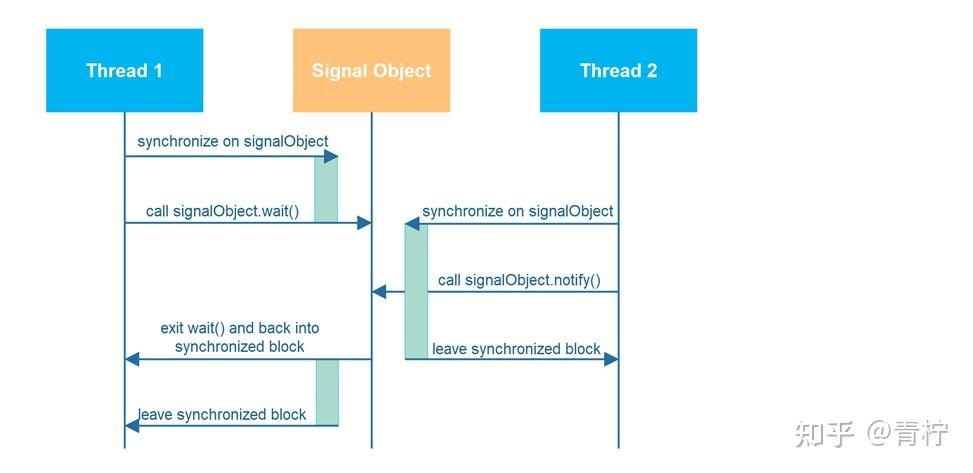
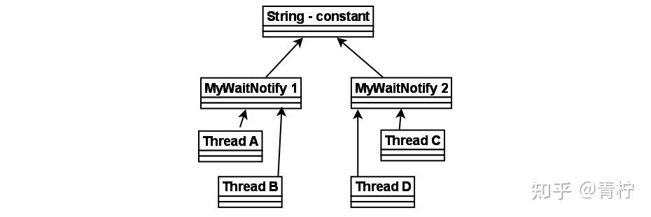
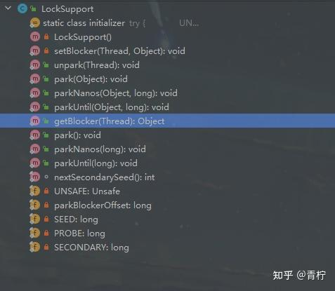

> Summary: The article explains LockSupport as a permit-based blocking primitive and contrasts it with fragile wait/notify patterns.

## Intended Reader

Java developers learning low-level blocking and wake-up semantics.

## Why This Matters

Java concurrency is where language semantics, JVM memory visibility, OS scheduling, and data-structure design meet. Small misunderstandings often become production-only bugs.

LockSupport is easier to compose than raw wait/notify because it uses permits, but correct blocking still requires explicit state checks.

## Mental Model

Think in terms of state ownership, visibility, ordering, blocking, and wake-up semantics. APIs such as AQS, CAS, LockSupport, volatile, and ThreadLocal are tools for shaping those guarantees.

The practical way to read this article is to look for the boundary it clarifies: what state exists, who owns it, which operation changes it, and what evidence proves the system behaved as expected.

## Implementation Walkthrough

- Start with the signal problem: a waiting thread needs a reliable condition and a wake-up mechanism.
- Explain lost signals and why state must be checked around blocking operations.
- Compare wait/notify pitfalls with LockSupport park and unpark.
- Relate LockSupport to higher-level synchronizers such as AQS.

## Pitfalls and Tradeoffs

- LockSupport avoids some wait/notify ordering problems but does not replace condition design.
- Spurious wakeups still require loops around blocking conditions.
- Parking threads directly should be reserved for infrastructure code.

## Verification Checklist

- Test unpark-before-park behavior.
- Test interruption while parked.
- Always pair blocking with a visible state condition.

## Practical Takeaways

- Distinguish atomicity, visibility, and ordering; they solve different classes of concurrency bugs.
- Do not treat locks as a single concept. Lock acquisition, queueing, parking, interruption, and fairness all affect behavior.
- Use low-level primitives only when the higher-level abstraction cannot express the requirement clearly.
- Concurrency bugs need evidence: thread dumps, state transitions, queue length, contention, and timeout signals.

## Visual Evidence

The migrated local images are preserved as supporting figures. They keep the English edition aligned with the same diagrams, screenshots, or console evidence used by the source article.





## Selected Technical Snippets

The following snippets are preserved only when they are safe to publish in English without broken encoding or translated identifiers.

```java
public class MonitorObject{
}

public class MyWaitNotify{

MonitorObject myMonitorObject = new MonitorObject();

public void doWait(){
synchronized(myMonitorObject){
try{
myMonitorObject.wait();
} catch(InterruptedException e){...}
}
}

public void doNotify(){
synchronized(myMonitorObject){
myMonitorObject.notify();
}
}
}
```

```java
public class MyWaitNotify2{

MonitorObject myMonitorObject = new MonitorObject();
boolean wasSignalled = false;

public void doWait(){
synchronized(myMonitorObject){
if(!wasSignalled){
try{
myMonitorObject.wait();
} catch(InterruptedException e){...}
}
//clear signal and continue running.
wasSignalled = false;
}
}

public void doNotify(){
synchronized(myMonitorObject){
wasSignalled = true;
myMonitorObject.notify();
}
}
}
```

```java
public class MyWaitNotify3{

MonitorObject myMonitorObject = new MonitorObject();
boolean wasSignalled = false;

public void doWait(){
synchronized(myMonitorObject){
while(!wasSignalled){
try{
myMonitorObject.wait();
} catch(InterruptedException e){...}
}
//clear signal and continue running.
wasSignalled = false;
}
}

public void doNotify(){
synchronized(myMonitorObject){
wasSignalled = true;
myMonitorObject.notify();
}
}
}
```

## Source Notes

- Topic: JUC
- [Original source](https://zhuanlan.zhihu.com/p/675939389)
- Original publication date: 2024-01-03
- This English edition is localized from the migrated article metadata, source structure, technical terms, local assets, and clean implementation evidence.

## Closing Thoughts

The goal of this English edition is not to imitate the original wording sentence by sentence. It preserves the engineering argument, removes migration noise, and presents the article as a publishable technical note that future readers can use for design, debugging, or implementation review.
