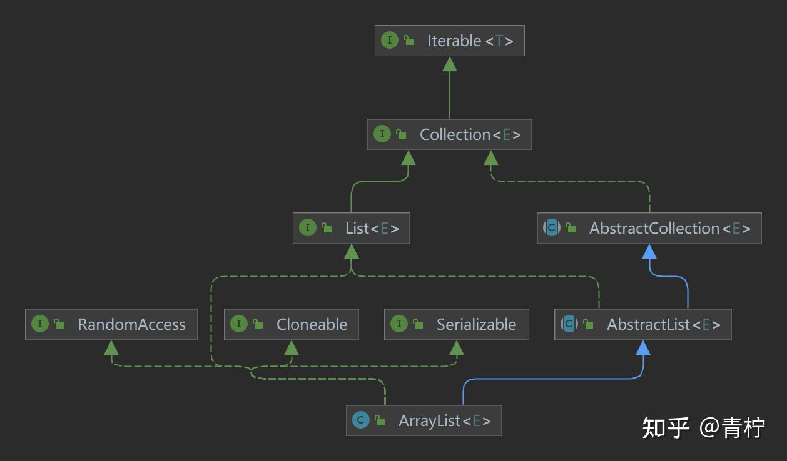
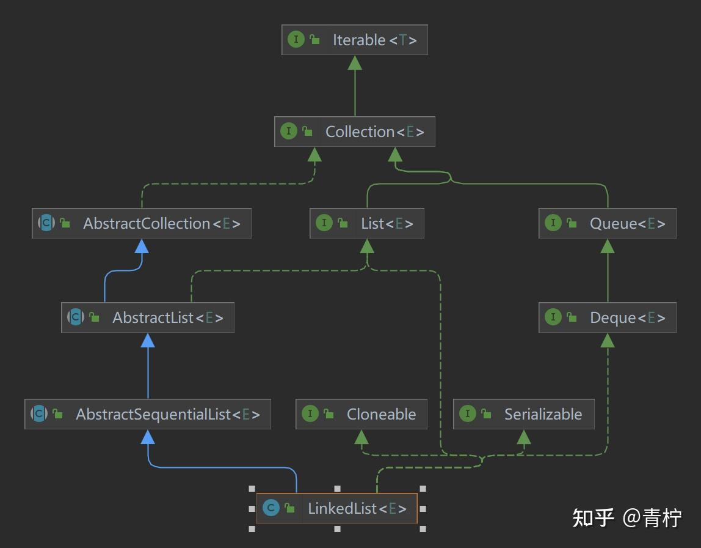
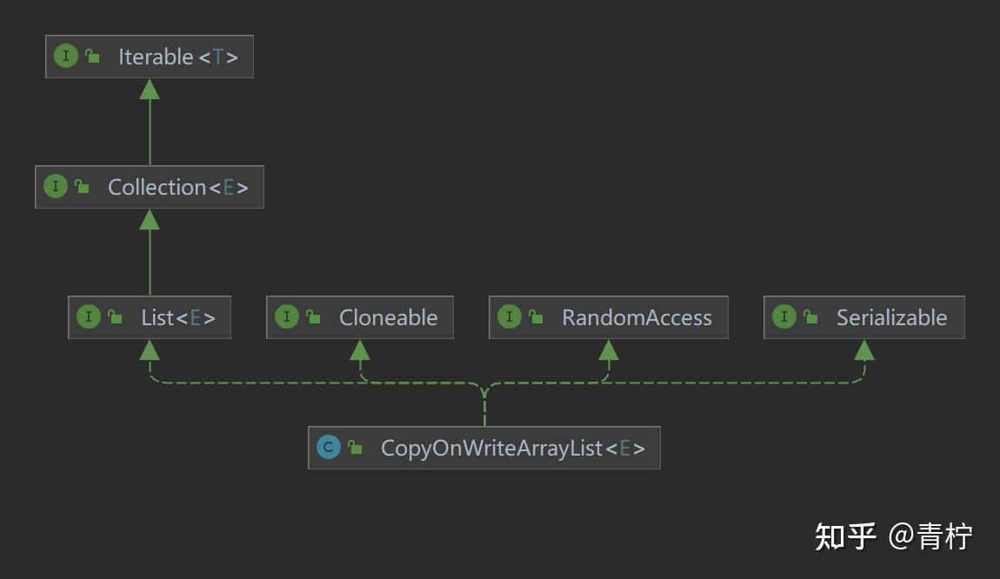

> Summary: The article explains why List implementations have different performance and concurrency behavior even when their API looks similar.

## Intended Reader

Java developers choosing collection implementations in service code.

## Why This Matters

JDK collection types look simple at the API level, but their behavior depends on data structures, resizing, iteration, hashing, and concurrency assumptions.

Choose a List implementation by workload shape: random access, insertion pattern, iteration frequency, mutation frequency, and concurrency assumptions.

## Mental Model

Choose collections by access pattern and mutation pattern, not by habit.

The practical way to read this article is to look for the boundary it clarifies: what state exists, who owns it, which operation changes it, and what evidence proves the system behaved as expected.

## Implementation Walkthrough

- Use ArrayList when indexed access and append-heavy workloads dominate.
- Use LinkedList only when its node-based behavior actually matches the operation pattern.
- Use CopyOnWriteArrayList for read-heavy concurrent scenarios with rare writes.
- Consider resizing, memory overhead, iterator behavior, and thread safety before choosing.

## Pitfalls and Tradeoffs

- ArrayList is usually cache-friendly but resizing and shifting can matter.
- LinkedList has pointer overhead and poor locality despite cheap node insertion in theory.
- CopyOnWriteArrayList makes reads simple but writes are expensive.

## Verification Checklist

- Benchmark representative read and write ratios.
- Check whether iteration or random access dominates.
- Avoid assuming List implementations are thread-safe.

## Practical Takeaways

- List and Map implementations optimize different operations; the wrong choice can quietly become a performance bottleneck.
- Hashing, resizing, ordering, and null handling are part of the practical contract.
- Collections are not automatically thread-safe; concurrency needs an explicit design.
- Reading the JDK source helps connect API behavior with memory and performance costs.

## Visual Evidence

The migrated local images are preserved as supporting figures. They keep the English edition aligned with the same diagrams, screenshots, or console evidence used by the source article.





## Selected Technical Snippets

The following snippets are preserved only when they are safe to publish in English without broken encoding or translated identifiers.

```java
public class CopyOnWriteArrayList<E>
implements List<E>, RandomAccess, Cloneable, java.io.Serializable {
private static final long serialVersionUID = 8673264195747942595L;

/** The lock protecting all mutators */
final transient ReentrantLock lock = new ReentrantLock();

/** The array, accessed only via getArray/setArray. */
private transient volatile Object[] array;

/**
* Gets the array.  Non-private so as to also be accessible
* from CopyOnWriteArraySet class.
*/
final Object[] getArray() {
return array;
}

/**
* Sets the array.
*/
final void setArray(Object[] a) {
array = a;
}

/**
* Creates an empty list.
*/
public CopyOnWriteArrayList() {
setArray(new Object[0]);
}
}
```

## Source Notes

- Topic: JDK
- [Original source](https://zhuanlan.zhihu.com/p/675940036)
- Original publication date: 2024-01-03
- This English edition is localized from the migrated article metadata, source structure, technical terms, local assets, and clean implementation evidence.

## Closing Thoughts

The goal of this English edition is not to imitate the original wording sentence by sentence. It preserves the engineering argument, removes migration noise, and presents the article as a publishable technical note that future readers can use for design, debugging, or implementation review.
