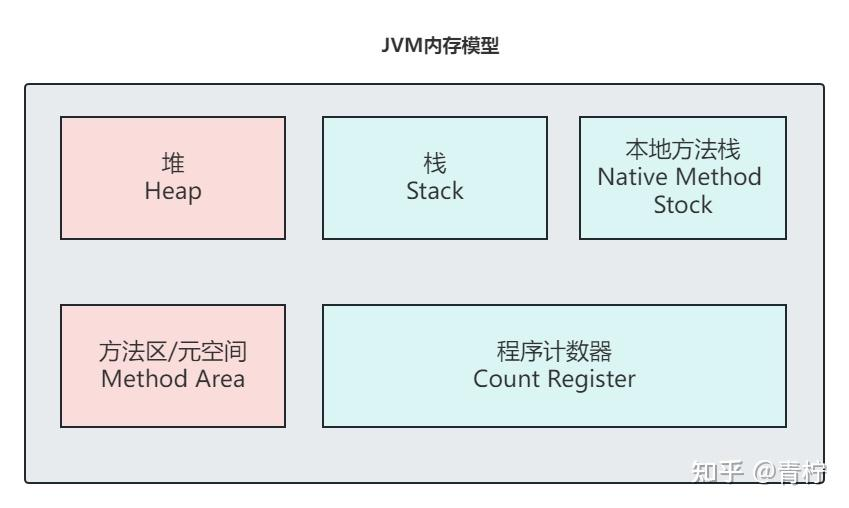
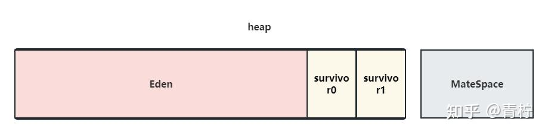
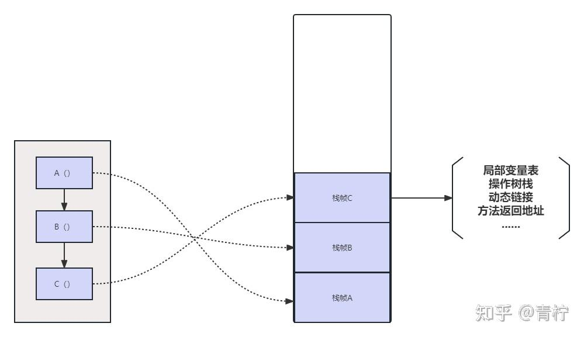
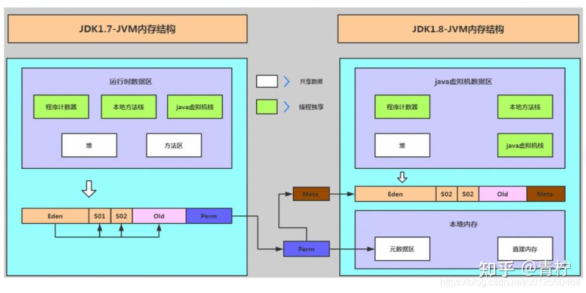
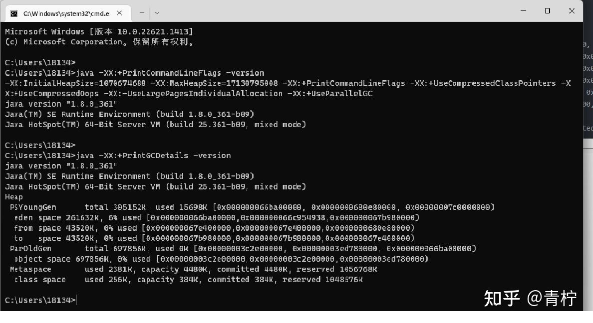
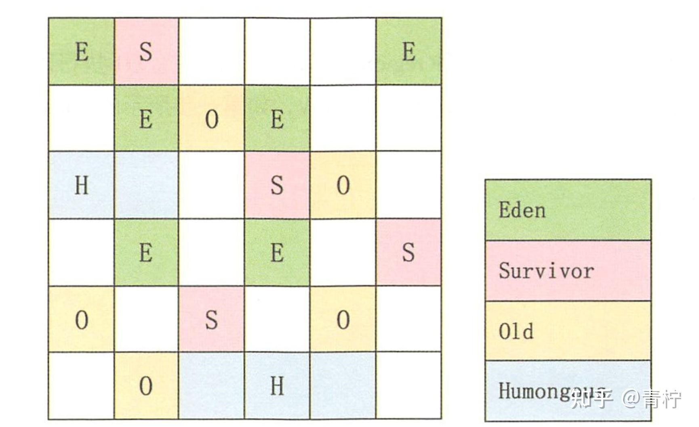

> Summary: The article connects JVM memory structure with practical GC tuning and runtime observability.

## Intended Reader

Java engineers diagnosing memory pressure, latency spikes, or GC behavior.

## Why This Matters

JVM behavior is shaped by memory layout, object allocation, garbage collection, class loading, and runtime optimization.

GC tuning starts with runtime evidence. You need to know where memory is allocated, how objects live and die, and which pause or throughput goal matters.

## Mental Model

A useful JVM mental model connects symptoms such as latency spikes, high allocation rate, or memory pressure to observable runtime signals.

The practical way to read this article is to look for the boundary it clarifies: what state exists, who owns it, which operation changes it, and what evidence proves the system behaved as expected.

## Implementation Walkthrough

- Map JVM runtime areas such as heap, stack, native method stack, and method area.
- Relate object allocation and object lifetime to GC pressure.
- Use GC logs, heap usage, allocation rate, and pause time to identify the real problem.
- Tune flags only after the workload and service-level goals are clear.

## Pitfalls and Tradeoffs

- Reducing pause time may reduce throughput or increase CPU cost.
- Increasing heap can reduce GC frequency while increasing worst-case pause or memory footprint.
- A tuning change without a before/after measurement is not a reliable improvement.

## Verification Checklist

- Capture GC logs before and after changes.
- Measure allocation rate, pause percentiles, and throughput.
- Test under production-like traffic and data size.

## Practical Takeaways

- GC tuning starts with allocation behavior and service-level goals, not with random flag changes.
- Memory visibility and object lifetime matter when debugging performance or correctness issues.
- JVM diagnostics should combine logs, metrics, heap/thread evidence, and workload context.
- A tuning change is only useful if it can be tied to a measured improvement.

## Visual Evidence

The migrated local images are preserved as supporting figures. They keep the English edition aligned with the same diagrams, screenshots, or console evidence used by the source article.








## Selected Technical Snippets

The following snippets are preserved only when they are safe to publish in English without broken encoding or translated identifiers.

```text
$ vmoption PrintGC true
Successfully updated the vm option.
NAME     BEFORE-VALUE  AFTER-VALUE
------------------------------------
PrintGC  false         true
```

```text
$ vmoption PrintGCDetails true
Successfully updated the vm option.
NAME            BEFORE-VALUE  AFTER-VALUE
-------------------------------------------
PrintGCDetails  false         true
```

```text
[GC (JvmtiEnv ForceGarbageCollection) [PSYoungGen: 2184K->352K(76288K)] 19298K->17474K(166912K), 0.0011562 secs] [Times: user=0.01 sys=0.00, real=0.00 secs]
[Full GC (JvmtiEnv ForceGarbageCollection) [PSYoungGen: 352K->0K(76288K)] [ParOldGen: 17122K->16100K(90112K)] 17474K->16100K(166400K), [Metaspace: 20688K->20688K(1069056K)], 0.0232947 secs] [Times: user=0.14 sys=0.01, real=0.03 secs]
```

## Source Notes

- Topic: JVM
- [Original source](https://zhuanlan.zhihu.com/p/675940342)
- Original publication date: 2024-01-03
- This English edition is localized from the migrated article metadata, source structure, technical terms, local assets, and clean implementation evidence.

## Closing Thoughts

The goal of this English edition is not to imitate the original wording sentence by sentence. It preserves the engineering argument, removes migration noise, and presents the article as a publishable technical note that future readers can use for design, debugging, or implementation review.
