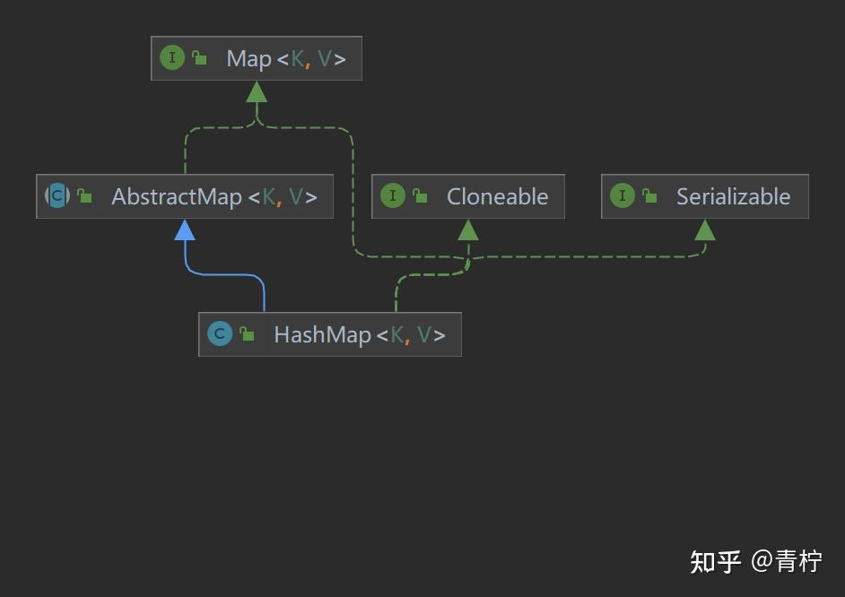
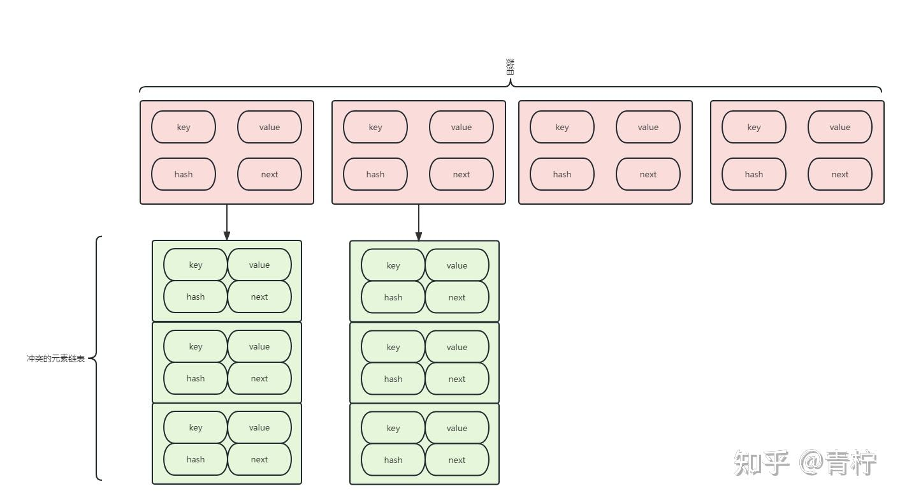
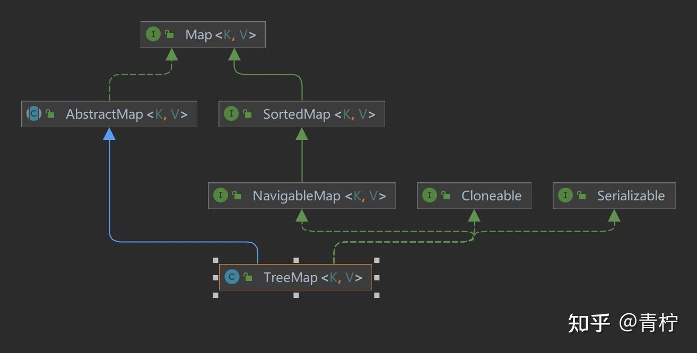

> *关于Map接口，具体的实现有HashMap、HashTable、TreeMap等*

## **HashMap**

老规矩，如果我们要看源码，我们要从这么几点去看：它的继承结构、它的核心实现能力。我们知道hashMap是一个kv容器，那么它的实现其实主要取决于这几点：

1. 存放 如何处理hash冲突 怎么存？
2. 获取 怎么通过key获取？
3. 扩容 什么时候 什么条件会扩容？
4. 删除 怎么样删除一个元素



**非常简洁的继承结构，除了序列化和拷贝支持还继承了AbstractMap复用key，value结构的部分通用功能。**

**我们先来看一下hashmap的结构**

****

首先说明一下，(n - 1) % hash 和 (n - 1) & hash，(2^h - 1) & hash 是等价的，其中n = 2^h，后者运算效率更高。

通过hashMap的继承结构，我们可以发现首先它实现了上层Map，并且实现了AbstractMap，HashMap内部采用的是数组+链表的结构，作为元素的存放，在存入的时候会先进行 (n - 1) & hash。

HashMap采用了数组加链表的结构，在存入元素的时候，会先通过 (n - 1) & hash获取hash存储的位置，这个位置就是key存放的位置，其实就是(n - 1) % hash，n相当于数组的长度，因为要&运算，所以长度必须是2的n次幂。

只有当hash发生了冲突，元素的内容不一样，但是hash值一样，这时候两个元素通过 (n - 1) & hash均放在了同一个位置，这时候才会在链表中放入元素。

那么。在hashMap中，Node又是用来干什么的呢？

数组中每个元素都被包装成了Node，其内部有四个属性，详情看源码：

```java
/* ---------------- Fields -------------- */

/**
* The table, initialized on first use, and resized as
* necessary. When allocated, length is always a power of two.
* (We also tolerate length zero in some operations to allow
* bootstrapping mechanics that are currently not needed.)
*/
　　//这个就是存储元素的数组
transient Node<K,V>[] table;

static class Node<K,V> implements Map.Entry<K,V> {　　　　  //key hash
final int hash;　　　　　// 元素的key　
final K key;　　　　　//元素的value
V value;　　　　 //下一个node指针
Node<K,V> next;

Node(int hash, K key, V value, Node<K,V> next) {
this.hash = hash;
this.key = key;
this.value = value;
this.next = next;
}

public final K getKey()        { return key; }
public final V getValue()      { return value; }
public final String toString() { return key + "=" + value; }

public final int hashCode() {
return Objects.hashCode(key) ^ Objects.hashCode(value);
}

public final V setValue(V newValue) {
V oldValue = value;
value = newValue;
return oldValue;
}

public final boolean equals(Object o) {
if (o == this)
return true;
if (o instanceof Map.Entry) {
Map.Entry<?,?> e = (Map.Entry<?,?>)o;
if (Objects.equals(key, e.getKey()) &&
Objects.equals(value, e.getValue()))
return true;
}
return false;
}
}
```

当发生了hash冲突、元素内容不一样但是hash一样，才会在链表中放入元素，数组中的元素被Node进行包装，内部分别是key、value、hash、和next指针。

那么，hashmap是如何进行hash计算的呢？

```java
static final int hash(Object key) {
int h;
return (key == null) ? 0 : (h = key.hashCode()) ^ (h >>> 16);
}
```

**key的hash计算并没有我们想想的那么复杂，首先null的hash永远为0，其次是将元素本身的hashCode取反，再与高16位异或计算。我们知道hashCode返回的是int值，所以最大就是32个字节。由于计算下标的时候是，(n-1) & hash。所以当n - 1，比较小的时候，只能与hash 的低位计算。比如数字 786431 和 1835007 的低位全都是1，但是他们的高位却不相同。这个时候让高位参与计算，会进一步减少碰撞的概率。**

**那么了解到hashmap的基本结构后，我们要从源码的结构和方法进一步了解它**

**首先看看HashMap的成员变量:**

```java
//默认的数组长度 16
static final int DEFAULT_INITIAL_CAPACITY = 1 << 4;
//数组最大长度 1073741824
static final int MAXIMUM_CAPACITY = 1 << 30;
//默认的扩容因子
static final float DEFAULT_LOAD_FACTOR = 0.75f;
//当链表的长度大于这个数字的时候，会转换成数结构
static final int TREEIFY_THRESHOLD = 8;
//存放数据的数组，内部都是一个个链表
transient Node<K,V>[] table;
//entrySet的引用，会在调用entrySet()时候赋值
transient Set<Map.Entry<K,V>> entrySet;
//这个是Map内的元素个数，每put一个元素进来就会+1。当size大于threshold的时候就会扩容
transient int size;
//防止并发修改的计数器
transient int modCount;
//扩容的阈值
//当数组初始化的时候会被用来记录初始化数组长度，这个时候他的长度就是数组的长度。其他的时候就和数组长度没哈关系了
int threshold;
//扩容因子，默认值是 DEFAULT_LOAD_FACTOR = 0.75。用来计算扩容的阈值
final float loadFactor;
```

### **HashMap的构造方法**

```java
public HashMap(int initialCapacity, float loadFactor) {
if (initialCapacity < 0)
throw new IllegalArgumentException("Illegal initial capacity: " +
initialCapacity);
if (initialCapacity > MAXIMUM_CAPACITY)
initialCapacity = MAXIMUM_CAPACITY;
if (loadFactor <= 0 || Float.isNaN(loadFactor))
throw new IllegalArgumentException("Illegal load factor: " +
loadFactor);
this.loadFactor = loadFactor;　　　　//这里tablesizefor 很重要！！！ 它通过获取最近的2^n，指定初始化长度
this.threshold = tableSizeFor(initialCapacity);
}

/**
* Constructs an empty <tt>HashMap</tt> with the specified initial
* capacity and the default load factor (0.75).
*
* @param  initialCapacity the initial capacity.
* @throws IllegalArgumentException if the initial capacity is negative.
*/
public HashMap(int initialCapacity) {　　　　　//指定长度，扩容因子0.75
this(initialCapacity, DEFAULT_LOAD_FACTOR);
}

/**
* Constructs an empty <tt>HashMap</tt> with the default initial capacity
* (16) and the default load factor (0.75).
*/
public HashMap() {　　　　　//默认长度16 扩容因子0.75
this.loadFactor = DEFAULT_LOAD_FACTOR; // all other fields defaulted
}

/**
* Constructs a new <tt>HashMap</tt> with the same mappings as the
* specified <tt>Map</tt>.  The <tt>HashMap</tt> is created with
* default load factor (0.75) and an initial capacity sufficient to
* hold the mappings in the specified <tt>Map</tt>.
*
* @param   m the map whose mappings are to be placed in this map
* @throws  NullPointerException if the specified map is null
*/
public HashMap(Map<? extends K, ? extends V> m) {
this.loadFactor = DEFAULT_LOAD_FACTOR;
putMapEntries(m, false);
}
static final int tableSizeFor(int cap) {
int n = cap - 1;
n |= n >>> 1;
n |= n >>> 2;
n |= n >>> 4;
n |= n >>> 8;
n |= n >>> 16;
return (n < 0) ? 1 : (n >= MAXIMUM_CAPACITY) ? MAXIMUM_CAPACITY : n + 1;
}
　　当cap正好就是2^n时 不减1会直接扩大一倍
之前说了cap最近的2^n数字，比如 3 离它最近的是4，那么对于4呢？其实离他最近的是8。
如果直接运算，会扩大一倍，所以将4减1，变成3，也就是离3最近的就是4。
　　n溢出，或者达到最大容量。正常情况下将n+1还原
```

### **扩容**：

扩容，是hashmap的一个核心方法，这个跟其他容器一样，为了节约空间。所以我们在业务开发中，往往在特定长度需要指定它的长度避免它频繁扩容！！！

```java
final Node<K,V>[] resize() {
//记住当前的元素数组
Node<K,V>[] oldTab = table;
//当前的数组容量，没有初始化就是0
int oldCap = (oldTab == null) ? 0 : oldTab.length;
//当前的数组的分配长度
int oldThr = threshold;
//newCap是新的数组长度和newThr 是新的数组容量
int newCap, newThr = 0;
//原来的数组不是空的
if (oldCap > 0) {
//原来的数组已经达到最大长度限制
if (oldCap >= MAXIMUM_CAPACITY) {
//直接将分配长度扩大成最大值，其实就是不能扩容了。
threshold = Integer.MAX_VALUE;
return oldTab;
}
//如果不是初始容量，老的数组长度扩大2倍 并且还在最大容量内
//并且老的容量已经超过了默认的初始值16
else if ((newCap = oldCap << 1) < MAXIMUM_CAPACITY &&
oldCap >= DEFAULT_INITIAL_CAPACITY)
//新的阈值是原来的2倍
newThr = oldThr << 1;
}
//初始化的时候指定了容量，直接使用指定的容量初始化
//这里比较绕，因为它构造里边用的是threshold来记录的初始化长度
//所以后边还会有 newThr == 0 的情况
else if (oldThr > 0)
newCap = oldThr;
else {
//采用默认的数据初始化，数组长度是 16，扩容因子是0.75。阈值是12
newCap = DEFAULT_INITIAL_CAPACITY;
newThr = (int)(DEFAULT_LOAD_FACTOR * DEFAULT_INITIAL_CAPACITY);
}
//这里是，初始化的时候指定了容量
//或者现有的容量小于 DEFAULT_INITIAL_CAPACITY 或者 扩容后超出MAXIMUM_CAPACITY 是触发
if (newThr == 0) {
//新的数组扩容阈值
float ft = (float)newCap * loadFactor;
//确定新的阈值，新的容量小于MAXIMUM_CAPACITY 并且临界值 也小于MAXIMUM_CAPACITY 才会用ft
newThr = (newCap < MAXIMUM_CAPACITY && ft < (float)MAXIMUM_CAPACITY ?
(int)ft : Integer.MAX_VALUE);
}
//新的阈值
threshold = newThr;
@SuppressWarnings({"rawtypes","unchecked"})
//使用新的容量去初始化一个新的Node数组,newCap必须是2^n
Node<K,V>[] newTab = (Node<K,V>[])new Node[newCap];
table = newTab;
//处理旧数组里的数组
if (oldTab != null) {
//遍历原来数组的每个元素
for (int j = 0; j < oldCap; ++j) {
Node<K,V> e;
if ((e = oldTab[j]) != null) {
oldTab[j] = null;
if (e.next == null)
//如果只有一个元素，将元素的hash与现在的位置取余确定新的数组下标
newTab[e.hash & (newCap - 1)] = e;
else if (e instanceof TreeNode)
//对于数结构的处理
((TreeNode<K,V>)e).split(this, newTab, j, oldCap);
else {
//这个是将原始的链表拆分开，分成高位和低位。
//低位不用移动，高位放到现有的位置 + 数组的原始长度处
Node<K,V> loHead = null, loTail = null;
Node<K,V> hiHead = null, hiTail = null;
Node<K,V> next;
do {
next = e.next;
//这个就是判断数据是处于低位还是高位
if ((e.hash & oldCap) == 0) {
if (loTail == null)
loHead = e;
else
loTail.next = e;
loTail = e;
}
else {
if (hiTail == null)
hiHead = e;
else
hiTail.next = e;
hiTail = e;
}
} while ((e = next) != null);
//将低位元素放在原始的索引处
if (loTail != null) {
loTail.next = null;
newTab[j] = loHead;
}
//将高位元素放在原始的索引 + 原始的数组长度处
if (hiTail != null) {
hiTail.next = null;
newTab[j + oldCap] = hiHead;
}
}
}
}
}
//返回新的元素
return newTab;
}

```

对于新数组容量和扩容阈值；

数组中链表只有一个元素，那么直接存储；

数组中是一个红黑树结构；

数组中还没有到达红黑树结构、但是有多个、拆分链表；

其中，HashMap提供了TreeNode，当数组内链表长度大于8后转换为TreeNode。

其中，默认的扩容因子是0.75，意味着：当添加某个元素后，数组的总的添加元素数大于了 数组长度 * 0.75(默认,也可自己设定),数组长度扩容为两倍。(如开始创建HashMap集合后，数组长度为16，临界值为16 * 0.75 = 12，当加入元素后元素个数超过12，数组长度扩容为32，临界值变为24)

**Map只有在添加的时候才会扩容，删除的时候是不会缩容的**。

接下来，我们看看针对容器的操作方法：

### **添加元素：**

```java
final V putVal(int hash, K key, V value, boolean onlyIfAbsent,
boolean evict) {
Node<K,V>[] tab; Node<K,V> p; int n, i;
//如果table 还没初始化，调用resize()初始化一个数组
if ((tab = table) == null || (n = tab.length) == 0)
n = (tab = resize()).length;
//通过(n - 1) & hash 计算元素的下标，如果下标出没有元素，直接初始化一个
if ((p = tab[i = (n - 1) & hash]) == null)
tab[i] = newNode(hash, key, value, null);
else {
//下标出已经有元素了，p就是下标处链表的头
Node<K,V> e; K k;
//当前元素的hash和下标处表头的hash相等，并且他们的key相等，直接辅助e
//这其实是个优化措施，比如你put一个key已经存在的元素
if (p.hash == hash &&
((k = p.key) == key || (key != null && key.equals(k))))
e = p;
//如果p已经转化成树结构，树结构处理
else if (p instanceof TreeNode)
e = ((TreeNode<K,V>)p).putTreeVal(this, tab, hash, key, value);
else {
//以p为起点，循环链表
for (int binCount = 0; ; ++binCount) {
if ((e = p.next) == null) {
//如果链表的尾部还没找到，就添加一个元素进去
p.next = newNode(hash, key, value, null);
//是否有必要转换成树结构 增强查询效率
if (binCount >= TREEIFY_THRESHOLD - 1)
treeifyBin(tab, hash);
break;
}
//如果在中间找到了，记下这个节点
if (e.hash == hash &&
((k = e.key) == key || (key != null && key.equals(k))))
break;
p = e;
}
}
//当前key对应的节点已经存在
if (e != null) {
//将原来节点里的值替换掉
V oldValue = e.value;
//原来的值是null或者明确指定了onlyIfAbsent 的才更新
if (!onlyIfAbsent || oldValue == null)
e.value = value;
//模板方法，里边是个空实现
afterNodeAccess(e);
return oldValue;
}
}
//操作次数加1
++modCount;
//元素数量+1，并且与扩容阈值比较
if (++size > threshold)
resize();
//模板方法，里边是个空实现
afterNodeInsertion(evict);
return null;
}
```

总体来说，HashMap添加元素可以分为这几步：

1.初始化

2.查找元素位置，如果当前位置是空，那么直接放，如果不是空就遍历链表看看元素是否存在？存在就更新，不存在则添加

```java
public V put(K key, V value) {
return putVal(hash(key), key, value, false, true);
}
public V putIfAbsent(K key, V value) {
return putVal(hash(key), key, value, true, true);
}
```

这些都是基于putVal去实现的。

如果通过别的方式添加元素，例如`putMapEntries：`

```java
final void putMapEntries(Map<? extends K, ? extends V> m, boolean evict) {
//获取待添加的map元素个数
int s = m.size();
if (s > 0) {
if (table == null) {
//反算一下容量的大小
float ft = ((float)s / loadFactor) + 1.0F;
int t = ((ft < (float)MAXIMUM_CAPACITY) ?
(int)ft : MAXIMUM_CAPACITY);
//已经超过了容量的阈值
if (t > threshold)
//将容量阈值规整为2^n形式
threshold = tableSizeFor(t);
}
//如果超限了 直接去扩容，确定一个合适的容量
else if (s > threshold)
resize();
for (Map.Entry<? extends K, ? extends V> e : m.entrySet()) {
K key = e.getKey();
V value = e.getValue();
//使用putVal一个一个添加
putVal(hash(key), key, value, false, evict);
}
}
}
//快捷方法
public void putAll(Map<? extends K, ? extends V> m) {
putMapEntries(m, true);
}
```

### **删除元素：**

```java
final Node<K,V> removeNode(int hash, Object key, Object value,
boolean matchValue, boolean movable) {
Node<K,V>[] tab; Node<K,V> p; int n, index;
//只有table不为空，并且存在数据的时候才处理
if ((tab = table) != null && (n = tab.length) > 0 &&
(p = tab[index = (n - 1) & hash]) != null) {
Node<K,V> node = null, e; K k; V v;
//这里是为了key对应的元素位置，一样是个优化策略。直接看第一个位置是不是要找的元素
if (p.hash == hash &&
((k = p.key) == key || (key != null && key.equals(k))))
node = p;
else if ((e = p.next) != null) {
//数结构单独处理
if (p instanceof TreeNode)
node = ((TreeNode<K,V>)p).getTreeNode(hash, key);
else {
//循环列表，看能不能找到key对应的位置
do {
if (e.hash == hash &&
((k = e.key) == key ||
(key != null && key.equals(k)))) {
node = e;
break;
}
p = e;
} while ((e = e.next) != null);
}
}
//通过上边的查找，如果找到了key对应的node节点
//如果启用了value匹配，并且value是匹配的。就准备删除节点
if (node != null && (!matchValue || (v = node.value) == value ||
(value != null && value.equals(v)))) {
//树节点单独处理
if (node instanceof TreeNode)
((TreeNode<K,V>)node).removeTreeNode(this, tab, movable);
else if (node == p)
//如果第一个节点就是node，直接替换掉第一个元素
tab[index] = node.next;
else
//直接替换next指针到node的下一个节点
p.next = node.next;
//操作次数增加
++modCount;
//元素数量减少
--size;
//模板方法，其实是个空实现
afterNodeRemoval(node);
return node;
}
}
return null;
}
```

删除元素的动作也可以分为两步：

1.找到key对应的位置，且hash和key都相等

2.处理结构，数组还是链表？

```java
public V remove(Object key) {
Node<K,V> e;
return (e = removeNode(hash(key), key, null, false, true)) == null ?
null : e.value;
}
public boolean remove(Object key, Object value) {
return removeNode(hash(key), key, value, true, true) != null;
}

```

以上都是通过removeNode实现。

### **清空元素：**

```java
public void clear() {
Node<K,V>[] tab;
modCount++;
if ((tab = table) != null && size > 0) {
size = 0;
//直接把数组的元素置空，数组的大小不变
for (int i = 0; i < tab.length; ++i)
tab[i] = null;
}
}
```

### **查找元素：**

**这是比较核心，也比较粗暴的方式**

```java
final Node<K,V> getNode(int hash, Object key) {
Node<K,V>[] tab; Node<K,V> first, e; int n; K k;
//table不是空的，并且key对应的下标是有数据存在的
if ((tab = table) != null && (n = tab.length) > 0 &&
(first = tab[(n - 1) & hash]) != null) {
//优化策略，首先检查第一个节点不是要找e 的key，如果是直接返回。
if (first.hash == hash &&
((k = first.key) == key || (key != null && key.equals(k))))
return first;
//链表不止一个元素
if ((e = first.next) != null) {
//树结构单独处理
if (first instanceof TreeNode)
return ((TreeNode<K,V>)first).getTreeNode(hash, key);
do {
//循环链表一直找到key
if (e.hash == hash &&
((k = e.key) == key || (key != null && key.equals(k))))
return e;
} while ((e = e.next) != null);
}
}
return null;
}
```

查找元素，就过于粗暴了。当然为了效率，会在链表长度大于8时自动转化为红黑树结构。

```java
public V get(Object key) {
Node<K,V> e;
return (e = getNode(hash(key), key)) == null ? null : e.value;
}
public boolean containsKey(Object key) {
return getNode(hash(key), key) != null;
}
//不存在元素的时候，使用一个默认值替换
public V getOrDefault(Object key, V defaultValue) {
Node<K,V> e;
return (e = getNode(hash(key), key)) == null ? defaultValue : e.value;
}

```

这些都是通过getNode实现。

### **修改元素：**

```java
public boolean replace(K key, V oldValue, V newValue) {
Node<K,V> e; V v;
//直接获取元素，如果是空的或者和oldValue不想等，就不处理
if ((e = getNode(hash(key), key)) != null &&
((v = e.value) == oldValue || (v != null && v.equals(oldValue)))) {
e.value = newValue;
afterNodeAccess(e);
return true;
}
return false;
}

//和上边一样，只是少了旧值的比较操作
public V replace(K key, V value) {
Node<K,V> e;
if ((e = getNode(hash(key), key)) != null) {
V oldValue = e.value;
e.value = value;
afterNodeAccess(e);
return oldValue;
}
return null;
}

public void replaceAll(BiFunction<? super K, ? super V, ? extends V> function) {
Node<K,V>[] tab;
if (function == null)
throw new NullPointerException();
if (size > 0 && (tab = table) != null) {
int mc = modCount;
//先循环数组
for (int i = 0; i < tab.length; ++i) {
//在循环数组内的链表
for (Node<K,V> e = tab[i]; e != null; e = e.next) {
//使用function替换每个元素
e.value = function.apply(e.key, e.value);
}
}
//如果发生了并发修改，就报错
if (modCount != mc)
throw new ConcurrentModificationException();
}
}
```

### **遍历容器：**

**HashIterator 是针对内部key和value的迭代器实现**

```java
abstract class HashIterator {
Node<K,V> next;        // next entry to return
Node<K,V> current;     // current entry
int expectedModCount;  // for fast-fail
int index;             // current slot

HashIterator() {
//记录当前被操作数量
expectedModCount = modCount;
//table引用
Node<K,V>[] t = table;
current = next = null;
index = 0;
//这个是为找到数组中第一个不是空的链表
if (t != null && size > 0) { // advance to first entry
do {} while (index < t.length && (next = t[index++]) == null);
}
}

public final boolean hasNext() {
return next != null;
}

final Node<K,V> nextNode() {
Node<K,V>[] t;
Node<K,V> e = next;
//并发操作检测
if (modCount != expectedModCount)
throw new ConcurrentModificationException();
//如果数组中存在空的就报错
if (e == null)
throw new NoSuchElementException();
//获取到下一个不是空的元素，并赋值给current 和 next
if ((next = (current = e).next) == null && (t = table) != null) {
do {} while (index < t.length && (next = t[index++]) == null);
}
return e;
}

//就是用的removeNode 其实只是加了并发检测
public final void remove() {
Node<K,V> p = current;
if (p == null)
throw new IllegalStateException();
if (modCount != expectedModCount)
throw new ConcurrentModificationException();
current = null;
K key = p.key;
removeNode(hash(key), key, null, false, false);
expectedModCount = modCount;
}
}
```

### **KeySet**

```java
public Set<K> keySet() {
Set<K> ks = keySet;
if (ks == null) {
//创建一个KeySet引用
ks = new KeySet();
keySet = ks;
}
return ks;
}

final class KeySet extends AbstractSet<K> {
public final int size()                 { return size; }
public final void clear()               { HashMap.this.clear(); }
//这个就是for循环语法糖会用的
public final Iterator<K> iterator()     { return new KeyIterator(); }
public final boolean contains(Object o) { return containsKey(o); }
public final boolean remove(Object key) {
return removeNode(hash(key), key, null, false, true) != null;
}
public final Spliterator<K> spliterator() {
return new KeySpliterator<>(HashMap.this, 0, -1, 0, 0);
}
public final void forEach(Consumer<? super K> action) {
Node<K,V>[] tab;
if (action == null)
throw new NullPointerException();
if (size > 0 && (tab = table) != null) {
int mc = modCount;
//先循环数组
for (int i = 0; i < tab.length; ++i) {
//再循环链表，但是只寻找元素的key
for (Node<K,V> e = tab[i]; e != null; e = e.next)
action.accept(e.key);
}
if (modCount != mc)
throw new ConcurrentModificationException();
}
}
}

//继承了上边的HashIterator，next里只key
final class KeyIterator extends HashIterator
implements Iterator<K> {
public final K next() { return nextNode().key; }
}
```

### **Values**

```java
public Collection<V> values() {
Collection<V> vs = values;
if (vs == null) {
//使用Values,和keySet机会
vs = new Values();
values = vs;
}
return vs;
}

final class Values extends AbstractCollection<V> {
public final int size()                 { return size; }
public final void clear()               { HashMap.this.clear(); }
//这个就是for循环语法糖会用的
public final Iterator<V> iterator()     { return new ValueIterator(); }
public final boolean contains(Object o) { return containsValue(o); }
public final Spliterator<V> spliterator() {
return new ValueSpliterator<>(HashMap.this, 0, -1, 0, 0);
}
public final void forEach(Consumer<? super V> action) {
Node<K,V>[] tab;
if (action == null)
throw new NullPointerException();
if (size > 0 && (tab = table) != null) {
int mc = modCount;
for (int i = 0; i < tab.length; ++i) {
for (Node<K,V> e = tab[i]; e != null; e = e.next)
action.accept(e.value);
}
if (modCount != mc)
throw new ConcurrentModificationException();
}
}
}
//继承了上边的HashIterator，next里只value
final class ValueIterator extends HashIterator
implements Iterator<V> {
public final V next() { return nextNode().value; }
}
```

### **快速失败**

8版本之后的快速失败：HashMap提供了一个modCount来定义修改的次数，如果常规遍历的情况下，再进行操作时会修改modCount的值，但是不会修改expectedModCount，每次操作时只要它两不相等就会出现ConcurrentModificationException异常。如果使用迭代器Iterator本身的操作例如remove方法操作时，会同时更新expectedModCount，那么就不会抛出ConcurrentModificationException的异常了。

### **树化**

TreeNode是HashMap的内部类，当数组内链表的长度大于8的时候会转换为TreeNode，进一步加强查找效率

首先，为什么HashMap要采用红黑树呢？具体我们可以参考红黑树的数据结构模型。这里不做过多解释，但是要明确一点，红黑树的特性就是从根到叶子节点的长度不会过长，它们是一个相对平衡的状态，哪怕有大量的数据，也能避免在一个根节点下大量遍历查找。从而提高查找效率。

但是通过添加到指定长度以上，会进入treeifyBin方法，这个方法会将Node节点转为TreeNode节点。注意！！！！因为Node有指针的，这里还是上下节点，所以它还没有达到一个红黑树的标准。

我们都知道看一个树形结构，我们要通过它的继承看到它的特性。我们来看看Node和TreeNode的区别：

```java
static final class TreeNode<K,V> extends LinkedHashMap.Entry<K,V>
static class Node<K,V> implements Map.Entry<K,V>
```

它们都基于KV存储实现，但是不一样的是TreeNode又继承了linkedHashMap。

```java
final void treeifyBin(Node<K,V>[] tab, int hash) {
int n, index; Node<K,V> e;
//如果当前列表小于64 就进行扩容就够了
if (tab == null || (n = tab.length) < MIN_TREEIFY_CAPACITY)
resize();
else if ((e = tab[index = (n - 1) & hash]) != null) {
//如果已经大于64了，先将链表转化为树结构，注意此时还不是红黑树 这些树的元素通过next指针相连
TreeNode<K,V> hd = null, tl = null;
do {
//先生成TreeNode节点
TreeNode<K,V> p = replacementTreeNode(e, null);
if (tl == null)
//先将head 设置为第一个TreeNode
hd = p;
else {
//新插入的TreeNode 的parent 就是上一个Node 如果前面没有那就是header
p.prev = tl;
tl.next = p;
}
//尾设置为最新插入的节点
tl = p;
} while ((e = e.next) != null);
if ((tab[index] = hd) != null)
//树化
hd.treeify(tab);
}
}
```

通过treeifyBin我们可以发现，这里开始处理TreeNode了，但此时它应该称为树，而不是红黑树，因为它们的节点是相连的

```java
final void treeify(Node<K,V>[] tab) {
TreeNode<K,V> root = null;
//遍历树节点
for (TreeNode<K,V> x = this, next; x != null; x = next) {
//处理第一个树节点
next = (TreeNode<K,V>)x.next;
x.left = x.right = null;
if (root == null) {
//如果当前没有根节点，那么它就当根节点 它是一个black节点
x.parent = null;
x.red = false;
root = x;
}
else {
K k = x.key;
int h = x.hash;
Class<?> kc = null;
for (TreeNode<K,V> p = root;;) {
//如果已经有根节点，那么就要遍历处理向左或者向右偏移
int dir, ph;
K pk = p.key;
//如果hash大于插入节点的hash 那么就要去左树继续查找
if ((ph = p.hash) > h)
dir = -1;
//右边查找 同理
else if (ph < h)
dir = 1;
//如果相同，就单独处理
else if ((kc == null &&
(kc = comparableClassFor(k)) == null) ||
(dir = compareComparables(kc, k, pk)) == 0)
dir = tieBreakOrder(k, pk);

TreeNode<K,V> xp = p;
//根据dir 就知道到底在左还是在右
//如果当前为空了，那么就应该将它插入了
if ((p = (dir <= 0) ? p.left : p.right) == null) {
//修改指针
x.parent = xp;
if (dir <= 0)
xp.left = x;
else
xp.right = x;
//旋转处理
root = balanceInsertion(root, x);
break;
}
}
}
}
moveRootToFront(tab, root);
}
```

那么在数据找到位置并插入后，就要做红黑树的处理balanceInsertion

```java
static <K,V> TreeNode<K,V> balanceInsertion(TreeNode<K,V> root,
TreeNode<K,V> x) {
x.red = true;
for (TreeNode<K,V> xp, xpp, xppl, xppr;;) {
if ((xp = x.parent) == null) {
x.red = false;
return x;
}
else if (!xp.red || (xpp = xp.parent) == null)
return root;
if (xp == (xppl = xpp.left)) {
if ((xppr = xpp.right) != null && xppr.red) {
xppr.red = false;
xp.red = false;
xpp.red = true;
x = xpp;
}
else {
if (x == xp.right) {
root = rotateLeft(root, x = xp);
xpp = (xp = x.parent) == null ? null : xp.parent;
}
if (xp != null) {
xp.red = false;
if (xpp != null) {
xpp.red = true;
root = rotateRight(root, xpp);
}
}
}
}
else {
if (xppl != null && xppl.red) {
xppl.red = false;
xp.red = false;
xpp.red = true;
x = xpp;
}
else {
if (x == xp.left) {
root = rotateRight(root, x = xp);
xpp = (xp = x.parent) == null ? null : xp.parent;
}
if (xp != null) {
xp.red = false;
if (xpp != null) {
xpp.red = true;
root = rotateLeft(root, xpp);
}
}
}
}
}
}

```

这里是将节点旋转处理，做左旋转或右旋转，这里对这个不做过多解释，有兴趣可以根据源码看看如何转换的，其中在插入数据时如果检查到是TreeNode，就根据putTreeVal处理，这里的方法类似。

其中如果是treeNode进行查找 也是根据树形查找方式，这里如果对数据结构比较熟悉的朋友应该已经知道了

```java
final TreeNode<K,V> getTreeNode(int h, Object k) {
return ((parent != null) ? root() : this).find(h, k, null);
}
```

## **ConcurrentHashMap**

ConcurrentHashMap是juc下的一个线程安全容器，主要是为了解决HashMap线程不安全的场景。

在jdk7中，ConcurrentHashMap保证线程安全的方式就是Segment，分段锁，默认Segment是16个，分段加锁保证读写效率。可以在初始化时修改

每个Segment中，我们可以看作每个Segment里面就是一个HashMap的结构，每个Segment都持有了独立的ReentrantLock，关于ReentrantLock可以参考aqs的原理。

所以在操作每个Segment时，互相是不干扰的。

但是在jdk8里，将Segment换成了Node，每个Node有自己的锁，通过CAS原理。

简单了解一下7中的原理

```java
static final class Segment<K,V> extends ReentrantLock implements Serializable {
private static final long serialVersionUID = 2249069246763182397L;

static final int MAX_SCAN_RETRIES =
Runtime.getRuntime().availableProcessors() > 1 ? 64 : 1;

transient volatile HashEntry<K,V>[] table;

transient int count;

transient int modCount;

transient int threshold;

final float loadFactor;
}
final Segment<K,V>[] segments;
```

HashEntry(哈希数组)，threshold(扩容阈值)，loadFactor(负载因子)表示segment是一个完整的HashMap。

public ConcurrentHashMap(int initialCapacity,float loadFactor, int concurrencyLevel)

初始容量：初始容量表示所有的segment数组中，一共含有多少个hashentry。若initialCapacity不为2的幂，会取一个大于initialCapacity的2的幂。
负载因子：默认0.75
并发级别：可以同时允许多少个线程并发。concurrencyLevel为多少，就有多少个segment，当然也会取一个大于等于这个值的2的幂。

而在8中，其实采用的是Node数组+链表+红黑树，例如put方法就是通过CAS原理 比较替换的方式添加。

那8下的ConcurrentHashMap如何保证线程安全的呢？其实是使用Unsafe操作+synchronized关键字；

**synchronized在操作的位置进行加锁、比如我们向某个链表插入数据，那就会在Node上先同步、然后通过CAS插入。在8版本下其实也有分段的思想、但是在7中其实我们指定了桶的数量、而在8中认为是每个Node的每个位置都有一把锁**。

如果我们这时去put 一个key-value

根据key计算数组下标、如果没有元素，则CAS添加；

如果有元素 那么先**synchronized锁定；**

加锁成功，判断元素类型，如果是链表那么就添加到链表、如果是红黑树节点那么添加到TreeNode；

添加完成，需要看是否需要转化成树结构；

## **HashTable**

hashTable跟HashMap最大的区别，就是HashTable是保证线程安全的，它的所有操作都进行了加锁。

HashMap底层是一个Entry数组，当发生hash冲突的时候，hashmap是采用链表的方式来解决的，在对应的数组位置存放链表的头结点。对链表而言，新加入的节点会从头结点加入。在hashmap做put操作的时候可能会造成数据丢失。现在假如A线程和B线程同时对同一个数组位置调用addEntry，两个线程会同时得到现在的头结点，然后A写入新的头结点之后，B也写入新的头结点，那B的写入操作就会覆盖A的写入操作造成A的写入操作丢失。

## **TreeMap**

对于treeMap，很多人很陌生、它也是基于Map接口实现的。

TreeMap是一个基于key有序的key value的散列。

map根据创建的key的排序方式、或者重写Comparator的排序方式进行排序；底层还是基于红黑树的结构实现的。



从它的继承结构可以清晰的看出来，它又实现了sorted排序方式，所以它是一个有序的。
