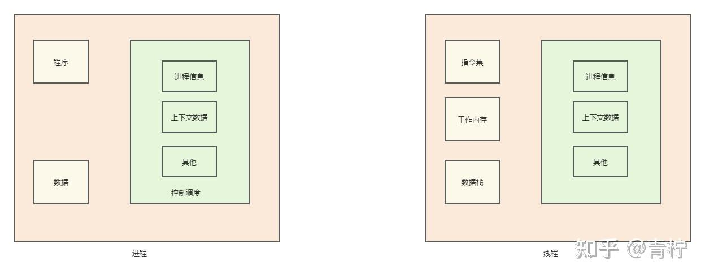
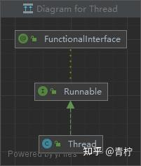
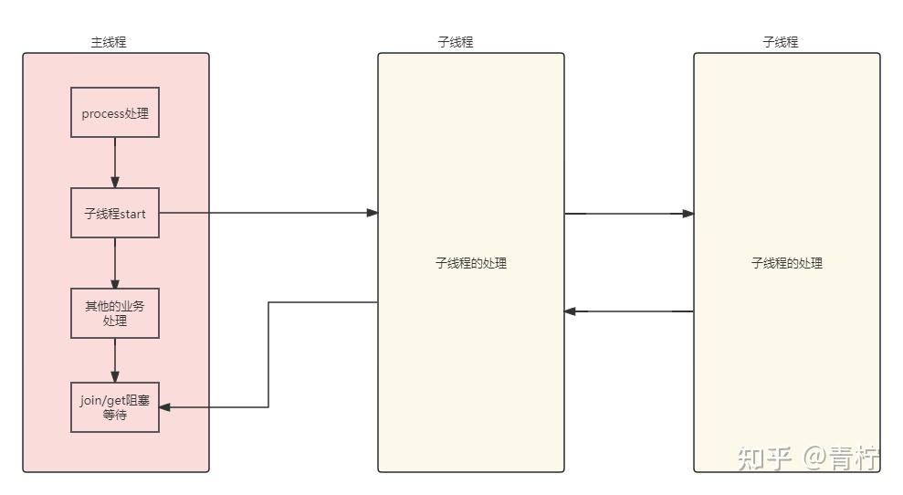
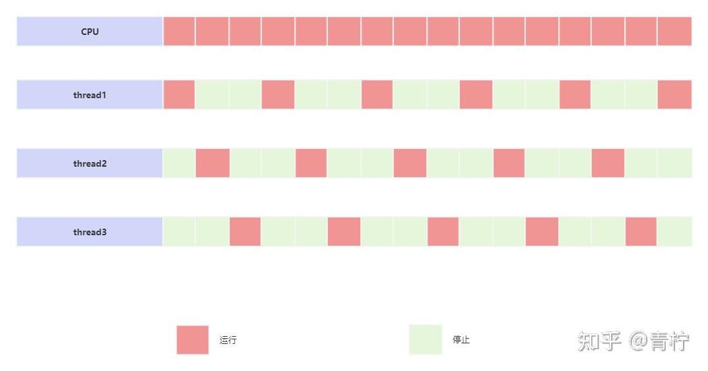
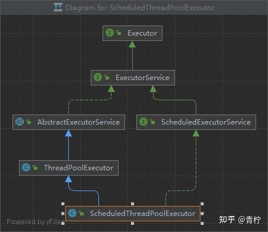
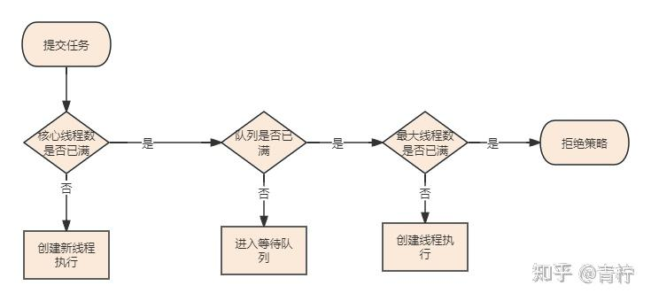

> *并发编程无处不在，本章主要从java的并发编程入手*

## **线程**

> *为什么我们程序中要使用多线程？单线程不是很好吗？多线程有什么意义？多线程使用的弊端？*

首先需要区分线程和进程的概念。

进程属于操作系统层面，针对程序的一次执行，在计算机中，CPU用来计算任务，内存用来存储运行时的数据，外部存储如硬盘存储了持久化的数据。那么程序就是在操作系统之上的应用服务，总体可以划分为程序、数据和调度。如下图所示：



进程的概念不过多描述，但是对于java工程而言，每一个jvm启动一个java程序，就产生 一个jvm的进程。在这个jvm进程中，每一个任务都是由线程去完成的，所以进程是操作系统分配的最小单位，例如我在程序中运行了一个main()函数，那么main函数就是这个进程的主线程；而在中，包含了工作内存，它代表了进程中的一次顺序执行的过程，线程是由CPU调度的最小单元，并且在一个进程中，线程共享进程的内存数据。Java程序在JVM运行时就是一个最好的例子：当JVM将java编译成class文件后，就是开启了一个jvm的进程，然后在jvm的进程中开启线程执行。理论上来讲，开启一个jvm进程后，除了java线程外，还会开启GC线程。

同时，在线程中，线程的创建、销毁以及切换上下文的速率要比进程小的多，所以线程也称为轻量进程。

明确几个概念，方便下文理解：

上下文切换：CPU采用时间切片方式切换上下文，CPU可以给每一个进程分配一个时间段，如果时间结束进程仍在执行，那么就会阻塞当前的进程并将CPU分配给另一个进程，如果进程在时间结束前停止，那么就直接将CPU分配给另一个进程。换个意思就是说如果单核CPU，在宏观上观察执行了多个进程，可以理解为进程做到了并发执行，但是实际上任意时间只有一个进程会占用CPU。随着时间推移，我们不难发现这种条件并不能达到我们的要求，我们不能接口在某个时间内只有一个进程可以被执行，所以又有了线程。我们希望一个线程去执行一个任务，那么一个进程就可以执行多个任务。每个线程只需要执行它自己关心的任务即可。

但是一个进程往往在创建、销毁上代价巨大，而且进程间是相互独立的，无法做到通信，那么我们的线程可以在这种场景大派用场，它的过程是轻量的，而且在同一个进程下多个线程可以共享资源并相互通信。

### **线程的创建**

java中，我们每创建一个线程，都对应着Thread的实例，在jvm调度时被使用，在同一时刻，一个CPU内核上只会存在一个Thread实例是正在被执行的，当前被执行的线程也叫做当前线程。

通过右侧图我们可以知道，其实不论是Runable还是Thrad都是通过FunctionalInterface去处理的。那么不同的继承链路代表了不同的特性。




在Thread中，我们观察到几个重要的属性：

- tid：代表当前线程id
- volidate name：代表当前线程名称
- priority：代表线程执行优先级（max = 10 min = 1 default = 5）
- daemon：代表是否是守护线程，默认为false
- group：线程所属的线程组
- volidate threadStatus：线程的状态，默认为0
- 对于LockSupport、Object monitor 的介绍请参考之前的文章，这里不在过多描述

[LockSupport](https://link.zhihu.com/?target=https%3A//www.cnblogs.com/oldEleven/p/17281783.html)

关于守护线程：守护线程是在进程运行时提供的后台服务的线程，常见的守护线程例如垃圾回收线程GC，我们甚至可以自定义守护线程，在线程初始化时默认为false，如果线程的父线程为守护线程，则默认当前也为守护线程

Thread parent = currentThread();

this.group = g;
this.daemon = parent.isDaemon();

这里截取部分代码段，完整请参考Thread#init（）

注意：priority不能用作线程执行顺序的保证，线程执行顺序取决于是否获取CPU的切片，priority只是推荐尽量以优先级的顺序获取，但往往真实的情况出乎意料，所以如果我们要保证线程通信的顺序，建议后文中通过并发机制、锁、或线程间通信保证顺序

简单介绍下Thread其他的方法：

yield：本身是一个native方法，我们可以得知调用底层的cpp，当前方法是让当前线程让出CPU，不过要注意的是就算当前线程让出CPU，再调度时还可能再次获取到CPU。

sleep：底层调用native方法，睡眠。

join：阻塞的等待，底层调用wait方法，支持指定时间放弃等待。

interrupted：添加停止的标记量，无法立即将线程停止，只是将标记设置为停止。

```java
1     public enum State {
2         /**
3          * 新建.并且没有执行前
4          */
5         NEW,
6
7         /**
8          运行
9          */
10         RUNNABLE,
11
12         /**
13          * 阻塞，并等待object监视器锁
14          */
15         BLOCKED,
16
17         /**
18          * 等待，在调用Object.wait 、Thread.join、LockSupport.park后
19          */
20         WAITING,
21
22         /**
23          * 计时结束，在调用Thread.sleep、LockSupport.parkNanos、LockSupport.parkUntil、Object.wait 、Thread.join
24          */
25         TIMED_WAITING,
26
27         /**
28          * 结束、线程完成执行已终止
29          */
30         TERMINATED;
31     }
```

在创建线程时，我们调用 synchronized void start()和 public void run()进行调用，需要注意的是，start后jvm会开启一个新的线程来执行自定义的代码，而run则是线程获取cpu后的入口代码，作为调用逻辑代码的入口。

```java
1 public synchronized void start() {
2         /**
3          先判断是否是新建状态、否则抛出异常
4          */
5         if (threadStatus != 0)
6             throw new IllegalThreadStateException();
7
8         /* Notify the group that this thread is about to be started
9          * so that it can be added to the group's list of threads
10          * and the group's unstarted count can be decremented. */
11         group.add(this);
12
13         boolean started = false;
14         try {
15             start0();
16              /**
17              调用native方法
18              */
19             started = true;
20         } finally {
21             try {
22                 if (!started) {
23                     group.threadStartFailed(this);
24                 }
25             } catch (Throwable ignore) {
26                 /* do nothing. If start0 threw a Throwable then
27                   it will be passed up the call stack */
28             }
29         }
30     }
31
32 @Override
33     public void run() {
34         if (target != null) {
35             target.run();
36         }
37     }
```

我们知道jvm底层是由c++和部分机器语言编写的，在start0中，调用了native方法，其实在创建线程时，都会调用

```java
/* Make sure registerNatives is the first thing <clinit> does. */
private static native void registerNatives();
static {
registerNatives();
}
```

在c++中，会调用Java_lang_registerNative,在启动调用start0后，会调用dll中ThreadStart方法，创建Thread对象。这里感兴趣可以下载openJdk源码，在cpp中再切换到内核创建线程，然后再切换回用户态。可以去[OpenJDK](https://link.zhihu.com/?target=https%3A//openjdk.org/)下载对应的hotSpot中jvm.cpp文件中查看。这里其实也说明了为什么我们在使用线程推荐使用线程池，防止因为每一次创建线程都会将用户态先切换到内核中创建thread，再切换回用户态中。

我们上文中说到，当前时间下只有CPU上执行的一个当前线程。获取当前线程可以通过 public static native Thread currentThread();静态方法获取。

创建线程，我们通常采用继承Thread或实现Runnable接口，除此之外，还有通过Callable接口或Future、FutureTask来实现创建线程。

```java
1 public class MyThread extends Thread {
2
3     @Override
4     public void run() {
5         // 线程需要执行的任务
6         for (int i = 1; i <= 5; i++) {
7             System.out.println("This is MyThread extending Thread: " + i);
8         }
9     }
10 }
11
12 public class Main {
13     public static void main(String[] args) {
14         MyThread thread1 = new MyThread();
15         thread1.start();
16
17         MyThread thread2 = new MyThread();
18         thread2.start();
19     }
20 }
21
22 public class MyRunnable implements Runnable {
23
24     @Override
25     public void run() {
26         // 线程需要执行的任务
27         for (int i = 1; i <= 5; i++) {
28             System.out.println("This is MyRunnable implementing Runnable: " + i);
29         }
30     }
31 }
32
33 public class Main {
34     public static void main(String[] args) {
35         MyRunnable myRunnable1 = new MyRunnable();
36         Thread thread1 = new Thread(myRunnable1);
37         thread1.start();
38
39         MyRunnable myRunnable2 = new MyRunnable();
40         Thread thread2 = new Thread(myRunnable2);
41         thread2.start();
42     }
43 }
```

上面的例子我们通过Thread和Runable来创建了线程执行任务，但是我们根据上面继承得知底层都使用了Thread模型，这样这个任务无法收集到返回信息，因为它被void修饰，如果我们希望在线程执行完成之后获取返回值，就需要使用Callable、Future和FutureTask

```java
@FunctionalInterface
public interface Callable<V> {
/**
* Computes a result, or throws an exception if unable to do so.
*
* @return computed result
* @throws Exception if unable to compute a result
*/
V call() throws Exception;
}

```

在juc中，我们可以看到Callable是支持泛型并且call带有返回值的。

同理，我们观察Future和FutureTask的结构，发现它们都是位于juc包下，juc是jdk给我们提供的并发组件包，通过继承关系可以得知Future和FutureTask的模型

首先，Future是一个泛型接口，定义了方法模板，而FutureTask则是Future的一个实现模型，它们都实现了Runable接口，但是它同时又实现了RunableFuture，一个自带泛型的返回，所以FutureTask就是基于Runable实现的带有泛型返回的task模型。

cancel：取消一个线程，但是并不一定能成功，如果已完成、已取消、或者因为其他原因无法取消，则尝试失败。传入 mayInterruptIfRunning 代表是否中断任务取消线程

get：阻塞，支持设置超时时间等待，注意：如果异步任务没有完成执行，那么它就会不停的等待下去，直到异步任务完成，我们可以设置时间来防止它无休止的等待下去，超过时间还没有完成后，会抛出异常。

isCancelled：是否被取消

isDone：是否完成

```java
public interface Future<V> {

/**
* Attempts to cancel execution of this task.  This attempt will
* fail if the task has already completed, has already been cancelled,
* or could not be cancelled for some other reason. If successful,
* and this task has not started when {@code cancel} is called,
* this task should never run.  If the task has already started,
* then the {@code mayInterruptIfRunning} parameter determines
* whether the thread executing this task should be interrupted in
* an attempt to stop the task.
*
* <p>After this method returns, subsequent calls to {@link #isDone} will
* always return {@code true}.  Subsequent calls to {@link #isCancelled}
* will always return {@code true} if this method returned {@code true}.
*
* @param mayInterruptIfRunning {@code true} if the thread executing this
* task should be interrupted; otherwise, in-progress tasks are allowed
* to complete
* @return {@code false} if the task could not be cancelled,
* typically because it has already completed normally;
* {@code true} otherwise
*/
boolean cancel(boolean mayInterruptIfRunning);

/**
* Returns {@code true} if this task was cancelled before it completed
* normally.
*
* @return {@code true} if this task was cancelled before it completed
*/
boolean isCancelled();

/**
* Returns {@code true} if this task completed.
*
* Completion may be due to normal termination, an exception, or
* cancellation -- in all of these cases, this method will return
* {@code true}.
*
* @return {@code true} if this task completed
*/
boolean isDone();

/**
* Waits if necessary for the computation to complete, and then
* retrieves its result.
*
* @return the computed result
* @throws CancellationException if the computation was cancelled
* @throws ExecutionException if the computation threw an
* exception
* @throws InterruptedException if the current thread was interrupted
* while waiting
*/
V get() throws InterruptedException, ExecutionException;

/**
* Waits if necessary for at most the given time for the computation
* to complete, and then retrieves its result, if available.
*
* @param timeout the maximum time to wait
* @param unit the time unit of the timeout argument
* @return the computed result
* @throws CancellationException if the computation was cancelled
* @throws ExecutionException if the computation threw an
* exception
* @throws InterruptedException if the current thread was interrupted
* while waiting
* @throws TimeoutException if the wait timed out
*/
V get(long timeout, TimeUnit unit)
throws InterruptedException, ExecutionException, TimeoutException;
}
```

在Future中，jdk其实帮我们定义了一套基于Future的规范，像FockJoin、Comtable等都采用了这种规范，为了方便起见，jdk又帮我们自行实现了一套标准化实现FutureTask，大多为了方便我们使用Exceutor执行submit时调用。

FutureTask中，实现了以下几种状态：

```java
private volatile int state;
private static final int NEW          = 0;
private static final int COMPLETING   = 1;
private static final int NORMAL       = 2;
private static final int EXCEPTIONAL  = 3;
private static final int CANCELLED    = 4;
private static final int INTERRUPTING = 5;
private static final int INTERRUPTED  = 6;

```

其中，jdk指出，它们代表任务运行的状态，最初为new，也就是初始化完成后，在set、setException或cancel中，运行状态会发生变化，在完成时状态有可能为COMPLETING、INTERRUPTING，它们整体的变化路径为NEW -> COMPLETING -> NORMAL NEW -> COMPLETING -> EXCEPTIONAL NEW -> CANCELLED NEW -> INTERRUPTING -> INTERRUPTED。具体的实现这里不过多描述，大都是采用 sun.misc.Unsafe 和CAS过程完成。只是在返回是收集了Callable的泛型，并且用Compteion处理：

```java
public void run() {
if (state != NEW ||
!UNSAFE.compareAndSwapObject(this, runnerOffset,
null, Thread.currentThread()))
return;
try {
Callable<V> c = callable;
if (c != null && state == NEW) {
V result;
boolean ran;
try {
result = c.call();
ran = true;
} catch (Throwable ex) {
result = null;
ran = false;
setException(ex);
}
if (ran)
set(result);
}
} finally {
// runner must be non-null until state is settled to
// prevent concurrent calls to run()
runner = null;
// state must be re-read after nulling runner to prevent
// leaked interrupts
int s = state;
if (s >= INTERRUPTING)
handlePossibleCancellationInterrupt(s);
}
}
```

可以看到获取到result后，指定了set(result)

```java
protected void set(V v) {
if (UNSAFE.compareAndSwapInt(this, stateOffset, NEW, COMPLETING)) {
outcome = v;
UNSAFE.putOrderedInt(this, stateOffset, NORMAL); // final state
finishCompletion();
}
}
```

通过CAS方式修改完成状态后，调用finishCompletion，如果出现异常，并且在中断前，就处理handlePossibleCancellationInterrupt

```java
private void handlePossibleCancellationInterrupt(int s) {
// It is possible for our interrupter to stall before getting a
// chance to interrupt us.  Let's spin-wait patiently.
if (s == INTERRUPTING)
while (state == INTERRUPTING)
Thread.yield(); // wait out pending interrupt

// assert state == INTERRUPTED;

// We want to clear any interrupt we may have received from
// cancel(true).  However, it is permissible to use interrupts
// as an independent mechanism for a task to communicate with
// its caller, and there is no way to clear only the
// cancellation interrupt.
//
// Thread.interrupted();
}

```

其实异常并没有做什么特别的，只是当线程状态为INTERRUPTING时，就尝试释放CPU，让其他线程去竞争CPU。

这里其实有一点很有意思的，在它们的根Runable接口上有一个@FunctionalInterface注解，熟悉lambda的朋友已经猜到我想说什么了...它是一个函数式编程注解，这里介绍以下函数接口

> *函数式接口，表明有且仅有一个抽象方法的接口，才能使用函数式接口注解@FunctionalInterface*

所以，我们在使用时也可以这样写：

```java
public class RunnableExample {

public static void main(String[] args) {

// 使用Lambda表达式创建Runnable对象
Runnable task = () -> {
// 任务内容
System.out.println("Executing task...");
};

// 创建线程并执行任务
Thread thread = new Thread(task);
thread.start();
}
}
```

从上面的解析，我们可以判断出来，Runable的缺点为：

1.Runable依赖与传入的target，它才是真正执行的类，而Runable实现类并不是线程类，需要在构造器初始化创建线程

2。如果需要处理当前线程，不能直接通过Thread提供的方法，而需要Thread,currentThread()获取当前时间的线程进行处理

优点为：

1.首先Runable是一个接口，在JAVA单继承多实现体系下，能满足已经存在基类的需要

2.针对不同的逻辑处理、资源控制可以更清晰的划分边界。例如我有不同的处理handler，我只需要让每个handler指定对应的target，而不需要在逻辑中复杂的去处理它们的关系，这也满足了面向对象OOP的思想

3.我们使用ThreadPoolExecutor时，通过submit处理的是Runable的实现类

在介绍了FutureTask后，我们往往会有这样一种场景，主线程执行方法时，包含了某个或某多个耗时较长的动作，我不希望它们以串行的方式来执行，而是通过异步的方式执行并收集返回值，例如业务中有如下场景：



通过这种方式，我们不需要等待各种任务的处理，只需要在需要的时候等待异步线程的返回，并且收集返回结果。这种方法有两个弊端：

1.如果调用很频繁，需要自定义线程池，避免主线程全部阻塞导致主要业务停顿；

2.如果是基于第三方通信等动作，要考虑幂等性

3.当然，我们也可以通过ComptableFuture进行处理，它的原理其实就是Fock/Join框架的思想和Future的实现，具体的Fock/Join我们后文再详细讲解

当然，我们还有另一种方法，也是使用最多的方式：线程池

右侧继承关系得知，Executor接口，实现的有Executors，线程池工厂；ThreadPoolExecutor等等，为什么我们要选择线程池呢？

文章最开始描述了，进程的创建销毁耗费资源大，线程相对较小但是也会耗费资源。一个线程在完成后会被回收，意味着线程的生命周期就是上图介绍的状态流程，结束后会被回收。那么在高并发场景肯定不能频繁的创建和销毁线程池，我希望有一个可以复用的线程，它们在处理任务结束后不会被回收而是接着处理我其他的任务，这就是线程池最大的优势。

ExecutorService executorService = Executors.newFixedThreadPool(1);

这就是通过Executors工厂创建的单线程的线程池，线程数量只有1，使用线程池可以满足我们业务的情况下指定线程池的资源，再我们每次执行target任务时，将任务交给线程池去处理。注意：生产环境慎用Executors，为什么我们更加推荐ThreadPoolExecutor而不是Executors，其实主要是由于线程池队列模型决定的，比如常用的BlockQueue，DetlyQueue等等，Executors的队列基本是无界的，这会导致大量的task被强引用，无法gc会导致oom

在ExecutorService接口中，实现了Executor接口，那么就会有两个实现方法：submit和executor分别位于ExecutorService和Executor，我们在使用时它们的区别如下：

```java
/**
* Submits a value-returning task for execution and returns a
* Future representing the pending results of the task. The
* Future's {@code get} method will return the task's result upon
* successful completion.
*
* <p>
* If you would like to immediately block waiting
* for a task, you can use constructions of the form
* {@code result = exec.submit(aCallable).get();}
*
* <p>Note: The {@link Executors} class includes a set of methods
* that can convert some other common closure-like objects,
* for example, {@link java.security.PrivilegedAction} to
* {@link Callable} form so they can be submitted.
*
* @param task the task to submit
* @param <T> the type of the task's result
* @return a Future representing pending completion of the task
* @throws RejectedExecutionException if the task cannot be
*         scheduled for execution
* @throws NullPointerException if the task is null
*/
<T> Future<T> submit(Callable<T> task);

/**
* Submits a Runnable task for execution and returns a Future
* representing that task. The Future's {@code get} method will
* return the given result upon successful completion.
*
* @param task the task to submit
* @param result the result to return
* @param <T> the type of the result
* @return a Future representing pending completion of the task
* @throws RejectedExecutionException if the task cannot be
*         scheduled for execution
* @throws NullPointerException if the task is null
*/
<T> Future<T> submit(Runnable task, T result);

/**
* Executes the given command at some time in the future.  The command
* may execute in a new thread, in a pooled thread, or in the calling
* thread, at the discretion of the {@code Executor} implementation.
*
* @param command the runnable task
* @throws RejectedExecutionException if this task cannot be
* accepted for execution
* @throws NullPointerException if command is null
*/
void execute(Runnable command);
```

可以看到 submit支持了Callable泛型和Runable泛型，代表着submit是支持返回值的，而execute只支持Runable。

### **线程的核心**

上面我们介绍了线程的原理和创建线程的方式，上文中提到在java中创建线程其实调用的是底层cpp jcm.cpp，在jvm中，线程的调度依赖与CPU和操作系统，在hotsopt中jvm thread为不同的操作系统实现了多套规范，如Windows，Linux等等...那么我们在编写线程应用程序时，线程是如何进行运行的呢？

线程的运行依赖于CPU的时间切片，这个概念就是上文中说到的，如果单核cpu，它实现并发工作的思想是多个进程乃至线程轮番获得cpu的时间切片，然后占有cpu进行处理。从宏观上而言它们确实是并发的，但是从微观上来说当前时间只会有一个线程获取到cpu的资源。有点绕口，画个图：



目前的操作系统调度线程的方式是：基于CPU时间切片进行调度，线程只有得到CPU时间切片才能获取资源执行，否则就等待分配。由于CPU的时间切片特别短，可以在各个线程直接切换，所以表现为宏观的并发执行，上图中所示分时调度，代表每个线程都是公平的，依次获取CPU的时间切片，依次调度执行；而还有一种方式是抢占CPU切片，这种方式才是目前大部分的模式，因为有次，对于线程来说本身也是有优先级。线程的优先级介绍在上文中。

线程的一次调度，就会贯穿线程的生命周期，在java中线程的生命周期为：（注意，这里说的是线程的生命周期状态，跟上文中FutureTask的state是不一样的）

```java
public enum State {
/**
* Thread state for a thread which has not yet started.
*/
NEW,

/**
* Thread state for a runnable thread.  A thread in the runnable
* state is executing in the Java virtual machine but it may
* be waiting for other resources from the operating system
* such as processor.
*/
RUNNABLE,

/**
* Thread state for a thread blocked waiting for a monitor lock.
* A thread in the blocked state is waiting for a monitor lock
* to enter a synchronized block/method or
* reenter a synchronized block/method after calling
* {@link Object#wait() Object.wait}.
*/
BLOCKED,

/**
* Thread state for a waiting thread.
* A thread is in the waiting state due to calling one of the
* following methods:
* <ul>
*   <li>{@link Object#wait() Object.wait} with no timeout</li>
*   <li>{@link #join() Thread.join} with no timeout</li>
*   <li>{@link LockSupport#park() LockSupport.park}</li>
* </ul>
*
* <p>A thread in the waiting state is waiting for another thread to
* perform a particular action.
*
* For example, a thread that has called <tt>Object.wait()</tt>
* on an object is waiting for another thread to call
* <tt>Object.notify()</tt> or <tt>Object.notifyAll()</tt> on
* that object. A thread that has called <tt>Thread.join()</tt>
* is waiting for a specified thread to terminate.
*/
WAITING,

/**
* Thread state for a waiting thread with a specified waiting time.
* A thread is in the timed waiting state due to calling one of
* the following methods with a specified positive waiting time:
* <ul>
*   <li>{@link #sleep Thread.sleep}</li>
*   <li>{@link Object#wait(long) Object.wait} with timeout</li>
*   <li>{@link #join(long) Thread.join} with timeout</li>
*   <li>{@link LockSupport#parkNanos LockSupport.parkNanos}</li>
*   <li>{@link LockSupport#parkUntil LockSupport.parkUntil}</li>
* </ul>
*/
TIMED_WAITING,

/**
* Thread state for a terminated thread.
* The thread has completed execution.
*/
TERMINATED;
}
```

- NEW：新建，创建成功但是还没有被调用start
- RUNABLE：Thread调用了start后如果线程获取到CPU的切片，开始执行。注意：调用start也许不会立刻被执行，而是需要获取到CPU的切片
- BLOCKED：阻塞，例如被同步代码块或锁阻塞时
- WAITING：这里的等待并不是等待CPU分配的切片，一个WAITING的线程不会被分配CPU切片，而是需要显式的被唤醒，否则就会一直处于等待状态。在后面篇幅中线程通信调度会详细说明
- TIMED_WAITING：等待超时时间，在指定时间过后会自己唤醒，在未到达指定时间不会被CPU分配，在上面源码注释中也描述了几种处于TIMED_WAITING的状态
- TERMINATED：在线程处于RUNABLE状态后，执行完成或者出现异常中断，线程将被终止，状态也会变为TERMINATED线程的操作

## **线程的操作**

### 线程的睡眠

```java
public static native void sleep(long millis) throws InterruptedException;
public static void sleep(long millis, int nanos)
throws InterruptedException
```

线程的sleep方法，目的是让当前执行的线程休眠，让线程的执行状态变为阻塞状态，当时间结束后，线程也不是立刻进行工作，而是先将自己变成就绪状态，等待CPU的时间切片。

### 线程的中断

java提供了stop方法用于结束线程，但是stop已经标记为弃用，@Deprecated，因为stop本身是一个很危险的方法。就像我们停止一个jvm进程，往往不会很粗暴的kill -9 因为在停止时，会有一系列的处理例如释放资源，回收，关闭连接。在程序中也一样，我们不推荐使用stop，因为它调用的cpp的stop，强制将一个线程停止，如果这个线程还持有某个锁，那这个锁将会永远无法被释放。那么一个线程如何停止？这里介绍Thread的interrupt方法，它在jdk源码中有一行注释：

// Just to set the interrupt flag

代表我们只是将interrupt的标记设置为停止，如果当前线程处于 wait(), wait(long), or wait(long, int) methods of the Object class, or of the join(), join(long), join(long, int), sleep(long), or sleep(long, int)阻塞状态，那么直接抛出InterruptedException.异常，线程处理异常退出；如果线程正在运行，那么不受影响继续运行，仅仅设置标记量，在适当的地方通过isInterrupted查看自己是否已经被中断，并执行响应的处理。

```java
1 public class ThreadInterruptExample {
2
3     public static void main(String[] args) {
4
5         Thread thread = new Thread(() -> {
6             while (!Thread.currentThread().isInterrupted()) {
7                 // 模拟执行任务
8                 System.out.println("Executing task...");
9                 try {
10                     Thread.sleep(1000); // 线程休眠1秒
11                 } catch (InterruptedException e) {
12                     // 捕获InterruptedException异常并处理
13                     System.out.println("Thread interrupted, exiting...");
14                     Thread.currentThread().interrupt(); // 重新设置中断标志
15                 }
16             }
17         });
18
19         // 启动线程
20         thread.start();
21
22         // 模拟主线程等待一段时间后中断子线程
23         try {
24             Thread.sleep(5000);  // 等待5秒
25         } catch (InterruptedException e) {
26             e.printStackTrace();
27         }
28
29         // 中断子线程
30         thread.interrupt();
31     }
32 }
```

### 线程的合并

合并比较抽象，用通俗的语言描述可以理解为：我有线程A和线程B,在某个时刻A需要等待B处理完成后再执行。

```java
1 public class ThreadJoinExample {
2
3     public static void main(String[] args) {
4
5         Thread threadA = new Thread(() -> {
6             try {
7                 System.out.println("Thread A is executing...");
8                 Thread.sleep(2000); // 模拟线程A执行任务的时间
9                 System.out.println("Thread A completed.");
10             } catch (InterruptedException e) {
11                 e.printStackTrace();
12             }
13         });
14
15         Thread threadB = new Thread(() -> {
16             try {
17                 System.out.println("Thread B is executing...");
18                 Thread.sleep(3000); // 模拟线程B执行任务的时间
19                 System.out.println("Thread B completed.");
20             } catch (InterruptedException e) {
21                 e.printStackTrace();
22             }
23         });
24
25         // 启动线程A
26         threadA.start();
27
28         // 等待线程A完成后，再启动线程B
29         try {
30             threadA.join();
31         } catch (InterruptedException e) {
32             e.printStackTrace();
33         }
34         threadB.start();
35     }
36 }
```

### 线程的放弃

yield方法，目的是让线程主动让出CPU切片，使其他线程可以获取到CPU，当前线程仍为RUNABLE状态，意味着它可以又一次获取到CPU的切片

### 设置守护线程

守护线程最先让我们想到的是基于JVM的守护线程，例如JVM的GC线程，守护线程在用户线程存活时存活，当没有用户线程后结束。

设置守护线程，可以使用setDaemon为true，设置的线程下的子线程也会默认为守护线程，注意：比如在启动前设置，否则会抛出异常。

## **线程池**

在上文创建线程的方式时，提到了线程池和EXECUTOR,目的是为了减少大量的线程创建销毁，而是交给线程池去异步调度，提升性能。

这里就会有一个很重要的问题？为什么线程池中的线程，或者说核心线程不会被回收？这个问题我们后面详细说明

线程池的存在，大大提升了执行异步任务时的性能，尤其在大量异步任务执行时，不需要再显式的创建线程，而是交给线程池去调度处理，这样有两点好处：

- .减少了频繁创建销毁线程带来的开销
- 线程池会对线程进行管理

### **Executor**

Executor，及其衍圣类，是位于juc下线程池底层模型，它的继承关系比较简介。

首先，位于最上层抽象度最高的是Executor接口，它的核心只有一个就是 void execute(Runnable command);就是用来执行被提交的Runable



ExeccutorService实现了Executor，它提供了对任务的处理、提交。它是一个任务的接收者，它内部规范了

<T> Future<T> submit(Callable<T> task);
<T> Future<T> submit(Runnable task, T result);
<T> List<Future<T>> invokeAll(Collection<? extends Callable<T>> tasks) throws InterruptedException;
<T> T invokeAny(Collection<? extends Callable<T>> tasks) throws InterruptedException, ExecutionException;
用来提交Callable及Runnable的任务，支持单个提交或批量提交
AbstractExecutorService又实现了ExecutorService，作为一个抽象类，它定义了ExecutorService中默认的实现方式

ThreadPoolExecutor：赫赫有名的线程池工厂实现类，哪怕你没有看过juc的源码，我相信你从任何渠道都能了解到它。它继承了AbstractExecutorService，重写了部分默认Executor的规范，最显而易见的是，它定义了基于 RejectedExecutionHandler的拒绝策略：
AbortPolicy、CallerRunsPolicy、DiscardOldestPolicy、DiscardPolicy，并且它定义了基于Worker的模型，继承了 AbstractQueuedSynchronizer模型（大名鼎鼎的AQS）
ScheduledExecutorService：基于ExecutorService的实现，通过schedule、scheduleAtFixedRate等方法实现了周期和延时调度
ScheduledThreadPoolExecutor：实现了ScheduledExecutorService的机制
Executors：Executor的工厂，实现了快速创建ThreadPoolExecutor的工厂
Executors实现了几种快速创建线程池的方式，如：

```java
1 public static ExecutorService newSingleThreadExecutor() {
2         return new FinalizableDelegatedExecutorService
3             (new ThreadPoolExecutor(1, 1,
4                                     0L, TimeUnit.MILLISECONDS,
5                                     new LinkedBlockingQueue<Runnable>()));
6     }
```

实现了创建单线程的线程池，创建的线程池只包含一个工作线程，执行任务采用FIFO的顺序执行，并且这个线程不会被回收，新来的多个任务会被阻塞在阻塞队列中，阻塞队列是无界的。

```java
public static ExecutorService newFixedThreadPool(int nThreads) {
return new ThreadPoolExecutor(nThreads, nThreads,
0L, TimeUnit.MILLISECONDS,
new LinkedBlockingQueue<Runnable>());
}
```

实现了固定线程的线程池，nThreads为指定线程数，在执行任务时最大线程数量即为nThreads，所有线程繁忙后新增任务将会被阻塞在阻塞队列中，阻塞队列是无界的。

```java
public static ExecutorService newCachedThreadPool() {
return new ThreadPoolExecutor(0, Integer.MAX_VALUE,
60L, TimeUnit.SECONDS,
new SynchronousQueue<Runnable>());
}
```

可缓存线程池，它的区别在于如果当前线程处于空闲状态时，会被线程池回收。通过参数可得这种线程池不会限制线程数量，而是交给jvm去处理，当新任务到来时，如果所有的线程已经繁忙，则会创建新的线程处理，如果线程空间则会被回收。

```java
public static ScheduledExecutorService newScheduledThreadPool(int corePoolSize) {
return new ScheduledThreadPoolExecutor(corePoolSize);
}
```

延时调度线程池，它提供了延时处理的任务，它依赖

```java
public ScheduledFuture<?> scheduleAtFixedRate(Runnable command,
long initialDelay,
long period,
TimeUnit unit) {
if (command == null || unit == null)
throw new NullPointerException();
if (period <= 0)
throw new IllegalArgumentException();
ScheduledFutureTask<Void> sft =
new ScheduledFutureTask<Void>(command,
null,
triggerTime(initialDelay, unit),
unit.toNanos(period));
RunnableScheduledFuture<Void> t = decorateTask(command, sft);
sft.outerTask = t;
delayedExecute(t);
return t;
}
public ScheduledFuture<?> scheduleWithFixedDelay(Runnable command,
long initialDelay,
long delay,
TimeUnit unit) {
if (command == null || unit == null)
throw new NullPointerException();
if (delay <= 0)
throw new IllegalArgumentException();
ScheduledFutureTask<Void> sft =
new ScheduledFutureTask<Void>(command,
null,
triggerTime(initialDelay, unit),
unit.toNanos(-delay));
RunnableScheduledFuture<Void> t = decorateTask(command, sft);
sft.outerTask = t;
delayedExecute(t);
return t;
}
```

传入initialDelay：首次执行延时、period：间隔时间，当执行任务的时间大于间隔时间，会等待前一次调度完毕后继续用原有线程继续执行新任务。

在大多数情况下，我们尽量不适用Executors去创建线程池，而是通过ThreadPoolExecutor去创建线程池，在了解ThreadPoolExecutor后我们详细介绍为什么需要避免Executors的使用。

```java
public ThreadPoolExecutor(int corePoolSize,
int maximumPoolSize,
long keepAliveTime,
TimeUnit unit,
BlockingQueue<Runnable> workQueue,
ThreadFactory threadFactory,
RejectedExecutionHandler handler) {
if (corePoolSize < 0 ||
maximumPoolSize <= 0 ||
maximumPoolSize < corePoolSize ||
keepAliveTime < 0)
throw new IllegalArgumentException();
if (workQueue == null || threadFactory == null || handler == null)
throw new NullPointerException();
this.acc = System.getSecurityManager() == null ?
null :
AccessController.getContext();
this.corePoolSize = corePoolSize;
this.maximumPoolSize = maximumPoolSize;
this.workQueue = workQueue;
this.keepAliveTime = unit.toNanos(keepAliveTime);
this.threadFactory = threadFactory;
this.handler = handler;
}
```

首先，观察ThreadPoolExecutor的构造函数，有几个比较重要的参数：

- corePoolSize：核心线程数，这些线程在空闲也不会被回收
- maximumPoolSize：最大线程数，执行任务线程数最大值
- keepAliveTime：回收时间，非核心线程在空闲超过回收时间后会被回收
- workQueue：任务队列的容器，常见的BlockQueue，DelayQueue等等...它们维护了任务队列的顺序，规则，特性
- RejectedExecutionHandler ：拒绝策略，往往我们会自定义拒绝策略
- ThreadFactory：线程定义的一些其他信息，如ThreadGroup、ThreadName等等...
- 核心和最大线程数：当线程池收到新任务，并且工作线程少于核心线程数时，创建新线程，直到工作线程数已经达到了核心线程数；如果工作线程数已经大于核心线程数，但是小于最大线程数，那么只有任务队列已满时才会创建新线程，如果设置核心线程数和最大线程数相等，可以创建一个固定大小的线程池。
- workQueue：最常用的时BlockQueue，如果接收到新任务核心线程都在繁忙状态，则将任务阻塞到BlockQueue中。



从上面的图中我们可以观察到，线程池工作的流程如下：
如果当前工作线程小于核心线程，那么创建一个线程执行

1. 如果线程池中工作线程大于核心线程数量，新来的任务会进入队列等待，然后空闲的核心线程会再获取任务进行处理（线程复用）
2. 如果核心线程已满，而且队列已经满了的情况下，会创建新线程执行任务直到工作线程数等于最大线程数
3. 如果队列已经满了，而且线程总数也达到了最大线程数，再来新任务就会触发拒绝策略

那么线程池中的线程如何做到不被回收？我们说在观察源码时提到了Worker，是基于AQS完成的并发处理。其实在ThreadPoolExecutor中，它们会将工作线程包装成Worker节点，从Worker的源码中不难看出，Worker本身就是一个Runable线程，因为它实现了Runnable，那么我们主要关注它的run方法：

```java
final void runWorker(Worker w) {
Thread wt = Thread.currentThread();
Runnable task = w.firstTask;
w.firstTask = null;
w.unlock(); // allow interrupts //先释放掉锁
boolean completedAbruptly = true;
try {
while (task != null || (task = getTask()) != null) { //while一直获取task任务，如果获取到task则先给自己上一把锁，避免被中断
w.lock();
// If pool is stopping, ensure thread is interrupted;
// if not, ensure thread is not interrupted.  This
// requires a recheck in second case to deal with
// shutdownNow race while clearing interrupt
if ((runStateAtLeast(ctl.get(), STOP) ||
(Thread.interrupted() &&
runStateAtLeast(ctl.get(), STOP))) &&
!wt.isInterrupted())
wt.interrupt();
try {
beforeExecute(wt, task);
Throwable thrown = null;
try {
task.run(); //再执行之际task 其实就是runable的target方法
} catch (RuntimeException x) {
thrown = x; throw x;
} catch (Error x) {
thrown = x; throw x;
} catch (Throwable x) {
thrown = x; throw new Error(x);
} finally {
afterExecute(task, thrown);
}
} finally {
task = null;
w.completedTasks++;
w.unlock();
}
}
completedAbruptly = false;
} finally {
processWorkerExit(w, completedAbruptly);
}
}

private Runnable getTask() {
boolean timedOut = false; // Did the last poll() time out?

for (;;) {
int c = ctl.get();
int rs = runStateOf(c);

// Check if queue empty only if necessary.
if (rs >= SHUTDOWN && (rs >= STOP || workQueue.isEmpty())) {
decrementWorkerCount();
return null;
}

int wc = workerCountOf(c);

// Are workers subject to culling?  这一步其实是判断这个包装的线程是否是核心线程 如果不是核心线程那么线程池中总数是否大于核心线程数
boolean timed = allowCoreThreadTimeOut || wc > corePoolSize;

if ((wc > maximumPoolSize || (timed && timedOut)) //如果是核心线程 那么不走这里处理  不需要返回不被释放
&& (wc > 1 || workQueue.isEmpty())) {
if (compareAndDecrementWorkerCount(c))
return null;
continue;
}

try {
Runnable r = timed ?
workQueue.poll(keepAliveTime, TimeUnit.NANOSECONDS) :
workQueue.take();
if (r != null)
return r;
timedOut = true;
} catch (InterruptedException retry) {
timedOut = false;
}
}
}
```

所以 对于线程池的核心线程，它们一直会被阻塞到workQueue.take private final BlockingQueue<Runnable> workQueue; workQueue是一个阻塞队列，它们永远会被阻塞直到线程池关闭或获取到task，因为上层一直再自自旋，对于非核心线程在经过处理后就会被回收掉返回。这就是线程池中线程为什么可以被复用的原因

在《JAVA高并发核心编程》中，有一个很有意思的错误案例，线程池配置不合理导致线程任务无法执行：

```java
public static void main(String[] args) {
ThreadPoolExecutor executor = new ThreadPoolExecutor(
1, 100, 100, TimeUnit.SECONDS, new LinkedBlockingQueue<>(100)
);

for (int i = 0; i < 5; i++) {
final int taskIndex = i;
executor.execute(() -> {
try {
//极端测试
Thread.sleep(Long.MAX_VALUE);
} catch (InterruptedException e) {
throw new RuntimeException(e);
}
});
}

while (true){
System.out.println("-activeCount:" + executor.getActiveCount() + "-taskCount:" + executor.getTaskCount());
sleepSeconds(1)
}
}
```

我们可以看到，创建线程池核心线程数1个 最大100个 队列最大100 添加五个任务并sleep 可是只会有一个任务在执行，剩余4个都在等待。就是因为一个任务占用核心线程，但是一直永远无法完成，阻塞队列没有满则不会创建非核心线程去执行剩下的四个任务。

在ThreadPoolExecuor中，我们观察源码得到信息：在将任务包装成Worker后，worker执行提供了钩子处理：

```java
final void runWorker(Worker w) {
Thread wt = Thread.currentThread();
Runnable task = w.firstTask;
w.firstTask = null;
w.unlock(); // allow interrupts
boolean completedAbruptly = true;
try {
while (task != null || (task = getTask()) != null) {
w.lock();
if ((runStateAtLeast(ctl.get(), STOP) ||
(Thread.interrupted() &&
runStateAtLeast(ctl.get(), STOP))) &&
!wt.isInterrupted())
wt.interrupt();
try {
beforeExecute(wt, task);  ##前置钩子处理
Throwable thrown = null;
try {
task.run();
} catch (RuntimeException x) {
thrown = x; throw x;
} catch (Error x) {
thrown = x; throw x;
} catch (Throwable x) {
thrown = x; throw new Error(x);
} finally {
afterExecute(task, thrown);  ##后置钩子处理
}
} finally {
task = null;
w.completedTasks++;
w.unlock();
}
}
completedAbruptly = false;
} finally {
processWorkerExit(w, completedAbruptly);
}
}

```

并且在退出时，提供了 terminated()调用，它也是一个钩子函数。

其中 beforeExecute、afterExecute 是在任务前后执行被调用，如果我们自定义的钩子方法在实现中抛出了异常，可能会导致工作线程异常停止。

### **拒绝策略**

在上面线程池的运行流程中，我们不难发现在队列容器满了后会触发拒绝策略，因为我们使用ThraedPoolExecutor尽量避免采用无界的容器队列，所以拒绝策略就是帮助我们感知无法被提交的任务做补偿机制。在线程池中触发拒绝策略主要有以下两点：

1.队列满了并且最大线程已经到达极限

2.线程池被关闭了

在ThreadPoolExecutor中，线程池的拒绝策略主要是依赖与 RejectedExecutionHandler去实现的，在RejectedExecutionHandler只有一个方法处理：

void rejectedExecution(Runnable r, ThreadPoolExecutor executor);

在juc中，帮我们提供了几个默认的处理方式，主要有：

AbortPolicy：拒绝策略 直接拒绝并抛出 RejectedExecutionException异常（默认的）

DiscardPolicy：抛弃策略 什么都不干直接丢，很危险啊...

DiscardOldestPolicy：抛弃最老的 移除队列头部元素，先进的先滚蛋...

CallerRunsPolicy：调用者自己执行 线程池管不了你了，你自己玩把...更危险啊，使用不当会导致主线程都被阻塞掉

当然在spring中，也有自己的实现，具体参考spring framework源码。

在实际情况中，其实上面的几种方式都有不同的缺陷，为了更好的满足业务场景，我们往往会自定义拒绝策略，常见的方式例如延时添加（rocket源码参考可以发现在put message时如果触发拒绝策略那么就过一会儿再试试）、记录补偿redis、es等等用补偿队列去处理、或者发一个message等等...我们只需要实现RejectedExecutionHandler并初始化线程池时执行我们所需的handler去处理。

### **线程池的关闭**

线程池的关闭，往往在我们使用中常常被忽略，我们往往在创建线程池使用后并不会去主动关闭它，更多的线程池是全局性线程池，但是在一些特定任务下，官方推荐手动关闭线程池。上文中我们介绍过，线程池在shutdown状态下，就不会接受新的任务了，只会处理现有的任务；线程池在stop状态下不会接受新的任务也不会处理剩余队列的任务；当所有任务处理完成，状态为tidying；执行完terminated()方法后，状态为terminated。

在juc中，给我们提供了几种关闭线程池的方式：

shutdown()：是Executor提供的关闭方法，会将线程池设置为 SHUTDOWN状态，等待现有的任务执行完成，并且不会再接受新任务。

shutdownNow()：立即关闭线程池，将线程池状态设置为 STOP，不接受新任务并且原有任务也也会被放弃并返回。

awaitTermination(long timeout, TimeUnit unit)：等待线程池关闭。

来观察源码：

```java
public void shutdown() {
final ReentrantLock mainLock = this.mainLock;
mainLock.lock();
try {
checkShutdownAccess(); //前置检查
advanceRunState(SHUTDOWN); //设置属性
interruptIdleWorkers(); //中断任务
onShutdown(); // hook for ScheduledThreadPoolExecutor
} finally {
mainLock.unlock();
}
tryTerminate();
}

private void interruptIdleWorkers(boolean onlyOne) {
final ReentrantLock mainLock = this.mainLock;
mainLock.lock();
try {
for (Worker w : workers) {
Thread t = w.thread;
if (!t.isInterrupted() && w.tryLock()) {
try {
t.interrupt();
} catch (SecurityException ignore) {
} finally {
w.unlock();
}
}
if (onlyOne)
break;
}
} finally {
mainLock.unlock();
}
}

public List<Runnable> shutdownNow() {
List<Runnable> tasks;
final ReentrantLock mainLock = this.mainLock;
mainLock.lock();
try {
checkShutdownAccess();
advanceRunState(STOP);
interruptWorkers();
tasks = drainQueue();
} finally {
mainLock.unlock();
}
tryTerminate();
return tasks;
}
private void interruptWorkers() {
final ReentrantLock mainLock = this.mainLock;
mainLock.lock();
try {
for (Worker w : workers)
w.interruptIfStarted();
} finally {
mainLock.unlock();
}
}
void interruptIfStarted() {
Thread t;
if (getState() >= 0 && (t = thread) != null && !t.isInterrupted()) {
try {
t.interrupt();
} catch (SecurityException ignore) {
}
}
}
```

首先对比上面的shutdown和shutdownNow我们可以发现，shutdown是设置状态避免接受新任务，然后中断空闲线程，等待所有的线程处理完成；而shutdownNow是设置状态后直接把所有的线程都停止，注意这里的停止其实不是让所有执行的线程立即结束，而是也通过标记量的方式告诉线程本身被停止，再合适的时机去结束线程。如何选择优雅的关闭线程池，在《java并发编程》中提到了，我们采用这种组合的方式关闭线程池，参考一下Dubbo中的某一个代码片段：

```java
try {
if (threadPool.isTerminated()){
for (int i = 0; i < 1000; i++) {
if (threadPool.awaitTermination(10, TimeUnit.MILLISECONDS)){
break;
}
threadPool.shutdownNow();
}
}
} catch (InterruptedException e) {
throw new RuntimeException(e);
}
```

awaitTermination方法不会立即返回，而是等待时间超过之后，如果关闭返回true，未关闭返回false，参考dubbo的代码可以实现一个线程池关闭的方法：

```java
/**
* 实现ExecutorService的优雅关闭
* @param threadPool
*/
public static void shutdownThreadPool(ExecutorService threadPool){
/**
* 已经关闭则不处理
*/
if (!(threadPool instanceof ExecutorService) || threadPool.isTerminated()){
return;
}
/**
* 先停止接受新任务
*/
try {
threadPool.shutdown();
} catch (SecurityException | NullPointerException e) {
/**
* 认证不通过或者threadPool已经为空
*/
return;
}
try {
/**
* 等待60秒关闭
*/
if (!threadPool.awaitTermination(60, TimeUnit.SECONDS)){
/**
* 关闭线程池中的任务
*/
threadPool.shutdownNow();
if (!threadPool.awaitTermination(60, TimeUnit.SECONDS)){
//未正常结束
}
}
} catch (InterruptedException e) {
threadPool.shutdownNow();
}
/**
* 如果还没关闭 那就再循环关闭
*/
try {
if (!threadPool.isTerminated()){
for (int i = 0; i < 1000; i++) {
if (threadPool.awaitTermination(10, TimeUnit.MILLISECONDS)){
break;
}
threadPool.shutdownNow();
}
}
} catch (Throwable e) {
System.out.println(e.getMessage());
}
}
```

### **线程池配置**

在使用ThreadPoolExecutor时，最多的就是设置线程池线程数量了，不合理的配置会导致线程池运行状态出乎意料...类似上面那个错误配置的例子。线程池的线程数与异步任务的类型有很大的关系。在网上有很多介绍的例子，它们或多或少都有一定的区别。其实在任务上，主要我们可以将任务分为三类：

- IO密集型
- CPU密集型
- 混合型

IO密集型是指主要的任务处理IO操作，因为IO的操作时间较长并且大都是阻塞操作，它的特点是占用CPU较低，例如Netty的IO线程；CPU密集型主要是参与大量计算，响应较快，并且CPU占用较高，CPU在频繁的分片切换。由于IO密集型主要耗时在IO阻塞上，CPU占用不高，所以我们通常使用2 * CPU核心的线程数，CPU的核心数可以通过Runtime.getRuntime().availableProcessors()来获取；对于CPU密集型来说，我们直到线程的运行依赖CPU的切片。如果一个8核的CPU，有8个线程，理论上来说它们的性能是最高的，如果有80个线程，每个CPU就会根据这些线程来回调度分片，那么在切换上下文时就会有资源损耗，所以一般CPU密集型我们推荐线程数等于CPU的数量；对于混合型任务来讲，有这样一个公式：

（线程运行时间 / CPU等待时间） * （CPU数 + 1）

例如 一个任务耗时1000ms， CPU运行时间100ms 则线程数为： 10 * 5 = 50 （假设CPU数量为4），当然这种方式取决于具体的使用，不一定会准确，还有一种比较特殊的情况：某些系统在空闲时间会做归档做统计之类的任务，有些情况下可以将配置调大保证效率，但是并不是越大越好，具体需要参考压测的数据！（例如大名鼎鼎的redis，单线程多路复用性能也很强大，具体后文后我们再详细介绍为什么redis这么快？为什么它要采用多路复用？）

## **后记**

本章主要介绍线程相关内容，在目录中介绍了本集合主要介绍的内容，下一章将会对jvm、锁、并发等内容详细介绍。
