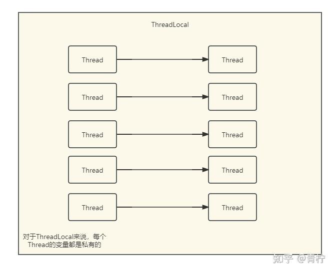
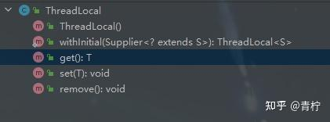
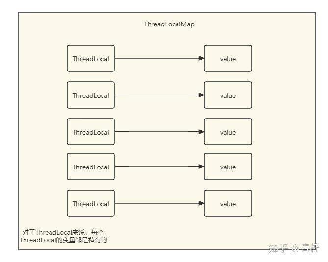
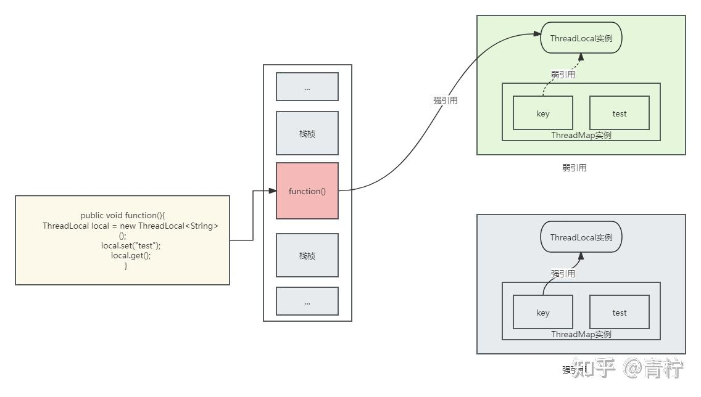
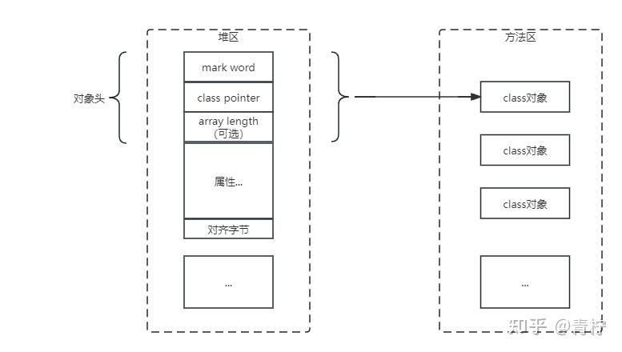
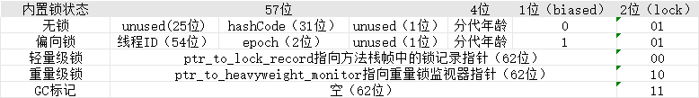

> Summary: The article studies several concurrency mechanisms through the shared-state problems they solve and the failure modes they introduce.

## Intended Reader

Java developers debugging thread safety issues in service code.

## Why This Matters

Java concurrency is where language semantics, JVM memory visibility, OS scheduling, and data-structure design meet. Small misunderstandings often become production-only bugs.

Locks, ThreadLocal, and atomic operations are not interchangeable. Each one controls a different relationship between state, ownership, and visibility.

## Mental Model

Think in terms of state ownership, visibility, ordering, blocking, and wake-up semantics. APIs such as AQS, CAS, LockSupport, volatile, and ThreadLocal are tools for shaping those guarantees.

The practical way to read this article is to look for the boundary it clarifies: what state exists, who owns it, which operation changes it, and what evidence proves the system behaved as expected.

## Implementation Walkthrough

- Use ThreadLocal when state should be isolated per thread, and understand cleanup requirements.
- Use weak-reference behavior to reason about memory retention and ThreadLocalMap cleanup.
- Explain why increments are unsafe when read-modify-write is not atomic.
- Define critical sections around the smallest state transition that must be protected.

## Pitfalls and Tradeoffs

- ThreadLocal avoids sharing but can leak memory in pooled threads if not removed.
- Locks protect invariants but can introduce contention and deadlocks.
- Atomic operations are efficient for simple state updates but not for complex invariants.

## Verification Checklist

- Remove ThreadLocal values in finally blocks when using thread pools.
- Test concurrent increments under contention.
- Inspect lock scope and avoid blocking IO while holding locks.

## Practical Takeaways

- Distinguish atomicity, visibility, and ordering; they solve different classes of concurrency bugs.
- Do not treat locks as a single concept. Lock acquisition, queueing, parking, interruption, and fairness all affect behavior.
- Use low-level primitives only when the higher-level abstraction cannot express the requirement clearly.
- Concurrency bugs need evidence: thread dumps, state transitions, queue length, contention, and timeout signals.

## Visual Evidence

The migrated local images are preserved as supporting figures. They keep the English edition aligned with the same diagrams, screenshots, or console evidence used by the source article.









## Selected Technical Snippets

The following snippets are preserved only when they are safe to publish in English without broken encoding or translated identifiers.

```java
public void set(T value) {
Thread t = Thread.currentThread();
ThreadLocalMap map = getMap(t);
if (map != null) {
map.set(this, value);
} else {
createMap(t, value);
}
}
```

```java
static class ThreadLocalMap {

/**
* The entries in this hash map extend WeakReference, using
* its main ref field as the key (which is always a
* ThreadLocal object).  Note that null keys (i.e. entry.get()
* == null) mean that the key is no longer referenced, so the
* entry can be expunged from table.  Such entries are referred to
* as "stale entries" in the code that follows.
*/
static class Entry extends WeakReference<ThreadLocal<?>> {
/** The value associated with this ThreadLocal. */
Object value;

Entry(ThreadLocal<?> k, Object v) {
super(k);
value = v;
}
}

/**
* The initial capacity -- MUST be a power of two.
*/
private static final int INITIAL_CAPACITY = 16;

/**
* The table, resized as necessary.
* table.length MUST always be a power of two.
*/
private Entry[] table;

/**
* The number of entries in the table.
*/
private int size = 0;

/**
* The next size value at which to resize.
*/
private int threshold; // Default to 0

/**
* Set the resize threshold to maintain at worst a 2/3 load factor.
*/
private void setThreshold(int len) {
threshold = len * 2 / 3;
}

/**
* Increment i modulo len.
*/
private static int nextIndex(int i, int len) {
return ((i + 1 < len) ? i + 1 : 0);
}

/**
* Decrement i modulo len.
*/
private static int prevIndex(int i, int len) {
return ((i - 1 >= 0) ? i - 1 : len - 1);
}

/**
* Construct a new map initially containing (firstKey, firstValue).
* ThreadLocalMaps are constructed lazily, so we only create
* one when we have at least one entry to put in it.
*/
ThreadLocalMap(ThreadLocal<?> firstKey, Object firstValue) {
table = new Entry[INITIAL_CAPACITY];
int i = firstKey.threadLocalHashCode & (INITIAL_CAPACITY - 1);
table[i] = new Entry(firstKey, firstValue);
size = 1;
setThreshold(INITIAL_CAPACITY);
}
}
```

```java
private static int count = 0;

public static void main(String[] args) {
Runnable runnable = new Runnable() {
@Override
public void run() {
for (int i = 0; i < 10000; i++) {
count++;
}
}
};

Thread thread1 = new Thread(runnable);
Thread thread2 = new Thread(runnable);

thread1.start();
thread2.start();

try {
thread1.join();
thread2.join();
} catch (InterruptedException e) {
e.printStackTrace();
}

System.out.println("Count: " + count);
}
```

## Source Notes

- Topic: JUC
- [Original source](https://zhuanlan.zhihu.com/p/675943628)
- Original publication date: 2024-01-03
- This English edition is localized from the migrated article metadata, source structure, technical terms, local assets, and clean implementation evidence.

## Closing Thoughts

The goal of this English edition is not to imitate the original wording sentence by sentence. It preserves the engineering argument, removes migration noise, and presents the article as a publishable technical note that future readers can use for design, debugging, or implementation review.
