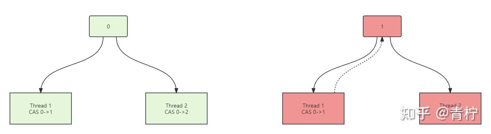
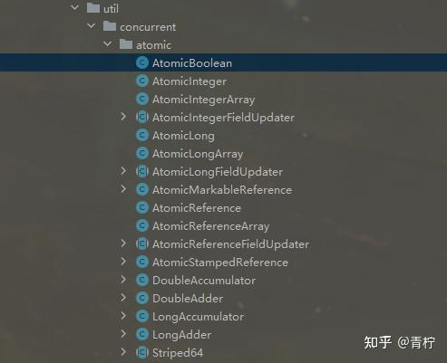
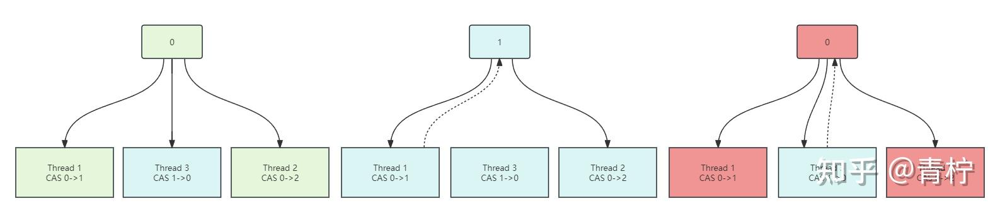
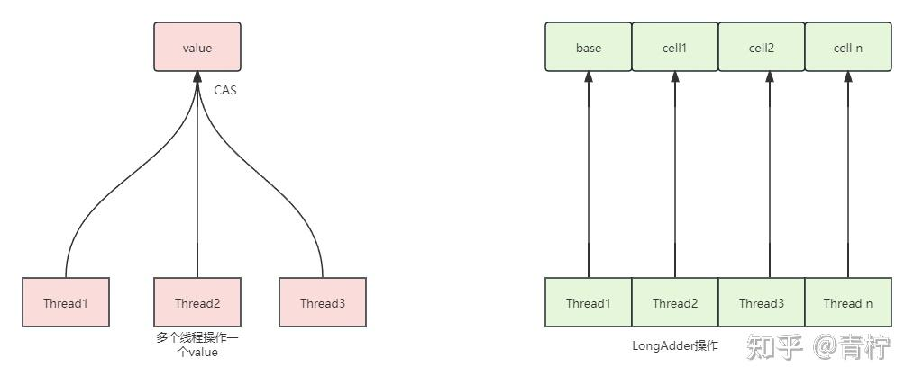

> Summary: The article explains CAS as the foundation of many atomic classes and lock-free state transitions in Java.

## Intended Reader

Java developers learning atomic operations and lock-free concurrency.

## Why This Matters

Java concurrency is where language semantics, JVM memory visibility, OS scheduling, and data-structure design meet. Small misunderstandings often become production-only bugs.

CAS enables optimistic state updates: compare the expected value with the current value, then update only if the state has not changed.

## Mental Model

Think in terms of state ownership, visibility, ordering, blocking, and wake-up semantics. APIs such as AQS, CAS, LockSupport, volatile, and ThreadLocal are tools for shaping those guarantees.

The practical way to read this article is to look for the boundary it clarifies: what state exists, who owns it, which operation changes it, and what evidence proves the system behaved as expected.

## Implementation Walkthrough

- Start with the read-modify-write race that makes normal increments unsafe.
- Explain CAS as compare-and-set and connect it to memory offsets or low-level field access.
- Study Atomic classes as reusable wrappers around CAS-based updates.
- Discuss ABA and why versioning or stamped references may be needed in some designs.

## Pitfalls and Tradeoffs

- CAS avoids blocking but can spin under high contention.
- Atomic classes work well for simple variables but not for multi-field invariants.
- Lock-free code can be faster and harder to reason about at the same time.

## Verification Checklist

- Benchmark under realistic contention rather than single-thread tests.
- Check whether the invariant spans more than one field.
- Document retry loops and failure behavior.

## Practical Takeaways

- Distinguish atomicity, visibility, and ordering; they solve different classes of concurrency bugs.
- Do not treat locks as a single concept. Lock acquisition, queueing, parking, interruption, and fairness all affect behavior.
- Use low-level primitives only when the higher-level abstraction cannot express the requirement clearly.
- Concurrency bugs need evidence: thread dumps, state transitions, queue length, contention, and timeout signals.

## Visual Evidence

The migrated local images are preserved as supporting figures. They keep the English edition aligned with the same diagrams, screenshots, or console evidence used by the source article.






## Selected Technical Snippets

The following snippets are preserved only when they are safe to publish in English without broken encoding or translated identifiers.

```java
@ForceInline
```

```java
/**
* Atomically updates Java variable to {@code x} if it is currently
* holding {@code expected}.
*
* <p>This operation has memory semantics of a {@code volatile} read
* and write.  Corresponds to C11 atomic_compare_exchange_strong.
*
* @return {@code true} if successful
*/
@ForceInline
public final boolean compareAndSwapObject(Object o, long offset,
Object expected,
Object x) {
return theInternalUnsafe.compareAndSetObject(o, offset, expected, x);
}

/**
* Atomically updates Java variable to {@code x} if it is currently
* holding {@code expected}.
*
* <p>This operation has memory semantics of a {@code volatile} read
* and write.  Corresponds to C11 atomic_compare_exchange_strong.
*
* @return {@code true} if successful
*/
@ForceInline
public final boolean compareAndSwapInt(Object o, long offset,
int expected,
int x) {
return theInternalUnsafe.compareAndSetInt(o, offset, expected, x);
}

/**
* Atomically updates Java variable to {@code x} if it is currently
* holding {@code expected}.
*
* <p>This operation has memory semantics of a {@code volatile} read
* and write.  Corresponds to C11 atomic_compare_exchange_strong.
*
* @return {@code true} if successful
*/
@ForceInline
public final boolean compareAndSwapLong(Object o, long offset,
long expected,
long x) {
return theInternalUnsafe.compareAndSetLong(o, offset, expected, x);
}
```

```java
/**
* Reports the location of a given field in the storage allocation of its
* class.  Do not expect to perform any sort of arithmetic on this offset;
* it is just a cookie which is passed to the unsafe heap memory accessors.
*
* <p>Any given field will always have the same offset and base, and no
* two distinct fields of the same class will ever have the same offset
* and base.
*
* <p>As of 1.4.1, offsets for fields are represented as long values,
* although the Sun JVM does not use the most significant 32 bits.
* However, JVM implementations which store static fields at absolute
* addresses can use long offsets and null base pointers to express
* the field locations in a form usable by {@link #getInt(Object,long)}.
* Therefore, code which will be ported to such JVMs on 64-bit platforms
* must preserve all bits of static field offsets.
* @see #getInt(Object, long)
*/
@ForceInline
public long objectFieldOffset(Field f) {
return theInternalUnsafe.objectFieldOffset(f);
}

/**
* Reports the location of a given static field, in conjunction with {@link
* #staticFieldBase}.
* <p>Do not expect to perform any sort of arithmetic on this offset;
* it is just a cookie which is passed to the unsafe heap memory accessors.
*
* <p>Any given field will always have the same offset, and no two distinct
* fields of the same class will ever have the same offset.
*
* <p>As of 1.4.1, offsets for fields are represented as long values,
* although the Sun JVM does not use the most significant 32 bits.
* It is hard to imagine a JVM technology which needs more than
* a few bits to encode an offset within a non-array object,
* However, for consistency with other methods in this class,
* this method reports its result as a long value.
* @see #getInt(Object, long)
*/
@ForceInline
public long staticFieldOffset(Field f) {
return theInternalUnsafe.staticFieldOffset(f);
}
```

## Source Notes

- Topic: JUC
- [Original source](https://zhuanlan.zhihu.com/p/676290217)
- Original publication date: 2024-01-05
- This English edition is localized from the migrated article metadata, source structure, technical terms, local assets, and clean implementation evidence.

## Closing Thoughts

The goal of this English edition is not to imitate the original wording sentence by sentence. It preserves the engineering argument, removes migration noise, and presents the article as a publishable technical note that future readers can use for design, debugging, or implementation review.
