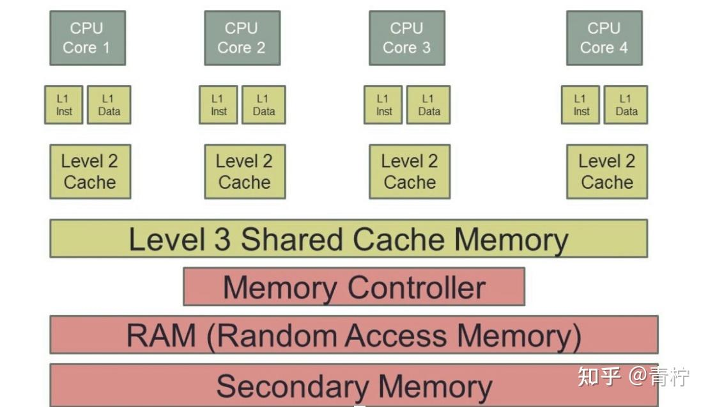
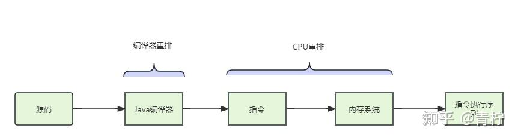
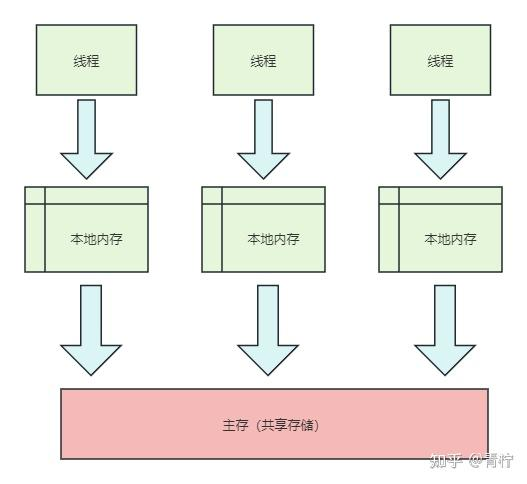

> JMM模型：Java Memory Model Java内存模型，它不像JVM内存模型，而是一个***规范***

## 并发编程的问题

### 原子性问题

原子性问题，就是指一个“不可中断”的动作，要么执行要么不执行，它不会因为线程和CPU切片的切换被中断。如：i++语句，就不是一个原子性操作[1]。

### 可见性问题

一个变量被一个线程修改，其他线程能够立刻发现，我们说它具有可见性。在JMM中，所以的变量都存放在公共内存中，当线程操作变量会将内存中的值复制到本地空间（私有内存），这里就有一个可见性问题：如果线程操作完成没有来得及同步到主内存中，那么这段时间我们认为它是不可见的[2]。

### 有序性问题

所谓有序，是指程序执行的顺序按照代码的先后顺序进行执行。

> 后面我将会通过这三点来介绍我们的重头戏JMM模型于特性

## CPU的高速缓存

在现在的CPU架构中，由于CPU的运算速度比内存的存取速度快很多，为了提高处理性能，CPU不直接和主存进行通信，而是在CPU和主存之间设计了CPU的高速缓存Cache，目前版本CPU主要有三层高速缓存，上图：



*CPU高速缓存*

越靠近CPU的缓存，容量更小，缓存速度更快；越远离CPU的缓存，容量更大，缓存速度越慢。

利用CPU高速缓存进行数据读取有以下优势：

- 写缓冲区可以保证指令流水线持续运行，避免处理器停顿等待向主存中写入数据产生的延迟。
- 通过以批处理的方式刷新缓冲区，以及合并缓冲区中对同一主存地址的多次读写，减少对内存总线的占用。

在上面的图中，我们不难发现每个CPU有各自独立的L1缓存和L2缓存，所有CPU有共享的L3缓存。CPU的处理过程是：先将计算需要的数据缓存在CPU高速缓存中，在CUP计算时直接从高速缓存中读取数据并在计算完成后写入高速缓存，以上步骤完成后再把高速缓存的数据同步到主存。每个线程可能在不同的CPU切片上运行，因此每个线程都有自己的高速缓存，同一份数据可能被缓存到多个CPU中，那么在不同的CPU内核中看到同一个变量的缓存就有可能不一样，就会有可见性问题。

### MESI协议

> 在CPU中，提供了总线锁和缓存锁，用来解决可见性问题

例如我们需要执行i++操作，在总线锁上发一个Lock信号锁定缓存，这样其他CPU就不能操作缓存了。当CPU访问L3缓存时，总是通过总线来进行访问，这种方式会在同一时间阻塞其他CPU，开销较大。

为了降低锁的颗粒度，需要各个CPU在访问缓存时有一定的规范，我们的MESI协议就登场了。简单的来说，当某CPU对高速缓存中的数据进行操作后，需要立刻通知其他CPU来放弃之前的历史数据从主存中重新加载，这个场景于volatile很相似。

## volatile的原理

上面说了，为了解决CPU高速缓存的可见性，采用了一种方式叫做MESI协议，而volatile也类似，它的本质是在操作volatile修饰变量时将字节码Lock并且要求线程的本地内存值立即刷新到主存中，从而保证了其他线程的可见性。正常情况下，操作系统并不会校验共享变量是否需要被强制同步，只有当变量被volatile修饰后，该变量所在的缓存行才被要求进行缓存一致性校验。

在添加volatile[3]关键字后，在汇编指令会出现lock addl指令，它的作用如下：

- 将当前CPU缓存数据立即写回主存：在对volatile变量进行读写时，lock前缀指令在执行期间，CPU可以独享主存，通过缓存锁实现对共享内存的独占性访问，会组织两个CPU同时修改共享内存数据
- 让其他CPU放弃数据：写回操作需要总线，每个CPU在总线上传播数据来检查自己的缓存是否过期，当CPU发现缓存对应行已经被修改后，将当前的缓存行失效，当CPU需要使用时再从内存中读取
- 内存屏障：禁止指令重排

### 重排序

> volatile可以防止指令重排序，那么什么叫做重排序呢？

这里要说的是volatile对于有序性的保证，它不同于可见性，为了提高CPU执行的性能，编译器和CPU会优化需要被执行的指令顺序，在重排序中主要分为两部分



*指令重排过程模型 参考《java高并发编程》*

编译器重排：指在代码编译阶段进行重排，不改变程序结果为了提升效率，例如：两个操作，操作A需要耗时等待其他资源，而操作B于A没有依赖关系，那么随着编译器的重排，可能先执行B操作可以提升编译速度。

CPU重排：pipline流水线执行操作是现在CPU的特性，为了CPU的执行效率，流水都是并行执行的，在不影响语义的情况下，执行的顺序是允许不一致的。

```java
public static void main(String[] args) {
int a = 0;
int b = 0;
int c = a + b;
}
```

参考上面的代码，定义并赋值a和b时，本身a、b是没有显示关系的，但是定义c时依赖于a、b，那么第三行就不会重排到上方，而a和b因为没有显示关系，所以a和b是可以发生重排序的。所以volatile也带有JMM全屏障的语义，禁止编译器和CPU对存在volatile的指令进行重排序。

## JMM

> JMM是JSR-133定义的规范，提供了合理禁用缓存以及禁止重排序的方法，用于解决可见性和有序性问题，在不同的操作系统下，有效避免操作系统的差异，保证java程序在各种平台对内存访问的规范。

Java内存模型中的变量存储在主存中，类似物理存储，还包括了部分共享存储，在java中每个线程都有自己的工作内存。

主存：存储java实例对象、类信息、常量、静态变量，它是一个共享存储，多个线程操作下会有线程安全问题

工作内存：当前方法的本地变量，每个线程间的工作内存是相互独立的，线程间无法共享私有的数据，私有数据只会被当前线程所操作，所以不会有线程安全问题。



*JMM内存模型*

JMM将所有变量都存储在主存中，当线程使用变量时，将主存中的数据复制到自己的本地内存中，线程对变量的读取时操作本地内存，这样JMM有一个问题：多个线程操作一个共享变量时，如果线程没有及时将修改的变量同步回主存中，那么这个修改其实是其他线程不可见的。

同时，JMM也规定了基于VM hotspot的几种操作：read读取、load载入、use使用、assign赋值、store存储、write写入、lock锁定、unLock解锁。它规定了JMM规范下数据的读取回写等操作，并且为了保证有序性，在JMM中定义了几个内存屏障：

- Load Barrier 读屏障：读指令钱插入，让高速缓存中数据失效，重新从主存加载
- Store Barrier 写屏障：写指令之后插入，让高速缓存最新数据写回主存
- ......

通过各种组合来解决有序性和可见性的问题，volatile就是利用这种方式，达到可见性和有序性：

- 在每个volatile写操作前插入一个StoreStore屏障
- 在每个volatile写操作后面插入一个StoreLoad屏障
- 在每个volatile读操作后面插入一个LoadLoad屏障
- 在每个volatile读操作后面插入一个LoadStore屏障

## volatile不满足原子性

我们上面说了volatile的特性，但是在多线程操作下，volatile无法保证原子性，因为虽然它要求被volatile存在内存屏障read、load等必须是连续的，***但是在不同的CPU内核上并发执行的线程还是有可能出现读取脏数据的情况，如果线程CPU切片完成，但是没有来得及去write到主存，虽然volatile的特性，其他线程会在执行时重新获取值，但是可能获取的是一个脏数据，所以对于并发操作，如果要保证操作的原子性，需要使用锁；在高并发场景下，volatile需要搭配显式锁进行使用***。

```java
private volatile int counter = 0;

public static void main(String[] args) {
VolatileExample example = new VolatileExample();

// 创建并启动10个线程
for (int i = 0; i < 10; i++) {
new Thread(() -> {
for (int j = 0; j < 1000; j++) {
example.incrementCounter();
}
}).start();
}

// 等待所有线程执行完成
try {
Thread.sleep(2000);
} catch (InterruptedException e) {
e.printStackTrace();
}

// 输出最终计数器的值
System.out.println("计数器的值: " + example.getCounter());
}

public void incrementCounter() {
counter++;
}

public int getCounter() {
return counter;
}
```

上面的程序就是一个很好的例子，并发情况下还是会有读取脏数据的问题。

```java
private volatile int counter = 0;
private Lock lock = new ReentrantLock();

public static void main(String[] args) {
VolatileExample example = new VolatileExample();

// 创建并启动10个线程
for (int i = 0; i < 10; i++) {
new Thread(() -> {
for (int j = 0; j < 1000; j++) {
example.incrementCounter();
}
}).start();
}

// 等待所有线程执行完成
try {
Thread.sleep(2000);
} catch (InterruptedException e) {
e.printStackTrace();
}

// 输出最终计数器的值
System.out.println("计数器的值: " + example.getCounter());
}

public void incrementCounter() {
lock.lock();
try {
counter++;
} finally {
lock.unlock();
}
}

public int getCounter() {
return counter;
}
```

搭配锁，可以保证数据的操作正常。
