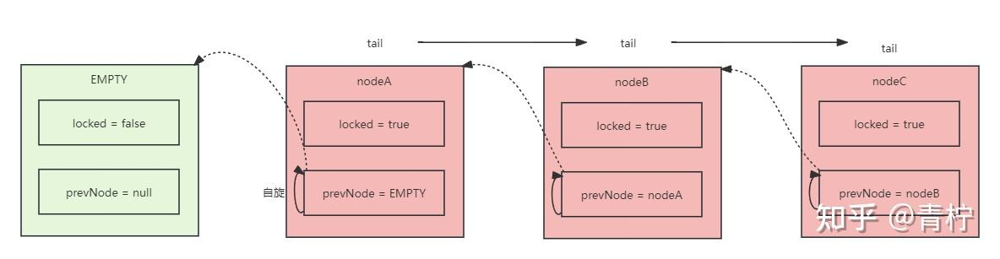
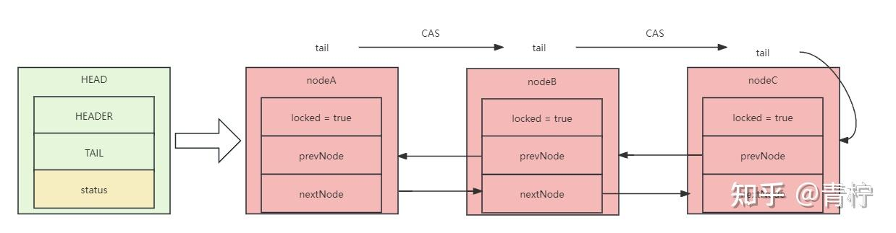
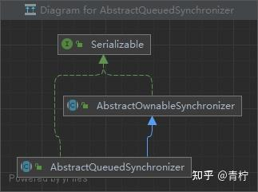
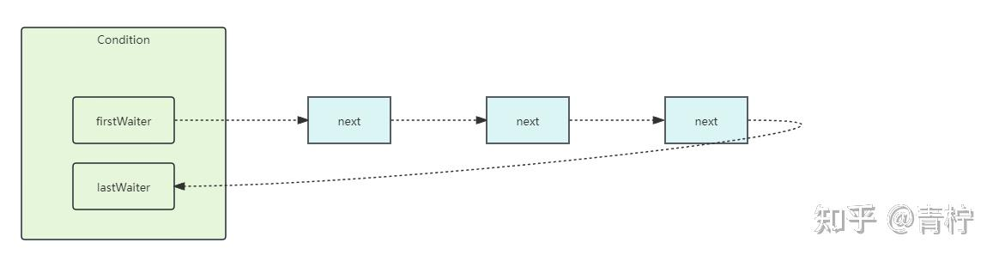

> Life is like a box of chocolates, you never know what you're gonna get." - from the movie Forrest Gump
> 之前的篇幅介绍了关于内置锁的实现，在jvm中，内置锁有着“致命”的缺点，所以从1.55版本开始，jvm帮助我们实现了一套关于aqs同步队列的模型，而且帮我们实现了几种显示锁，如：ReentrantLock及衍生类

## 前言

我们都知道，对于同步处理中，常用的方式有*synchronized*和CAS自旋处理，线程本质上就是获取到CPU切片的任务执行体，但是在常规的方式下有几点“致命”的缺陷：

- 内置锁，无法灵活的控制锁的处理
- CAS，大量自旋会消耗CPU，如果长时间高频自旋会消耗CPU
- SMP架构的CPU导致总线风暴[1]

AQS，主要是为了解决CAS恶心自旋的手段。CAS恶行自旋的解决方式主要是以空间换时间，常用的手段包括：热点分散，如ConcurrentHashMap的分段思想；队列削峰，如JUC并发包采用的思想。

## AQS的队列

队列削峰是一种比较常见的手段，为了减少无效争夺资源导致的性能浪费，通过队列的方式进行排队可以有效的避免无用的竞争。

### CLH自旋锁

> 说到AQS，不得不说CLH的队列模型。在AQS队列中，其实是借鉴了CLH的思想来实现的。

CLH锁是基于单向链表排队的自旋锁，申请加锁的线程会通过CAS操作在单项链表的尾部加入一个节点，该线程只需要在其前驱节点上进行自旋，等待当前节点的前驱节点释放锁。CLH锁只有线程在入队时进行CAS操作，在节点加入队列之后，只需普通自旋[2]。

在AQS的实现中，使用了CLH的方式，在AbstractQueuedSynchronizer中的成员变量Node节点上有这么一段注释很有意思：

```text
Wait queue node class.
The wait queue is a variant of a "CLH" (Craig, Landin, and Hagersten) lock queue. CLH locks are normally used for spinlocks. We instead use them for blocking synchronizers, but use the same basic tactic of holding some of the control information about a thread in the predecessor of its node. A "status" field in each node keeps track of whether a thread should block. A node is signalled when its predecessor releases. Each node of the queue otherwise serves as a specific-notification-style monitor holding a single waiting thread. The status field does NOT control whether threads are granted locks etc though. A thread may try to acquire if it is first in the queue. But being first does not guarantee success; it only gives the right to contend. So the currently released contender thread may need to rewait.
To enqueue into a CLH lock, you atomically splice it in as new tail. To dequeue, you just set the head field.
+------+  prev +-----+       +-----+
head |      | <---- |     | <---- |     |  tail
+------+       +-----+       +-----+

Insertion into a CLH queue requires only a single atomic operation on "tail", so there is a simple atomic point of demarcation from unqueued to queued. Similarly, dequeuing involves only updating the "head". However, it takes a bit more work for nodes to determine who their successors are, in part to deal with possible cancellation due to timeouts and interrupts.
The "prev" links (not used in original CLH locks), are mainly needed to handle cancellation. If a node is cancelled, its successor is (normally) relinked to a non-cancelled predecessor. For explanation of similar mechanics in the case of spin locks, see the papers by Scott and Scherer at http://www.cs.rochester.edu/u/scott/synchronization/
We also use "next" links to implement blocking mechanics. The thread id for each node is kept in its own node, so a predecessor signals the next node to wake up by traversing next link to determine which thread it is. Determination of successor must avoid races with newly queued nodes to set the "next" fields of their predecessors. This is solved when necessary by checking backwards from the atomically updated "tail" when a node's successor appears to be null. (Or, said differently, the next-links are an optimization so that we don't usually need a backward scan.)
Cancellation introduces some conservatism to the basic algorithms. Since we must poll for cancellation of other nodes, we can miss noticing whether a cancelled node is ahead or behind us. This is dealt with by always unparking successors upon cancellation, allowing them to stabilize on a new predecessor, unless we can identify an uncancelled predecessor who will carry this responsibility.
CLH queues need a dummy header node to get started. But we don't create them on construction, because it would be wasted effort if there is never contention. Instead, the node is constructed and head and tail pointers are set upon first contention.
Threads waiting on Conditions use the same nodes, but use an additional link. Conditions only need to link nodes in simple (non-concurrent) linked queues because they are only accessed when exclusively held. Upon await, a node is inserted into a condition queue. Upon signal, the node is transferred to the main queue. A special value of status field is used to mark which queue a node is on.
Thanks go to Dave Dice, Mark Moir, Victor Luchangco, Bill Scherer and Michael Scott, along with members of JSR-166 expert group, for helpful ideas, discussions, and critiques on the design of this class.
```

这里说明了几点：

- AQS的等待队列是CLH的变体，在CLH中锁通常是为了自旋，但是我们用于blocking synchronizes（阻塞线程）
- AQS中有一个“status”标记量来决定线程是否应该被“休息”
- 使用“next”链接来阻塞，每个线程的id都被存储在自己的节点中。在前置节点中通过遍历“next”节点来发出唤醒信号
- CLH需要一个“dummy header node”伪节点来使用额外的链接开始执行，在首次使用时，constructed and head and tail pointers（构造head 和tail节点）



*CLH加锁流程*

首先，ThreadA执行lock处理，创建NodeA，并将其设置为locked 状态，因为nodeA是除head节点后的第一个节点，那么将它的prevNode设置成EMPTY的头节点，然后A开始自旋，因为NodeA即是第一个节点，也是最后一个节点，所以tail节点指向当前NodeA；

ThreadB也执行lock操作，那么创建NodeB，并将其设置为locked状态，因为在B创建之前，tail节点指向NodeA，那么将B的前驱节点设置为NodeA，然后B开始自旋...以此类推

当ThreadA操作完成后，开始进行unlock，设置前驱节点为null[3]，locked设置为false；当ThreadB开始自旋发现它的上一个节点NodeA已经处理完成（locked = false），那么它开始执行，执行完成后进行unlock...依次类推

```java
/**
* @author fisher
* 简易版CLH队列锁实现 通过实现Lock
*/
public class CLHLock implements Lock {

/**
* 当前线程的本地变量
*/
private static ThreadLocal<Node> curNodeLocal = new ThreadLocal<>();

/**
* CLH队列尾部的指针，使用CAS
*/
private AtomicReference<Node> tail = new AtomicReference<>(null);

public CLHLock(){
/**
* 设置尾部节点
*/
tail.getAndSet(Node.EMPTY);
}

/**
* 加锁操作，就是将节点添加到队列尾部
*/
@Override
public void lock() {
Node curNode = new Node(true, null);
Node prevNode = tail.get();
/**
* CAS将Node添加到尾部
*/
while (!tail.compareAndSet(prevNode, curNode)){
prevNode = tail.get();
}
/**
* 设置前驱节点
*/
curNode.setPrevNode(prevNode);

/**
* 自旋直到前驱节点为false 如果前驱节点为true 则上一个线程还在占有锁
*/
while (curNode.getPrevNode().isLocked()){
/**
* 让出CPU
*/
Thread.yield();
}
/**
* 这里说明线程已经获取到了锁
*/
curNodeLocal.set(curNode);
}

/**
* 释放锁
*/
@Override
public void unlock() {
Node curNode = curNodeLocal.get();
curNode.setLocked(false);
curNode.setPrevNode(null); //help GC
curNodeLocal.set(null);
}

/**
* @author fisher
* 自定义CLH队列的节点类型
*/
@Data
static class Node {

/**
* 锁状态 使用volatile修饰
* true：抢占锁或者已经占有锁
* false：当前线程已经释放锁，下一个线程可以占有锁
*/
volatile boolean locked;

/**
* 上一个节点
*/
Node prevNode;

/**
* 构造
*/
public Node(boolean locked, Node prevNode){
this.locked = locked;
this.prevNode = prevNode;
}

/**
* 空节点
*/
public static final Node EMPTY = new Node(false, null);
}

@Override
public void lockInterruptibly() throws InterruptedException {

}

@Override
public boolean tryLock() {
return false;
}

@Override
public boolean tryLock(long time, TimeUnit unit) throws InterruptedException {
return false;
}

@Override
public Condition newCondition() {
return null;
}
```

## AQS队列刨析

在上面介绍到CLH的队列锁，其实AQS也是基于这种思想实现的，不同的是CLH是基于单向链表，而AQS是基于双向链表实现的。它与CLH不同的是，每个Node都包含了前驱节点prevNode和后置节点nextNode，这种结构导致了在AQS的队列中每个节点包含两个指针，分别指向前后节点。



*AQS队列*

### AQS核心

AQS的几个核心的成员变量：

```java
/**
* Head of the wait queue, lazily initialized.  Except for
* initialization, it is modified only via method setHead.  Note:
* If head exists, its waitStatus is guaranteed not to be
* CANCELLED.
*/
private transient volatile Node head;

/**
* Tail of the wait queue, lazily initialized.  Modified only via
* method enq to add new wait node.
*/
private transient volatile Node tail;

/**
* The synchronization state.
*/
private volatile int state;

/**
* Returns the current value of synchronization state.
* This operation has memory semantics of a {@code volatile} read.
* @return current state value
*/
protected final int getState() {
return state;
}

/**
* Sets the value of synchronization state.
* This operation has memory semantics of a {@code volatile} write.
* @param newState the new state value
*/
protected final void setState(int newState) {
state = newState;
}

/**
* Atomically sets synchronization state to the given updated
* value if the current state value equals the expected value.
* This operation has memory semantics of a {@code volatile} read
* and write.
*
* @param expect the expected value
* @param update the new value
* @return {@code true} if successful. False return indicates that the actual
*         value was not equal to the expected value.
*/
protected final boolean compareAndSetState(int expect, int update) {
// See below for intrinsics setup to support this
return unsafe.compareAndSwapInt(this, stateOffset, expect, update);
}
```

其中，status就是保证锁的同步，它被volatile修饰，更新status采用的是CAS的更新方式[4]



*AQS的继承关系*

通过查看AbstractOwnableSynchronizer的源码，发现它有一个基类

```java
/**
* The current owner of exclusive mode synchronization.
*/
private transient Thread exclusiveOwnerThread;
```

它表示当前正在占用锁的线程。

AQS同CLH一样，会将Thread包装成Node节点，我们观察一下AQS的内部类Node：

```java
static final class Node {
/** Marker to indicate a node is waiting in shared mode */
static final Node SHARED = new Node();
/** Marker to indicate a node is waiting in exclusive mode */
static final Node EXCLUSIVE = null;

/** waitStatus value to indicate thread has cancelled */
static final int CANCELLED =  1;
/** waitStatus value to indicate successor's thread needs unparking */
static final int SIGNAL    = -1;
/** waitStatus value to indicate thread is waiting on condition */
static final int CONDITION = -2;
/**
* waitStatus value to indicate the next acquireShared should
* unconditionally propagate
*/
static final int PROPAGATE = -3;

/**
* Status field, taking on only the values:
*   SIGNAL:     The successor of this node is (or will soon be)
*               blocked (via park), so the current node must
*               unpark its successor when it releases or
*               cancels. To avoid races, acquire methods must
*               first indicate they need a signal,
*               then retry the atomic acquire, and then,
*               on failure, block.
*   CANCELLED:  This node is cancelled due to timeout or interrupt.
*               Nodes never leave this state. In particular,
*               a thread with cancelled node never again blocks.
*   CONDITION:  This node is currently on a condition queue.
*               It will not be used as a sync queue node
*               until transferred, at which time the status
*               will be set to 0. (Use of this value here has
*               nothing to do with the other uses of the
*               field, but simplifies mechanics.)
*   PROPAGATE:  A releaseShared should be propagated to other
*               nodes. This is set (for head node only) in
*               doReleaseShared to ensure propagation
*               continues, even if other operations have
*               since intervened.
*   0:          None of the above
*
* The values are arranged numerically to simplify use.
* Non-negative values mean that a node doesn't need to
* signal. So, most code doesn't need to check for particular
* values, just for sign.
*
* The field is initialized to 0 for normal sync nodes, and
* CONDITION for condition nodes.  It is modified using CAS
* (or when possible, unconditional volatile writes).
*/
volatile int waitStatus;

/**
* Link to predecessor node that current node/thread relies on
* for checking waitStatus. Assigned during enqueuing, and nulled
* out (for sake of GC) only upon dequeuing.  Also, upon
* cancellation of a predecessor, we short-circuit while
* finding a non-cancelled one, which will always exist
* because the head node is never cancelled: A node becomes
* head only as a result of successful acquire. A
* cancelled thread never succeeds in acquiring, and a thread only
* cancels itself, not any other node.
*/
volatile Node prev;

/**
* Link to the successor node that the current node/thread
* unparks upon release. Assigned during enqueuing, adjusted
* when bypassing cancelled predecessors, and nulled out (for
* sake of GC) when dequeued.  The enq operation does not
* assign next field of a predecessor until after attachment,
* so seeing a null next field does not necessarily mean that
* node is at end of queue. However, if a next field appears
* to be null, we can scan prev's from the tail to
* double-check.  The next field of cancelled nodes is set to
* point to the node itself instead of null, to make life
* easier for isOnSyncQueue.
*/
volatile Node next;

/**
* The thread that enqueued this node.  Initialized on
* construction and nulled out after use.
*/
volatile Thread thread;

/**
* Link to next node waiting on condition, or the special
* value SHARED.  Because condition queues are accessed only
* when holding in exclusive mode, we just need a simple
* linked queue to hold nodes while they are waiting on
* conditions. They are then transferred to the queue to
* re-acquire. And because conditions can only be exclusive,
* we save a field by using special value to indicate shared
* mode.
*/
Node nextWaiter;

/**
* Returns true if node is waiting in shared mode.
*/
final boolean isShared() {
return nextWaiter == SHARED;
}

/**
* Returns previous node, or throws NullPointerException if null.
* Use when predecessor cannot be null.  The null check could
* be elided, but is present to help the VM.
*
* @return the predecessor of this node
*/
final Node predecessor() throws NullPointerException {
Node p = prev;
if (p == null)
throw new NullPointerException();
else
return p;
}

Node() {    // Used to establish initial head or SHARED marker
}

Node(Thread thread, Node mode) {     // Used by addWaiter
this.nextWaiter = mode;
this.thread = thread;
}

Node(Thread thread, int waitStatus) { // Used by Condition
this.waitStatus = waitStatus;
this.thread = thread;
}
}
```

| 成员变量 | 描述 |
| --- | --- |
| CANCELLED | 取消状态 |
| SIGNAL | 等待信号 |
| CONDITION | 当前正在进行条件等待 |
| PROPAGATE | 下一次共享锁无条件传播 |
| volatile int waitStatus | 对应上面几种状态标记量 |
| volatile Thread thread | Thread所包装的Node节点 |
| volatile Node prev | 前驱节点，当前节点会在前驱节点自旋，直到前驱节点释放 |
| volatile Node next | 后置节点 |
| Node nextWaiter | 如果是等待节点，那么指向下一个等待中的节点 |

- CANCELLED：表示当前节点已经取消，取消的节点不会被阻塞，也不会参与竞争
- SIGNAL：表示当前节点的后驱节点正在等待，当当前节点获取锁并释放后，会通知后驱节点醒来
- CONDITION：表示当前节点正在阻塞中，在某个锁的等待队列CONDITION中，在signal()后会将当前节点转移到当前锁的等待队列中[5]
- PROPAGATE：表示共享锁的传播，因为共享锁可能有N个锁，这时可以让N个节点来竞争并工作，思想可以参考CountDownLatch

SHARED、EXCLUSIVE 表示抢占锁的方式，SHARED代表共享锁添加到队列等待；而EXCLUSIVE 表示独占锁添加到队列

### AQS的模板

AQS是基于模板模式实现的，这样的好处是通过规范来分离层级，分离变与不变

```java
// Main exported methods

/**
* Attempts to acquire in exclusive mode. This method should query
* if the state of the object permits it to be acquired in the
* exclusive mode, and if so to acquire it.
*
* <p>This method is always invoked by the thread performing
* acquire.  If this method reports failure, the acquire method
* may queue the thread, if it is not already queued, until it is
* signalled by a release from some other thread. This can be used
* to implement method {@link Lock#tryLock()}.
*
* <p>The default
* implementation throws {@link UnsupportedOperationException}.
*
* @param arg the acquire argument. This value is always the one
*        passed to an acquire method, or is the value saved on entry
*        to a condition wait.  The value is otherwise uninterpreted
*        and can represent anything you like.
* @return {@code true} if successful. Upon success, this object has
*         been acquired.
* @throws IllegalMonitorStateException if acquiring would place this
*         synchronizer in an illegal state. This exception must be
*         thrown in a consistent fashion for synchronization to work
*         correctly.
* @throws UnsupportedOperationException if exclusive mode is not supported
*/
protected boolean tryAcquire(int arg) {
throw new UnsupportedOperationException();
}

/**
* Attempts to set the state to reflect a release in exclusive
* mode.
*
* <p>This method is always invoked by the thread performing release.
*
* <p>The default implementation throws
* {@link UnsupportedOperationException}.
*
* @param arg the release argument. This value is always the one
*        passed to a release method, or the current state value upon
*        entry to a condition wait.  The value is otherwise
*        uninterpreted and can represent anything you like.
* @return {@code true} if this object is now in a fully released
*         state, so that any waiting threads may attempt to acquire;
*         and {@code false} otherwise.
* @throws IllegalMonitorStateException if releasing would place this
*         synchronizer in an illegal state. This exception must be
*         thrown in a consistent fashion for synchronization to work
*         correctly.
* @throws UnsupportedOperationException if exclusive mode is not supported
*/
protected boolean tryRelease(int arg) {
throw new UnsupportedOperationException();
}
```

可以观察到AQS的源码中为我们定义了类似tryAcquire、tryAcquireShared等方法，在AQS的本身中直接抛出了UnsupportedOperationException异常，所以AQS其实是一种同步模型的规范，我们可以基于AQS的模板实现自己的同步方式，当然juc中例如ReentrantLock、CountDownLatch都是采用AQS的模板实现的。

在AQS的模板中，定义了SHARED、EXCLUSIVE：

SHARED：独占锁，常见的实现有ReentrantLock
EXCLUSIVE：共享锁，常见的实现有Semaphore、CountDownLatch、CyclicBarrier、ReadWriteLock

在AQS中，提供了几个钩子函数来供我们拓展：

尝试获取独占锁

```java
protected boolean tryAcquire(int arg) {
throw new UnsupportedOperationException();
}
```

尝试释放独占锁

```java
protected boolean tryRelease(int arg) {
throw new UnsupportedOperationException();
}
```

尝试获取共享锁

```java
protected int tryAcquireShared(int arg) {
throw new UnsupportedOperationException();
}
```

尝试释放共享锁

```java
protected boolean tryReleaseShared(int arg) {
throw new UnsupportedOperationException();
}
```

是否处于独占模式（主要在独占锁的队列中使用）

```java
protected boolean isHeldExclusively() {
throw new UnsupportedOperationException();
}
```

### AQS入队

```java
/**
* Creates and enqueues node for current thread and given mode.
*
* @param mode Node.EXCLUSIVE for exclusive, Node.SHARED for shared
* @return the new node
*/
private Node addWaiter(Node mode) {
Node node = new Node(Thread.currentThread(), mode);
// Try the fast path of enq; backup to full enq on failure
Node pred = tail;
if (pred != null) {
node.prev = pred;
if (compareAndSetTail(pred, node)) {
pred.next = node;
return node;
}
}
enq(node);
return node;
}
/**
* Acquires in exclusive mode, ignoring interrupts.  Implemented
* by invoking at least once {@link #tryAcquire},
* returning on success.  Otherwise the thread is queued, possibly
* repeatedly blocking and unblocking, invoking {@link
* #tryAcquire} until success.  This method can be used
* to implement method {@link Lock#lock}.
*
* @param arg the acquire argument.  This value is conveyed to
*        {@link #tryAcquire} but is otherwise uninterpreted and
*        can represent anything you like.
*/
public final void acquire(int arg) {
if (!tryAcquire(arg) &&
acquireQueued(addWaiter(Node.EXCLUSIVE), arg))
selfInterrupt();
}
```

在acquire中，我们发现通过自定义实现的tryAcquire，如果尝试获取锁成功，那么可以直接返回；反之如果获取锁失败，将Thread包装成Node节点并且：Thread.*currentThread*().interrupt();

那么我们再观察addWaiiter添加等待节点的方法，Node.EXCLUSIVE代表独占锁，首先将当前线程包装成一个Node对象节点：newNode(Thread.currentThread(), mode);

将当前节点设置为尾部节点：Node pred = tail，注意这里是将节点的前置节点设置成tail节点，如果队列不为空则pred !=null，那么当前节点的前置节点就是刚才设置好的tail节点；然后通过CAS将当前节点更新为tail节点，如果CAS成功了那么它的前置节点的后驱就应该是当前节点；如果队列为空或者CAS修改失败了，那么只能尝试让它去自旋自旋。

```java
/**
* Inserts node into queue, initializing if necessary. See picture above.
* @param node the node to insert
* @return node's predecessor
*/
private Node enq(final Node node) {
for (;;) {
Node t = tail;
if (t == null) { // Must initialize
if (compareAndSetHead(new Node()))
tail = head;
} else {
node.prev = t;
if (compareAndSetTail(t, node)) {
t.next = node;
return t;
}
}
}
}
```

当addWaiter添加失败后，则通过enq（）进行自旋，这里的自旋如果当前tail节点已经存在，那么当前节点的前驱节点就是tail，当前节点会添加在队尾；如果tail是空的，那么它就应该在队列的头。

```java
/**
* Acquires in exclusive uninterruptible mode for thread already in
* queue. Used by condition wait methods as well as acquire.
*
* @param node the node
* @param arg the acquire argument
* @return {@code true} if interrupted while waiting
*/
final boolean acquireQueued(final Node node, int arg) {
boolean failed = true;
try {
boolean interrupted = false;
for (;;) {
final Node p = node.predecessor();
if (p == head && tryAcquire(arg)) {
setHead(node);
p.next = null; // help GC
failed = false;
return interrupted;
}
if (shouldParkAfterFailedAcquire(p, node) &&
parkAndCheckInterrupt())
interrupted = true;
}
} finally {
if (failed)
cancelAcquire(node);
}
}
```

如果当前节点已经添加到队列中，使用acquireQueue自旋抢占锁。首先获取当前节点的前驱节点：
finalNode p = node.predecessor()，然后开始自旋当前节点的前驱节点是否是头节点，只有当前驱节点是head后再通过tryAcquire获取锁，如果处理成功了那么当前节点就是头节点，把之前的头节点清理掉[6]。

如果头节点获取到了锁，执行临界代码，那它后面的节点应该自旋或者park阻塞掉，防止CPU过多的消耗，因为这时靠后的节点往往是获取不到锁的，这也是AQS优化的一个地方，**相比CLH的空自旋，AQS会将其他节点阻塞而不是空自旋**。

```java
/**
* Checks and updates status for a node that failed to acquire.
* Returns true if thread should block. This is the main signal
* control in all acquire loops.  Requires that pred == node.prev.
*
* @param pred node's predecessor holding status
* @param node the node
* @return {@code true} if thread should block
*/
private static boolean shouldParkAfterFailedAcquire(Node pred, Node node) {
int ws = pred.waitStatus;
if (ws == Node.SIGNAL)
/*
* This node has already set status asking a release
* to signal it, so it can safely park.
*/
return true;
if (ws > 0) {
/*
* Predecessor was cancelled. Skip over predecessors and
* indicate retry.
*/
do {
node.prev = pred = pred.prev;
} while (pred.waitStatus > 0);
pred.next = node;
} else {
/*
* waitStatus must be 0 or PROPAGATE.  Indicate that we
* need a signal, but don't park yet.  Caller will need to
* retry to make sure it cannot acquire before parking.
*/
compareAndSetWaitStatus(pred, ws, Node.SIGNAL);
}
return false;
}
```

其他线程会根据waitStatus的状态决定是否被阻塞：

ws ==Node.SIGNAL：表示前驱的状态已经是signal，那么可以就返回，让线程Park
ws >0：这里的waitStatus可能表示为1，就说明它已经取消了，那么就不需要让取消的节点参与竞争，让当前的节点直接指向取消节点的前驱
else：waitStatus可能为*CONDITION*= -2、*PROPAGATE*= -3、INIT = 0，那么尝试将前驱节点状态修改为SIGNAL，前驱节点释放锁，当前节点就去尝试获取锁

```java
/**
* Releases in exclusive mode.  Implemented by unblocking one or
* more threads if {@link #tryRelease} returns true.
* This method can be used to implement method {@link Lock#unlock}.
*
* @param arg the release argument.  This value is conveyed to
*        {@link #tryRelease} but is otherwise uninterpreted and
*        can represent anything you like.
* @return the value returned from {@link #tryRelease}
*/
public final boolean release(int arg) {
if (tryRelease(arg)) {
Node h = head;
if (h != null && h.waitStatus != 0)
unparkSuccessor(h);
return true;
}
return false;
}
```

首先通过模板方法tryRelease定义的实现，执行成功后如果当前队列的head节点不为空并且状态不是初始化状态才会释放unparkSuccessor（）。

```java
/**
* Wakes up node's successor, if one exists.
*
* @param node the node
*/
private void unparkSuccessor(Node node) {
/*
* If status is negative (i.e., possibly needing signal) try
* to clear in anticipation of signalling.  It is OK if this
* fails or if status is changed by waiting thread.
*/
int ws = node.waitStatus;
if (ws < 0)
compareAndSetWaitStatus(node, ws, 0);

/*
* Thread to unpark is held in successor, which is normally
* just the next node.  But if cancelled or apparently null,
* traverse backwards from tail to find the actual
* non-cancelled successor.
*/
Node s = node.next;
if (s == null || s.waitStatus > 0) {
s = null;
for (Node t = tail; t != null && t != node; t = t.prev)
if (t.waitStatus <= 0)
s = t;
}
if (s != null)
LockSupport.unpark(s.thread);
}
```

在获取到当前节点的状态后，如果当前节点状态<0 那么就将它CAS修改为0；找到当前节点的后驱节点，如果后驱节点已经为空或者状态大于0，那么其实后驱节点已经取消了，就把后驱节点的指针清掉并且往前去找状态小于0的节点；如果找到了，就唤醒后驱节点的线程。

### AQS条件队列

在上面中我们提到了Condition，在注释【5】中也说明AQS的FIFO队列和Condition队列是两个模型。Condition是类似于让线程具体等待条件的。在JVM中，有wait、notify来解决线程等待唤醒的过程；而在JUC中，定义了Condition模型，通过ConditionObject来实现，本质来说它也是一个等待队列模型：



*Condition等待队列*

与AQS的同步队列不同的是，Condition是一个等待队列，它是由单向链表来决定的。当线程不满足获取锁的条件时，需要将AQS的队列中的Node节点同步到Condition的条件队列，直到满足条件后再将Condition条件队列的节点同步到AQS参与竞争。

```java
/**
* Implements interruptible condition wait.
* <ol>
* <li> If current thread is interrupted, throw InterruptedException.
* <li> Save lock state returned by {@link #getState}.
* <li> Invoke {@link #release} with saved state as argument,
*      throwing IllegalMonitorStateException if it fails.
* <li> Block until signalled or interrupted.
* <li> Reacquire by invoking specialized version of
*      {@link #acquire} with saved state as argument.
* <li> If interrupted while blocked in step 4, throw InterruptedException.
* </ol>
*/
public final void await() throws InterruptedException {
if (Thread.interrupted())
throw new InterruptedException();
Node node = addConditionWaiter();
int savedState = fullyRelease(node);
int interruptMode = 0;
while (!isOnSyncQueue(node)) {
LockSupport.park(this);
if ((interruptMode = checkInterruptWhileWaiting(node)) != 0)
break;
}
if (acquireQueued(node, savedState) && interruptMode != THROW_IE)
interruptMode = REINTERRUPT;
if (node.nextWaiter != null) // clean up if cancelled
unlinkCancelledWaiters();
if (interruptMode != 0)
reportInterruptAfterWait(interruptMode);
}
```

首先给Condition新增一个节点，放入队列的尾部；然后释放锁，唤醒AQS头节点的下一个节点，然后将当前线程阻塞，直到当前节点离开等待队列，回到同步队列成为同步节点。

```java
/**
* Moves the longest-waiting thread, if one exists, from the
* wait queue for this condition to the wait queue for the
* owning lock.
*
* @throws IllegalMonitorStateException if {@link #isHeldExclusively}
*         returns {@code false}
*/
public final void signal() {
if (!isHeldExclusively())
throw new IllegalMonitorStateException();
Node first = firstWaiter;
if (first != null)
doSignal(first);
}

/**
* Removes and transfers nodes until hit non-cancelled one or
* null. Split out from signal in part to encourage compilers
* to inline the case of no waiters.
* @param first (non-null) the first node on condition queue
*/
private void doSignal(Node first) {
do {
if ( (firstWaiter = first.nextWaiter) == null)
lastWaiter = null;
first.nextWaiter = null;
} while (!transferForSignal(first) &&
(first = firstWaiter) != null);
}
/**
* Transfers a node from a condition queue onto sync queue.
* Returns true if successful.
* @param node the node
* @return true if successfully transferred (else the node was
* cancelled before signal)
*/
final boolean transferForSignal(Node node) {
/*
* If cannot change waitStatus, the node has been cancelled.
*/
if (!compareAndSetWaitStatus(node, Node.CONDITION, 0))
return false;

/*
* Splice onto queue and try to set waitStatus of predecessor to
* indicate that thread is (probably) waiting. If cancelled or
* attempt to set waitStatus fails, wake up to resync (in which
* case the waitStatus can be transiently and harmlessly wrong).
*/
Node p = enq(node);
int ws = p.waitStatus;
if (ws > 0 || !compareAndSetWaitStatus(p, ws, Node.SIGNAL))
LockSupport.unpark(node.thread);
return true;
}
```

当线程调用signal（）后，会将等待队列中的第一个节点同步到同步队列中，等待唤醒。在实际的唤醒方法中，先将first节点的指针指向自己的下一个节点，如果这时nextWaiter为空，那么尾部也为空，将原来的头部指针清除，然后将唤醒的节点同步到同步队列中（transferForSignal）。

### 实现一把AQS简单的锁

```java
/**
* @author fisher
* 基于AQS实现的一把简易锁
*/
public class AQSLock extends AbstractQueuedSynchronizer {

/**
* @param arg the acquire argument. This value is always the one
*        passed to an acquire method, or is the value saved on entry
*        to a condition wait.  The value is otherwise uninterpreted
*        and can represent anything you like.
* @return
*/
@Override
protected boolean tryAcquire(int arg) {
//CAS更新
if (compareAndSetState(0 ,1)){
setExclusiveOwnerThread(Thread.currentThread());
return true;
}
return false;
}

/**
*
* @param arg the release argument. This value is always the one
*        passed to a release method, or the current state value upon
*        entry to a condition wait.  The value is otherwise
*        uninterpreted and can represent anything you like.
* @return
*/
@Override
protected boolean tryRelease(int arg) {
//如果当前线程不是占用锁的线程
if (Thread.currentThread() != getExclusiveOwnerThread()){
throw new IllegalMonitorStateException();
}
if (getState() != 0){
throw new IllegalMonitorStateException();
}
setExclusiveOwnerThread(null);
setState(0);
return true;
}
}
```
